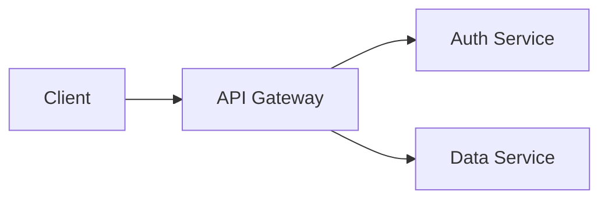

# convert-slides

AgentX plugin that converts Markdown documents to Microsoft PowerPoint (PPTX) using [Pandoc](https://pandoc.org), with automatic Mermaid diagram rendering.

## What's new in 1.1.0

- Fenced ```` ```mermaid ```` blocks are pre-rendered to high-resolution PNGs and embedded in slides when [mermaid-cli](https://github.com/mermaid-js/mermaid-cli) is on `PATH`.
- AgentX templates that already use Mermaid (ADR, Spec, Roadmap, Arch-Review) now produce decks with real diagrams instead of code blocks.
- Graceful degradation: without `mmdc` the plugin behaves exactly as 1.0.0 (diagrams render as code).

## Requirements

- PowerShell 7+
- Pandoc on `PATH` (`pandoc --version`)
- Optional: [mermaid-cli](https://github.com/mermaid-js/mermaid-cli) for diagram rendering -- `npm install -g @mermaid-js/mermaid-cli`

## Usage

Run via the AgentX CLI from the workspace root:

```powershell
# Convert default doc folders (docs/prd, docs/adr, docs/specs, docs/ux, docs/reviews)
.\.agentx\plugins\convert-slides\convert-slides.ps1

# Specific folders
.\.agentx\plugins\convert-slides\convert-slides.ps1 -Folders "docs/prd,docs/specs"

# Specific files
.\.agentx\plugins\convert-slides\convert-slides.ps1 -Files "docs/prd/PRD-42.md,README.md"

# Custom output folder + corporate template
.\.agentx\plugins\convert-slides\convert-slides.ps1 `
  -Files "docs/specs/SPEC-42.md" `
  -Output "build/slides" `
  -Template "assets/brand-template.pptx"

# Use H1 as slide breaks instead of H2
.\.agentx\plugins\convert-slides\convert-slides.ps1 -Folders "docs/prd" -SlideLevel 1
```

Bash wrapper:

```bash
./.agentx/plugins/convert-slides/convert-slides.sh -Folders "docs/prd"
```

## Parameters

| Name | Default | Description |
|------|---------|-------------|
| `Folders` | `docs/prd,docs/adr,docs/specs,docs/ux,docs/reviews` | Comma-separated folders to scan for `*.md` |
| `Files` | (none) | Comma-separated `.md` files (overrides `Folders` when set) |
| `Template` | (none) | Path to a reference `.pptx` for branding/layout |
| `Output` | (alongside source) | Destination folder for `.pptx` files |
| `SlideLevel` | `2` | Heading level that begins a new slide (Pandoc `--slide-level`) |
| `MermaidTheme` | `default` | Mermaid theme: `default`, `dark`, `forest`, `neutral` |
| `MermaidWidth` | `1600` | Pixel width for rendered Mermaid PNGs (sized for 16:9 slides) |
| `NoMermaid` | (off) | Switch: skip Mermaid rendering even if `mmdc` is installed |

## Mermaid diagrams

Any fenced ```` ```mermaid ```` block in your Markdown is rendered to a transparent PNG and embedded as a slide image. When `mmdc` is missing the plugin emits a warning and falls back to Pandoc's default code-block rendering -- nothing is lost, just visually flatter.

```markdown
## Architecture


```

## Slide Structure

Pandoc maps Markdown to slides using heading levels:

- Headings above `SlideLevel` become section title slides.
- Headings at `SlideLevel` start a new content slide.
- A horizontal rule (`---`) also forces a slide break.
- Lists, code blocks, tables, and images render as standard PPTX content.

## Exit Codes

- `0` - all conversions succeeded (or nothing to convert).
- `1` - Pandoc missing, or one or more files failed to convert.