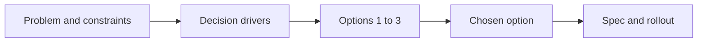
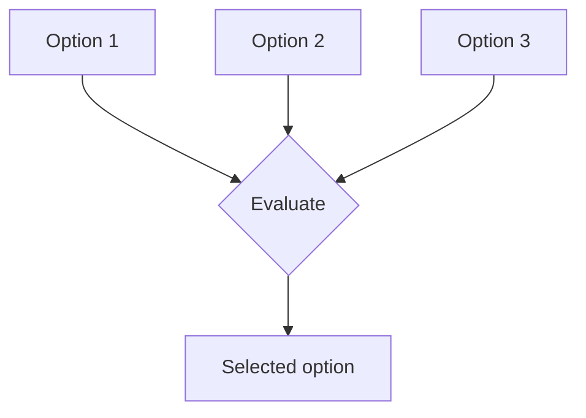

---
inputs:
  decision_id:
    description: "ADR sequential ID number"
    required: true
    default: ""
  decision_title:
    description: "Short title of the architectural decision"
    required: true
    default: ""
  date:
    description: "Decision date (YYYY-MM-DD)"
    required: false
    default: "${current_date}"
  status:
    description: "Decision status"
    required: false
    default: "Accepted"
  author:
    description: "Author of this architectural decision"
    required: false
    default: "agentx"
---

# ADR: ${decision_title}

**Status**: ${status}
**Date**: ${date}
**Author**: ${author}
**PRD**: `docs/artifacts/prd/PRD-{id}.md`
**UX**: `docs/ux/UX-{id}.md`

## Context

{What decision is required, why now, and what happens if we delay it?}

### Decision Drivers

| Driver | Why it matters | Priority |
|---|---|---|
| {Driver 1} | {User, business, or platform need} | High |
| {Driver 2} | {Quality attribute or delivery constraint} | High |
| {Driver 3} | {Cost, risk, or operability concern} | Medium |

### Requirements

- {Requirement from PRD}
- {Requirement from UX}
- {Requirement from operations, security, or compliance}

### Constraints

- {Technical constraint}
- {Team or timeline constraint}
- {Regulatory or platform constraint}

### AI/ML Architecture (if applicable)

State whether GenAI or agentic AI was evaluated for this decision. If not chosen, explain why a traditional approach is preferred.

### Research Summary

| Source | Evidence captured | Verified on |
|---|---|---|
| {Official documentation URL} | {Version, support status, or platform limits} | {YYYY-MM-DD} |
| {Benchmark or case study URL} | {Performance, scale, or failure mode evidence} | {YYYY-MM-DD} |
| {Security or risk source URL} | {Known vulnerabilities, guardrails, or viability notes} | {YYYY-MM-DD} |

### Council and Evidence

| Record | Required detail |
|---|---|
| Council artifact | {Path with actual independently attributed model responses} |
| Synthesis | {Consensus, disagreements and effect on the selected option} |
| Override, if any | {Explicit rationale and accountable decision owner} |

Named models or a generated brief alone are not evidence of a completed council.

## Decision

We will {state the selected architectural approach in one clear sentence}.

[Confidence:] High | Medium | Low

### Key Architectural Choices

| Choice | Decision | Why | Confidence |
|---|---|---|---|
| {Choice 1} | {Selected} | {Rationale} | High |
| {Choice 2} | {Selected} | {Rationale} | Medium |
| {Choice 3} | {Deferred or rejected} | {Rationale} | Medium |

## Options Considered

### Option 1: {Name}

**Description**: {What this option looks like in practice}

**Pros:**
- {Benefit}
- {Benefit}
- {Benefit}

**Cons:**
- {Trade-off}
- {Trade-off}
- {Trade-off}

**Effort**: S | M | L | XL
**Risk**: Low | Medium | High
**Confidence**: High | Medium | Low

### Option 2: {Name}

**Description**: {What this option looks like in practice}

**Pros:**
- {Benefit}
- {Benefit}

**Cons:**
- {Trade-off}
- {Trade-off}

**Effort**: S | M | L | XL
**Risk**: Low | Medium | High
**Confidence**: High | Medium | Low

### Option 3: {Name}

**Description**: {What this option looks like in practice}

**Pros:**
- {Benefit}
- {Benefit}

**Cons:**
- {Trade-off}
- {Trade-off}

**Effort**: S | M | L | XL
**Risk**: Low | Medium | High
**Confidence**: High | Medium | Low

## Rationale

1. **{Reason 1}**: {Why the selected option best fits the drivers}
2. **{Reason 2}**: {Why the rejected options are weaker in this context}
3. **{Reason 3}**: {What risk is accepted and why it is acceptable}

### Evaluation Matrix

| Criteria | Option 1 | Option 2 | Option 3 | Why it matters |
|---|---|---|---|---|
| Scalability | {Score} | {Score} | {Score} | {Context} |
| Cost | {Score} | {Score} | {Score} | {Context} |
| Complexity | {Score} | {Score} | {Score} | {Context} |
| Risk | {Score} | {Score} | {Score} | {Context} |

For cost-sensitive options, record the load envelope, idle/active cost, price
source and verification date. Unknown cost is not zero.

## Consequences

### Positive
- {Benefit}
- {Benefit}

### Negative
- {Trade-off}
- {Trade-off}

### Accepted Risks and Follow-up

| Risk | Trigger | Mitigation | Owner |
|---|---|---|---|
| {Risk} | {When it shows up} | {How to monitor or reduce it} | {Role} |

## Implementation

**Detailed technical specification**: `docs/artifacts/specs/SPEC-{id}.md`

### Migration / rollout checkpoints

| Phase | Outcome | Exit signal |
|---|---|---|
| {Phase 1} | {Preparation or pilot} | {Evidence} |
| {Phase 2} | {Implementation or migration} | {Evidence} |
| {Phase 3} | {Validation or rollout} | {Evidence} |

## References

### Internal
- PRD: `docs/artifacts/prd/PRD-{epic-id}.md`
- UX: `docs/ux/UX-{feature-id}.md`
- Spec: `docs/artifacts/specs/SPEC-{id}.md`
- Council: `docs/artifacts/adr/COUNCIL-{id}.md`

### External
- [Official documentation](https://...)
- [Benchmark or case study](https://...)
- [Security or viability source](https://...)

## Review History

| Date | Reviewer | Status | Notes |
|---|---|---|---|
| {date} | {name} | {Pending / Approved / Changes requested} | {Evidence and comments} |
