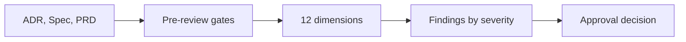
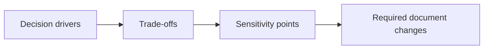

---
inputs:
  artifact_title:
    description: "Title of the ADR, document, or feature being reviewed"
    required: true
    default: ""
  adr_path:
    description: "Path to the ADR being reviewed (agentx mode)"
    required: false
    default: "docs/artifacts/adr/ADR-{id}.md"
  spec_path:
    description: "Path to the Tech Spec being reviewed (agentx mode)"
    required: false
    default: "docs/artifacts/specs/SPEC-{id}.md"
  prd_path:
    description: "Path to the parent PRD (for traceability; agentx mode)"
    required: false
    default: "docs/artifacts/prd/PRD-{id}.md"
  document_paths:
    description: "Comma-separated paths to human-written document(s) under review (standalone mode). Supports .md, .txt, .docx, .doc, .pptx, .ppt, .pdf, .html, images (.png/.jpg/.svg), diagrams (.drawio/.vsdx/.puml/.mmd)"
    required: false
    default: ""
  document_formats:
    description: "Detected formats per document_paths entry (e.g. 'docx,pptx,png'); used in citations and the Inputs section"
    required: false
    default: ""
  architect:
    description: "Architect responsible for the ADR/Spec"
    required: false
    default: "AgentX Architect"
  reviewer:
    description: "Reviewer name (agent or person)"
    required: false
    default: "AgentX Architecture Reviewer"
  date:
    description: "Review date (YYYY-MM-DD)"
    required: false
    default: "${current_date}"
  domain_labels:
    description: "Domain labels on the issue (e.g. needs:ai, needs:realtime)"
    required: false
    default: ""
  mode:
    description: "Review mode: 'agentx' (issue-driven, full ADR+Spec+PRD) or 'standalone' (single human-written architecture document)"
    required: false
    default: "agentx"
---

# Architecture Review: ${artifact_title}

- **Mode**: `${mode}`
- **Documents under review** (standalone mode): `${document_paths}` (formats: `${document_formats}`)
- **ADR** (agentx mode): [${adr_path}](../../${adr_path})
- **Tech Spec** (agentx mode): [${spec_path}](../../${spec_path})
- **PRD** (agentx mode): [${prd_path}](../../${prd_path})
- **Architect**: ${architect}
- **Reviewer**: ${reviewer}
- **Date**: ${date}
- **Domain labels**: ${domain_labels}
- **Decision**: APPROVED | CHANGES REQUESTED | BLOCKED

## Summary

- **Mode**: `${mode}`
- **Pre-review gates**: PASS | FAIL (`<which gate>`)
- **Findings**: `<c>` Critical, `<h>` High, `<m>` Medium, `<l>` Low
- **Frameworks cited**: `<ATAM | STRIDE | ISO/IEC 25010 | NIST CSF | OWASP | C4 | arc42>`
- **Decision rationale**: `<one paragraph>`

## Pre-Review Gates

If any required gate is FAIL, return `BLOCKED` and stop.

### AgentX Workflow Mode

| # | Gate | Status | Notes |
|---|---|---|---|
| 1 | ADR file present at `${adr_path}` | PASS / FAIL | |
| 2 | Tech Spec present at `${spec_path}` | PASS / FAIL | |
| 3 | PRD present at `${prd_path}` | PASS / FAIL / N/A | |
| 4 | ADR contains 3+ options with explicit comparison | PASS / FAIL | |
| 5 | ADR records Decision and Consequences | PASS / FAIL | |
| 6 | Tech Spec contains diagrams | PASS / FAIL | |
| 7 | Tech Spec contains zero code examples | PASS / FAIL | |
| 8 | Data Scientist alignment present when `needs:ai` | PASS / FAIL / N/A | |
| 9 | Platform approach stated with rationale | PASS / FAIL / N/A | |

### Standalone Document Mode (Human-Written Doc / ADR / Spec / RFC)

| # | Standalone Gate | Status | Notes |
|---|---|---|---|
| S1 | Document present at the provided path | PASS / FAIL | |
| S2 | Document states a decision or recommended approach | PASS / FAIL | |
| S3 | Document records rationale | PASS / FAIL | |
| S4 | Document considers at least one alternative | PASS / FAIL | |
| S5 | Document states quality attributes or NFRs | PASS / FAIL | |
| S6 | Document includes a diagram or clear component model | PASS / FAIL | |

## Dimension Coverage Matrix

| # | Dimension | Status | Findings | Frameworks Applied |
|---|---|---|---|---|
| 1 | Business and Requirements Alignment | OK / Issues / N/A | `<count>` | ATAM, ISO/IEC 25010 |
| 2 | Scalability and Performance | OK / Issues / N/A | `<count>` | Well-Architected |
| 3 | Reliability and Resilience | OK / Issues / N/A | `<count>` | Well-Architected |
| 4 | Security | OK / Issues / N/A | `<count>` | STRIDE, OWASP, NIST CSF |
| 5 | Data Architecture | OK / Issues / N/A | `<count>` | ISO/IEC 25010 |
| 6 | Integration and APIs | OK / Issues / N/A | `<count>` | C4, arc42 |
| 7 | Observability | OK / Issues / N/A | `<count>` | RED, USE, OpenTelemetry |
| 8 | Deployment and Operations | OK / Issues / N/A | `<count>` | Well-Architected |
| 9 | Cost and Efficiency | OK / Issues / N/A | `<count>` | Well-Architected |
| 10 | Maintainability and Evolution | OK / Issues / N/A | `<count>` | Conway, ISO/IEC 25010 |
| 11 | Compliance and Governance | OK / Issues / N/A | `<count>` | TOGAF, NIST CSF |
| 12 | Risks and Trade-offs | OK / Issues / N/A | `<count>` | ATAM |

## Platform Approach (Pro-Code vs Low-Code vs Hybrid)

| Field | Value |
|---|---|
| Selected approach | `Pro-Code` / `Low-Code` / `Hybrid` |
| Platforms / SDKs named in ADR/Spec | `<list>` |
| Alternatives considered in ADR | `<list>` |
| Hybrid boundary (if Hybrid) | `<what lives where>` |
| Rubric score summary | `<brief score summary>` |
| Anti-patterns checked | `<list>` |
| AI-specific call-out (if `needs:ai`) | `<brief note>` |
| Decision risk | `Low` / `Medium` / `High` with rationale |

## Findings

> Order by severity. Every finding must cite the exact section and evidence of harm.
> Remove unused example findings; zero supported findings is a valid result.
> In standalone mode, cite the actual document and page, slide, diagram or section.

### CRITICAL: `<title>`
- **Dimension**: `<1..12>`
- **Artifact**: `<ADR | Spec>` -- section "`<heading>`" (lines `<a>`-`<b>`)
- **Framework**: `<framework>`
- **Evidence of harm**: `<concrete scenario or citation>`
- **Recommendation**: `<what to change in the document>`

### HIGH: `<title>`
- **Dimension**:
- **Artifact**:
- **Framework**:
- **Evidence of harm**:
- **Recommendation**:

### MEDIUM: `<title>`
- **Dimension**:
- **Artifact**:
- **Framework**:
- **Evidence of harm**:
- **Recommendation**:

### LOW: `<title>`
- **Dimension**:
- **Artifact**:
- **Framework**:
- **Evidence of harm**:
- **Recommendation**:

## Severity Rubric

| Severity | Criteria | Blocks Approval |
|---|---|---|
| Critical | Outage, data loss, breach, regulatory violation, or gate failure | Yes |
| High | NFR not met, missing control, broken integration contract | Yes |
| Medium | Realistic quality, operability, or cost risk | Yes under the AgentX approval gate |
| Low | Small documentation or clarity gap | No |

## STRIDE Threat Model Coverage (Dimension 4)

| Trust Boundary | Spoofing | Tampering | Repudiation | Information Disclosure | Denial of Service | Elevation of Privilege |
|---|---|---|---|---|---|---|
| `<boundary 1>` | | | | | | |
| `<boundary 2>` | | | | | | |
| `<boundary 3>` | | | | | | |

## NFR Traceability (Dimensions 1, 2, 3)

| PRD NFR | Target | Spec Section / Component | Status |
|---|---|---|---|
| `<latency>` | `<value>` | `<section>` | Mapped / Partial / Unmapped |
| `<availability>` | `<value>` | `<section>` | |
| `<throughput>` | `<value>` | `<section>` | |
| `<RTO>` | `<value>` | `<section>` | |
| `<RPO>` | `<value>` | `<section>` | |
| `<security control>` | `<value>` | `<section>` | |

## Trade-offs and Sensitivity Points (Dimension 12)

| Trade-off | Chosen | Rejected | Sensitivity Point | Risk if Wrong |
|---|---|---|---|---|
| `<trade-off 1>` | | | | |
| `<trade-off 2>` | | | | |

## Open Questions for Architect

- `<question 1>`
- `<question 2>`

## Decision Rationale

`<2-4 sentences explaining why APPROVED / CHANGES REQUESTED / BLOCKED>`

## Self-Review Checklist (Reviewer)

- [ ] Pre-review gates evaluated first
- [ ] All 12 dimensions have a status
- [ ] Every finding cites exact section and line range
- [ ] Every finding states evidence of harm
- [ ] No implementation-only critique outside ADR/Spec scope
- [ ] Decision matches the highest-severity findings
- [ ] No unresolved High or Medium findings; N/A decisions include a reason
