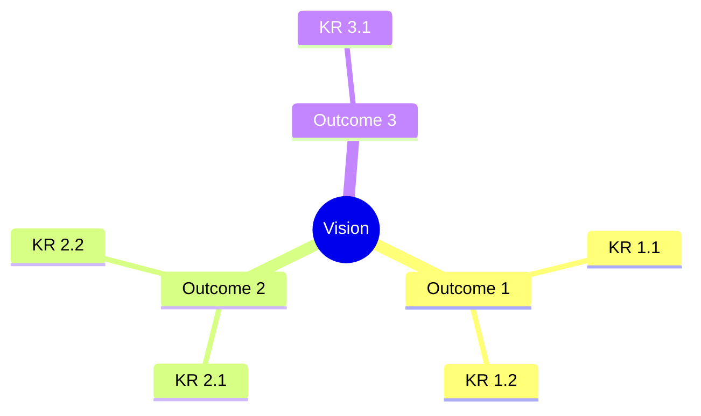
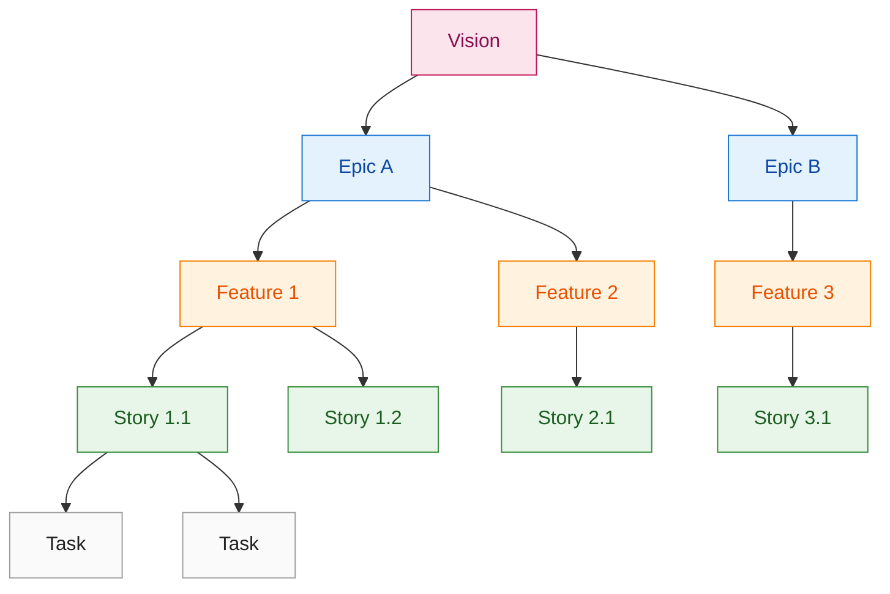
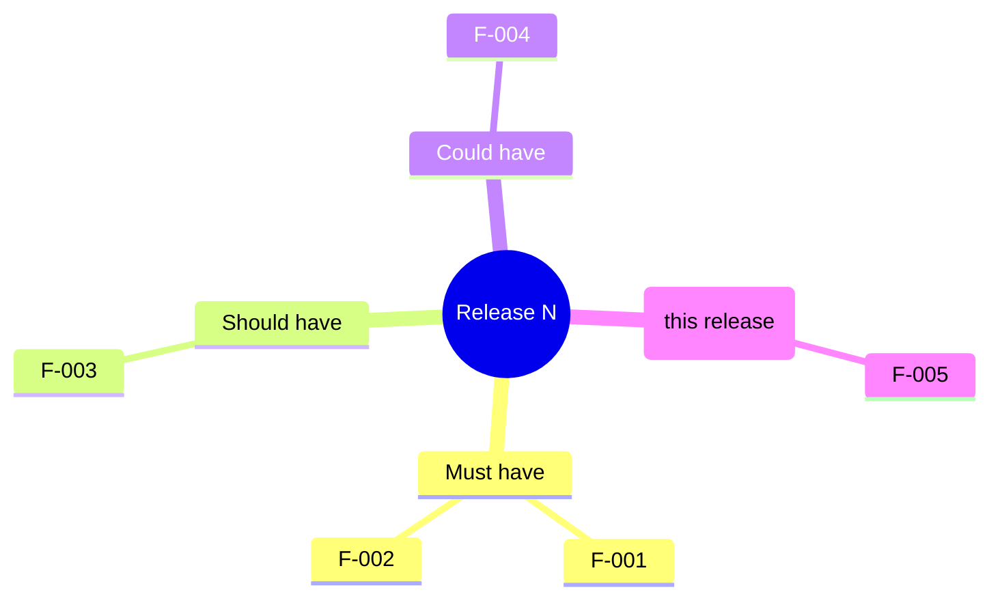
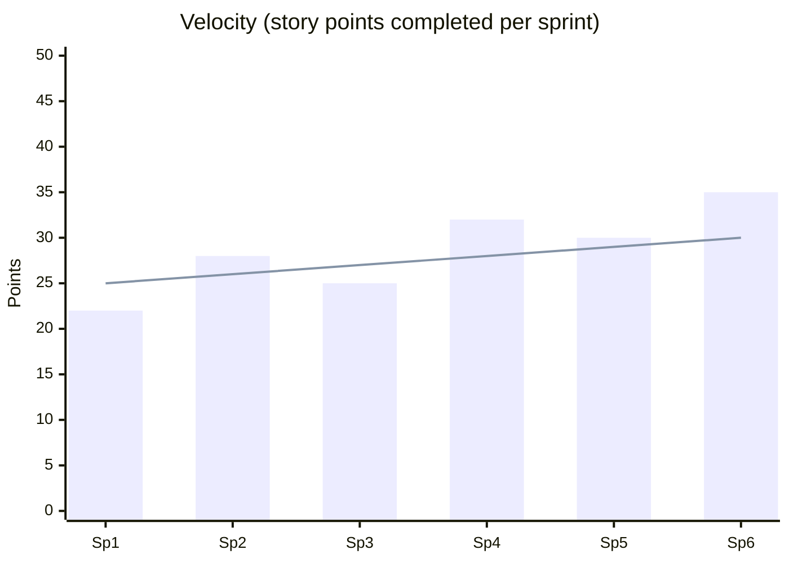
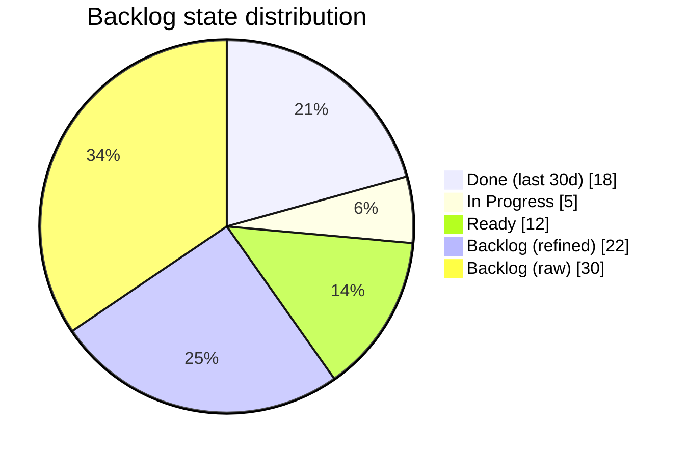
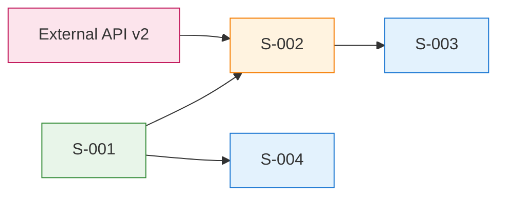
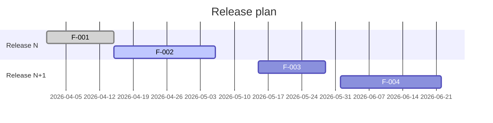
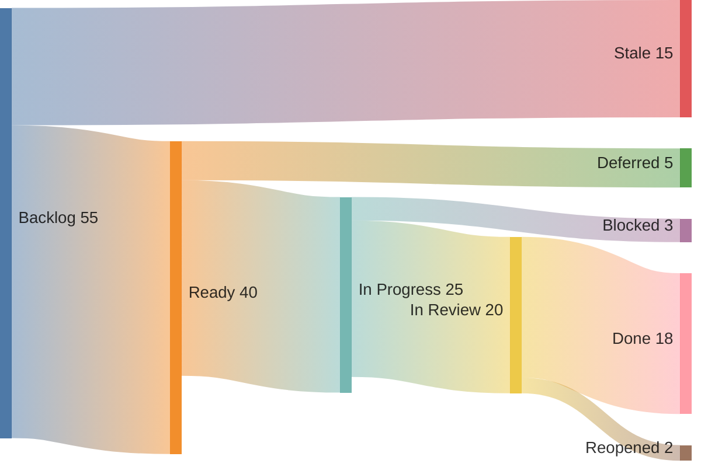
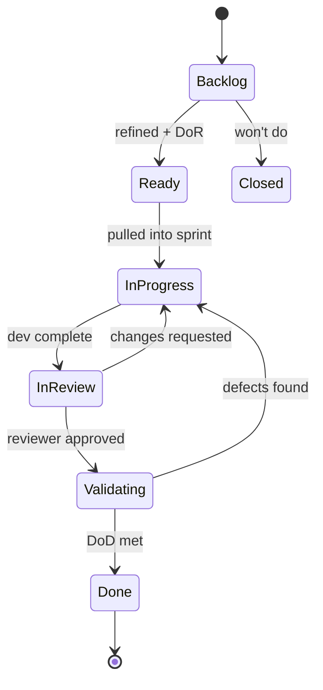

<!-- Inputs: {project_name}, {owner}, {date}, {planning_horizon} -->

# Product Backlog: {project_name}

> **Owner**: {owner}
> **Last updated**: {date}
> **Planning horizon**: {planning_horizon}
> **Source of truth**: This file (local mode) OR GitHub Projects V2 / ADO Boards (remote mode)

This template is the canonical structure for a living product backlog. In **Local Mode** this file is the source of truth and is mirrored into per-issue JSON under `.agentx/issues/`. In **GitHub/ADO Mode** this file is a human-readable rollup; the issue tracker is the source of truth.

---

## 1. Vision and North Star

- **Vision**: <one sentence: what we are building, for whom, why it matters>
- **North Star metric**: <single metric that captures product value>
- **Strategic outcomes** (12-18 months): <3-5 bullets>
- **Non-goals**: <out of scope; prevents scope creep>



---

## 2. Backlog Hierarchy

AgentX uses a 3-level hierarchy. Higher levels carry intent; lower levels carry execution detail.

| Level | Purpose | Size | Owner | Lifecycle |
|-------|---------|------|-------|-----------|
| Epic | Multi-quarter strategic theme | Months | Product Manager | Vision -> Discovery -> Delivery -> Done |
| Feature | Single coherent capability | Weeks | Architect | Backlog -> Ready -> In Progress -> Done |
| User Story | Smallest valuable increment | Days | Engineer | Backlog -> Ready -> In Progress -> In Review -> Done |
| Task / Sub-task | Implementation detail | Hours | Engineer | Open -> Done |
| Bug | Defect to fix | Hours-days | Engineer | Reported -> In Progress -> Verified -> Closed |
| Spike | Time-boxed research | Days | Architect | Open -> Findings -> Closed |



---

## 3. Prioritization Framework

Choose ONE primary framework; document the rationale.

| Framework | Best for | Inputs | Output |
|-----------|----------|--------|--------|
| **RICE** | Feature ranking | Reach, Impact, Confidence, Effort | (R x I x C) / E |
| **WSJF** | SAFe / large programs | Cost of Delay / Job Size | Numeric score |
| **MoSCoW** | Release scoping | Stakeholder consensus | Must / Should / Could / Won't |
| **Kano** | UX-driven products | User survey | Basic / Performance / Excitement |
| **ICE** | Lightweight / experiments | Impact, Confidence, Ease | I x C x E |

### RICE worksheet (default)

| ID | Title | Reach | Impact (0.25-3) | Confidence (0-1) | Effort (person-weeks) | RICE | Rank |
|----|-------|-------|-----------------|------------------|----------------------|------|------|
| F-001 | <feature> | 1000 | 2 | 0.8 | 4 | 400 | 1 |
| F-002 | <feature> | 500 | 3 | 0.6 | 2 | 450 | 2 |

### MoSCoW for current release



---

## 4. INVEST Quality Gate (per Story)

Every User Story MUST satisfy INVEST before entering `Ready`:

- **I**ndependent: deliverable in isolation, minimal cross-story coupling
- **N**egotiable: scope can flex, ACs not yet a contract
- **V**aluable: clear user or business value
- **E**stimable: team can size it
- **S**mall: completable in <= 1 sprint (ideally 1-3 days)
- **T**estable: acceptance criteria are verifiable

---

## 5. Definition of Ready (DoR)

Story enters `Ready` only when ALL apply:

- [ ] Title follows `[Story|Bug|Spike] <imperative phrase>`
- [ ] User story format: `As a <persona>, I want <capability>, so that <outcome>`
- [ ] Acceptance criteria in Given/When/Then (3+ scenarios incl. edge case)
- [ ] INVEST satisfied
- [ ] Dependencies identified and unblocked OR explicitly tracked
- [ ] Estimate recorded (story points or t-shirt)
- [ ] Owner assigned
- [ ] Labels applied: `type:*`, `priority:*`, optional `needs:*`

## 6. Definition of Done (DoD)

Story moves to `Done` only when ALL apply:

- [ ] Code merged to main with passing CI
- [ ] Tests written and passing (>=80% diff coverage)
- [ ] Reviewer approval recorded in `docs/artifacts/reviews/`
- [ ] Docs updated (README, ADR, Spec, runbook as applicable)
- [ ] No HIGH or MEDIUM review findings open
- [ ] Issue closed with closing keyword in commit/PR
- [ ] Compound capture resolved (learning written or skip rationale recorded)

---

## 7. Active Backlog

### 7.1 Epics

| ID | Title | Outcome | Status | Priority | Target | Owner | Notes |
|----|-------|---------|--------|----------|--------|-------|-------|
| E-001 | <epic title> | <KR or outcome> | Discovery | P0 | Q3 2026 | <owner> | <link to PRD> |

### 7.2 Features (current + next quarter)

| ID | Epic | Title | RICE | MoSCoW | Status | Owner | ETA |
|----|------|-------|------|--------|--------|-------|-----|
| F-001 | E-001 | <feature> | 400 | Must | Ready | <owner> | <date> |

### 7.3 Stories (current sprint)

| ID | Feature | Title | Points | Status | Owner | Issue |
|----|---------|-------|--------|--------|-------|-------|
| S-001 | F-001 | <story> | 3 | In Progress | <owner> | #42 |

### 7.4 Bugs

| ID | Title | Severity | Status | Owner | Reported |
|----|-------|----------|--------|-------|----------|
| B-001 | <bug> | High | In Progress | <owner> | <date> |

### 7.5 Spikes

| ID | Question | Time-box | Status | Owner | Findings |
|----|----------|----------|--------|-------|----------|
| K-001 | <research question> | 2 days | Open | <owner> | <link or pending> |

---

## 8. Capacity and Velocity

### 8.1 Team capacity (current sprint)

| Member | Capacity (pts) | Committed | Available |
|--------|----------------|-----------|-----------|
| <name> | 13 | 10 | 3 |

### 8.2 Velocity trend



### 8.3 Backlog health



---

## 9. Dependency Graph



---

## 10. Release Plan



---

## 11. Flow Metrics (sankey)



---

## 12. Workflow State Machine



---

## 13. Refinement Cadence

| Ceremony | Frequency | Duration | Outcome |
|----------|-----------|----------|---------|
| Backlog refinement | Weekly | 60 min | Top 10 stories meet DoR |
| Sprint planning | Per sprint | 90 min | Sprint goal + commitment |
| Daily standup | Daily | 15 min | Blockers surfaced |
| Sprint review | Per sprint | 60 min | Demo + stakeholder feedback |
| Retrospective | Per sprint | 60 min | 1-3 process improvements |

---

## 14. Local Mode Wiring (AgentX)

When this repo runs in **Local Mode**, this file is the source of truth. The CLI keeps `.agentx/issues/*.json` in sync.

### Authoring flow

1. Add an item to a backlog table above (Epic/Feature/Story/Bug/Spike).
2. Run the matching CLI command:

```powershell
# Story
.\.agentx\agentx.ps1 issue create -t "[Story] <title>" -l "type:story,priority:p1" -b "<body or path to spec>"

# Bug
.\.agentx\agentx.ps1 issue create -t "[Bug] <title>" -l "type:bug,priority:p0"

# Epic
.\.agentx\agentx.ps1 issue create -t "[Epic] <title>" -l "type:epic"
```

3. Update the row in this file with the issue number returned by the CLI.
4. As work progresses, update the row's Status column AND run:

```powershell
.\.agentx\agentx.ps1 issue update -n <num> -s "In Progress"
.\.agentx\agentx.ps1 issue update -n <num> -s "In Review"
.\.agentx\agentx.ps1 issue close  -n <num>
```

### Migration to GitHub mode

When the repo gains a GitHub remote, AgentX auto-syncs `.agentx/issues/` to GitHub Issues + Projects V2. This file remains as the human-readable rollup; the issue tracker becomes authoritative for status.

---

## 15. Self-Review Checklist (before sharing)

- [ ] Vision, North Star, and outcomes are concrete and current
- [ ] Hierarchy reflects actual work (no orphan stories)
- [ ] Each story passes INVEST and DoR
- [ ] Priorities use a single declared framework
- [ ] Dependencies and blockers are visible
- [ ] Velocity and capacity reflect last 3 sprints
- [ ] All Mermaid diagrams render
- [ ] ASCII-only (no smart quotes, em-dashes, emoji)
