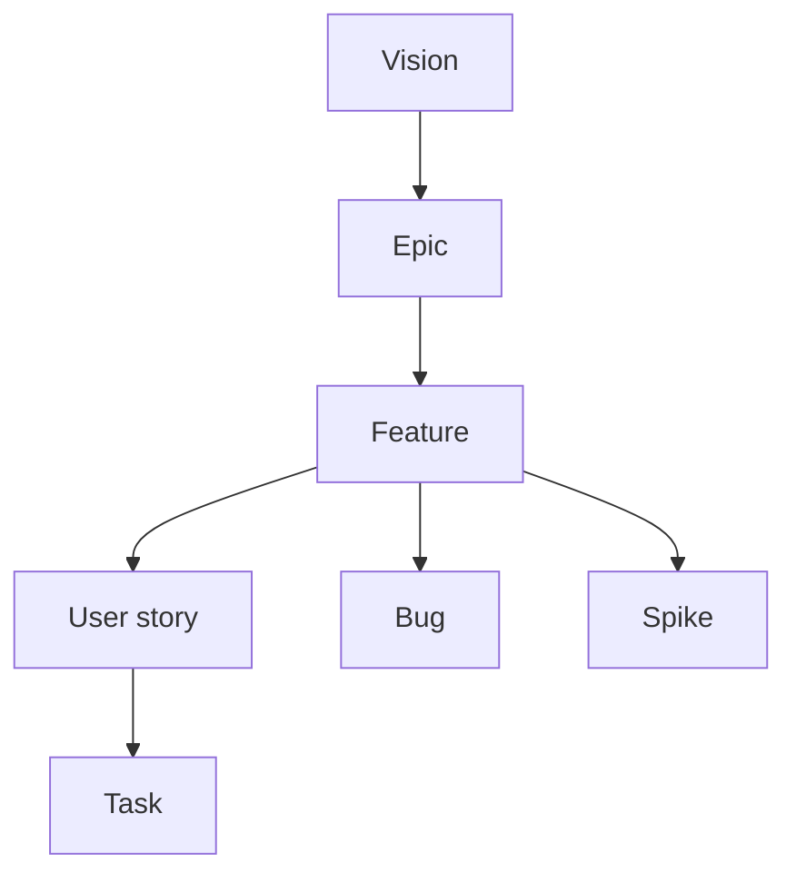
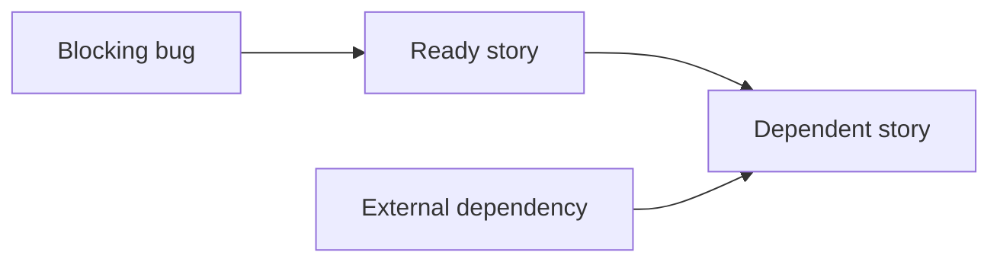
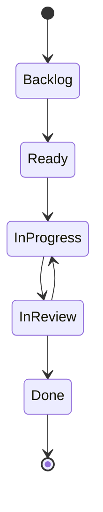

<!-- Inputs: {project_name}, {owner}, {date}, {planning_horizon} -->

# Product Backlog: {project_name}

> **Owner**: {owner}
> **Last updated**: {date}
> **Planning horizon**: {planning_horizon}
> **Source of truth**: This file (local mode) OR GitHub Projects V2 / ADO Boards (remote mode)

Select the actual tracker and replace example rows; example statuses are not
evidence that work or approvals have occurred.

## 1. Vision and North Star

- **Vision**: <one sentence>
- **North Star metric**: <single measure>
- **Strategic outcomes**: <3-5 bullets>
- **Non-goals**: <explicit exclusions>

## 2. Backlog Hierarchy

| Level | Purpose | Size | Owner | Lifecycle |
|---|---|---|---|---|
| Epic | Strategic theme | Months | Product Manager | Vision -> Discovery -> Delivery -> Done |
| Feature | Coherent capability | Weeks | Architect | Backlog -> Ready -> In Progress -> Done |
| User Story | Smallest valuable increment | Days | Engineer | Backlog -> Ready -> In Progress -> In Review -> Done |
| Task / Sub-task | Implementation detail | Hours | Engineer | Open -> Done |
| Bug | Defect to fix | Hours-days | Engineer | Reported -> In Progress -> Verified -> Closed |
| Spike | Time-boxed research | Days | Architect | Open -> Findings -> Closed |

```mermaid
flowchart TB
    Vision[Vision] --> Epic[Epic]
    Epic --> Feature[Feature]
    Feature --> Story[User story]
    Story --> Task[Task]
    Feature --> Bug[Bug]
    Feature --> Spike[Spike]
```

## 3. Prioritization Framework

| Framework | Best for | Inputs | Output |
|---|---|---|---|
| RICE | Feature ranking | Reach, Impact, Confidence, Effort | Ranked score |
| WSJF | Large programs | Cost of Delay, Job Size | Ranked score |
| MoSCoW | Release scoping | Stakeholder agreement | Must / Should / Could / Won't |
| ICE | Lightweight bets | Impact, Confidence, Ease | Ranked score |

### Selected framework

| Decision | Rationale |
|---|---|
| {Chosen framework} | {Why it fits this backlog} |

## 4. INVEST Quality Gate (per Story)

- **Independent**
- **Negotiable**
- **Valuable**
- **Estimable**
- **Small**
- **Testable**

## 5. Definition of Ready (DoR)

- [ ] Story uses the expected title pattern
- [ ] Story statement is present
- [ ] Acceptance criteria are testable
- [ ] Dependencies are visible
- [ ] Estimate is recorded
- [ ] Owner and labels are assigned

## 6. Definition of Done (DoD)

- [ ] Delivery evidence exists
- [ ] Validation passed
- [ ] Review artifact recorded
- [ ] Documentation impact addressed
- [ ] No open blocking findings
- [ ] No unresolved High/Medium review findings; loop and current evidence requirements met
- [ ] Compound capture resolved or skipped with rationale

## 7. Active Backlog

### 7.1 Epics

| ID | Title | Outcome | Status | Priority | Target | Owner | Notes |
|---|---|---|---|---|---|---|---|
| E-001 | <epic> | <outcome> | Discovery | P0 | <quarter> | <owner> | <PRD link> |

### 7.2 Features (current + next quarter)

| ID | Epic | Title | Priority Score | Release Class | Status | Owner | ETA |
|---|---|---|---|---|---|---|---|
| F-001 | E-001 | <feature> | <score> | Must | Ready | <owner> | <date> |

### 7.3 Stories (current sprint)

| ID | Feature | Title | Points | Status | Owner | Issue |
|---|---|---|---|---|---|---|
| S-001 | F-001 | <story> | <points> | In Progress | <owner> | #<n> |

### 7.4 Bugs

| ID | Title | Severity | Status | Owner | Reported |
|---|---|---|---|---|---|
| B-001 | <bug> | High | In Progress | <owner> | <date> |

### 7.5 Spikes

| ID | Question | Time-box | Status | Owner | Findings |
|---|---|---|---|---|---|
| K-001 | <question> | <time-box> | Open | <owner> | <link or pending> |

## 8. Capacity and Velocity

| Metric | Current | Trend | Note |
|---|---|---|---|
| Team capacity | <points> | Stable / Rising / Falling | <note> |
| Planned load | <points> | Stable / Rising / Falling | <note> |
| Realized velocity | <points> | Stable / Rising / Falling | <note> |

## 9. Dependency Graph

```mermaid
flowchart LR
    StoryA[Ready story] --> StoryB[Dependent story]
    BugFix[Blocking bug] --> StoryA
    External[External dependency] --> StoryB
```

| Dependency | Why it matters | Owner | Status |
|---|---|---|---|
| <dependency> | <impact> | <owner> | Open / Tracked / Cleared |

## 10. Release Plan

| Release | Scope | Exit gate | Target date |
|---|---|---|---|
| Release 1 | <top items> | <evidence needed> | <date> |
| Release 2 | <top items> | <evidence needed> | <date> |

## 11. Flow Metrics (sankey)

| Flow state | Count | Risk signal | Action |
|---|---|---|---|
| Backlog | <n> | <signal> | <action> |
| Ready | <n> | <signal> | <action> |
| In Progress | <n> | <signal> | <action> |
| In Review | <n> | <signal> | <action> |
| Done | <n> | <signal> | <action> |

## 12. Workflow State Machine

```mermaid
stateDiagram-v2
    [*] --> Backlog
    Backlog --> Ready
    Ready --> InProgress
    InProgress --> InReview
    InReview --> Done
    InReview --> InProgress
    Done --> [*]
```

## 13. Refinement Cadence

| Ceremony | Frequency | Outcome |
|---|---|---|
| Backlog refinement | <cadence> | <top items are ready> |
| Sprint planning | <cadence> | <clear sprint goal> |
| Review | <cadence> | <stakeholder feedback> |
| Retrospective | <cadence> | <process improvements> |

## 14. Local Mode Wiring (AgentX)

| Action | Local-mode expectation |
|---|---|
| Create item | Add row here; create an issue record when issue tracking is enabled or enforced |
| Update status | Keep this file and `.agentx/issues/` aligned |
| Close item | Record outcome, evidence, and capture decision |
| Migrate to remote tracker | Keep this file as human rollup; remote tracker becomes status source |

## 15. Self-Review Checklist (before sharing)

- [ ] Vision and outcomes are current
- [ ] Priority method is explicit
- [ ] Dependencies are visible
- [ ] Ready items meet DoR
- [ ] Release plan has clear gates
- [ ] Mermaid diagrams render
- [ ] ASCII-only content
