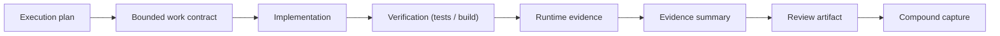
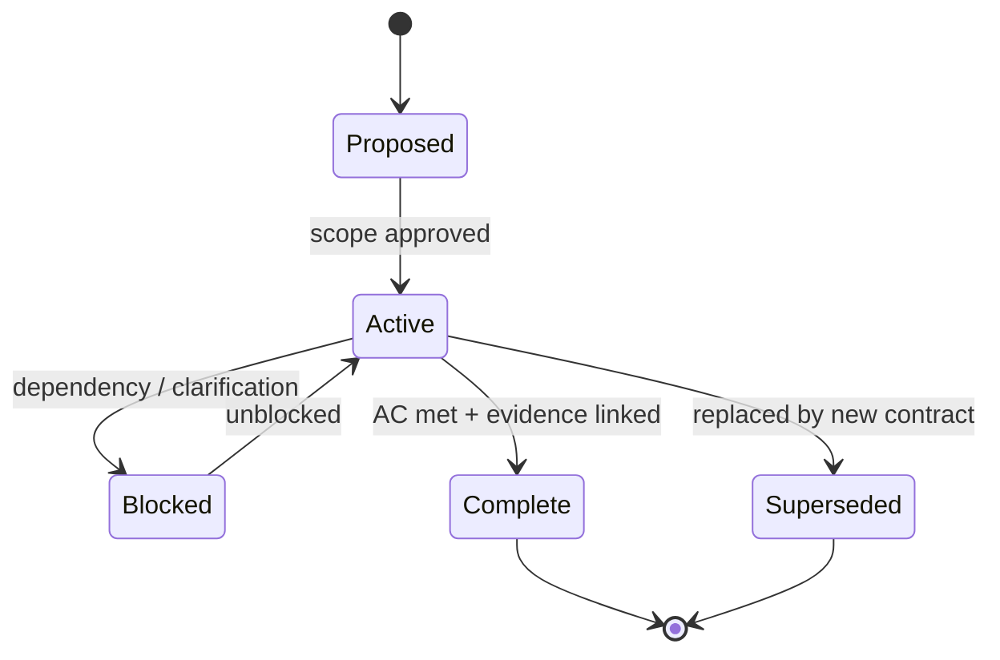
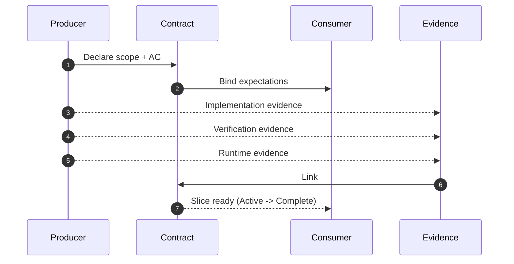
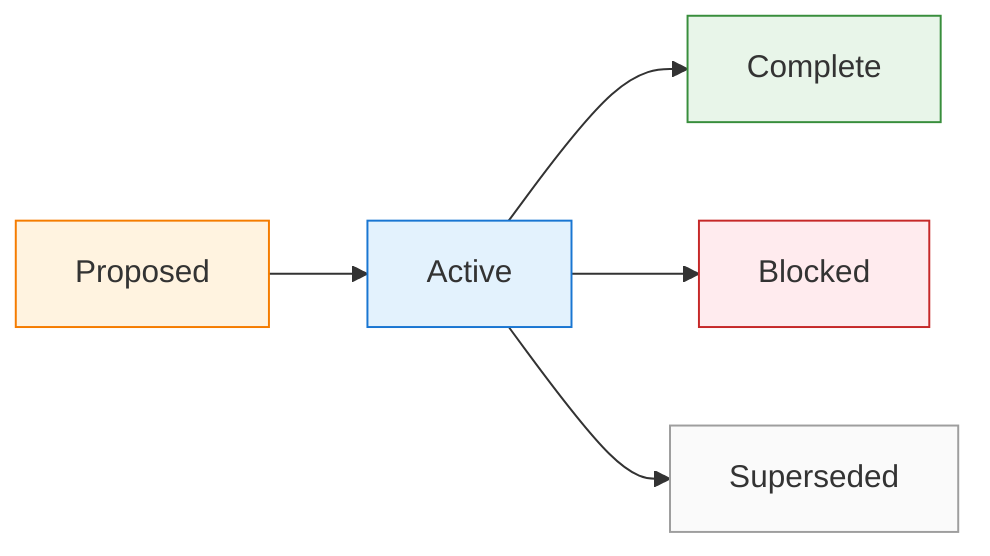

<!-- Inputs: {slice_name}, {author}, {date} -->

# Work Contract: ${slice_name}

**Checkpoint**: Work
**Status**: Proposed | Active | Blocked | Complete | Superseded
**Author**: ${author}
**Date**: ${date}

---

## Purpose

{Why this slice exists and what bounded value it is intended to deliver.}

## Scope

- {Surface, file family, or workflow area this slice is allowed to change}
- {Second allowed surface if applicable}

## Not In Scope

- {Explicit exclusion to prevent scope creep}
- {Deferred or unrelated work}

## Acceptance Criteria

- [ ] {Criterion 1}
- [ ] {Criterion 2}
- [ ] {Criterion 3}

## Verification Method

- {Tests, checks, or validation path that proves the slice is correct}
- {Static, functional, or review validation expected}

## Runtime Evidence Expectations

- {What must be observed on the real surface, if applicable}
- {What durable evidence summary or artifact must be produced}

## Risks

- {Main implementation or workflow risk}
- {Main validation or rollout risk}

## Recovery Path

- {How to revert, retry, narrow scope, or resume after interruption}

## Dependencies

- {Execution plan, spec, issue, or other contract this slice depends on}

## Evaluator Notes

- Contract readiness: {Ready | Needs changes}
- Review focus: {What evaluator should pay most attention to}
- Findings summary: {Empty until evaluation begins}

## Evidence Links

- Plan: {link or path}
- Progress: {link or path}
- Findings: {link or path}
- Review: {link or path}
---

## Appendix A: Contract Diagrams (v8.4.43+)

> Additive section.

### A.1 Plan -> Contract -> Implementation -> Evidence -> Review

### A.2 Contract Status Lifecycle

### A.3 Acceptance Criteria Traceability

| AC ID | Acceptance criterion | Source (PRD / Spec / ADR) | Verification method | Evidence link |
|-------|----------------------|----------------------------|---------------------|----------------|
| AC-1 | {criterion} | {PRD Section X} | {unit / integration / e2e / runtime} | {path} |
| AC-2 | {criterion} | {Spec Section Y} | {unit / integration / e2e / runtime} | {path} |
| AC-3 | {criterion} | {ADR-NNNN} | {unit / integration / e2e / runtime} | {path} |

## Appendix B: Rich Visual Diagrams (v8.4.43+)

### B.1 Contract Handoff Sequence

### B.2 Contract State (styled)

