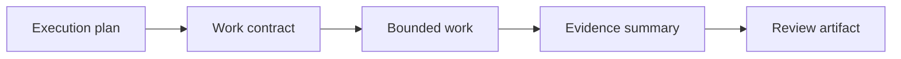
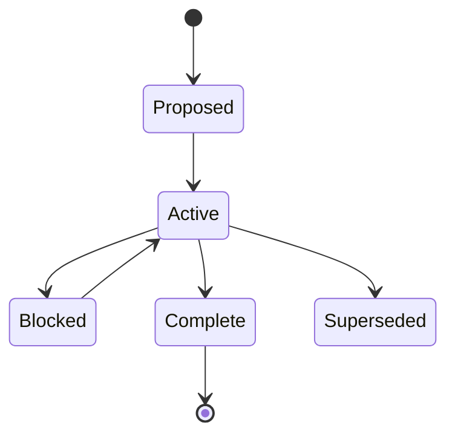

<!-- Inputs: {slice_name}, {author}, {date} -->

# Work Contract: ${slice_name}

**Checkpoint**: Work
**Status**: Proposed | Active | Blocked | Complete | Superseded
**Author**: ${author}
**Date**: ${date}

## Purpose

{Why this slice exists and what bounded value it delivers.}

## Scope

- {Allowed surface or workflow area}
- {Second allowed surface if needed}

| Boundary | Contract |
|---|---|
| File ownership | {Allowed paths and areas owned by other workers} |
| Tools and side effects | {Allowed actions and required approval before writes/deployments} |
| Shared loop | {Parent owner/reference; workers must not reset shared state} |

```mermaid
flowchart LR
    Plan[Execution plan] --> Contract[Work contract]
    Contract --> Build[Bounded work]
    Build --> Evidence[Evidence summary]
    Evidence --> Review[Review artifact]
```

## Not In Scope

- {Explicit exclusion}
- {Deferred work}

## Acceptance Criteria

- [ ] {Criterion 1}
- [ ] {Criterion 2}
- [ ] {Criterion 3}

## Verification Method

- {How correctness is proved}
- {How review will verify it}

## Runtime Evidence Expectations

- {What must be observed on the real surface}
- {What durable proof must be produced}
- {Current revision/configuration, exact checks and documented unavailable coverage}

## Risks

| Risk | Trigger | Mitigation |
|---|---|---|
| {Risk} | {Trigger} | {Mitigation} |

## Recovery Path

```mermaid
stateDiagram-v2
    [*] --> Proposed
    Proposed --> Active
    Active --> Blocked
    Blocked --> Active
    Active --> Complete
    Active --> Superseded
    Complete --> [*]
```

- {How to revert, retry, narrow scope, or resume}

## Dependencies

- {Execution plan, spec, issue, or other contract}

## Evaluator Notes

- Contract readiness: {Ready | Needs changes}
- Review focus: {What matters most}
- Findings summary: {Empty until evaluation}

## Evidence Links

- Plan: {path}
- Progress: {path}
- Findings: {path}
- Review: {path}
