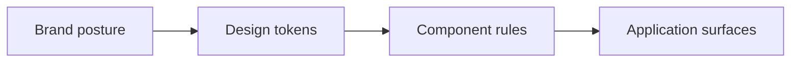
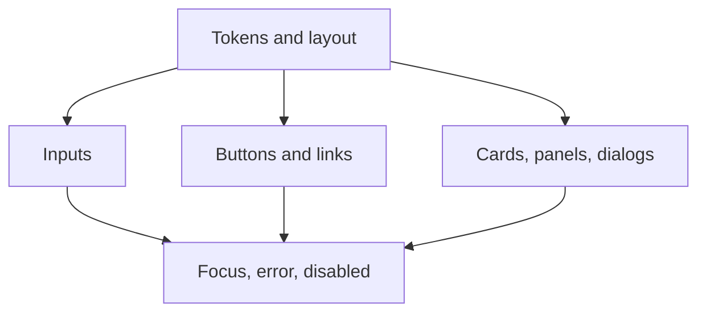

<!-- Inputs: {project_name}, {date}, {primary_direction} -->
<!--
Source: Nine-section DESIGN.md schema adapted from
  VoltAgent/awesome-design-md (https://github.com/VoltAgent/awesome-design-md)
  via nexu-io/open-design (https://github.com/nexu-io/open-design), Apache-2.0.
  See repository NOTICE for full attribution.
-->

# DESIGN.md -- {project_name}

> Portable design system. Single source of truth for visual language across prototypes, production UI, and design hand-offs.

Date: {date}
Primary direction: {primary_direction}

## 1. Brand

- Voice: <tone and writing rules>
- Audience: <primary audience>
- Constraints: <regulatory, accessibility, or posture constraints>

## 2. Color

| Token | Light | Dark | Usage |
|---|---|---|---|
| `--bg` | <value> | <value> | Page background |
| `--surface` | <value> | <value> | Cards and panels |
| `--text` | <value> | <value> | Body text |
| `--accent` | <value> | <value> | Primary emphasis |
| `--focus-ring` | <value> | <value> | Keyboard focus |

Contrast minima: 4.5:1 body, 3:1 large text, 3:1 non-text UI.

## 3. Typography

- Display: <family and weights>
- Text: <family and weights>
- Mono: <family and weights>

| Step | Size | Line | Use |
|---|---|---|---|
| -1 | <size> | <line> | Captions |
| 0 | <size> | <line> | UI default |
| 1 | <size> | <line> | Body |
| 2 | <size> | <line> | Heading |
| 3 | <size> | <line> | Large heading |

## 4. Spacing

- Base unit: <value>
- Token scale: <named tokens>
- Rule: No arbitrary spacing outside the token set

## 5. Layout

| Surface | Grid | Container | Density |
|---|---|---|---|
| Mobile | <grid> | <max width> | <density> |
| Tablet | <grid> | <max width> | <density> |
| Desktop | <grid> | <max width> | <density> |

## 6. Components

| Component | Variants | Default | Notes |
|---|---|---|---|
| Button | <variants> | <default> | <notes> |
| Input | <variants> | <default> | <notes> |
| Card | <variants> | <default> | <notes> |
| Dialog | <variants> | <default> | <notes> |
| Toast | <variants> | <default> | <notes> |

## 7. Motion

- Fast / base / slow durations: <values>
- Easing: <value>
- Reduced motion behavior: <rule>
- Banned patterns: <looping, distracting, or layout-shifting motion>

## 8. Voice and Content

- Sentence case for UI labels and headings
- Error messages say what happened and what to do next
- Empty states explain the situation and offer one primary action
- Avoid invented claims or placeholder metrics

## 9. Anti-Patterns (Project-Specific)

- <pattern to avoid>
- <pattern to avoid>
- <pattern to avoid>

## Change Log

| Date | Author | Change |
|---|---|---|
| {date} | {who} | Initial design system |
