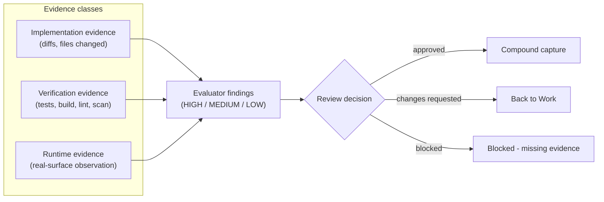
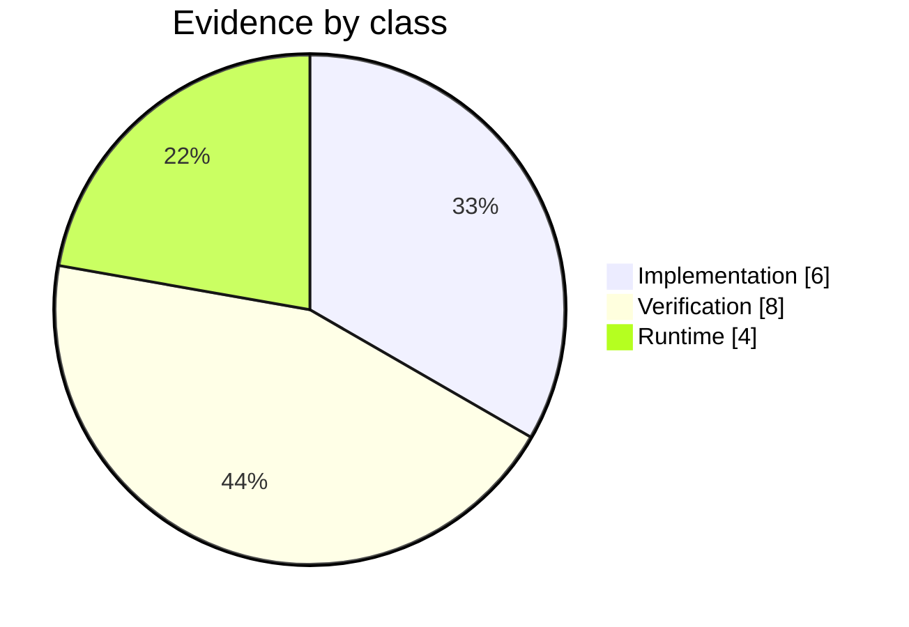
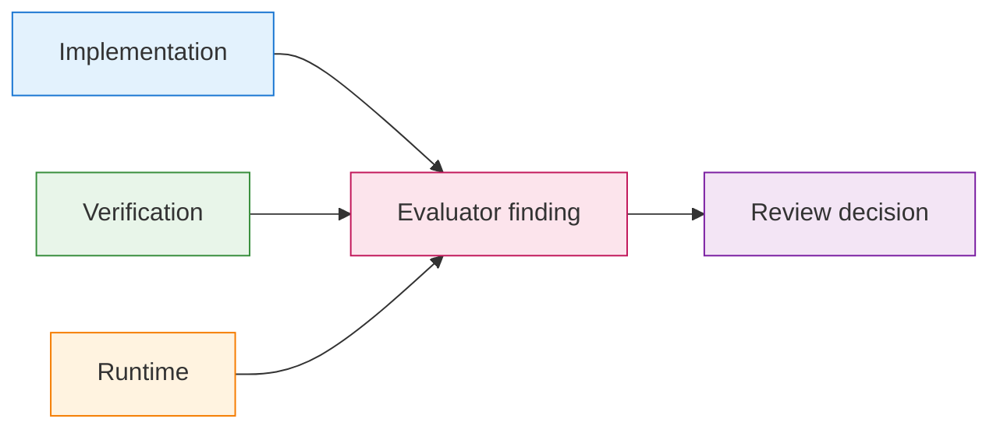

<!-- Inputs: {issue_number}, {slice_name}, {author}, {date} -->

# Evidence Summary: ${slice_name}

**Issue**: #${issue_number}
**Checkpoint**: Work | Review
**Status**: Draft | Current | Superseded
**Author**: ${author}
**Date**: ${date}

---

## Implementation Evidence

- Changed files: {paths or summaries}
- Generated artifacts: {paths or summaries}
- Scope confirmation: {what changed vs what stayed untouched}

## Verification Evidence

- Tests run: {unit, integration, e2e, or other validation}
- Static checks: {lint, build, typecheck, or equivalent}
- Result summary: {pass, fail, partial, blocker}

## Runtime Evidence

- Real-surface observation: {UI path, API response, log trace, command output, or walkthrough}
- Durable proof: {stored output, linked artifact, or summarized observation}
- Remaining runtime gap: {empty if complete}

## Evaluator Findings

- Active findings: {link or summary}
- Requested next action: {what must change before the slice can advance}

## Review References

- Work contract: {path}
- Review artifact: {path}
- Durable findings: {path}

## Notes

- {Anything important for resumption, rollback, or follow-up review}
---

## Appendix A: Evidence Diagrams (v8.4.43+)

> Additive section.

### A.1 Three Evidence Classes -> Review Decision

### A.2 Filled Mini-Example

| Class | Artifact | Path / link | Note |
|-------|----------|-------------|------|
| Implementation | Diff | `git show HEAD~1` | Adds `/health` endpoint and registration |
| Verification | xUnit run | `artifacts/test-results/health.trx` | 12/12 pass, coverage 86% |
| Verification | Static analysis | `artifacts/sast/health.sarif` | 0 high, 0 medium |
| Runtime | curl probe | `artifacts/runtime/health-prod.txt` | 200 OK, p95 18ms over 1k requests |

### A.3 Evidence Freshness Note

| Field | Value |
|-------|-------|
| Captured at | {ISO 8601 timestamp} |
| Captured by | {agent / role / human} |
| Valid until | {expiry; e.g., next deploy} |
| Reproducer command | {one command another agent can run} |

## Appendix B: Rich Visual Diagrams (v8.4.43+)

### B.1 Evidence Mix (pie)

### B.2 Evidence Flow (styled)

