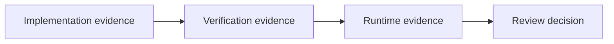

<!-- Inputs: {slice_name}, {author}, {date} -->

# Evidence Summary: ${slice_name}

**Checkpoint**: Work | Review
**Status**: Draft | Current | Superseded
**Author**: ${author}
**Date**: ${date}

## Implementation Evidence

- Changed files: {paths or summaries}
- Generated artifacts: {paths or summaries}
- Scope confirmation: {what changed vs what stayed untouched}
- Revision and inputs: {Commit/file hashes, configuration, dataset and tool/model versions}

## Verification Evidence

- Tests run: {unit, integration, e2e, or other validation}
- Static checks: {lint, build, typecheck, or equivalent}
- Result summary: {pass, fail, partial, blocker}

| Command / check | Executed at | Exit / result | Evidence path |
|---|---|---|---|
| {Exact command and scope} | {Timestamp} | {Observed result} | {Immutable output or hash-bound record} |

Unexecuted checks are `Not run` with a reason, never a pass. Summaries of old runs
do not become fresh evidence by changing their timestamp.

## Runtime Evidence

```mermaid
flowchart LR
    Impl[Implementation evidence] --> Verify[Verification evidence]
    Verify --> Runtime[Runtime evidence]
    Runtime --> Review[Review decision]
```

- Real-surface observation: {UI path, API response, log trace, or walkthrough}
- Durable proof: {stored output, linked artifact, or summarized observation}
- Remaining runtime gap: {empty if complete}
- Documentation review: {Drift result, updated/no-impact rationale and current reviewed hashes}

## Evaluator Findings

- Active findings: {link or summary}
- Requested next action: {what must change before the slice can advance}

## Review References

- Work contract: {path}
- Review artifact: {path}
- Durable findings: {path}

## Notes

- {Anything important for resumption, rollback, or follow-up review}
