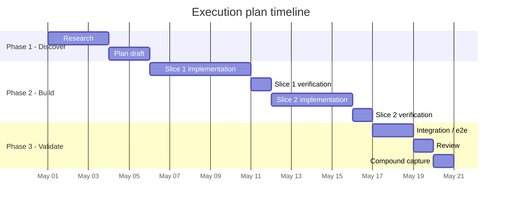
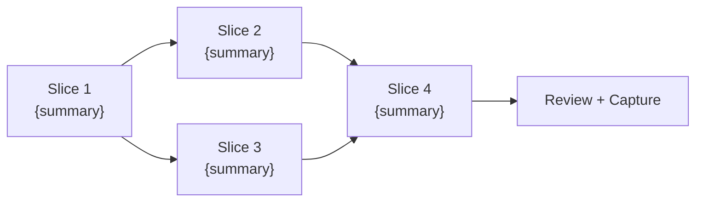
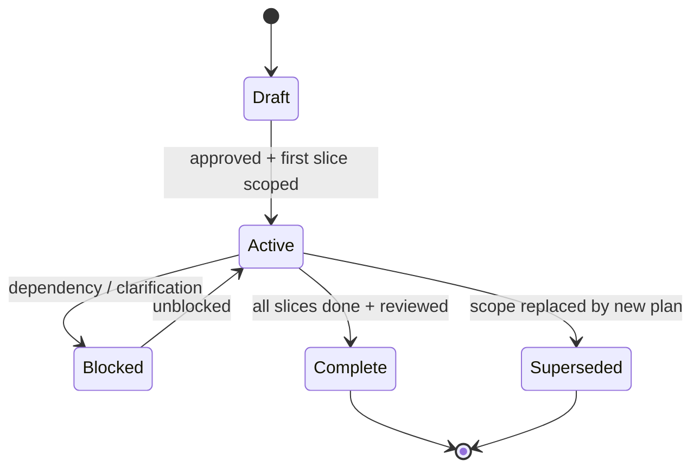
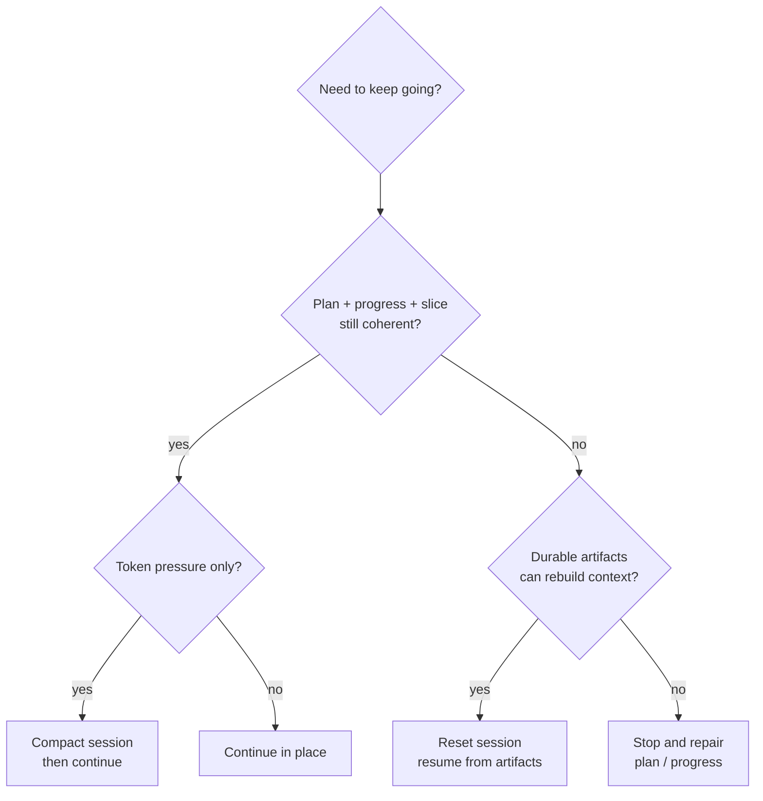
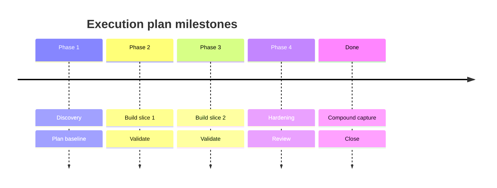
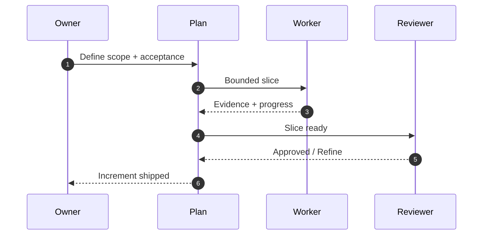
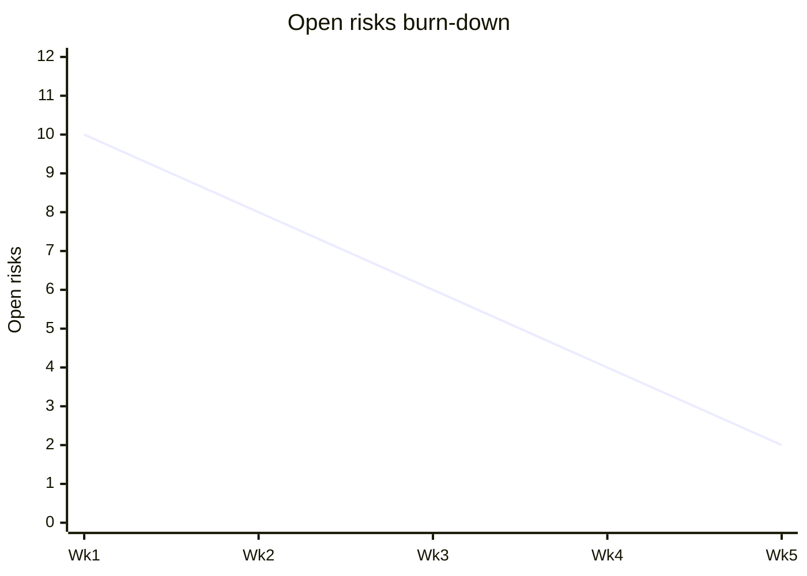
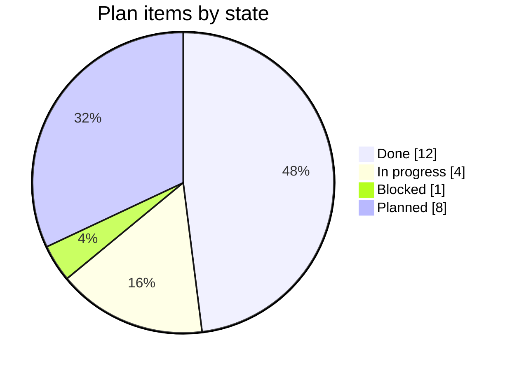

<!-- Inputs: {issue_number}, {title}, {date}, {author}, {agent} -->

# Execution Plan: {title}

**Issue**: #{issue_number}
**Author**: {agent}
**Date**: {date}
**Status**: Draft | In Progress | Complete

---

## Purpose / Big Picture

<!-- Explain what changes for the user or repo after this work, and how to tell it succeeded. -->

This execution plan is a living document. Keep `Progress`, `Surprises & Discoveries`, `Decision Log`, and `Outcomes & Retrospective` current as work proceeds.

## Progress

- [ ] Initial plan drafted
- [ ] Repo context and dependencies reviewed
- [ ] Validation approach defined
- [ ] Implementation started
- [ ] Acceptance evidence recorded

## Surprises & Discoveries

- Observation:
	Evidence:

## Decision Log

- Decision:
	Options Considered:
	Chosen:
	Rationale:
	Date/Author:

## Context and Orientation

<!-- Describe the current repo state for a new agent. Name the key files, modules, and constraints relevant to this work. -->

## Pre-Conditions

- [ ] Issue exists and is classified
- [ ] Dependencies checked (no open blockers)
- [ ] Required skills identified
- [ ] Complexity assessed and this task is confirmed to require a plan

## Plan of Work

<!-- Describe the intended sequence of edits and decisions in prose. Keep it concrete and repo-specific. -->

## Steps

| # | Step | Owner | Status | Notes |
|---|------|-------|--------|-------|
| 1 | | | Not Started | |
| 2 | | | Not Started | |
| 3 | | | Not Started | |
| 4 | | | Not Started | |
| 5 | | | Not Started | |

## Concrete Steps

<!-- Record exact commands, working directories, or operator actions needed to validate progress. Update this as the work evolves. -->

## Blockers

| Blocker | Impact | Resolution | Status |
|---------|--------|------------|--------|
| | | | |

## Validation and Acceptance

- [ ] Criterion 1
- [ ] Criterion 2
- [ ] Criterion 3

<!-- Phrase acceptance as observable outcomes, not internal claims only. -->

## Idempotence and Recovery

<!-- Explain how to retry safely and how to recover if a step fails halfway. -->

## Rollback Plan

<!-- If something goes wrong, how do we undo? -->

## Artifacts and Notes

<!-- Include concise transcripts, summaries, or references to evidence generated during the work. -->

## Outcomes & Retrospective

<!-- At major milestones or completion, summarize what was achieved, what remains, and lessons learned. -->

---

**Template**: [EXEC-PLAN-TEMPLATE.md](../../.github/templates/EXEC-PLAN-TEMPLATE.md)

---

## Appendix A: Plan Diagrams (v8.4.43+)

> Additive section.

### A.1 Phase Gantt

### A.2 Dependency Graph

### A.3 Plan Lifecycle

### A.4 Reset / Compact / Continue Decision

### A.5 Risk Burn-Down

| Risk ID | Description | Severity (1-5) | Owner | Status | Burn-down date |
|---------|-------------|----------------|-------|--------|-----------------|
| R-1 | {risk} | {n} | {owner} | {open / mitigated / accepted} | {date} |
| R-2 | {risk} | {n} | {owner} | {open / mitigated / accepted} | {date} |

## Appendix B: Rich Visual Diagrams (v8.4.43+)

### B.1 Plan Timeline

### B.2 Plan Coordination Sequence

### B.3 Risk Burn-down (xychart)

### B.4 Plan Health (pie)

