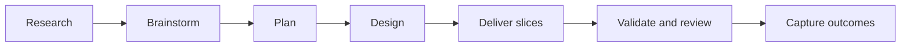
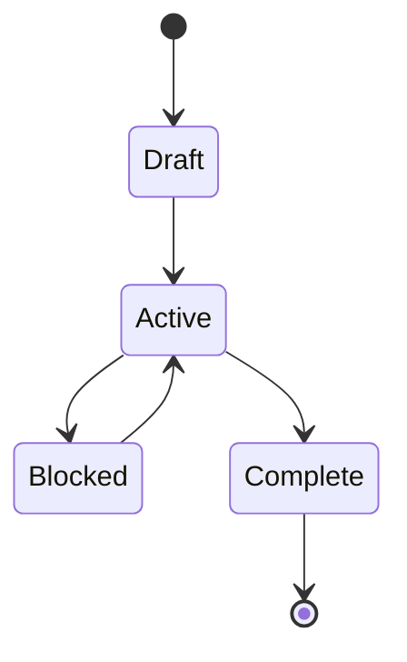

<!-- Inputs: {title}, {date}, {author}, {agent} -->

# Execution Plan: {title}

**Author**: {agent}
**Date**: {date}
**Status**: Draft | In Progress | Complete

## Purpose / Big Picture

{What changes for the user or repo after this work, and how success is observed.}

## Progress

- [ ] Initial plan drafted
- [ ] Dependencies reviewed
- [ ] Validation path defined
- [ ] Work started
- [ ] Acceptance evidence recorded

## Surprises & Discoveries

- Observation: {what changed the plan}
- Evidence: {how it was observed}

## Decision Log

| Decision | Options considered | Chosen | Rationale | Date / Author |
|---|---|---|---|---|
| {Decision} | {Options} | {Chosen} | {Why} | {Date / Author} |

## Alternatives Considered

{Record the brainstorm alternatives and selection rationale before writing
the plan of work. Link the required council or specialist alignment.}

## Context and Orientation

{Describe the current repo state, important files, and constraints.}

## Pre-Conditions

- [ ] Issue exists and is classified
- [ ] Dependencies checked
- [ ] Required skills identified
- [ ] Task complexity warrants a plan

## Plan of Work

```mermaid
flowchart LR
    Discover[Research] --> Brainstorm[Brainstorm]
    Brainstorm --> Plan[Plan]
    Plan --> Design[Design]
    Design --> Deliver[Deliver slices]
    Deliver --> Validate[Validate and review]
    Validate --> Capture[Capture outcomes]
```

{Describe the intended sequence of edits and decisions in prose.}

## Steps

| # | Step | Owner | Status | Notes |
|---|---|---|---|---|
| 1 | {Step} | {Owner} | Not Started | {Notes} |
| 2 | {Step} | {Owner} | Not Started | {Notes} |
| 3 | {Step} | {Owner} | Not Started | {Notes} |

## Concrete Steps

| Validation activity | Working area | Evidence |
|---|---|---|
| {Activity} | {Path or surface} | {Artifact or observation} |

## Blockers

| Blocker | Impact | Resolution | Status |
|---|---|---|---|
| {Blocker} | {Impact} | {Resolution} | {State} |

## Validation and Acceptance

- [ ] `agentx doc-drift check` passed; updated/no-impact rationale and reviewed document hashes recorded
- [ ] Required independent review has zero High/Medium findings
- [ ] Final evidence matches the reviewed code, configuration and documents
- [ ] Criterion 1
- [ ] Criterion 2
- [ ] Criterion 3

## Idempotence and Recovery

```mermaid
stateDiagram-v2
    [*] --> Draft
    Draft --> Active
    Active --> Blocked
    Blocked --> Active
    Active --> Complete
    Complete --> [*]
```

{Explain how to retry safely and how to recover if a step fails halfway.}

**Shared loop owner / reference**: {Owner and current loop}. Delegated workers
and descendants must not reset or complete the parent's loop. If state is lost,
recover through the supported CLI with carried-over changes included and fresh
verification; never hand-edit evidence timestamps or baseline hashes.

## Rollback Plan

{If something goes wrong, how to undo or narrow the blast radius.}

## Artifacts and Notes

- {Concise transcript, summary, or evidence reference}

## Outcomes & Retrospective

{What was achieved, what remains, and what should be learned from this work.}
