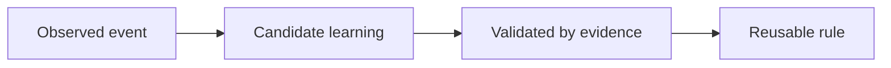

<!-- Inputs: {id}, {issue}, {date}, {category} -->
<!--
confidence: 0.0-1.0 float. 0.0=hypothesis, 0.5=observed once,
            0.8=auto-promote threshold, 1.0=universal convention.
observations: integer count of times this pattern has been re-confirmed.
              Each independent confirmation increments by 1.
status: draft | curated | promoted | archived
-->

# LEARNING-{id}: {Title}

**Date**: {date}
**Issue**: #{issue}
**Category**: {category}
**Confidence**: {confidence}  (auto-promote at >= 0.8)
**Observations**: {observations}

## Context

What was the situation? What problem were we solving?

## Learning

The reusable insight. State it as a rule or pattern another agent could apply.

## Evidence

- Where did this come from? (issue link, commit, review finding)
- How was it validated? (test, retry success, peer review)

## Why It Matters

When does this apply? What does it prevent?

## Promotion Path

At confidence >= 0.8 with at least 3 independent observations, assess promotion
through the configured learning workflow. Record the actual promotion result
before claiming it reached `memories/conventions.md` or the conventions router;
thresholds alone are not proof that automation ran.

## Related

- ADR(s):
- Review(s):
- Other LEARNING(s):
