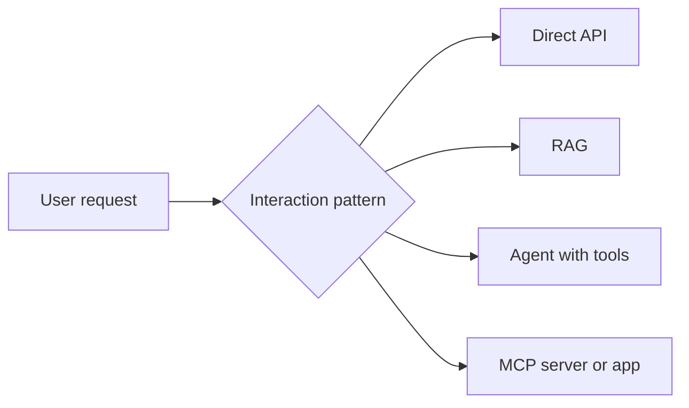
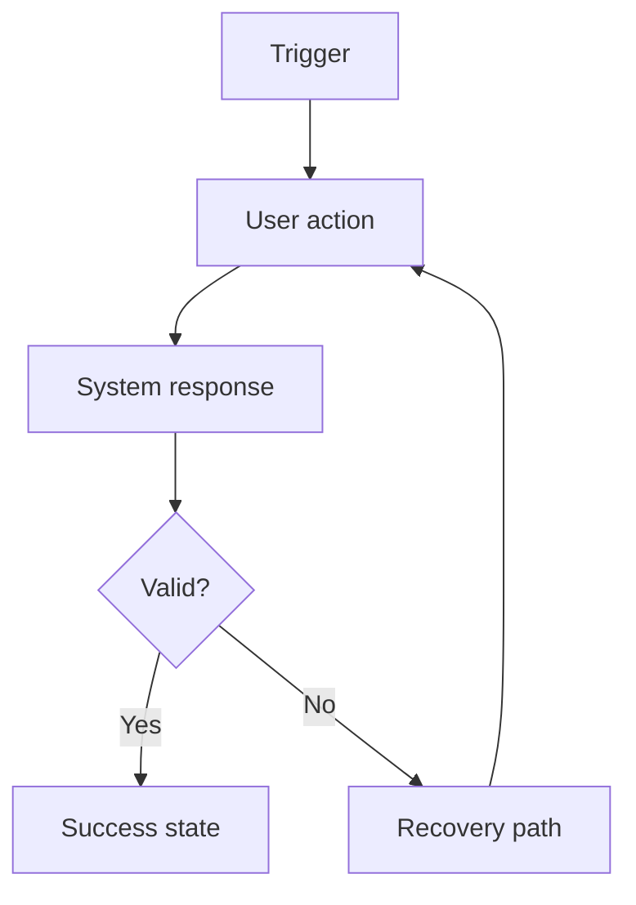
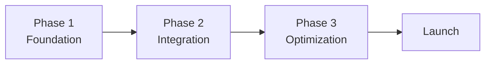

---
inputs:
  epic_title:
    description: "Title of the Epic"
    required: true
    default: ""
  priority:
    description: "Priority level"
    required: false
    default: "p2"
  author:
    description: "Document author (agent or person name)"
    required: false
    default: "Product Manager Agent"
  date:
    description: "Creation date (YYYY-MM-DD)"
    required: false
    default: "${current_date}"
---

# PRD: ${epic_title}

**Status**: Draft | Review | Approved
**Author**: ${author}
**Date**: ${date}
**Stakeholders**: {Names/Roles}
**Priority**: ${priority}

## 1. Problem Statement

### What problem are we solving?
{Clear description of the user problem or business need.}

### Why is this important?
{Business value, user impact, or strategic reason.}

### What happens if we do not solve this?
{Consequence of inaction.}

## 2. Target Users

### Primary Users

| Persona | Goals | Pain Points | Current Behavior |
|---|---|---|---|
| {Name/Role} | {Goal} | {Pain point} | {How they solve it today} |
| {Name/Role} | {Goal} | {Pain point} | {How they solve it today} |

### Secondary Users

| Persona | Benefit | Dependency on primary flow |
|---|---|---|
| {Group} | {Value received} | {How they depend on it} |

## 3. Goals & Success Metrics

### Business Goals
1. {Goal 1 with measurable target}
2. {Goal 2 with measurable target}
3. {Goal 3 with measurable target}

### Success Metrics (KPIs)

| Metric | Current | Target | Timeline |
|---|---|---|---|
| {Metric 1} | {Baseline} | {Goal} | {When} |
| {Metric 2} | {Baseline} | {Goal} | {When} |
| {Metric 3} | {Baseline} | {Goal} | {When} |

### User Success Criteria
- {Observable user success outcome}
- {Observable user success outcome}

## 4. Requirements

> Requirements Quality Rule: every requirement must be testable and specific.

### 4.1 Functional Requirements

#### Must Have (P0)
1. **{Requirement}**: {Description}
   - **User Story**: As a {role}, I want {capability} so that {benefit}
   - **Acceptance Criteria**:
     - [ ] {Criterion 1}
     - [ ] {Criterion 2}
2. **{Requirement}**: {Description}
   - **User Story**: As a {role}, I want {capability} so that {benefit}
   - **Acceptance Criteria**:
     - [ ] {Criterion 1}

#### Should Have (P1)
1. **{Requirement}**: {Description}
   - **User Story**: As a {role}, I want {capability} so that {benefit}

#### Could Have (P2)
1. **{Requirement}**: {Description}
   - **User Story**: As a {role}, I want {capability} so that {benefit}

#### Won't Have (Out of Scope)
- {Feature explicitly excluded}
- {Feature deferred to later}

### 4.2 AI/ML Requirements

> Include this section only when the request involves AI, ML, LLM, intelligent automation, agents, or MCP.

#### Technology Classification
- [ ] AI/ML powered
- [ ] Rule-based / statistical
- [ ] Hybrid

> If the user explicitly requested AI behavior, do not silently reclassify to rule-based without confirmation.

#### Model Requirements (if AI/ML powered)

| Requirement | Specification |
|---|---|
| Model Type | LLM / Vision / Embedding / Speech / Custom |
| Provider or host preference | Microsoft Foundry / OpenAI / Anthropic / Google / Local / Any / TBD |
| Latency | Real-time / Near-real-time / Batch |
| Quality Threshold | {Named metric and threshold} |
| Cost Budget | {Budget per request, session, or month} |
| Data Sensitivity | PII / Confidential / Internal / Public |

#### Product-Facing AI Contract

| Requirement | Specification |
|---|---|
| Primary AI Job | {What user-visible reasoning or generation the AI performs} |
| Grounding Sources | {Docs, KBs, APIs, files, databases, or none} |
| Tool / Action Boundaries | {What the AI may and may not do} |
| Response Contract | {Free text / structured output / citations / draft artifact} |
| Fallback Behavior | {What users see when confidence is low or the model fails} |
| Human Review Trigger | {When a human must approve or correct} |

#### Inference Pattern
- [ ] Real-time API
- [ ] Batch processing
- [ ] RAG
- [ ] Fine-tuned model
- [ ] Agent with tools
- [ ] Multi-agent orchestration
- [ ] MCP Server
- [ ] MCP App

#### Data Requirements
- Training / evaluation data: {source, format, volume}
- Grounding data: {knowledge base, documents, or APIs}
- Data sensitivity: {PII / Confidential / Public}
- Volume: {requests per hour/day/month}
- Freshness requirement: {static / daily sync / near-real-time / user-provided only}

#### MCP Requirements (if MCP Server or MCP App)

| Requirement | Specification |
|---|---|
| Protocol | MCP Server / MCP App / Both |
| Transport | stdio / SSE / Streamable HTTP |
| AI Host | VS Code Copilot / Claude Desktop / GitHub Copilot / Custom |
| Tools Exposed | {tool names and purposes} |
| Resources Exposed | {resource URIs and content types} |
| UI Views | {interactive views, if MCP App} |
| Authentication | {OAuth / API key / none} |

#### Responsible AI Requirements

| Concern | Requirement |
|---|---|
| Guardrails | {Input/output filtering and topic boundaries} |
| Transparency | {How users are informed AI is in use} |
| Fairness | {Bias testing strategy} |
| Privacy | {Retention, consent, and PII handling} |
| Human Oversight | {When human review is required} |
| Accountability | {Logging and auditability} |

#### AI-Specific Acceptance Criteria
- [ ] Model behavior meets quality threshold
- [ ] Latency meets product requirement
- [ ] Cost is within budget
- [ ] Evaluation dataset exists with {N} test cases
- [ ] Guardrails and fallback behavior are defined
- [ ] Human-review path exists for high-risk outcomes

### 4.3 Non-Functional Requirements

| Category | Requirement |
|---|---|
| Performance | {Response time, throughput, or concurrency target} |
| Security | {Auth, authorization, protection, compliance requirement} |
| Scalability | {Growth and capacity expectation} |
| Usability | {Accessibility, supported platforms, localization} |
| Reliability | {Recovery, monitoring, and fault-handling expectation} |

## 5. User Stories & Features

| Feature | Description | Priority | Stories |
|---|---|---|---|
| {Feature 1} | {What it delivers} | P0 | {US-1.1, US-1.2} |
| {Feature 2} | {What it delivers} | P1 | {US-2.1} |
| {Feature 3} | {What it delivers} | P2 | {US-3.1} |

### Story Breakdown

| Story ID | As a... | I want... | So that... | Acceptance Criteria | Priority | Estimate |
|---|---|---|---|---|---|---|
| US-1.1 | {role} | {capability} | {benefit} | {criterion list} | P0 | {estimate} |
| US-1.2 | {role} | {capability} | {benefit} | {criterion list} | P0 | {estimate} |
| US-2.1 | {role} | {capability} | {benefit} | {criterion list} | P1 | {estimate} |

## 6. User Flows

### Primary Flow: {Flow Name}
- Trigger: {What initiates this flow}
- Preconditions: {Required state before flow starts}
- Success state: {Outcome}
- Alternative flows: {Error scenario or edge case}

### Secondary Flow: {Flow Name}
{Repeat only when materially different from the primary flow.}

## 7. Dependencies & Constraints

### Technical Dependencies

| Dependency | Type | Status | Owner | Impact if Unavailable |
|---|---|---|---|---|
| {Dependency} | External | {Available/In Development} | {Team} | {Impact} |
| {Dependency} | Internal | {Available/In Development} | {Team} | {Impact} |

### Business Dependencies
- {Launch dependency}
- {Legal or compliance dependency}
- {Training or enablement dependency}

### Technical Constraints
- {Architecture or platform constraint}
- {Integration or compatibility constraint}
- {Migration or supportability constraint}

### Resource Constraints
- Development team: {size}
- Timeline: {duration}
- Budget: {amount}

## 8. Risks & Mitigations

| Risk | Impact | Probability | Mitigation | Owner |
|---|---|---|---|---|
| {Risk 1} | High/Med/Low | High/Med/Low | {Mitigation plan} | {Owner} |
| {Risk 2} | High/Med/Low | High/Med/Low | {Mitigation plan} | {Owner} |
| {Risk 3} | High/Med/Low | High/Med/Low | {Mitigation plan} | {Owner} |

## 9. Timeline & Milestones

| Phase | Goal | Deliverables | Stories |
|---|---|---|---|
| Phase 1: Foundation | {Goal} | {Key deliverables} | {Story list} |
| Phase 2: Integration | {Goal} | {Key deliverables} | {Story list} |
| Phase 3: Optimization | {Goal} | {Key deliverables} | {Story list} |

### Launch Date
- Target: {YYYY-MM-DD}
- Launch criteria:
  - [ ] All P0 stories completed
  - [ ] Security audit passed
  - [ ] Performance benchmarks met
  - [ ] Documentation complete
  - [ ] Support team trained

## 10. Out of Scope

### Explicitly excluded from this Epic
- {Feature excluded from this release}
- {Feature deferred to later}
- {Feature requiring different infrastructure or policy}

### Future Considerations
- {Enhancement to revisit later}
- {Enhancement to revisit later}

## 11. Open Questions

| Question | Owner | Status | Resolution |
|---|---|---|---|
| {Question 1} | {Name} | Open | TBD |
| {Question 2} | {Name} | Resolved | {Answer} |

## 12. Appendix

### Research Summary
- {Primary user or market evidence}
- {Competitive or workflow evidence}
- {Feasibility or technical evidence}
- {If evidence is missing, record `TBD` and carry it into Open Questions before handoff}

### Research Validation and Handoff

| Check | Evidence / Outcome |
|---|---|
| Prior art or comparable solutions reviewed | {sources or note} |
| User evidence or explicit assumption gap recorded | {sources or `TBD`} |
| Standards or compliance constraints reviewed | {sources or note} |
| Architect handoff readiness | {Ready / Blocked with reason} |
| UX handoff readiness | {Ready / Blocked / N/A} |
| Data Scientist handoff readiness for AI scope | {Ready / Blocked / N/A} |

### Council Citation (when required)

| Field | Value |
|---|---|
| Council artifact | `docs/artifacts/prd/COUNCIL-{epic-id}.md` |
| Required when | Non-trivial scope, priority, or AI-bearing PRDs |
| PRD sections updated from synthesis | Scope, priority, success metrics, risks, and open questions |
| Skip rationale location | Research Summary |

### Research & References
- {Market research or customer evidence}
- {Competitor analysis}
- {User interview notes}
- {Technical feasibility study}

### Glossary
- **{Term}**: {Definition}
- **{Term}**: {Definition}

### Related Documents
- Technical Specification: `docs/artifacts/specs/SPEC-{feature-id}.md`
- UX Design: `docs/ux/UX-{feature-id}.md`
- Architecture Decision Record: `docs/artifacts/adr/ADR-{epic-id}.md`

## Review & Approval

| Stakeholder | Role | Status | Date | Comments |
|---|---|---|---|---|
| {Name} | Product Manager | Pending / Approved / Changes Requested | {date} | {comments} |
| {Name} | Engineering Lead | Pending / Approved / Changes Requested | {date} | {comments} |
| {Name} | UX Lead | Pending / Approved / Changes Requested | {date} | {comments} |

### Validation Record

| Field | Value |
|---|---|
| Research validated for handoff | {Yes / No with reason} |
| Council synthesis reflected where required | {Yes / No / N/A} |
| Blocking open questions carried forward | {Yes / No} |

**Generated by AgentX Product Manager Agent**  
**Last Updated**: {YYYY-MM-DD}  
**Version**: 1.0
