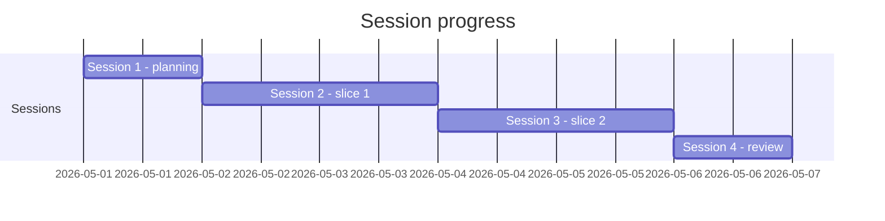
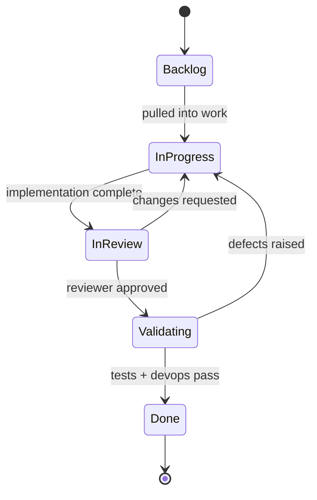
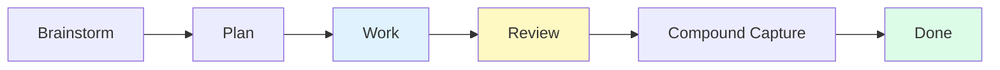
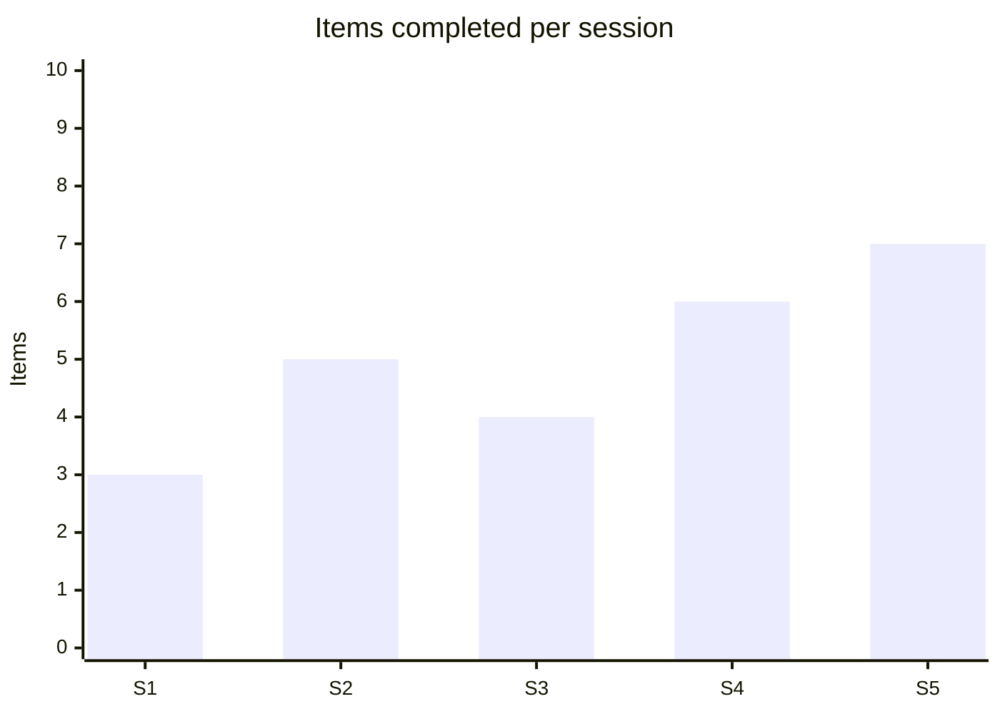
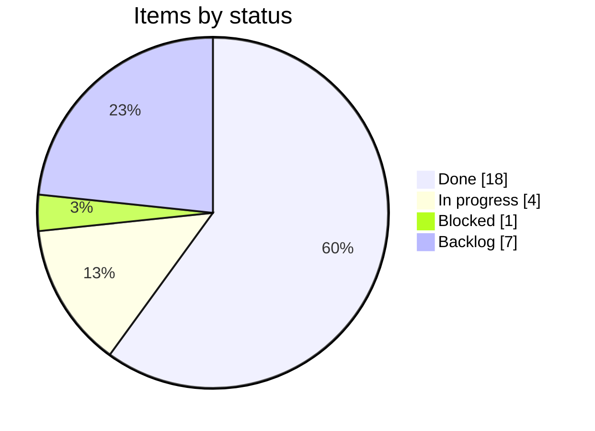

---
inputs:
 issue_number:
 description: "GitHub issue number"
 required: true
 default: ""
 issue_title:
 description: "Issue title"
 required: true
 default: ""
 agent_role:
 description: "Agent role (PM, UX, Architect, Engineer, Reviewer)"
 required: true
 default: ""
 session_date:
 description: "Session date"
 required: false
 default: "${current_date}"
---

# Progress Log: #${issue_number} - ${issue_title}

> **Purpose**: Track agent sessions, decisions, and continuity across context windows. 
> **Pattern**: Each agent appends session notes before handoff or context refresh. 
> **See Also**: [Skills.md Checkpoint Protocol](../../Skills.md#checkpoint-protocol)

---

## Status

| Field | Value |
|-------|-------|
| Issue | #${issue_number} |
| Type | <!-- type:story / type:bug / type:feature --> |
| Agent | ${agent_role} |
| Status | <!-- In Progress / In Review / Done --> |
| Started | ${session_date} |
| Last Updated | ${session_date} |

### Phase Checklist

- [ ] Research & planning
- [ ] Implementation
- [ ] Testing (80% coverage)
- [ ] Documentation
- [ ] Review ready

### GenAI Phase Checklist (if applicable)

- [ ] Prompt engineering (system prompt, structured output schema)
- [ ] Evaluation dataset created ({N} test cases)
- [ ] Model version pinned with evaluation baseline
- [ ] Guardrails configured and tested
- [ ] LLM-as-judge evaluation passing thresholds
- [ ] AgentOps tracing enabled

### MCP Phase Checklist (if applicable)

- [ ] Tool definitions with JSON Schema validation
- [ ] Resource providers implemented
- [ ] End-to-end test with target AI host
- [ ] Security review (input validation, path traversal, SSRF)

---

## Checkpoint Log

<!-- Record each checkpoint stop as a structured entry.
 See Skills.md Checkpoint Protocol for when to use checkpoints. -->

### CP-001

| Field | Value |
|-------|-------|
| Status | Pending <!-- Pending / [PASS] Completed --> |
| Phase | <!-- e.g., Implementation --> |
| Skill | <!-- e.g., react, testing --> |
| Files Changed | <!-- count --> |

**Summary:**
> <!-- What was completed before this checkpoint -->

**Decision Needed:**
1. <!-- Question or option for user -->

**User Response:**
<!-- Fill after user responds -->

---

## Session 1 - ${agent_role} (${session_date})

### What I Accomplished
- [List key deliverables completed this session]
- [Changes made to codebase]
- [Documents created/updated]

### Testing & Verification
- [Tests written/run]
- [Coverage metrics]
- [Manual verification steps]

### Issues & Blockers
- [Problems encountered]
- [Decisions that need clarification]
- [Dependencies on other work]

### Next Steps
- [What should be done in next session]
- [Specific files/features to work on]
- [Prerequisites needed]

### Context for Next Agent
[Any important context the next agent should know about this work]

---

## Session 2 - ${agent_role} (${current_date})

### Previous Session Review
- [Quick review of what was done before]
- [Verification that previous work still functions]

### What I Accomplished
- 
- 

### Testing & Verification
- 
- 

### Issues & Blockers
- 
- 

### Next Steps
- 
- 

### Context for Next Agent

---

## Completion Summary

**Final Status**: [In Progress / Ready for Review / Completed] 
**Total Sessions**: [Number] 
**Total Checkpoints**: [Number] 
**Overall Coverage**: [Percentage] 
**Ready for Handoff**: [Yes/No]

### Key Achievements
- 
- 

### Outstanding Items
- 
- 

### Artifacts Produced

| Artifact | Path | Description |
|----------|------|-------------|
| <!-- e.g., Component --> | <!-- src/... --> | <!-- Brief description --> |
| <!-- e.g., Tests --> | <!-- tests/... --> | <!-- Brief description --> |
| <!-- e.g., Docs --> | <!-- docs/... --> | <!-- Brief description --> |

---

**Generated by AgentX ${agent_role} Agent** 
**Last Updated**: ${session_date} 
**Version**: 1.0

---

## Appendix A: Progress Diagrams (v8.4.43+)

> Additive section.

### A.1 Session Timeline



### A.2 Status Flow



### A.3 Checkpoint Chain



> Highlight the current checkpoint each session.

### A.4 Burn-up / progress table

| Slice | Planned | Actual | Drift | Status | Notes |
|-------|---------|--------|-------|--------|-------|
| {S1} | {effort} | {effort} | {+/-} | {state} | {note} |
| {S2} | {effort} | {effort} | {+/-} | {state} | {note} |


## Appendix B: Rich Visual Diagrams (v8.4.43+)

### B.1 Velocity (xychart)



### B.2 Status Distribution (pie)



### B.3 Progress Sequence

```mermaid
sequenceDiagram
  autonumber
  participant Loop
  participant Work
  participant Evidence
  participant Review
  Loop->>Work: Start iteration
  Work-->>Evidence: Append evidence
  Loop->>Review: Self-review
  Review-->>Loop: Findings (HIGH/MED/LOW)
  Loop->>Work: Fix
  Loop-->>Loop: Iterate (>= min)
  Loop-->>Review: Complete (gate passed)
```
