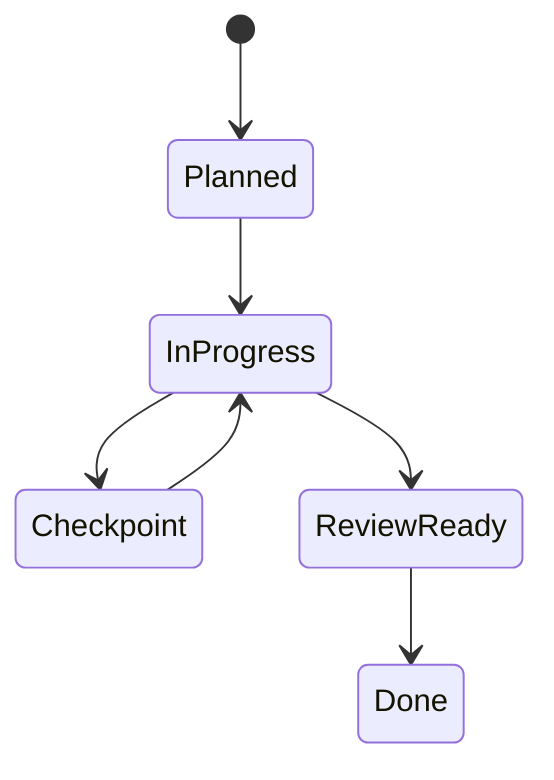
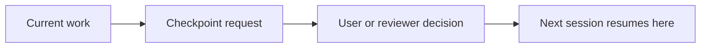

---
inputs:
  issue_title:
    description: "Issue title"
    required: true
    default: ""
  agent_role:
    description: "Agent role (PM, UX, Architect, Engineer, Reviewer)"
    required: true
    default: ""
  session_date:
    description: "Session date"
    required: false
    default: "${current_date}"
---

# Progress Log: ${issue_title}

> Purpose: Track sessions, checkpoints, and handoff context across agent turns.

## Status

| Field | Value |
|---|---|
| Type | <!-- type:story / type:bug / type:feature --> |
| Agent | ${agent_role} |
| Status | <!-- In Progress / In Review / Done --> |
| Started | ${session_date} |
| Last Updated | ${session_date} |

```mermaid
stateDiagram-v2
    [*] --> Planned
    Planned --> InProgress
    InProgress --> Checkpoint
    Checkpoint --> InProgress
    InProgress --> ReviewReady
    ReviewReady --> Done
```

### Phase Checklist

- [ ] Research and planning
- [ ] Implementation
- [ ] Testing (80% coverage)
- [ ] Documentation drift checked; impact rationale and reviewed hashes recorded
- [ ] Review ready

### GenAI Phase Checklist (if applicable)

- [ ] Prompt engineering documented
- [ ] Evaluation dataset created ({N} test cases)
- [ ] Actual model identity recorded and compared with a held-out baseline
- [ ] Guardrails configured and tested
- [ ] Required objective graders and calibrated judge checks passed, or limitations recorded
- [ ] AgentOps tracing enabled

### MCP Phase Checklist (if applicable)

- [ ] Tool definitions with JSON Schema validation
- [ ] Resource providers implemented
- [ ] End-to-end test with target AI host
- [ ] Security review completed

## Checkpoint Log

```mermaid
flowchart LR
    Work[Current work] --> Checkpoint[Checkpoint request]
    Checkpoint --> Decision[User or reviewer decision]
    Decision --> Resume[Next session resumes here]
```

### CP-001

| Field | Value |
|---|---|
| Status | Pending <!-- Pending / `[PASS]` Completed --> |
| Phase | <!-- e.g., Implementation --> |
| Skill | <!-- e.g., react, testing --> |
| Files Changed | <!-- count --> |

**Summary:**  
> <!-- What was completed before this checkpoint -->

**Decision Needed:**
1. <!-- Question or option for user -->

**User Response:**  
<!-- Fill after user responds -->

## Session 1 - ${agent_role} (${session_date})

### What I Accomplished
- {Key deliverable completed}
- {Files or artifacts updated}
- {Evidence captured}

### Testing & Verification
- {Tests or checks run}
- {Coverage or validation notes}
- {Manual verification summary}
- {Exact command, scope, timestamp, result and revision-bound evidence path}

### Issues & Blockers
- {Problem encountered}
- {Decision needed}
- {Dependency on other work}

### Next Steps
- {Next highest-value action}
- {Specific file, flow, or artifact to continue}
- {Prerequisite if any}

### Context for Next Agent
{Short continuity note for the next session.}

Repeat the session block for new work, recording what earlier evidence still
holds and what was invalidated. Do not duplicate old results as new execution.

## Completion Summary

| Field | Value |
|---|---|
| Final Status | [In Progress / Ready for Review / Completed] |
| Total Sessions | {Number} |
| Total Checkpoints | {Number} |
| Overall Coverage | {Percentage} |
| Ready for Handoff | [Yes/No] |

Mark completion only after the required review and CLI loop closure succeed.
Unmeasured coverage remains unknown with a reason.

### Key Achievements
- {Achievement}
- {Achievement}

### Outstanding Items
- {Outstanding item}
- {Outstanding item}

### Artifacts Produced

| Artifact | Path | Description |
|---|---|---|
| {Artifact} | {path} | {description} |
| {Artifact} | {path} | {description} |

**Generated by AgentX ${agent_role} Agent**  
**Last Updated**: ${session_date}  
**Version**: 1.0
