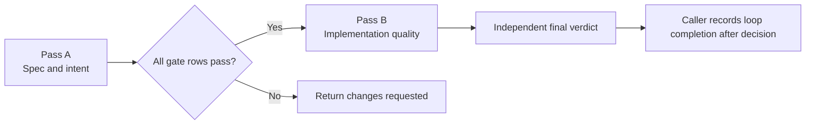
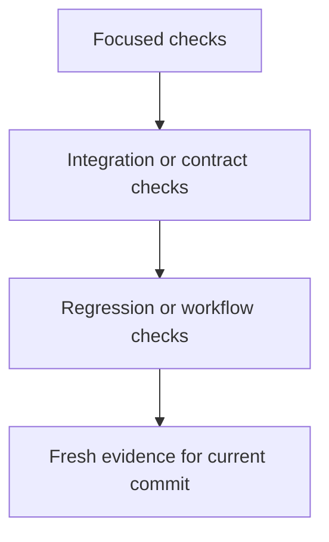

---
inputs:
  story_title:
    description: "Title of the story being reviewed"
    required: true
    default: ""
  engineer:
    description: "Engineer GitHub username"
    required: true
    default: ""
  reviewer:
    description: "Reviewer name (agent or person)"
    required: false
    default: "Code Reviewer Agent"
  commit_sha:
    description: "Full commit SHA being reviewed"
    required: true
    default: ""
  date:
    description: "Review date (YYYY-MM-DD)"
    required: false
    default: "${current_date}"
---

# Code Review: ${story_title}

**Engineer**: ${engineer}
**Reviewer**: ${reviewer}
**Commit SHA**: ${commit_sha}
**Review Date**: ${date}
**Review Duration**: {time spent}

## 1. Executive Summary

### Overview
{1-2 sentence summary of what changed.}

### Files Changed

| Measure | Value |
|---|---|
| Total Files | {count} |
| Lines Added | {count} |
| Lines Removed | {count} |
| Test Files | {count} |

### Review Posture

- Review the exact final scope, not an imagined rewrite.
- Zero findings is valid; do not force a quota.
- If a check was not executed, record `Not Run`, `Blocked`, or `Unknown` with a reason.
- Do not prefill approval from passing structure alone.

### Verdict
**Status**: `[PASS]` APPROVED | `[WARN]` CHANGES REQUESTED | `[FAIL]` REJECTED  
**Confidence Level**: High | Medium | Low  
**Recommendation**: {Merge | Request Changes | Reject}

## 1a. Two-Pass Review Protocol

### Pass A: Spec & Intent Compliance (gate)

| Check | Status | Evidence |
|---|---|---|
| PRD acceptance criteria addressed | `[PASS]` / `[FAIL]` / `[N/A]` | {link or note} |
| ADR decision honored | `[PASS]` / `[FAIL]` / `[N/A]` | {ADR link} |
| Tech Spec contract honored | `[PASS]` / `[FAIL]` / `[N/A]` | {SPEC link} |
| UX intent honored for UI-bearing change | `[PASS]` / `[FAIL]` / `[N/A]` | {UX link} |
| Scope matches issue | `[PASS]` / `[FAIL]` | {issue link} |
| PRD non-goals respected | `[PASS]` / `[FAIL]` / `[N/A]` | {note} |
| Active loop or prior verified work record exists | `[PASS]` / `[FAIL]` | {loop state or prior evidence reference} |
| Fresh verification evidence present for the current commit | `[PASS]` / `[FAIL]` | {commit SHA and run log} |
| Documentation review evidence present | `[PASS]` / `[FAIL]` | {quality report path} |
| Model Council record present when required by scope | `[PASS]` / `[FAIL]` / `[N/A]` | {council artifact path} |

**Pass A verdict**: `[PASS]` proceed to Pass B | `[FAIL]` return CHANGES REQUESTED.

> Do not require caller loop completion before final review. The independent verdict and fresh review evidence become the completion gate after this decision.

### Pass B: Code Quality & Craft

Only run when Pass A is `[PASS]`.

## 2. Code Quality

### `[PASS]` Strengths
1. **{Strength 1}**: {Description with file reference}
2. **{Strength 2}**: {Description with file reference}
3. **{Strength 3}**: {Description with file reference}

### `[WARN]` Issues Found

| Severity | Issue | File:Line | Impact | Required Correction |
|---|---|---|---|---|
| high | {Major issue} | {file#line} | {Why it blocks approval} | {Concrete fix} |
| medium | {Material issue} | {file#line} | {Why it must be resolved} | {Concrete fix} |
| low | {Minor issue} | {file#line} | {Why it matters} | {Suggestion} |

> Any unresolved `high` or `medium` finding blocks approval. `medium` is not a suggestion-only lane.

### Detailed Issues

| Title | Severity | Category | Problem | Recommendation | Reference |
|---|---|---|---|---|---|
| {Issue 1} | high | Security / Correctness / Reliability | {Why it matters} | {How to correct it} | {Link or rule} |
| {Issue 2} | medium | Maintainability / Performance / Documentation | {Why it matters} | {How to correct it} | {Link or rule} |

## 3. Architecture & Design

| Check | Status | Evidence / Note |
|---|---|---|
| Design pattern fit | `[PASS]` / `[WARN]` / `[FAIL]` | {note} |
| Separation of concerns | `[PASS]` / `[WARN]` / `[FAIL]` | {note} |
| Dependency boundaries | `[PASS]` / `[WARN]` / `[FAIL]` | {note} |
| Simplicity and cohesion | `[PASS]` / `[WARN]` / `[FAIL]` | {note} |
| Scope discipline | `[PASS]` / `[WARN]` / `[FAIL]` | {note} |

## 4. Testing

### Coverage Summary

| Metric | Value | Target | Notes |
|---|---|---|---|
| Overall coverage | {Unknown if not executed} | {target} | {tool or reason unavailable} |
| Line coverage | {Unknown if not executed} | {target} | {tool or reason unavailable} |
| Branch coverage | {Unknown if not executed} | {target} | {tool or reason unavailable} |
| Files below target | {Unknown if not executed} | 0 preferred | {note} |

### Test Breakdown

| Test Type | Count | Scope | Status |
|---|---|---|---|
| Unit Tests | {count or Unknown} | {services, functions, or modules} | `[PASS]` / `[WARN]` / `[FAIL]` / `Unknown` |
| Integration Tests | {count or Unknown} | {APIs, DB, integrations} | `[PASS]` / `[WARN]` / `[FAIL]` / `Unknown` |
| E2E Tests | {count or Unknown} | {user journeys} | `[PASS]` / `[WARN]` / `[FAIL]` / `Unknown` |
| Performance or resilience checks | {count or Unknown} | {critical paths} | `[PASS]` / `[WARN]` / `[FAIL]` / `Unknown` |

### Test Quality Assessment
- Well-tested areas: {list}
- Gaps that need more tests: {list}
- Untested or unexecuted paths: {list with reason}

## 5. Security Review

| Check | Status | Evidence / Note |
|---|---|---|
| No hardcoded secrets | `[PASS]` / `[WARN]` / `[FAIL]` | {note} |
| Input validation present | `[PASS]` / `[WARN]` / `[FAIL]` | {note} |
| Auth and authorization enforced | `[PASS]` / `[WARN]` / `[FAIL]` | {note} |
| Dependency scan clean | `[PASS]` / `[WARN]` / `[FAIL]` | {note} |
| Secure defaults and transport | `[PASS]` / `[WARN]` / `[FAIL]` | {note} |

### Vulnerabilities Found

| Severity | CWE / OWASP | Location | Description | Fix |
|---|---|---|---|---|
| {high / medium / low} | {CWE or OWASP ref} | {file#line} | {What can go wrong} | {Required change} |

## 6. Performance Review

| Check | Status | Evidence / Note |
|---|---|---|
| I/O patterns appropriate | `[PASS]` / `[WARN]` / `[FAIL]` | {note} |
| Query shape efficient | `[PASS]` / `[WARN]` / `[FAIL]` | {note} |
| Caching strategy appropriate | `[PASS]` / `[WARN]` / `[FAIL]` | {note} |
| Pagination or batching present | `[PASS]` / `[WARN]` / `[FAIL]` | {note} |
| Resource limits or pooling configured | `[PASS]` / `[WARN]` / `[FAIL]` | {note} |

### Performance Issues

| Issue | Location | Impact | Required Fix |
|---|---|---|---|
| {Issue} | {file#line} | {latency, memory, throughput, or scale risk} | {fix} |

### Load Testing Results
{Include benchmark summary when applicable; otherwise record `Not Run` with a reason.}

## 7. Documentation Review

For every feature, story, bug, or config-only change, require documentation drift review tied to the final implementation, not only structural checks.

| Field | Required Content |
|---|---|
| Quality report path | `{path to the JSON output from scripts/score-code-quality.ps1}` |
| `documentationReview.status` | `updated` or `no-impact` |
| `documentationReview.rationale` | Substantive explanation tied to the implemented behavior |
| `documentationReview.documents` | Workspace-relative reviewed docs with current SHA-256 hashes |
| Semantic comparison result | {What changed in docs, or why no doc changed} |

## 8. Acceptance Criteria Verification

| Acceptance Criterion | Status | Verification Evidence |
|---|---|---|
| AC1 | `[PASS]` / `[WARN]` / `[FAIL]` | {evidence} |
| AC2 | `[PASS]` / `[WARN]` / `[FAIL]` | {evidence} |
| AC3 | `[PASS]` / `[WARN]` / `[FAIL]` | {evidence} |

### Regression Testing
- [ ] Existing features still work
- [ ] No breaking changes to public contracts
- [ ] Backward compatibility maintained or migration documented

## 9. GenAI Review (if applicable)

> Include when the change uses LLMs, agents, prompt assets, evaluations, or other AI behavior.

| Category | Check | Status | Notes |
|---|---|---|---|
| Prompt Engineering | Prompt assets externalized | `[PASS]` / `[FAIL]` | {note} |
| Model Governance | Primary host or deployment identity recorded with verified source and date | `[PASS]` / `[FAIL]` | {note} |
| Model Governance | Provider-supported snapshot pinned when available; otherwise alias and host version recorded | `[PASS]` / `[FAIL]` | {note} |
| Model Governance | Fallback host or provider path recorded | `[PASS]` / `[FAIL]` | {note} |
| Evaluation | Held-out dataset exists and unexecuted comparisons are called out explicitly | `[PASS]` / `[FAIL]` | {note} |
| Safety | Guardrails and approval boundaries configured | `[PASS]` / `[FAIL]` | {note} |
| Observability | Model calls, cost, and latency are traced | `[PASS]` / `[FAIL]` | {note} |
| Error Handling | Fallback and failure behavior are documented and verified | `[PASS]` / `[FAIL]` | {note} |

## 10. MCP Review (if applicable)

> Include when the change implements an MCP Server or MCP App.

| Check | Status | Notes |
|---|---|---|
| Tool inputs validated with JSON Schema | `[PASS]` / `[FAIL]` | {note} |
| One action per tool | `[PASS]` / `[FAIL]` | {note} |
| Resource naming consistent | `[PASS]` / `[FAIL]` | {note} |
| Path traversal or SSRF risks handled | `[PASS]` / `[FAIL]` | {note} |
| Destructive actions require confirmation | `[PASS]` / `[FAIL]` | {note} |
| Host rendering and accessibility verified | `[PASS]` / `[FAIL]` | {note} |

## 11. Technical Debt

| Item | Type | Reason | Remediation | Priority |
|---|---|---|---|---|
| {Debt item} | New / Resolved | {Why it exists} | {How to address it} | High / Medium / Low |
| {Debt item} | New / Resolved | {Why it exists} | {How to address it} | High / Medium / Low |

## 12. Compliance & Standards

| Standard or Rule | Status | Evidence |
|---|---|---|
| Project coding standards | `[PASS]` / `[WARN]` / `[FAIL]` | {note} |
| Required quality gates | `[PASS]` / `[WARN]` / `[FAIL]` | {note} |
| Security checklist completed | `[PASS]` / `[WARN]` / `[FAIL]` | {note} |
| Documentation and handoff requirements met | `[PASS]` / `[WARN]` / `[FAIL]` | {note} |

## 13. Recommendations

### Must Fix (Blocking)
1. {Blocking issue and why it blocks release}
2. {Blocking issue and why it blocks release}

### Should Fix (High Priority)
1. {High-priority issue}
2. {High-priority issue}

### Nice to Have (Low Priority)
1. {Future improvement}
2. {Future improvement}

## 14. Decision

### Verdict
**Status**: `[PASS]` APPROVED | `[WARN]` CHANGES REQUESTED | `[FAIL]` REJECTED

### Implementation Rubric v2.1 Reference (required for implementation reviews)

Use `evaluation/rubrics/code-quality.md` and the JSON output from `scripts/score-code-quality.ps1`. Do not replace it with a parallel scoring system.

| Dimension ID | Weight | Blocking | Floor |
|---|---:|---|---:|
| `requirements-fit` | 15 | yes | 3 |
| `design-conformance` | 10 | yes | 3 |
| `logic-correctness` | 15 | yes | 3 |
| `verification-tests` | 15 | yes | 3 |
| `security-privacy` | 10 | yes | 3 |
| `reliability-errors` | 10 | yes | 3 |
| `maintainability-readability` | 10 | no | 2 |
| `simplicity-scope` | 5 | no | 2 |
| `performance-resources` | 5 | no | 2 |
| `documentation-operability` | 5 | no | 2 |

### Required JSON Review Evidence

| Field | Required Content |
|---|---|
| `rubricVersion` | `2.1.0` |
| `reviewer` | {independent reviewer id} |
| `reviewedAt` | {fresh timestamp for this exact final scope} |
| `files` | Current implementation paths with current SHA-256 hashes |
| `documentationReview.status` | `updated` or `no-impact` |
| `documentationReview.rationale` | Substantive rationale, not a placeholder |
| `documentationReview.documents` | Current reviewed documentation paths with current SHA-256 hashes |
| `dimensions` | All ten rubric dimensions exactly once |
| `report path` | `{workspace-relative JSON report path}` |

### Model Council Record (if applicable)

| Field | Required Content |
|---|---|
| Council artifact | `docs/artifacts/**/COUNCIL-*.md` or equivalent review-council record |
| Requested and resolved identities | {actual models or hosts used, source, and gaps if any} |
| Synthesis applied in verdict | {How consensus, divergence, and risks affected the decision} |
| Override rationale | {Required when the verdict diverges from the council synthesis} |

### Approval Gate

- Rubric score >= 80
- Every blocking dimension meets its floor
- Unresolved findings must be `H0M0`
- Fresh code hashes and reviewed-doc hashes match the final scope
- Final verdict is independent and issued before caller loop completion
- If a check was not run, the review must not claim that coverage or behavior was proven

## 15. Next Steps

| Action | Owner | Priority | Due |
|---|---|---|---|
| {Action} | {Owner} | High | {Date} |
| {Action} | {Owner} | Medium | {Date} |

## 16. Related Issues & PRs

- Issue: #{story-id}
- PR: {link}
- ADR / SPEC / UX: {links}

## 17. Reviewer Notes

{Anything important for the next review pass, handoff, or audit trail.}
