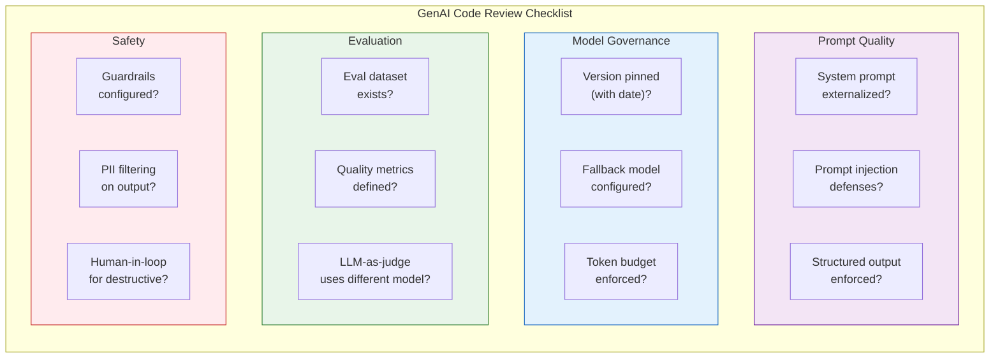
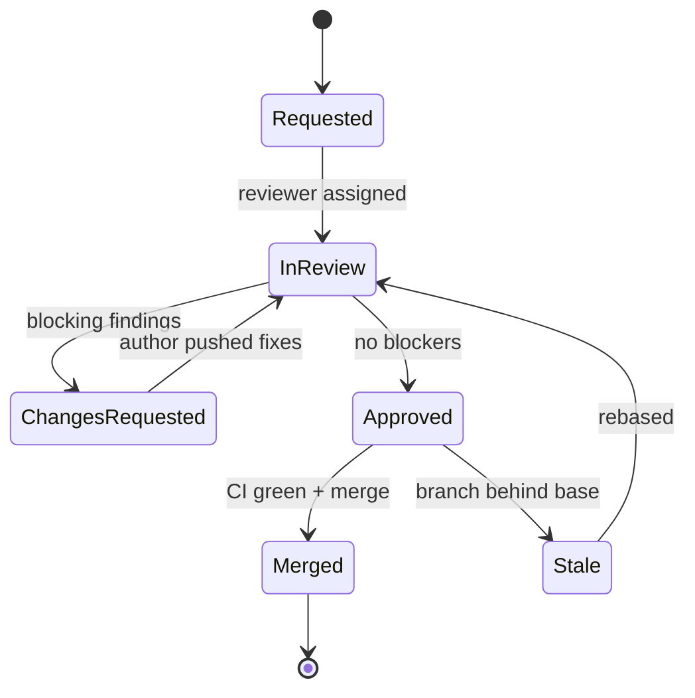
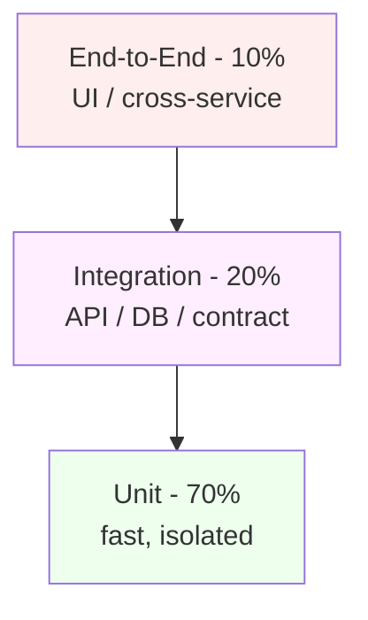
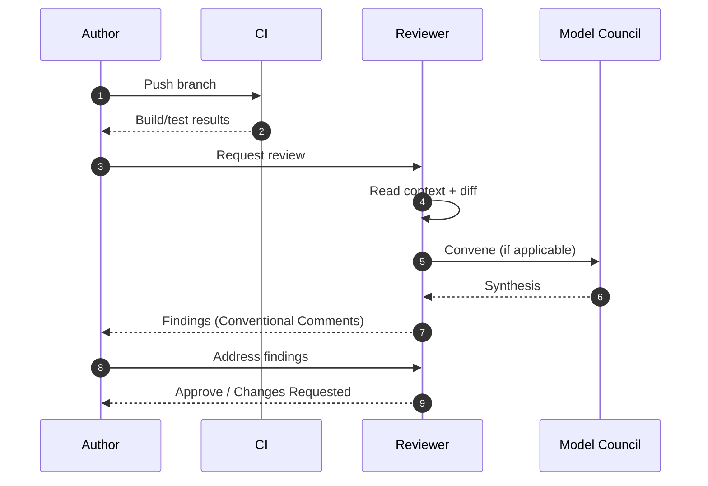
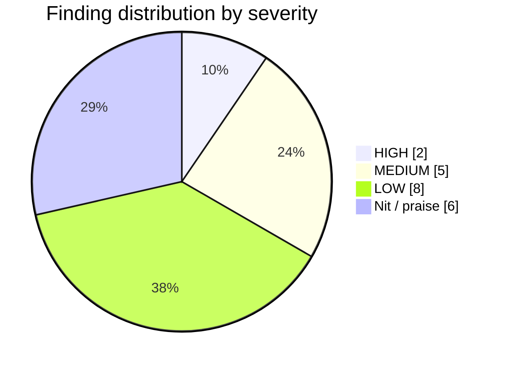
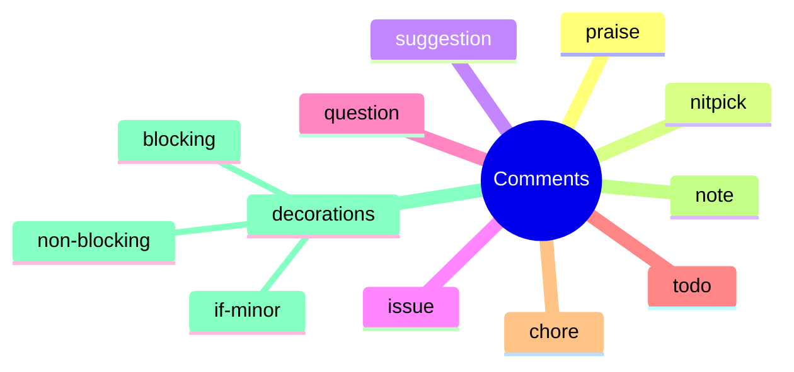

---
inputs:
  story_title:
    description: "Title of the story being reviewed"
    required: true
    default: ""
  engineer:
    description: "Engineer GitHub username"
    required: true
    default: ""
  reviewer:
    description: "Reviewer name (agent or person)"
    required: false
    default: "Code Reviewer Agent"
  commit_sha:
    description: "Full commit SHA being reviewed"
    required: true
    default: ""
  date:
    description: "Review date (YYYY-MM-DD)"
    required: false
    default: "${current_date}"
---

# Code Review: ${story_title}

**Engineer**: ${engineer} 
**Reviewer**: ${reviewer} 
**Commit SHA**: ${commit_sha} 
**Review Date**: ${date} 
**Review Duration**: {time spent}

**Assessment State**: NOT ASSESSED. A scaffold is not a review or approval.
Leave checks unchecked until current, scope-specific evidence supports them.
Replace NOT ASSESSED with PASS, FAIL, or N/A only after assessment; justify N/A.
Examples and diagrams are illustrative, not observed findings or measurements.
Structural checks do not certify roles, skills, security, task completion, or
production readiness. Record untested scope and remaining gates explicitly.

---

## Table of Contents

1. [Executive Summary](#1-executive-summary)
2. [Two-Pass Review Protocol](#1a-two-pass-review-protocol)
3. [Code Quality](#2-code-quality)
3. [Architecture & Design](#3-architecture--design)
4. [Testing](#4-testing)
5. [Security Review](#5-security-review)
6. [Performance Review](#6-performance-review)
7. [Documentation Review](#7-documentation-review)
8. [Acceptance Criteria Verification](#8-acceptance-criteria-verification)
9. [GenAI Review](#9-genai-review) *(if applicable)*
10. [MCP Review](#10-mcp-review) *(if applicable)*
11. [Technical Debt](#11-technical-debt)
12. [Compliance & Standards](#12-compliance--standards)
13. [Recommendations](#13-recommendations)
14. [Decision](#14-decision)
15. [Next Steps](#15-next-steps)
16. [Related Issues & PRs](#16-related-issues--prs)
17. [Reviewer Notes](#17-reviewer-notes)

---

> **Diagram policy**: Mermaid is the default format for all diagrams produced or referenced in this review. Use PlantUML, draw.io, Structurizr, or Graphviz only when Mermaid cannot express the intent, a Visio (.vsdx) round-trip is required, or the user explicitly requests another format. See the [diagram-as-code skill](../skills/diagrams/diagram-as-code/SKILL.md). When falling back, record the reason in a header comment.

---

## 1. Executive Summary

### Overview
{1-2 sentence summary of what was implemented}

### Files Changed
- **Total Files**: {count}
- **Lines Added**: {count}
- **Lines Removed**: {count}
- **Test Files**: {count}

### Verdict
**Status**: NOT ASSESSED

**Confidence Level**: High | Medium | Low 
**Recommendation**: {Merge | Request Changes | Reject}

---

## 1a. Two-Pass Review Protocol

> **Hard rule**: Run Pass A to completion BEFORE starting Pass B. Pass A asks "does this build the right thing?". Pass B asks "is the thing built well?". A code-quality-perfect change that misses the PRD or ADR is still a reject.

### Pass A: Spec & Intent Compliance (gate)

Complete this pass first. If any row is `[FAIL]`, stop the review, return `CHANGES REQUESTED`, and do not score Pass B.

| Check | Status | Evidence |
|-------|--------|----------|
| PRD acceptance criteria all addressed (see Section 8) | NOT ASSESSED | {link or note} |
| ADR decision honored (no silent deviation) | NOT ASSESSED | {ADR-### link} |
| Tech Spec contract honored (interfaces, schemas, error model) | NOT ASSESSED | {SPEC-### link} |
| UX prototype intent honored for UI-bearing change | NOT ASSESSED | {UX-### link} |
| Scope matches issue (no scope creep, no scope cut) | NOT ASSESSED | {issue link} |
| Non-goals from PRD respected | NOT ASSESSED | {note} |
| Quality loop completed (`loop status` = complete) | NOT ASSESSED | {iteration count} |
| Fresh verification evidence present (tests run on current commit) | NOT ASSESSED | {commit SHA + run log} |

**Pass A verdict**: NOT ASSESSED. Proceed to Pass B only after evidence supports
PASS; otherwise record CHANGES REQUESTED or BLOCKED with the failing or unassessed rows.

### Pass B: Code Quality & Craft

Only run when Pass A is `[PASS]`. Covers sections 2-7 and 9-12 below. Pass B can request changes on quality grounds even when Pass A is green; in that case the final decision is `CHANGES REQUESTED` with severity per the Pass B findings.

---

## 2. Code Quality

### Strengths
1. **{Strength 1}**: {Description with file reference}
 - Example: Well-structured service layer with clear separation of concerns ([ServiceName.cs](path/to/ServiceName.cs#L20-L45))

2. **{Strength 2}**: {Description}
 - Example: Comprehensive error handling with custom exceptions

3. **{Strength 3}**: {Description}
 - Example: Excellent use of async/await patterns

### Issues Found

| Severity | Issue | File:Line | Recommendation |
|----------|-------|-----------|----------------|
| **Critical** | {Issue requiring immediate fix} | [file.cs](path#L10) | {Specific fix} |
| **High** | {Major issue} | [file.cs](path#L25) | {Specific fix} |
| **Medium** | {Moderate issue} | [file.cs](path#L40) | {Specific fix} |
| **Low** | {Minor issue/suggestion} | [file.cs](path#L55) | {Specific fix} |

### Detailed Issues

#### Critical Issue 1: {Title}
**Location**: [file.cs](path/to/file.cs#L20-L25) 
**Severity**: Critical 
**Category**: Security | Performance | Correctness

**Problem**:
```csharp
// Current problematic code
public async Task<User> GetUserAsync(string userId)
{
 var sql = $"SELECT * FROM users WHERE id = '{userId}'"; // SQL injection!
 return await _db.QueryAsync<User>(sql);
}
```

**Issue**: SQL injection vulnerability - user input concatenated into query.

**Recommendation**:
```csharp
// Fixed code
public async Task<User> GetUserAsync(string userId)
{
 var sql = "SELECT * FROM users WHERE id = @userId";
 return await _db.QueryFirstOrDefaultAsync<User>(sql, new { userId });
}
```

**Reference**: [Security Skill](../skills/architecture/security/SKILL.md#sql-injection)

#### High Issue 1: {Title}
{Repeat structure}

#### Medium Issue 1: {Title}
{Repeat structure}

#### Low Issue 1: {Title}
{Repeat structure}

---

## 3. Architecture & Design

### Design Patterns Used
- [ ] Repository Pattern - NOT ASSESSED; {evidence or N/A rationale}
- [ ] Dependency Injection - NOT ASSESSED; {evidence or N/A rationale}
- [ ] Factory Pattern - NOT ASSESSED; {evidence or N/A rationale}
- [ ] Observer Pattern - NOT ASSESSED; {evidence or N/A rationale}

### SOLID Principles
- **Single Responsibility**: NOT ASSESSED; {evidence}
- **Open/Closed**: NOT ASSESSED; {evidence}
- **Liskov Substitution**: NOT ASSESSED; {evidence}
- **Interface Segregation**: NOT ASSESSED; {evidence}
- **Dependency Inversion**: NOT ASSESSED; {evidence}

### Code Organization
- **Folder Structure**: NOT ASSESSED; {evidence}
- **Naming**: NOT ASSESSED; {evidence}
- **File Size**: NOT ASSESSED; {measurement}
- **Complexity**: NOT ASSESSED; {measurement}

---

## 4. Testing

### Coverage Summary
- **Total Coverage**: {XX.X}% (Target: 80%)
- **Line Coverage**: {XX.X}%
- **Branch Coverage**: {XX.X}%
- **Files with <80% coverage**: {count}

### Test Breakdown
| Test Type | Count | % of Total | Target |
|-----------|-------|------------|--------|
| **Unit Tests** | {count} | {XX}% | 70% |
| **Integration Tests** | {count} | {XX}% | 20% |
| **E2E Tests** | {count} | {XX}% | 10% |
| **Total** | {count} | 100% | - |

### Test Quality Assessment

#### Well-Tested
NOT ASSESSED. {List behaviors verified by current tests and link the results.}

#### Needs More Tests
NOT ASSESSED. {List uncovered cases and their risks.}

#### Not Tested
NOT ASSESSED. {List untested behaviors and unavailable prerequisites.}

### Test Code Review

**Example Well-Written Test**:
```csharp
[Fact]
public async Task CreateAsync_ValidDto_ReturnsEntity()
{
 // Arrange
 var dto = new CreateEntityDto("Test Name", "Description");
 var mockRepo = new Mock<IEntityRepository>();
 mockRepo.Setup(r => r.AddAsync(It.IsAny<Entity>()))
 .ReturnsAsync(new Entity { Id = Guid.NewGuid(), Name = "Test Name" });
 var service = new EntityService(mockRepo.Object);

 // Act
 var result = await service.CreateAsync(dto);

 // Assert
 result.Should().NotBeNull();
 result.Name.Should().Be("Test Name");
 mockRepo.Verify(r => r.AddAsync(It.IsAny<Entity>()), Times.Once);
}
```
**Illustrative strengths**: AAA pattern, clear naming, verifies behavior, uses FluentAssertions

**Example Test Needing Improvement**:
```csharp
[Fact]
public async Task Test1()
{
 var result = await _service.CreateAsync(new CreateEntityDto("", ""));
 Assert.NotNull(result);
}
```
**Illustrative issues**: Vague name, unclear intent, doesn't test meaningful scenario

---

## 5. Security Review

### Security Checklist
- [ ] **No Hardcoded Secrets**: NOT ASSESSED; {scan scope and results}
- [ ] **SQL Parameterization**: NOT ASSESSED; {query review evidence}
- [ ] **Input Validation**: NOT ASSESSED; {boundary tests}
- [ ] **Authentication**: NOT ASSESSED; {positive and negative tests}
- [ ] **Authorization**: NOT ASSESSED; {permission tests}
- [ ] **HTTPS Only**: NOT ASSESSED; {transport evidence}
- [ ] **CORS Configuration**: NOT ASSESSED; {origin policy evidence}
- [ ] **Dependency Scan**: NOT ASSESSED; {manifests, findings, errors and unscanned scope}

### Vulnerabilities Found
NOT ASSESSED. {Record confirmed findings, or a scoped no-findings result with evidence.}

#### Vulnerability 1: {Title}
**Severity**: Critical | High | Medium | Low 
**CWE**: [CWE-{ID}](https://cwe.mitre.org/data/definitions/{ID}.html) 
**OWASP**: [A01:2021](https://owasp.org/Top10/)

**Location**: [file.cs](path/to/file.cs#L50)

**Description**:
{What is the vulnerability and how it can be exploited}

**Impact**:
{What an attacker could do}

**Fix**:
```csharp
// Secure implementation
```

**Reference**: [Security Skill](../skills/architecture/security/SKILL.md)

### Security Headers
```csharp
// Missing security headers - add to middleware
app.Use(async (context, next) =>
{
 context.Response.Headers.Add("X-Content-Type-Options", "nosniff");
 context.Response.Headers.Add("X-Frame-Options", "DENY");
 context.Response.Headers.Add("X-XSS-Protection", "1; mode=block");
 context.Response.Headers.Add("Strict-Transport-Security", "max-age=31536000");
 await next();
});
```

---

## 6. Performance Review

### Performance Checklist
- [ ] **Async/Await**: NOT ASSESSED; {I/O review evidence}
- [ ] **N+1 Queries**: NOT ASSESSED; {query measurements}
- [ ] **Database Indexes**: NOT ASSESSED; {query plan evidence}
- [ ] **Caching**: NOT ASSESSED; {invalidation and performance tests}
- [ ] **Pagination**: NOT ASSESSED; {boundary tests}
- [ ] **Connection Pooling**: NOT ASSESSED; {configuration and load evidence}

### Performance Issues

#### N+1 Query Problem (Illustrative Example)
**Location**: [EntityService.cs](path/to/EntityService.cs#L120)

**Problem**:
```csharp
public async Task<IEnumerable<EntityDto>> GetAllWithRelatedAsync()
{
 var entities = await _repo.GetAllAsync();

 foreach (var entity in entities) // N+1 query!
 {
 entity.Related = await _repo.GetRelatedAsync(entity.Id);
 }

 return entities.Select(e => e.ToDto());
}
```

**Fix**:
```csharp
public async Task<IEnumerable<EntityDto>> GetAllWithRelatedAsync()
{
 // Use eager loading to fetch related data in one query
 var entities = await _repo.Query()
 .Include(e => e.Related)
 .ToListAsync();

 return entities.Select(e => e.ToDto());
}
```

### Load Testing Results
{If applicable - include benchmark results}

---

## 7. Documentation Review

### Documentation Checklist
- [ ] **XML Documentation**: NOT ASSESSED; {reviewed API scope}
- [ ] **Inline Comments**: NOT ASSESSED; {reviewed logic}
- [ ] **README Updated**: NOT ASSESSED; {behavior comparison}
- [ ] **API Documentation**: NOT ASSESSED; {contract comparison}
- [ ] **Migration Guide**: NOT ASSESSED; {compatibility impact}

### Documentation Quality

**Well-Documented**:
```csharp
/// <summary>
/// Creates a new entity with the specified details.
/// </summary>
/// <param name="dto">The entity creation details.</param>
/// <returns>The created entity with generated ID.</returns>
/// <exception cref="ValidationException">Thrown when dto validation fails.</exception>
public async Task<Entity> CreateAsync(CreateEntityDto dto)
```
**Illustrative strengths**: Describes parameters, return value, and exceptions

**Needs Improvement**:
```csharp
// Process the entity
public async Task<Entity> ProcessAsync(Entity entity)
```
**Illustrative issues**: Vague XML doc, unclear what "process" means

---

## 8. Acceptance Criteria Verification

### Story Acceptance Criteria
From Issue #{story-id}:

- [ ] **AC1**: {Acceptance criterion} - NOT ASSESSED
 - **Evidence**: {command, result and current source revision}

- [ ] **AC2**: {Acceptance criterion} - NOT ASSESSED
 - **Evidence**: {command, result and current source revision}

- [ ] **AC3**: {Acceptance criterion} - NOT ASSESSED
 - **Evidence**: {command, result and current source revision}

- [ ] **AC4**: {Acceptance criterion} - NOT ASSESSED
 - **Evidence**: {command, result and current source revision}

### Regression Testing
- [ ] Existing features still work - NOT ASSESSED; {regression evidence}
- [ ] No breaking changes to public APIs - NOT ASSESSED; {contract evidence}
- [ ] Backward compatibility maintained - NOT ASSESSED; {compatibility evidence}

---

## 9. GenAI Review (if applicable)

> **Trigger**: Include this section when the code involves LLM calls, AI agents, GenAI inference,
> prompt engineering, or evaluation pipelines. Skip if no GenAI components.

### GenAI Review Flow



### GenAI Checklist

| Category | Check | Status | Notes |
|----------|-------|--------|-------|
| **Prompt Engineering** | System prompt externalized (not inline strings) | NOT ASSESSED | {evidence} |
| **Prompt Engineering** | Prompt injection defenses present | NOT ASSESSED | {evidence} |
| **Prompt Engineering** | Structured output schema enforced | NOT ASSESSED | {evidence} |
| **Model Governance** | Model version pinned with date suffix | NOT ASSESSED | {evidence} |
| **Model Governance** | Fallback model from different provider configured | NOT ASSESSED | {evidence} |
| **Model Governance** | Token budget enforced per request | NOT ASSESSED | {evidence} |
| **Evaluation** | Evaluation dataset exists with {N}+ test cases | NOT ASSESSED | {evidence} |
| **Evaluation** | Quality thresholds defined (coherence, relevance, etc.) | NOT ASSESSED | {evidence} |
| **Evaluation** | LLM-as-judge uses different model than agent | NOT ASSESSED | {evidence} |
| **Safety** | Input/output guardrails configured | NOT ASSESSED | {evidence} |
| **Safety** | PII detection on model outputs | NOT ASSESSED | {evidence} |
| **Safety** | Human-in-the-loop for high-risk actions | NOT ASSESSED | {evidence} |
| **Observability** | All LLM calls traced (OpenTelemetry / equivalent) | NOT ASSESSED | {evidence} |
| **Observability** | Token usage and cost tracked per request | NOT ASSESSED | {evidence} |
| **Error Handling** | Graceful fallback when model unavailable | NOT ASSESSED | {evidence} |
| **Error Handling** | Timeout configured with fallback response | NOT ASSESSED | {evidence} |

### GenAI Issues Found

| Severity | Issue | Location | Recommendation |
|----------|-------|----------|--------------|
| {Critical/High/Medium/Low} | {description} | [file](path#L10) | {fix} |

---

## 10. MCP Review (if applicable)

> **Trigger**: Include this section when the code implements an MCP Server or MCP App.
> Skip if no MCP components.

### MCP Server Checklist (if applicable)

| Check | Status | Notes |
|-------|--------|-------|
| Tool input parameters validated with JSON Schema | NOT ASSESSED | {evidence} |
| One action per tool (no multi-mode mega-tools) | NOT ASSESSED | {evidence} |
| Tool names use `verb_noun` convention | NOT ASSESSED | {evidence} |
| Resource URIs follow consistent naming scheme | NOT ASSESSED | {evidence} |
| Path traversal prevention on file-access tools | NOT ASSESSED | {evidence} |
| SSRF prevention on URL-accepting tools | NOT ASSESSED | {evidence} |
| Error responses are structured MCP errors (not raw exceptions) | NOT ASSESSED | {evidence} |
| Destructive tools require confirmation | NOT ASSESSED | {evidence} |
| Transport security (TLS for SSE/HTTP) | NOT ASSESSED | {evidence} |
| All tool calls logged with context | NOT ASSESSED | {evidence} |

### MCP App Checklist (if applicable)

| Check | Status | Notes |
|-------|--------|-------|
| registerAppTool() calls have clear descriptions | NOT ASSESSED | {evidence} |
| Views render correctly in target host widths | NOT ASSESSED | {evidence} |
| WCAG 2.1 AA accessibility in iframe content | NOT ASSESSED | {evidence} |
| Dark/light theme support | NOT ASSESSED | {evidence} |
| State management handles host disconnection gracefully | NOT ASSESSED | {evidence} |
| Event cleanup on view unmount | NOT ASSESSED | {evidence} |

### MCP Issues Found

| Severity | Issue | Location | Recommendation |
|----------|-------|----------|--------------|
| {Critical/High/Medium/Low} | {description} | [file](path#L10) | {fix} |

---

## 11. Technical Debt

### New Technical Debt Introduced
1. **{Debt Item 1}**: {Description}
 - **Location**: [file.cs](path)
 - **Reason**: {Why it was introduced}
 - **Remediation**: {How to fix in future}
 - **Priority**: High | Medium | Low

2. **{Debt Item 2}**: {Description}

### Technical Debt Addressed
1. **{Resolved Item 1}**: {What was fixed}
 - **Before**: {Old code/approach}
 - **After**: {New code/approach}

---

## 12. Compliance & Standards

### Coding Standards
- [ ] Follows applicable naming conventions - NOT ASSESSED; {evidence}
- [ ] Follows project code style (EditorConfig) - NOT ASSESSED; {evidence}
- [ ] No compiler warnings - NOT ASSESSED; {build output}
- [ ] No linter errors - NOT ASSESSED; {lint output}
- [ ] Follows applicable Skills.md guidelines - NOT ASSESSED; {scope and evidence}

### Production Requirements (Skills.md)
- [ ] 80% test coverage - NOT ASSESSED; {coverage report and scope}
- [ ] Security checklist completed - NOT ASSESSED; {review evidence}
- [ ] Performance considerations addressed - NOT ASSESSED; {measurements}
- [ ] Documentation complete - NOT ASSESSED; {reviewed documents}
- [ ] Error handling implemented - NOT ASSESSED; {failure-path tests}

---

## 13. Recommendations

### Must Fix (Blocking)
1. ** {Critical Issue}**: {Brief description}
 - **Impact**: Blocks deployment
 - **ETA**: {time estimate}

2. ** {Critical Issue}**: {Brief description}

### Should Fix (High Priority)
1. ** {High Issue}**: {Brief description}
 - **Impact**: Reduces quality/performance
 - **ETA**: {time estimate}

### Nice to Have (Low Priority)
1. ** {Low Issue}**: {Brief description}
 - **Impact**: Code improvement
 - **Can be addressed in future PR**

---

## 14. Decision

### Verdict
**Status**: NOT ASSESSED

### Weighted Score (optional for non-UI reviews; MANDATORY for UI-bearing reviews)

> Originated from the Anthropic harness-design article (Mar 2026). Use this rubric when the verdict feels close, or when comparing iterations across a quality loop. For UI-bearing changes (see `UI-Bearing Change Review Gate` in docs/WORKFLOW.md), this section is mandatory and the Originality row MUST be graded. The narrative verdict above remains authoritative -- the score is an aid, not a substitute.

Grade each category from 0 to 100. Multiply by the weight to get the weighted contribution.

| Category | Weight | Hard Floor | Score (0-100) | Weighted |
|----------|-------:|-----------:|--------------:|---------:|
| Correctness (does it work? regressions?) | 25 | 70 | | |
| Security | 20 | 80 | | |
| Testing (coverage + meaningfulness) | 15 | 70 | | |
| Architecture & Design fit | 10 | 60 | | |
| Performance | 10 | 60 | | |
| Documentation | 5 | 50 | | |
| Acceptance criteria coverage | 10 | 80 | | |
| Originality / non-generic output *(UI-bearing only; drop and renormalize otherwise)* | 5 | 50 | | |
| **Total (out of 100)** | 100 | -- | | |

Gate rules:

- Total >= 80 AND no floor breach -> APPROVED is defensible.
- Total 60-79 -> CHANGES REQUESTED.
- Total < 60 -> REJECTED.
- Floor breach in a non-blocker category (Architecture, Performance, Documentation, Originality) -> CHANGES REQUESTED.
- Floor breach in a blocker category (Correctness, Security, Testing, Acceptance criteria) -> REJECTED, regardless of total.
- For non-UI-bearing changes, drop the Originality row and renormalize the remaining weights to sum to 100.

### Rationale
{Explain the decision. If a weighted score was computed, cite the floors that drove the verdict, not the total alone.}

**If APPROVED**:
- {Evidence that scoped acceptance criteria are met}
- {Evidence that applicable quality gates are satisfied}
- {Security and performance evidence with remaining limitations}
- {Remaining validation and deployment gates; review approval alone is not production certification}

**If CHANGES REQUESTED**:
- {count} critical issues must be fixed
- {count} high-priority issues should be fixed
- Engineer should address feedback and re-submit

**If REJECTED**:
- {Fundamental issues requiring redesign}
- {Architectural changes needed}
- {Start over with different approach}

---

## 15. Next Steps

### For Engineer (if changes requested)
1. Address all Critical issues
2. Address all High-priority issues
3. Consider Medium and Low suggestions
4. Re-run tests and verify coverage
5. Update documentation if needed
6. Comment on issue when ready for re-review

### For Reviewer (if approved)
1. Record the evidence-backed decision and remaining gates
2. Move to Validating for required post-review checks
3. Obtain authorized merge and deployment decisions separately
4. Close the issue only after delivery and compound capture are complete

### For PM/Architect (if applicable)
{Any follow-up items for other roles}

---

## 16. Related Issues & PRs

### Related Issues
- Blocks: #{issue-id}
- Related to: #{issue-id}
- Depends on: #{issue-id}

### Related PRs
- [PR #{number}](link) - {Description}

---

## 17. Reviewer Notes

### Review Process
- **Review Method**: Line-by-line | High-level | Pair review
- **Tools Used**: NOT ASSESSED; {tools actually executed}
- **Time Spent**: {duration}

### Follow-Up
- [ ] Schedule follow-up review after changes
- [ ] Pair with engineer on complex sections
- [ ] Document learnings in team wiki

---

## Appendix

### Files Reviewed
NOT ASSESSED. {List actual reviewed paths, revisions and scope-specific coverage.}

### Test Coverage Report
[Link to coverage report](path/to/coverage.html)

### CI/CD Pipeline Results
- [ ] Build: NOT ASSESSED; {command and result}
- [ ] Unit Tests: NOT ASSESSED; {command, count and result}
- [ ] Integration Tests: NOT ASSESSED; {command, count and result}
- [ ] Security Scan: NOT ASSESSED; {scope, findings, scanner errors and skipped checks}
- [ ] Linting: NOT ASSESSED; {command and result}

---

**Generated by Frontier Review FDE**
**Last Updated**: {YYYY-MM-DD} 
**Review Version**: 1.0

---

**Signature**: 
Reviewed by: {Reviewer Name/Agent} 
Date: {YYYY-MM-DD} 
Status: NOT ASSESSED

---

## Appendix A: Conventional Comments and Review Diagrams (v8.4.43+)

> Additive section. References: Conventional Comments (https://conventionalcomments.org/) v1.0 - labels and decorations, Google Code Review Developer Guide.

### A.1 Conventional Comments Cheat Sheet

Use this format on every code review comment:

```
<label> [decorations]: <subject>

[discussion]
```

| Label | When to use |
|-------|-------------|
| `praise` | Highlight something good. Real praise, not a sandwich. |
| `nitpick` | Trivial. Personal preference. Author may ignore. |
| `suggestion` | Concrete change request that would improve the code. |
| `issue` | A bug or concrete problem that needs fixing. |
| `todo` | Small follow-up that can ship in a separate PR. |
| `question` | Real question seeking information. |
| `thought` | Explores an idea; not a request. |
| `chore` | Process step (rebase, retitle, link issue). |
| `note` | Permanent note for future readers. |

| Decoration | Meaning |
|------------|---------|
| `(blocking)` | Author MUST resolve before merge. |
| `(non-blocking)` | Author MAY merge without addressing. |
| `(if-minor)` | Resolve if it is minor; otherwise mark resolved. |

Example:
```
issue (blocking): SQL string is concatenated, not parameterized.

This is OWASP A03:2021 Injection. Replace with a parameterized query.
```

### A.2 Review Lifecycle State Machine



### A.3 Risk Heat Map of Findings

```mermaid
quadrantChart
    title Findings - severity vs likelihood
    x-axis Low likelihood --> High likelihood
    y-axis Low impact --> High impact
    quadrant-1 Fix now (blocking)
    quadrant-2 Fix soon
    quadrant-3 Note and move on
    quadrant-4 Watch
    Finding-1: [0.8, 0.9]
    Finding-2: [0.3, 0.7]
    Finding-3: [0.6, 0.2]
    Finding-4: [0.2, 0.3]
```

### A.4 Test Pyramid (target shape per project)



### A.5 Review Decision Rubric

| Decision | Required state |
|----------|----------------|
| APPROVED | 0 blocking issues. Tests >= 80% coverage. CI green. Self-review checklist passed. |
| CHANGES REQUESTED | >=1 blocking issue, or >=2 non-blocking issue + suggestion combinations on the same area. |
| BLOCKED | Cannot review (missing artifact, broken build, scope unclear). |


## Appendix B: Rich Visual Diagrams (v8.4.43+)

### B.1 Review Interaction Sequence



### B.2 Finding Distribution (pie)



### B.3 Conventional Comments Mindmap



### B.4 Coverage Trend (xychart)

```mermaid
xychart-beta
  title "Test coverage trend"
  x-axis [Iter1, Iter2, Iter3, Iter4, Iter5]
  y-axis "Coverage %" 60 --> 100
  line [72, 78, 83, 88, 92]
```
