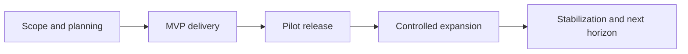
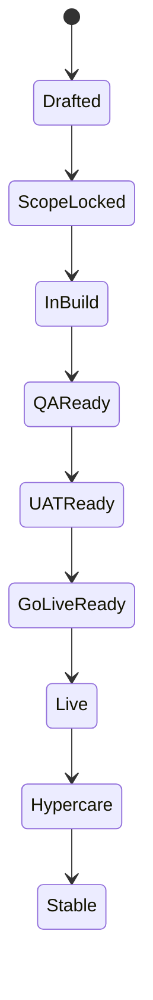
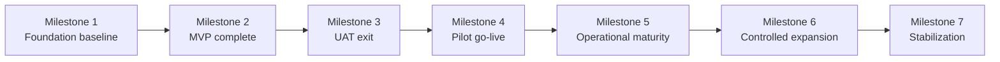

---
inputs:
  portfolio_title:
    description: "Portfolio or program title"
    required: true
    default: ""
  portfolio_scope:
    description: "Short description of the workstreams or product scope covered by the roadmap"
    required: true
    default: ""
  status:
    description: "Roadmap status"
    required: false
    default: "Draft"
  author:
    description: "Document author (agent or person name)"
    required: false
    default: "Product Manager Agent"
  date:
    description: "Creation date (YYYY-MM-DD)"
    required: false
    default: "${current_date}"
  portfolio_start_date:
    description: "Planned start date for the roadmap horizon"
    required: false
    default: "{YYYY-MM-DD}"
  portfolio_horizon:
    description: "Overall roadmap horizon"
    required: false
    default: "{YYYY-MM-DD to YYYY-MM-DD}"
  related_prds:
    description: "Bullet list of related PRD paths"
    required: false
    default: "- docs/artifacts/prd/PRD-{workstream}.md"
---

# Portfolio Roadmap and Release Plan: ${portfolio_title}

**Portfolio Scope**: ${portfolio_scope}
**Status**: ${status}
**Author**: ${author}
**Date**: ${date}
**Portfolio Start Date**: ${portfolio_start_date}
**Portfolio Horizon**: ${portfolio_horizon}
**Related PRDs**:
${related_prds}

## 1. Purpose

This roadmap gives one dated release view across the portfolio so workstreams share milestone logic, release gates, and a common planning cadence.

## 2. Portfolio Planning Rules

- Define the MVP boundary and time-box from evidence, not a fixed sprint count.
- Prioritize the riskiest assumption and a useful vertical slice; reserve a
  foundation-only sprint only when dependencies justify it.
- Breadth is added only after the prior release wave is stable.
- Scope is reduced before quality is compromised.
- Workshops shape waves, not every individual milestone.
- Pilot production must include explicit rollback and hypercare.

## 3. Dated MVP Sprint Calendar

| Sprint | Dates | Focus | Primary Outcome |
|---|---|---|---|
| {Sprint} | {YYYY-MM-DD to YYYY-MM-DD} | {Highest-risk assumption or capability} | {Observable outcome} |
| {Sprint} | {YYYY-MM-DD to YYYY-MM-DD} | {Next dependency-ready slice} | {Observable outcome} |
| {Sprint} | {YYYY-MM-DD to YYYY-MM-DD} | {Validation and release preparation} | {Exit evidence} |

### MVP Gate Dates

| Gate | Target Date | Meaning |
|---|---|---|
| {Dependency or readiness gate} | {YYYY-MM-DD} | {Required proof} |
| {Capability acceptance gate} | {YYYY-MM-DD} | {Required proof} |
| MVP Build Complete | {YYYY-MM-DD} | MVP is ready for formal validation |

## 4. Dated Release Plan

| Release or Milestone | Dates | Scope | Exit Standard |
|---|---|---|---|
| Release 0: Foundation Baseline | {YYYY-MM-DD to YYYY-MM-DD} | Shared platform baseline | {Security, telemetry, delivery path approved} |
| Release 1 RC: MVP Candidate | {YYYY-MM-DD to YYYY-MM-DD} | Final MVP build and hardening | {Core workflows pass review} |
| Release 1 UAT | {YYYY-MM-DD to YYYY-MM-DD} | Controlled UAT | {No unresolved critical blockers} |
| Milestone 4: Pilot Production Go-Live | {YYYY-MM-DD} | First controlled production release | {Rollback and monitoring ready} |
| Release 2: Operational Maturity | {YYYY-MM-DD to YYYY-MM-DD} | Dependability and supportability | {Defect trend and support load acceptable} |
| Release 3: Controlled Expansion | {YYYY-MM-DD to YYYY-MM-DD} | Bounded breadth increase | {Prior wave stable and approved} |
| Release 4: Stabilization | {YYYY-MM-DD to YYYY-MM-DD} | Hardening and next-phase readiness | {Runbooks and stability targets complete} |

### 4.1 Release Objectives and Primary Owners

| Release or Milestone | Primary Objective | Primary Owner | Supporting Owners |
|---|---|---|---|
| Release 0: Foundation Baseline | {Establish the delivery baseline} | {Product Manager} | {Engineering Lead, Platform Lead} |
| Release 1 RC: MVP Candidate | {Prove the MVP works end to end} | {Engineering Lead} | {Product Manager, Workstream Leads} |
| Release 1 UAT | {Validate pilot users can complete target flows} | {UAT Lead} | {Product Manager, SMEs} |
| Milestone 4: Pilot Production Go-Live | {Launch a safe pilot cohort} | {Operations Lead} | {Product Manager, Support Lead} |
| Release 2: Operational Maturity | {Harden operations before breadth} | {Workstream Leads} | {Operations Lead, Engineering Lead} |
| Release 3: Controlled Expansion | {Expand only after readiness proof} | {Product Manager} | {Workstream Leads, Training Lead} |
| Release 4: Stabilization | {Close the horizon in a stable state} | {Product Manager} | {Operations Lead, Engineering Lead} |

### 4.2 Release Readiness Status Model

| Status | Meaning |
|---|---|
| Drafted | Release intent exists but dates or scope are still changing |
| Scope Locked | In-scope capabilities and success criteria are approved |
| In Build | Delivery is active |
| QA Ready | Core regression evidence exists |
| UAT Ready | Validation assets and pilot readiness are complete |
| Go-Live Ready | Monitoring, rollback, support, and communications are confirmed |
| Live | Release is active for the approved cohort |
| Hypercare | Elevated monitoring and support window |
| Stable | Hypercare exit criteria are met |

## 5. Capability Waves and Planning Logic

| Wave | Dates | Planning Logic | Workstream A Scope | Workstream B Scope |
|---|---|---|---|---|
| Wave 1: MVP | {YYYY-MM-DD to YYYY-MM-DD} | {Validated discovery feeds MVP delivery} | {Minimum valuable capabilities} | {Minimum valuable capabilities} |
| Wave 2: Pilot and Operational Maturity | {YYYY-MM-DD to YYYY-MM-DD} | {Use MVP evidence to plan pilot and maturity work} | {UAT, pilot, operational hardening} | {UAT, pilot, operational hardening} |
| Wave 3: Controlled Expansion | {YYYY-MM-DD to YYYY-MM-DD} | {Expansion starts only after stability proof} | {Broader workflow coverage} | {Broader governance and reporting} |
| Wave 4: Stabilization and Next-Phase Readiness | {YYYY-MM-DD to YYYY-MM-DD} | {End-horizon hardening and next-horizon shaping} | {Reporting and resilience} | {Lifecycle and resilience} |

### 5.2 Planning Workshops

| Workshop | Dates | Purpose | Feeds |
|---|---|---|---|
| Workshop 1: MVP Discovery and Scope Lock | {YYYY-MM-DD to YYYY-MM-DD} | {Confirm MVP boundaries and quality gates} | Wave 1 |
| Workshop 2: UAT, Pilot, and Release 2 Planning | {YYYY-MM-DD to YYYY-MM-DD} | {Translate MVP evidence into pilot and maturity planning} | Wave 2 |
| Workshop 3: Expansion Planning | {YYYY-MM-DD to YYYY-MM-DD} | {Define the next bounded breadth wave} | Wave 3 |
| Workshop 4: Stabilization and Next-Phase Strategy | {YYYY-MM-DD to YYYY-MM-DD} | {Close the current horizon and prepare the next} | Wave 4 |

### 5.3 Cross-Workstream Dependencies

| Dependency | Why It Matters | Dependent Waves |
|---|---|---|
| Shared user-facing delivery surface | {Both workstreams depend on the same governed experience} | Waves 1-4 |
| Shared identity, RBAC, and audit model | {Pilot rollout and approvals fail without common controls} | Waves 1-4 |
| Shared telemetry and release controls | {UAT and go-live require one operational evidence model} | Waves 1-4 |
| Template and playbook governance | {Breadth expansion depends on approved change control} | Waves 1-4 |
| Support and training readiness | {Adoption depends on business enablement, not only code complete} | Waves 2-4 |

## 6. Roadmap by Milestone

| Milestone | Date | Portfolio Meaning | Workstream A Focus | Workstream B Focus | Planning Input |
|---|---|---|---|---|---|
| Milestone 1: Foundation Baseline | {YYYY-MM-DD} | {Shared delivery baseline complete} | {Workspace, telemetry, controls} | {Workspace, telemetry, lineage} | {Execute Workshop 1 outputs} |
| Milestone 2: MVP Build Complete | {YYYY-MM-DD} | {MVP build complete} | {Accepted MVP capabilities} | {Accepted MVP capabilities} | {Evidence prepares the next wave} |
| Milestone 3: UAT Exit | {YYYY-MM-DD} | {Controlled UAT signed off} | {MVP accepted for pilot} | {MVP accepted for pilot} | {Execute Workshop 2 outputs} |
| Milestone 4: Pilot Production Go-Live | {YYYY-MM-DD} | {Narrow production cohort live} | {Pilot cohort live} | {Pilot cohort live} | {Continue Wave 2} |
| Milestone 5: Release 2 Operational Maturity | {YYYY-MM-DD} | {First maturity wave complete} | {Execution and resilience} | {Execution and resilience} | {Workshop 3 prepares expansion} |
| Milestone 6: Release 3 Controlled Expansion | {YYYY-MM-DD} | {Controlled breadth complete} | {Broader support and approvals} | {Governance and broader coverage} | {Execute Workshop 3 outputs} |
| Milestone 7: Release 4 Stabilization | {YYYY-MM-DD} | {End-of-horizon hardening complete} | {Reporting and post-release maturity} | {Reporting and lifecycle maturity} | {Workshop 4 prepares next horizon} |

## 7. Visual Timeline

Use the selected portfolio horizon, milestone diagram and dated tables in
Sections 3, 4 and 6. Remove unused example waves; do not force a one-year horizon.
Replace placeholders with justified dates before approval.

## 8. Quality Gates

### 8.1 Sprint Gates

| Sprint | Entry Gate | Exit Gate |
|---|---|---|
| {Sprint} | {Scope, prerequisites and decisions approved} | {Slice acceptance criteria and review evidence pass} |
| {Sprint} | {Dependencies verified} | {Integration, quality and operational evidence pass} |
| {Release preparation} | {Candidate scope frozen} | {Candidate ready for user acceptance} |

### 8.2 UAT and Production Gates

| Gate | Minimum Standard |
|---|---|
| UAT Start | {Release candidate deployed, pilot scenarios approved, training material ready} |
| UAT Exit | {Acceptance criteria met; no unresolved High/Medium implementation-review findings; permitted residual risks explicitly recorded} |
| Pilot Production Go-Live | {Monitoring active, rollback tested, support ownership named, communications ready} |
| Release 2 and beyond | {Prior wave stable and support load acceptable} |

### 8.3 Cross-Functional Release Readiness Checklist

| Readiness Area | Minimum Expectation Before Go-Live |
|---|---|
| Business owner sign-off | {Pilot cohort, goals, and success metrics approved} |
| Training readiness | {Role-based training and walkthroughs complete} |
| Support readiness | {Named support owner, triage path, and escalation contacts confirmed} |
| Communications readiness | {Release notes and reporting path distributed} |
| Operational readiness | {Dashboards, alert thresholds, and incident channels active} |
| Data and reporting readiness | {Core KPIs visible for the active cohort} |
| Security and compliance readiness | {Access, auditability, retention, and approvals reviewed} |

### 8.4 Rollback and Hypercare Expectations

- Every production release names a rollback owner and trigger conditions.
- Hypercare begins immediately after go-live.
- No new breadth wave starts until the active release is stable.

## 9. Workstream Mapping

### 9.1 Workstream A
- MVP: {core MVP capabilities}
- Release 2: {operational maturity capabilities}
- Release 3: {controlled expansion capabilities}
- Release 4: {hardening and reporting capabilities}

### 9.2 Workstream B
- MVP: {core MVP capabilities}
- Release 2: {operational maturity capabilities}
- Release 3: {controlled expansion capabilities}
- Release 4: {hardening and reporting capabilities}

## 10. Notes for the Product Manager

- Keep this roadmap synchronized with related PRDs, ADRs, UX artifacts, and release evidence.
- Use one roadmap for shared portfolio planning rather than duplicating milestone dates across PRDs.
- Update dates and readiness status when major scope or sequencing assumptions change.
