---
inputs:
  project_name:
    description: "Name of the project or system"
    required: true
    default: ""
  author:
    description: "Document author"
    required: false
    default: "Security Architect"
  date:
    description: "Creation date (YYYY-MM-DD)"
    required: false
    default: "${current_date}"
---

# Security Plan: ${project_name}

**Status**: Draft | Review | Approved
**Author**: ${author}
**Date**: ${date}
**Classification**: {Public | Internal | Confidential}

---

## Table of Contents

1. [Security Overview](#1-security-overview)
2. [Threat Model](#2-threat-model)
3. [Authentication & Authorization](#3-authentication--authorization)
4. [Data Protection](#4-data-protection)
5. [Network Security](#5-network-security)
6. [Secrets Management](#6-secrets-management)
7. [Monitoring & Incident Response](#7-monitoring--incident-response)
8. [GenAI & LLM Security](#8-genai--llm-security) *(if applicable)*
9. [MCP Security](#9-mcp-security) *(if applicable)*
10. [Compliance](#10-compliance)
11. [Security Checklist](#11-security-checklist)

---

> **Diagram policy**: Mermaid is the default format for all diagrams in this security plan (threat models, trust boundaries, auth flows, network zones). Use PlantUML, draw.io, Structurizr, or Graphviz only when Mermaid cannot express the intent, a Visio (.vsdx) round-trip is required, or the user explicitly requests another format. See the [diagram-as-code skill](../skills/diagrams/diagram-as-code/SKILL.md). When falling back, record the reason in a header comment.

---

## 1. Security Overview

### System Description

{Brief description of what is being secured - 2-3 sentences.}

### Security Objectives

| Objective | Priority | Description |
|-----------|----------|-------------|
| Confidentiality | {High/Med/Low} | {Protect sensitive data from unauthorized access} |
| Integrity | {High/Med/Low} | {Ensure data is not tampered with} |
| Availability | {High/Med/Low} | {Maintain service uptime requirements} |

### Trust Boundaries

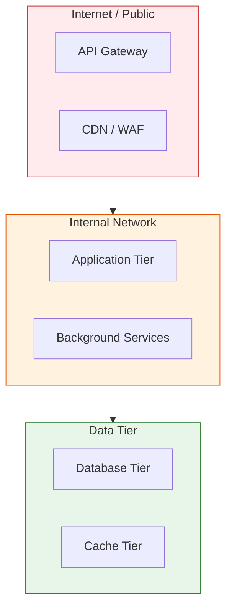

---

## 2. Threat Model

### STRIDE Analysis

| Category | Threat | Likelihood | Impact | Mitigation | Status |
|----------|--------|-----------|--------|------------|--------|
| **Spoofing** | {Unauthorized identity claim} | {Low/Med/High} | {Low/Med/High} | {Mitigation strategy} | {Open/Mitigated} |
| **Tampering** | {Data modification in transit} | {Low/Med/High} | {Low/Med/High} | {Mitigation strategy} | {Open/Mitigated} |
| **Repudiation** | {Action without audit trail} | {Low/Med/High} | {Low/Med/High} | {Mitigation strategy} | {Open/Mitigated} |
| **Info Disclosure** | {Sensitive data leak} | {Low/Med/High} | {Low/Med/High} | {Mitigation strategy} | {Open/Mitigated} |
| **Denial of Service** | {Service unavailability} | {Low/Med/High} | {Low/Med/High} | {Mitigation strategy} | {Open/Mitigated} |
| **Elevation** | {Unauthorized privilege gain} | {Low/Med/High} | {Low/Med/High} | {Mitigation strategy} | {Open/Mitigated} |

### Risk Register

| ID | Risk | Probability | Impact | Risk Score | Owner | Mitigation | Target Date |
|----|------|------------|--------|-----------|-------|------------|-------------|
| R1 | {Description} | {1-5} | {1-5} | {P x I} | {Name} | {Plan} | {Date} |

---

## 3. Authentication & Authorization

### Authentication Method

| Component | Method | Provider |
|-----------|--------|----------|
| User-facing app | {OAuth 2.0 / OIDC / SAML} | {Azure AD / Auth0 / Custom} |
| API | {JWT / API Key / mTLS} | {Azure AD / Custom} |
| Service-to-service | {Managed Identity / Client Credentials} | {Azure AD} |

### Authorization Model

- [ ] RBAC (Role-Based Access Control)
- [ ] ABAC (Attribute-Based Access Control)
- [ ] Least privilege principle enforced
- [ ] Permission boundaries documented

### Roles

| Role | Permissions | Assignment |
|------|------------|------------|
| Admin | Full access | {Manual assignment} |
| User | Read/Write own data | {Self-registration} |
| Service | API access only | {Managed Identity} |

---

## 4. Data Protection

### Data Classification

| Data Type | Classification | Encryption at Rest | Encryption in Transit |
|-----------|---------------|--------------------|-----------------------|
| User PII | Confidential | AES-256 | TLS 1.2+ |
| Auth tokens | Secret | AES-256 | TLS 1.2+ |
| App config | Internal | {Yes/No} | TLS 1.2+ |
| Public content | Public | N/A | TLS 1.2+ |

### Encryption Standards

- **At rest**: AES-256 (Azure Storage Service Encryption / SQL TDE)
- **In transit**: TLS 1.2+ (enforce `HTTPS only`)
- **Key management**: Azure Key Vault with HSM backing
- **Rotation**: Keys rotated every {90/180/365} days

---

## 5. Network Security

### Network Architecture

- [ ] Virtual Network with subnet isolation
- [ ] Network Security Groups (NSGs) with deny-all default
- [ ] Private Endpoints for PaaS services (no public endpoints)
- [ ] WAF (Web Application Firewall) for internet-facing services
- [ ] DDoS Protection Standard enabled

### Allowed Traffic

| Source | Destination | Port | Protocol | Purpose |
|--------|------------|------|----------|---------|
| Internet | WAF/LB | 443 | HTTPS | User traffic |
| App subnet | DB subnet | {5432/1433} | TCP | Database access |
| App subnet | Redis subnet | 6380 | TCP | Cache access |

---

## 6. Secrets Management

### Secret Storage

| Secret Type | Storage | Rotation | Access Method |
|-------------|---------|----------|---------------|
| DB password | Key Vault | 90 days | Managed Identity |
| API keys | Key Vault | 180 days | Managed Identity |
| Certificates | Key Vault | Auto-renew | Managed Identity |
| Connection strings | App Configuration | Reference to KV | Managed Identity |

### Rules

- MUST NOT hardcode secrets in source code
- MUST NOT store secrets in environment variables (use Key Vault references)
- MUST use Managed Identity for all Azure service authentication
- MUST enable secret scanning in CI/CD pipeline
- MUST audit secret access via Key Vault diagnostics

---

## 7. Monitoring & Incident Response

### Security Monitoring

| Signal | Tool | Alert Threshold | Response |
|--------|------|----------------|----------|
| Failed logins | {Azure Monitor / Application Insights} | >{5} in {5} min | Auto-block IP |
| Privilege escalation | {Microsoft Defender} | Any occurrence | Page on-call |
| Secret access | {Key Vault diagnostics} | Outside business hours | Alert team |
| Dependency vulnerability | {Dependabot / Snyk} | Critical/High | Block deploy |

### Incident Response Plan

1. **Detect**: Automated alerts via monitoring stack
2. **Triage**: On-call classifies severity (P0-P3)
3. **Contain**: Isolate affected component (network rules, disable access)
4. **Eradicate**: Patch vulnerability, rotate credentials
5. **Recover**: Restore from backup, verify integrity
6. **Post-mortem**: Document timeline, root cause, prevention measures

---

## 8. GenAI & LLM Security (if applicable)

> **Trigger**: Include this section when the system uses LLMs, AI agents, or GenAI inference.
> Skip if no AI/ML components exist.

### GenAI Threat Landscape

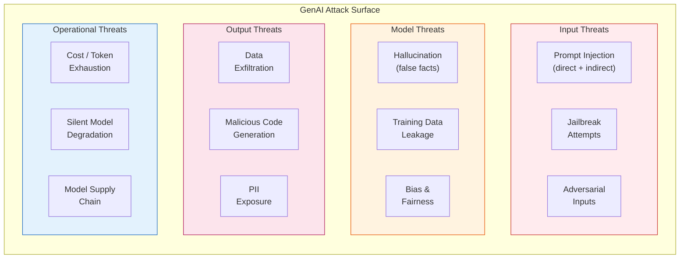

### OWASP LLM Top 10 Assessment

| # | Threat | Applicable? | Mitigation | Status |
|---|--------|-------------|------------|--------|
| LLM01 | Prompt Injection | {Yes/No} | {Input sanitization, system prompt hardening, output validation} | {Open/Mitigated} |
| LLM02 | Insecure Output Handling | {Yes/No} | {Output validation, escaping, structured output enforcement} | {Open/Mitigated} |
| LLM03 | Training Data Poisoning | {Yes/No} | {Data provenance, validation, curated datasets} | {Open/Mitigated} |
| LLM04 | Model Denial of Service | {Yes/No} | {Rate limiting, token budgets, request size limits} | {Open/Mitigated} |
| LLM05 | Supply Chain Vulnerabilities | {Yes/No} | {Model pinning, vendor assessment, fallback providers} | {Open/Mitigated} |
| LLM06 | Sensitive Information Disclosure | {Yes/No} | {PII filtering, output scanning, system prompt protection} | {Open/Mitigated} |
| LLM07 | Insecure Plugin/Tool Design | {Yes/No} | {Input validation per tool, least-privilege, no shell exec} | {Open/Mitigated} |
| LLM08 | Excessive Agency | {Yes/No} | {Human-in-the-loop, tool restrictions, confirmation prompts} | {Open/Mitigated} |
| LLM09 | Overreliance | {Yes/No} | {Confidence scoring, human review, factual grounding} | {Open/Mitigated} |
| LLM10 | Model Theft | {Yes/No} | {API key rotation, access logging, usage monitoring} | {Open/Mitigated} |

### Prompt Injection Defense

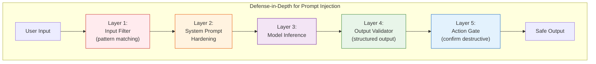

**Defense Layers:**
1. **Input Filter**: Block known injection patterns, enforce character limits, sanitize
2. **System Prompt Hardening**: Instruction hierarchy, role boundaries, canary tokens
3. **Model Inference**: Use models with strong instruction-following (e.g., system prompt priority)
4. **Output Validator**: Enforce structured output schema, reject unexpected formats
5. **Action Gate**: Require confirmation for destructive actions (delete, send, deploy)

### Guardrails Configuration

| Guardrail | Type | Trigger | Action |
|-----------|------|---------|--------|
| Topic boundary | Input | Query outside defined scope | Polite refusal + redirect |
| PII detection | Output | PII in generated response | Redact before returning |
| Content safety | Input/Output | Harmful / inappropriate content | Block + log incident |
| Token budget | Input | Request exceeds token limit | Reject with size error |
| Hallucination check | Output | Low groundedness score | Flag for human review |

---

## 9. MCP Security (if applicable)

> **Trigger**: Include this section when the system exposes an MCP Server or MCP App.
> Skip if no MCP components exist.

### MCP Attack Surface

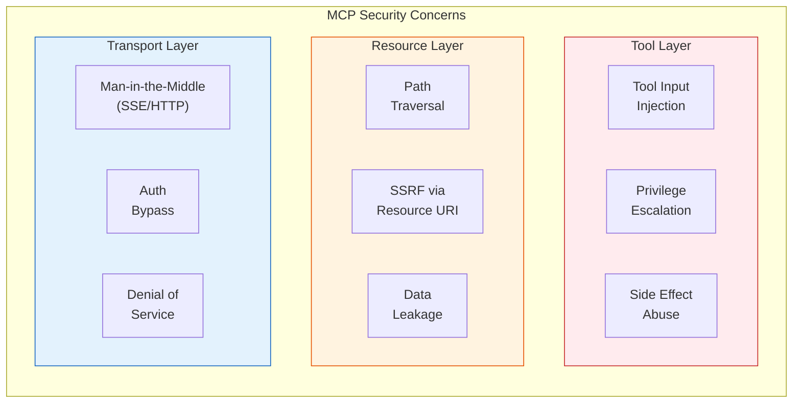

### MCP Security Controls

| Control | Implementation | Status |
|---------|---------------|--------|
| **Tool input validation** | JSON Schema validation on all parameters | {TODO/Done} |
| **Path sandboxing** | Restrict file access to allowed directories | {TODO/Done} |
| **SSRF prevention** | URL allowlist for external requests | {TODO/Done} |
| **Rate limiting** | Max {N} tool calls per minute per session | {TODO/Done} |
| **Authentication** | {OAuth / API key / stdio (no auth needed)} | {TODO/Done} |
| **Transport encryption** | TLS 1.2+ for SSE/HTTP transports | {TODO/Done} |
| **Audit logging** | Log all tool invocations with context | {TODO/Done} |
| **Error sanitization** | No system internals in error responses | {TODO/Done} |
| **Destructive action gate** | Require confirmation for write/delete tools | {TODO/Done} |

> **Reference**: Read `.github/skills/ai-systems/mcp-server-development/SKILL.md` for MCP security patterns.

---

## 10. Compliance

### Applicable Standards

- [ ] OWASP Top 10 (2021) reviewed
- [ ] OWASP AI Top 10 reviewed (if AI/ML components)
- [ ] Azure Well-Architected Framework Security Pillar
- [ ] {GDPR / HIPAA / SOC 2 / PCI-DSS - as applicable}

### Compliance Checklist

- [ ] Data residency requirements met
- [ ] Right to deletion (GDPR Art. 17) implemented
- [ ] Audit logging enabled for compliance-relevant operations
- [ ] Data processing agreements in place with third parties

---

## 11. Security Checklist

### Pre-Deployment

- [ ] STRIDE threat model completed (Section 2)
- [ ] Authentication and authorization configured (Section 3)
- [ ] Data encryption enabled (at rest + in transit) (Section 4)
- [ ] Network isolation applied (private endpoints, NSGs) (Section 5)
- [ ] Secrets stored in Key Vault (not in code) (Section 6)
- [ ] Monitoring and alerts configured (Section 7)
- [ ] Dependency vulnerability scan passed
- [ ] Security code review completed
- [ ] Penetration testing scheduled (if applicable)

### GenAI Pre-Deployment (if applicable)

- [ ] OWASP LLM Top 10 assessment completed (Section 8)
- [ ] Prompt injection defenses tested
- [ ] Guardrails configured and validated
- [ ] PII filtering verified on model outputs
- [ ] Model version pinned with evaluation baseline
- [ ] Token budgets and rate limits configured
- [ ] Fallback model/provider configured

### MCP Pre-Deployment (if applicable)

- [ ] All tool inputs validated with JSON Schema (Section 9)
- [ ] Path traversal prevention tested
- [ ] SSRF prevention validated
- [ ] Rate limiting configured
- [ ] Transport encryption enabled (if SSE/HTTP)
- [ ] Destructive action confirmation gates active
- [ ] Audit logging enabled for all tool calls

### Post-Deployment

- [ ] Security alerts validated (test fire)
- [ ] Incident response plan tested
- [ ] Access reviews scheduled (quarterly)
- [ ] Secret rotation verified

---

**Generated by AgentX Architect Agent** 
**Last Updated**: {YYYY-MM-DD} 
**Version**: 1.0

---

## Appendix A: OWASP Threat Modeling, MITRE ATT&CK, and NIST CSF (v8.4.43+)

> Additive section. References: OWASP Threat Modeling Process (Decompose -> Identify threats -> Mitigate -> Validate), STRIDE per-element, MITRE ATT&CK Enterprise Matrix v15+, NIST Cybersecurity Framework 2.0 (Govern, Identify, Protect, Detect, Respond, Recover).

### A.1 Data Flow Diagram with Trust Boundaries (OWASP shape)

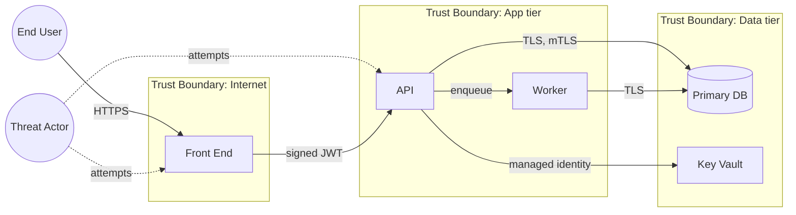

### A.2 Entry Points

| ID | Entry point | Protocol | Auth | Authz | Rate limit | Validation |
|----|-------------|----------|------|-------|------------|------------|
| E1 | {public endpoint} | HTTPS | {OIDC} | {RBAC role} | {n/min} | {schema} |
| E2 | {webhook} | HTTPS+HMAC | {signed} | {scope} | {n/min} | {schema} |

### A.3 Exit Points

| ID | Exit point | Destination | Data class | Encryption | Logged |
|----|------------|-------------|------------|------------|--------|
| X1 | {outbound API} | {3rd party} | {PII / non-PII} | TLS 1.2+ | {yes/no} |
| X2 | {email send} | {SMTP relay} | {PII} | TLS | {yes/no} |

### A.4 Trust Levels

| Level | Description | Example principal |
|-------|-------------|--------------------|
| T0 | Anonymous | unauthenticated visitor |
| T1 | Authenticated user | end user with valid JWT |
| T2 | Privileged user | admin, support agent |
| T3 | Service identity | managed identity, signed workload |
| T4 | Platform / break-glass | emergency operator |

### A.5 Threat Tree (per critical asset)

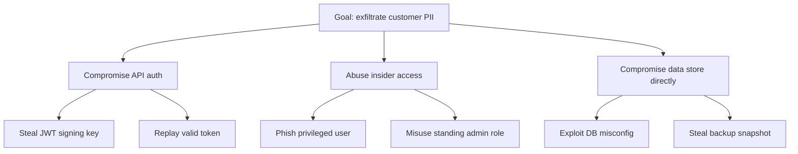

### A.6 Use / Misuse Case Diagram

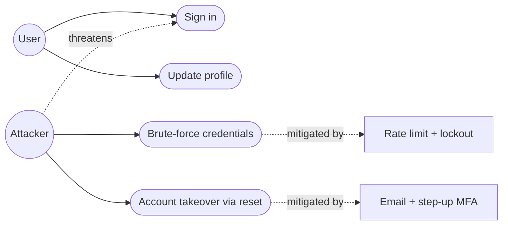

### A.7 Cyber Kill-Chain Timeline

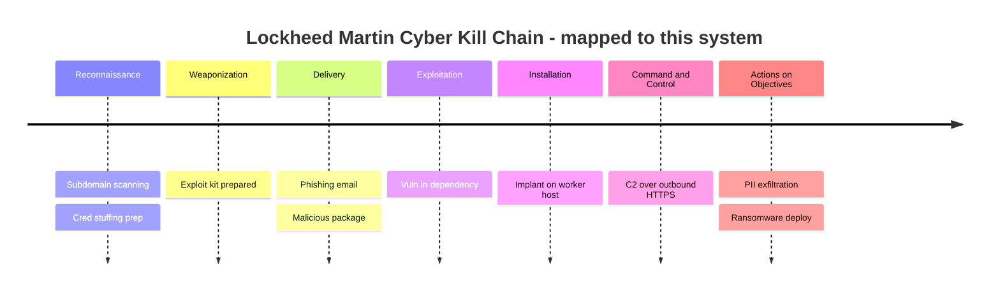

### A.8 MITRE ATT&CK Mapping

| Tactic | Technique ID | Technique | Detection (control) | Owner |
|--------|--------------|-----------|----------------------|-------|
| Initial Access | T1078 | Valid Accounts | {SIEM rule} | {team} |
| Credential Access | T1110 | Brute Force | {WAF + lockout} | {team} |
| Privilege Escalation | T1068 | Exploitation for Priv Esc | {patching SLA} | {team} |
| Defense Evasion | T1027 | Obfuscated Files or Info | {EDR rule} | {team} |
| Lateral Movement | T1021 | Remote Services | {network segmentation} | {team} |
| Exfiltration | T1041 | Exfil over C2 Channel | {egress monitoring + DLP} | {team} |

### A.9 NIST CSF 2.0 Coverage Matrix

| Function | Category | Control / mechanism in this system | Maturity (1-5) |
|----------|----------|-------------------------------------|----------------|
| Govern (GV) | Policy and oversight | {policy} | {n} |
| Identify (ID) | Asset management | {inventory} | {n} |
| Identify (ID) | Risk assessment | {process} | {n} |
| Protect (PR) | Identity and access | {OIDC + RBAC + MFA} | {n} |
| Protect (PR) | Data security | {encryption at rest + in transit} | {n} |
| Detect (DE) | Continuous monitoring | {SIEM + alerting} | {n} |
| Respond (RS) | Incident response | {runbook + on-call} | {n} |
| Recover (RC) | Recovery planning | {DR + backups + RTO/RPO} | {n} |

### A.10 STRIDE Coverage Per DFD Element

| Element | S poof | T amper | R epudiate | I nfo disclosure | D oS | E lev priv | Mitigation |
|---------|--------|---------|-------------|-------------------|------|--------------|------------|
| FE | {y/n} | {y/n} | {y/n} | {y/n} | {y/n} | {y/n} | {control} |
| API | {y/n} | {y/n} | {y/n} | {y/n} | {y/n} | {y/n} | {control} |
| Worker | {y/n} | {y/n} | {y/n} | {y/n} | {y/n} | {y/n} | {control} |
| DB | {y/n} | {y/n} | {y/n} | {y/n} | {y/n} | {y/n} | {control} |
| KV | {y/n} | {y/n} | {y/n} | {y/n} | {y/n} | {y/n} | {control} |

## Appendix B: Rich Visual Diagrams (v8.4.43+)

### B.1 Incident Response Sequence

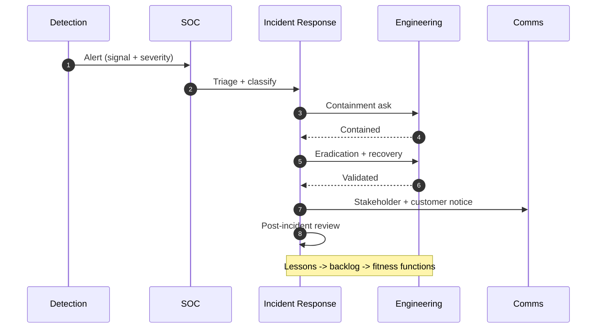

### B.2 Threat Mindmap

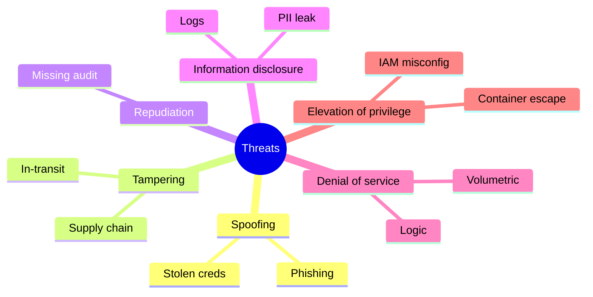

### B.3 Data Flow Sankey

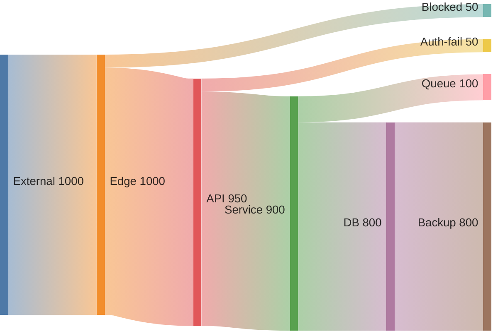

### B.4 Control Coverage (pie)

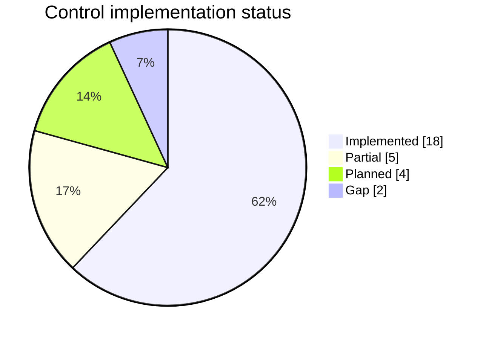

### B.5 Defense in Depth (styled)

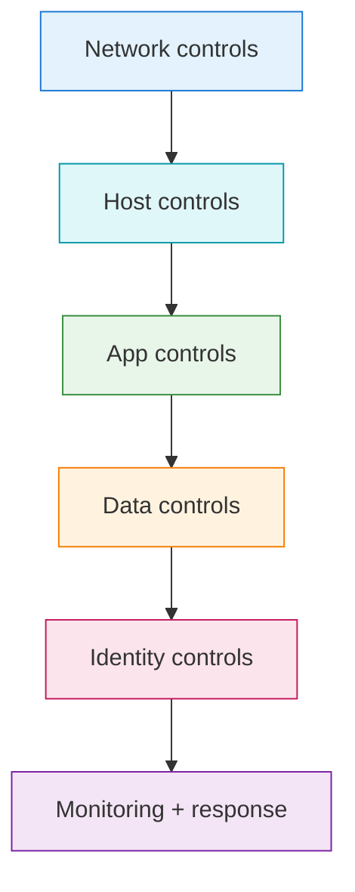
