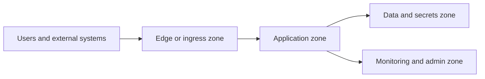
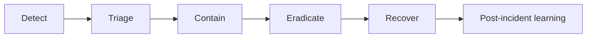
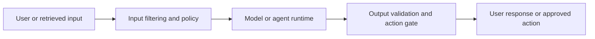

---
inputs:
  project_name:
    description: "Name of the project or system"
    required: true
    default: ""
  author:
    description: "Document author"
    required: false
    default: "Security Architect"
  date:
    description: "Creation date (YYYY-MM-DD)"
    required: false
    default: "${current_date}"
---

# Security Plan: ${project_name}

**Status**: Draft | Review | Approved
**Author**: ${author}
**Date**: ${date}
**Classification**: {Public | Internal | Confidential}

## 1. Security Overview

### System Description

{Brief description of what is being secured.}

### Security Objectives

| Objective | Priority | Description |
|---|---|---|
| Confidentiality | {High/Med/Low} | {Protect sensitive data from unauthorized access} |
| Integrity | {High/Med/Low} | {Prevent unauthorized tampering} |
| Availability | {High/Med/Low} | {Maintain required uptime and recovery posture} |

### Trust Boundaries

```mermaid
flowchart LR
    User[Users and external systems] --> Edge[Edge or ingress zone]
    Edge --> App[Application zone]
    App --> Data[Data and secrets zone]
    App --> Ops[Monitoring and admin zone]
```

## 2. Threat Model

### STRIDE Analysis

| Category | Threat | Likelihood | Impact | Mitigation | Status |
|---|---|---|---|---|---|
| Spoofing | {Unauthorized identity claim} | {Low/Med/High} | {Low/Med/High} | {Mitigation strategy} | {Open/Mitigated} |
| Tampering | {Data modification in transit or at rest} | {Low/Med/High} | {Low/Med/High} | {Mitigation strategy} | {Open/Mitigated} |
| Repudiation | {Action without audit trail} | {Low/Med/High} | {Low/Med/High} | {Mitigation strategy} | {Open/Mitigated} |
| Info Disclosure | {Sensitive data leak} | {Low/Med/High} | {Low/Med/High} | {Mitigation strategy} | {Open/Mitigated} |
| Denial of Service | {Service unavailability} | {Low/Med/High} | {Low/Med/High} | {Mitigation strategy} | {Open/Mitigated} |
| Elevation | {Unauthorized privilege gain} | {Low/Med/High} | {Low/Med/High} | {Mitigation strategy} | {Open/Mitigated} |

### Risk Register

| ID | Risk | Probability | Impact | Risk Score | Owner | Mitigation | Target Date |
|---|---|---|---|---|---|---|---|
| R1 | {Description} | {1-5} | {1-5} | {P x I} | {Name} | {Plan} | {Date} |

## 3. Authentication & Authorization

| Component | Method | Provider | Notes |
|---|---|---|---|
| User-facing app | {OAuth 2.0 / OIDC / SAML} | {Provider} | {MFA, session policy, or other notes} |
| API | {JWT / API key / mTLS} | {Provider} | {Scope or audience rules} |
| Service-to-service | {Managed Identity / Client Credentials} | {Provider} | {Rotation or lifecycle note} |

### Authorization Model

- [ ] RBAC
- [ ] ABAC
- [ ] Least privilege enforced
- [ ] Permission boundaries documented

### Roles

| Role | Permissions | Assignment |
|---|---|---|
| Admin | {Full or bounded admin access} | {Assignment rule} |
| User | {Permitted end-user actions} | {Assignment rule} |
| Service | {Machine-only actions} | {Assignment rule} |

## 4. Data Protection

| Data Type | Classification | Encryption at Rest | Encryption in Transit | Retention / Deletion Notes |
|---|---|---|---|---|
| User PII | Confidential | {Standard} | {Standard} | {Policy} |
| Auth tokens or secrets | Secret | {Standard} | {Standard} | {Policy} |
| App configuration | Internal | {Standard} | {Standard} | {Policy} |
| Public content | Public | {If applicable} | {Standard} | {Policy} |

### Encryption Standards

- At rest: {standard and owning service}
- In transit: {TLS baseline and enforcement point}
- Key management: {vault, HSM, or other store}
- Rotation: {frequency and owner}

## 5. Network Security

| Control | Requirement | Status |
|---|---|---|
| Segmentation | {Subnet or zone isolation model} | {Planned/Done} |
| Ingress | {WAF, reverse proxy, or gateway posture} | {Planned/Done} |
| Private access | {Private endpoints or internal-only services} | {Planned/Done} |
| Egress | {Allowlist, proxy, or approval model} | {Planned/Done} |
| DDoS | {Protection posture} | {Planned/Done} |

### Allowed Traffic

| Source | Destination | Port | Protocol | Purpose |
|---|---|---|---|---|
| Internet | {Ingress} | 443 | HTTPS | User traffic |
| App zone | {Data store} | {port} | TCP | Application data access |
| App zone | {Cache or queue} | {port} | TCP | Runtime support |

## 6. Secrets Management

| Secret Type | Storage | Rotation | Access Method |
|---|---|---|---|
| Database credential | {Store} | {Frequency} | {Identity or access path} |
| API key | {Store} | {Frequency} | {Identity or access path} |
| Certificate | {Store} | {Frequency} | {Identity or access path} |
| Connection setting | {Store} | {Frequency} | {Identity or access path} |

### Rules

- Secrets are never hardcoded in source.
- Access is least-privilege and auditable.
- Secret rotation and break-glass procedures are documented.
- Scanning for committed secrets is enabled.

## 7. Monitoring & Incident Response

```mermaid
flowchart LR
    Detect[Detect] --> Triage[Triage]
    Triage --> Contain[Contain]
    Contain --> Eradicate[Eradicate]
    Eradicate --> Recover[Recover]
    Recover --> Learn[Post-incident learning]
```

### Security Monitoring

| Signal | Tool | Alert Threshold | Response |
|---|---|---|---|
| Failed logins | {Tool} | {Threshold} | {Response} |
| Privilege escalation | {Tool} | {Threshold} | {Response} |
| Secret access anomaly | {Tool} | {Threshold} | {Response} |
| Dependency vulnerability | {Tool} | {Threshold} | {Response} |

### Incident Response Plan

1. Detect: {How incidents are identified}
2. Triage: {Who classifies severity}
3. Contain: {How blast radius is limited}
4. Eradicate: {How cause is removed}
5. Recover: {How services return safely}
6. Post-mortem: {How learning is captured}

## 8. GenAI & LLM Security (if applicable)

> Include only when the system uses LLMs, AI agents, or other GenAI inference.

```mermaid
flowchart LR
    Input[User or retrieved input] --> Guard1[Input filtering and policy]
    Guard1 --> Model[Model or agent runtime]
    Model --> Guard2[Output validation and action gate]
    Guard2 --> Result[User response or approved action]
```

### LLM Threat Assessment

**Catalog / version / source / verified on**: {Selected current OWASP or other
catalog, authoritative URL and date}. The categories below are a starting
checklist, not a claim to reproduce a particular current Top 10 edition.

| Threat | Applicable? | Mitigation | Status |
|---|---|---|---|
| Prompt Injection | {Yes/No} | {Boundary rules, grounding, sanitization} | {Open/Mitigated} |
| Insecure Output Handling | {Yes/No} | {Schema validation, escaping, approval gates} | {Open/Mitigated} |
| Training Data Poisoning | {Yes/No} | {Curated sources, provenance checks} | {Open/Mitigated} |
| Model Denial of Service | {Yes/No} | {Rate limits, token budgets, timeouts} | {Open/Mitigated} |
| Supply Chain Vulnerabilities | {Yes/No} | {Version pinning, vendor review, fallback provider} | {Open/Mitigated} |
| Sensitive Information Disclosure | {Yes/No} | {PII detection, prompt boundary rules} | {Open/Mitigated} |
| Insecure Tool Design | {Yes/No} | {Input validation and least privilege} | {Open/Mitigated} |
| Excessive Agency | {Yes/No} | {Human review for high-risk actions} | {Open/Mitigated} |
| Overreliance | {Yes/No} | {Confidence, fallback, human escalation} | {Open/Mitigated} |
| Model Theft | {Yes/No} | {Credential hygiene and access logging} | {Open/Mitigated} |

### Guardrails Configuration

| Guardrail | Trigger | Action |
|---|---|---|
| Topic boundary | Query outside allowed scope | Refuse and redirect |
| PII detection | Sensitive data in output | Redact or block |
| Content safety | Harmful or disallowed content | Block and log |
| Token budget | Request exceeds limit | Reject with size guidance |
| Low groundedness | Weak or missing evidence | Escalate or fall back |

## 9. MCP Security (if applicable)

> Include only when the system exposes an MCP Server or MCP App.

### MCP Security Controls

| Control | Implementation | Status |
|---|---|---|
| Tool input validation | {JSON Schema or equivalent} | {TODO/Done} |
| Path sandboxing | {Allowed directories only} | {TODO/Done} |
| SSRF prevention | {URL allowlist or blocked egress} | {TODO/Done} |
| Rate limiting | {Per-session or per-user policy} | {TODO/Done} |
| Authentication | {OAuth / API key / none for local stdio} | {TODO/Done} |
| Transport encryption | {TLS baseline if remote} | {TODO/Done} |
| Audit logging | {Approved tool-call metadata; redact secrets and sensitive payloads} | {TODO/Done} |
| Error sanitization | {No internal detail leakage} | {TODO/Done} |
| Destructive action gate | {Confirmation required for writes or deletes} | {TODO/Done} |

## 10. Compliance

### Applicable Standards

- [ ] OWASP Top 10 reviewed
- [ ] OWASP AI Top 10 reviewed (if AI/ML components)
- [ ] Relevant platform security baseline reviewed
- [ ] Applicable regulatory or contractual standards reviewed

### Compliance Checklist

- [ ] Data residency requirements met
- [ ] Right to deletion and retention controls defined
- [ ] Audit logging enabled for compliance-relevant actions
- [ ] Third-party data processing obligations documented

## 11. Security Checklist

### Pre-Deployment

- [ ] STRIDE threat model completed
- [ ] Authentication and authorization configured
- [ ] Data encryption enabled at rest and in transit
- [ ] Network isolation applied
- [ ] Secrets stored in an approved secret store
- [ ] Monitoring and alerts configured
- [ ] Dependency vulnerability scan passed
- [ ] Security review completed

### GenAI Pre-Deployment (if applicable)

- [ ] OWASP LLM Top 10 assessment completed
- [ ] Prompt injection defenses tested
- [ ] Guardrails configured and validated
- [ ] PII filtering verified on outputs
- [ ] Actual model/deployment identity recorded; supported snapshot pinned where available
- [ ] Evaluation baseline covers the deployed model and configured fallback
- [ ] Token budgets and rate limits configured
- [ ] Fallback model or provider configured

### MCP Pre-Deployment (if applicable)

- [ ] All tool inputs validated with JSON Schema
- [ ] Path traversal prevention tested
- [ ] SSRF prevention validated
- [ ] Rate limiting configured
- [ ] Transport encryption enabled when remote
- [ ] Destructive action confirmation gates active
- [ ] Audit logging enabled for all tool calls

### Post-Deployment

- [ ] Alerts test-fired successfully
- [ ] Incident response plan rehearsed
- [ ] Access reviews scheduled
- [ ] Secret rotation verified

**Generated by AgentX Architect Agent**  
**Last Updated**: {YYYY-MM-DD}  
**Version**: 1.0
