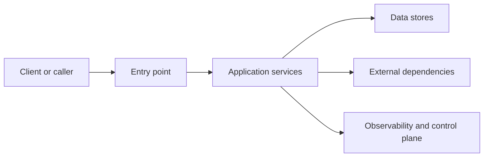
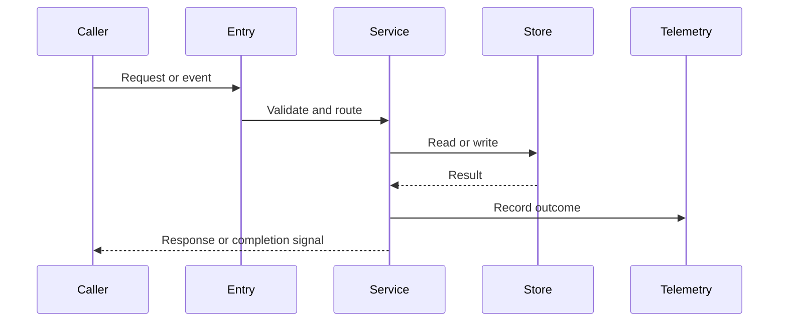
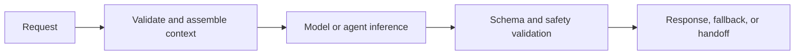

---
inputs:
  feature_name:
    description: "Name of the feature being specified"
    required: true
    default: ""
  author:
    description: "Spec author (agent or person)"
    required: false
    default: "Solution Architect Agent"
  date:
    description: "Specification date (YYYY-MM-DD)"
    required: false
    default: "${current_date}"
---

# Technical Specification: ${feature_name}

**Status**: Draft | Review | Approved
**Author**: ${author}
**Date**: ${date}
**Related ADR**: `docs/artifacts/adr/ADR-{id}.md`
**Related UX**: `docs/ux/UX-{id}.md`

> **Acceptance Criteria**: Defined in the PRD user stories - see `docs/artifacts/prd/PRD-${epic_id}.md` section 5 (User Stories & Features). Engineers should track AC completion against the originating Story issue.

## 1. Overview

{Brief description of what will be built.}

**Scope:**
- In scope: {What this spec covers}
- Out of scope: {What this spec does not cover}

**Success Criteria:**
- {Measurable success criterion 1}
- {Measurable success criterion 2}

### AI-first assessment

| Question | Answer |
|---|---|
| Could GenAI or agentic AI solve this better? | {Yes/No/Partially} |
| If yes, where does AI add value? | {User-visible reasoning, automation, retrieval, or none} |
| If no, why is a traditional approach preferred? | {Determinism, cost, latency, safety, or regulatory reason} |
| What risk does the chosen posture avoid? | {Hallucination, cost variability, privacy, complexity, or none} |

### 1.1 Selected Tech Stack (REQUIRED before implementation)

> Engineers SHOULD NOT start implementation until this table is completed and the chosen stack is explicit.

| Layer / Concern | Selected Technology | Version / SKU | Version Source / Verified On | Why This Was Chosen | Rejected Alternatives |
|---|---|---|---|---|---|
| Frontend / UI | {e.g. React, Blazor, none} | {version} | {official source, YYYY-MM-DD} | {brief rationale} | {alternatives considered} |
| Backend / Runtime | {e.g. Node.js, .NET, Python} | {version} | {official source, YYYY-MM-DD} | {brief rationale} | {alternatives considered} |
| API Style | {REST, GraphQL, gRPC, or none} | {n/a or version} | {official source, YYYY-MM-DD or n/a} | {brief rationale} | {alternatives considered} |
| Data Store | {e.g. PostgreSQL, Cosmos DB, none} | {version / tier} | {official source, YYYY-MM-DD} | {brief rationale} | {alternatives considered} |
| Hosting / Compute | {e.g. App Service, AKS, Functions} | {plan / SKU} | {official source, YYYY-MM-DD} | {brief rationale} | {alternatives considered} |
| Authentication / Security | {e.g. Entra ID, Auth0, existing platform auth} | {version / tier} | {official source, YYYY-MM-DD} | {brief rationale} | {alternatives considered} |
| Observability | {e.g. Application Insights, OpenTelemetry} | {version / tier} | {official source, YYYY-MM-DD} | {brief rationale} | {alternatives considered} |
| CI/CD | {e.g. GitHub Actions, Azure Pipelines} | {version / n/a} | {official source, YYYY-MM-DD or n/a} | {brief rationale} | {alternatives considered} |

**Implementation Preconditions:**
- The selected stack is consistent with the ADR decision.
- Major versions, managed service tiers, and externally hosted platforms are named explicitly.
- Each named version or SKU is verified against an official source and includes the verification date.
- Any unresolved stack choice is captured under Open Questions and blocks implementation.

## 2. Goals

| Goal | How success is measured | Out-of-scope boundary |
|---|---|---|
| {Goal 1} | {Metric or acceptance signal} | {Boundary} |
| {Goal 2} | {Metric or acceptance signal} | {Boundary} |
| {Goal 3} | {Metric or acceptance signal} | {Boundary} |

## 3. Architecture

### Architecture Summary

| Concern | Decision |
|---|---|
| Primary entry point | {API, UI, worker, event consumer, or other} |
| Core runtime shape | {Monolith, modular monolith, service, pipeline, or serverless} |
| Data ownership | {System of record and authoritative stores} |
| Integration pattern | {Sync API, async events, batch, or hybrid} |
| Availability posture | {SLA/SLO target or environment expectation} |

### Request / Work Sequence

## 4. Components

| Component | Responsibility | Inputs | Outputs | Dependencies |
|---|---|---|---|---|
| {Component 1} | {Responsibility} | {Input} | {Output} | {Dependencies} |
| {Component 2} | {Responsibility} | {Input} | {Output} | {Dependencies} |
| {Component 3} | {Responsibility} | {Input} | {Output} | {Dependencies} |

## 5. Data Model

| Entity / Record | Purpose | Key Fields | Constraints | Retention / Lifecycle |
|---|---|---|---|---|
| {Entity 1} | {Purpose} | {Key fields} | {Validation or uniqueness} | {Retention rule} |
| {Entity 2} | {Purpose} | {Key fields} | {Validation or uniqueness} | {Retention rule} |

### Data Relationships

| Source | Relationship | Target | Notes |
|---|---|---|---|
| {Entity 1} | {1:N / N:1 / N:N} | {Entity 2} | {Cardinality or ownership note} |

## 6. API Design

| Method / Event | Path or Topic | Purpose | Request Contract | Response Contract | Auth / Caller | Idempotency / Side Effects |
|---|---|---|---|---|---|---|
| {Method} | {path or topic} | {Purpose} | {fields and validation summary} | {result shape and statuses} | {auth model} | {safe to retry or side effect note} |
| {Method} | {path or topic} | {Purpose} | {fields and validation summary} | {result shape and statuses} | {auth model} | {safe to retry or side effect note} |

## 7. Security

| Concern | Requirement | Verification |
|---|---|---|
| Authentication | {Method and scope model} | {How it is validated} |
| Authorization | {Role, policy, or ownership rule} | {How it is validated} |
| Data protection | {Encryption, masking, or retention requirement} | {How it is validated} |
| Secrets | {Secret storage and access path} | {How it is validated} |
| Auditability | {What must be logged} | {How it is validated} |

## 8. Performance

| Metric | Target | Notes |
|---|---|---|
| Response time p50 | {target} | {Context} |
| Response time p95 | {target} | {Context} |
| Throughput / concurrency | {target} | {Context} |
| Background completion time | {target} | {Context} |
| Cost or resource budget | {target} | {Context} |

## 9. Error Handling

| Failure Mode | User-visible Behavior | System Behavior | Retry / Idempotency Rule | Escalation / Recovery |
|---|---|---|---|---|
| Validation failure | {What the user sees} | {What the system logs or rejects} | {Fail fast or retry rule} | {Retry or correction path} |
| Dependency outage | {What the user sees} | {Fallback or queueing behavior} | {Retry rule and safety bound} | {Escalation path} |
| Timeout | {What the user sees} | {Cancellation or retry behavior} | {Retry rule and safety bound} | {Escalation path} |
| Partial write or partial completion | {What the user sees} | {Consistency or compensation behavior} | {Idempotency or compensation rule} | {Escalation path} |

## 10. Monitoring & Observability

| Signal | Why it matters | Threshold / SLO | Owner / Response |
|---|---|---|---|
| Availability | {Why it matters} | {Threshold} | {Owner and action} |
| Latency | {Why it matters} | {Threshold} | {Owner and action} |
| Error rate | {Why it matters} | {Threshold} | {Owner and action} |
| Data freshness | {Why it matters} | {Threshold} | {Owner and action} |
| Cost / token use / resource use | {Why it matters} | {Threshold} | {Owner and action} |

## 11. Testing Strategy

| Test Layer | Purpose | Minimum Coverage | Evidence Required |
|---|---|---|---|
| Unit | {Core logic validation} | {target} | {artifact or report} |
| Integration | {Boundary and contract validation} | {target} | {artifact or report} |
| End-to-end | {Critical user or business flow} | {target} | {artifact or report} |
| Performance / resilience | {Load, failover, or recovery validation} | {target} | {artifact or report} |

## 12. Migration

| Area | Current State | Target State | Migration Notes |
|---|---|---|---|
| Data | {Current} | {Target} | {Backfill, dual-write, or cutover note} |
| Interfaces | {Current} | {Target} | {Versioning or compatibility note} |
| Operations | {Current} | {Target} | {Runbook or monitoring note} |

### Rollout Plan
- {Environment sequence}
- {Readiness checks}
- {Rollback trigger and owner}

## 13. Open Questions

| Question | Owner | Blocking? | Resolution Path |
|---|---|---|---|
| {Question 1} | {Owner} | Yes / No | {How it will be resolved} |
| {Question 2} | {Owner} | Yes / No | {How it will be resolved} |

## 14. AI/ML Specification (if applicable)

> Include this section when the issue has `needs:ai` or the ADR selects an AI-bearing architecture. This section blocks implementation until Data Scientist alignment is reviewed or the blocker is made explicit.

### 14.0 AI/ML Alignment Record

| Field | Value |
|---|---|
| Architect Owner | {name} |
| Data Scientist Reviewer | {name or clarification thread reference} |
| Review Status | {Reviewed / Blocked / Follow-up required} |
| Review Date | {YYYY-MM-DD} |
| Blocks implementation until Reviewed | {Yes / No} |
| Implementation Risks Raised | {summary of unresolved AI implementation risks} |
| Validation Note | {What the reviewer approved, or the blocker that prevented approval} |

### 14.1 Model Configuration

| Parameter | Value |
|---|---|
| Primary host or deployment identity | {resolved host, deployment, or runtime name} |
| Resolved model alias | {model alias exposed by the active host} |
| Provider-supported snapshot | {snapshot id if the provider exposes one; otherwise n/a} |
| Host / endpoint / SDK version | {host version, endpoint API version, or SDK version} |
| Resolution source / verified on | {official source or runtime inventory, YYYY-MM-DD} |
| Fallback host or deployment identity | {different provider or fallback path when applicable} |
| Endpoint | {URL or environment variable name} |
| Authentication | {API key, Managed Identity, OAuth, or equivalent} |
| Prompt File(s) | {paths under `prompts/`} |
| System Prompt Contract | {Role, constraints, variables, tool expectations} |
| Structured Output | {Schema location or format contract} |
| Context window budget | {maximum request context allowed for this workflow} |
| Reserved output headroom | {completion budget reserved so responses do not clip} |
| Reserved tool or retry headroom | {budget reserved for tool calls, retries, and fallback} |
| Timeout | {seconds} |
| Retry Policy | {retry count and strategy} |
| Fallback Trigger | {timeout, schema failure, outage, safety block, or other} |

> Pin a provider-supported snapshot when available. Otherwise record the alias, resolved host identity, and host version. Do not invent dated model identifiers.

### 14.2 Input / Output Contract

| Contract Element | Value |
|---|---|
| Input Schema | {request fields and validation summary} |
| Context Inputs | {conversation state, retrieved docs, tool outputs, profile data, or other} |
| Context Headroom Rule | {what must be trimmed, summarized, or rejected before overflow} |
| Output Schema | {response shape and required fields} |
| Schema Validation Path | {where invalid outputs are blocked} |
| User-visible Failure Modes | {fallback response, retry message, or human handoff} |
| Non-retryable Errors | {conditions that must fail fast} |
| Cost Headroom Rule | {how retries and fallback stay within budget} |

### 14.3 Agent Tools / Functions

| Tool Name | Purpose | Authorization Boundary | Input Schema | Output Schema | Idempotency Rule | Failure Contract | Side Effects |
|---|---|---|---|---|---|---|---|
| {tool_1} | {what it does} | {who or what may call it} | {params} | {return type} | {safe retry or no} | {retryable vs fail-fast behavior} | {DB write / API call / none} |
| {tool_2} | {what it does} | {who or what may call it} | {params} | {return type} | {safe retry or no} | {retryable vs fail-fast behavior} | {side effects} |

### 14.4 Inference Pipeline

### 14.5 Prompt, Retrieval, and Context Assets

| Asset / Concern | Value |
|---|---|
| Prompt Files | {system, user, and tool prompt paths} |
| Prompt Variables | {runtime variables injected into prompts} |
| Few-shot / Examples | {source and maintenance approach} |
| Knowledge Source | {Documents, database, API, vector store, or none} |
| Embedding Model | {model name or host alias} |
| Vector Store | {service name} |
| Chunk Strategy | {size, overlap, method} |
| Top-K Results | {number of chunks retrieved} |
| Relevance Threshold | {minimum threshold} |
| Fallback Retrieval Behavior | {what happens when retrieval is weak or empty} |

### 14.6 Evaluation Strategy

| Metric | Evaluator | Threshold | Test Dataset | Calibration / Rollback Condition |
|---|---|---|---|---|
| Relevance | {Evaluator} | {threshold} | {dataset location} | {judge calibration note and rollback trigger} |
| Groundedness | {Evaluator} | {threshold} | {dataset location} | {judge calibration note and rollback trigger} |
| Coherence | {Evaluator} | {threshold} | {dataset location} | {judge calibration note and rollback trigger} |
| Latency | {Evaluator} | {threshold} | {dataset location} | {rollback trigger} |
| Cost | {Evaluator} | {threshold} | {dataset location} | {rollback trigger} |

| Evaluation Evidence | Requirement |
|---|---|
| Held-out dataset | {versioned held-out tasks with expected outcomes and negative cases} |
| Judge or grader calibration | {labelled examples, disagreement review, and calibration owner} |
| Run provenance | {actual deployment identity, host version, prompt/tool revision, timestamp, and usage source} |
| Baseline comparison | {baseline artifact path and regression rule} |
| Rollback condition | {what score, safety, latency, or cost regression triggers rollback} |

### 14.7 Guardrails, Observability, and Operations

| Concern | Requirement |
|---|---|
| Safety Guardrails | {Prompt injection handling, moderation, out-of-domain policy} |
| Tracing | {How model calls are traced} |
| Token Tracking | {How prompt, completion, and cost are measured} |
| Context Headroom | {Budget reserved before retrieval and tool expansion} |
| Output Headroom | {Budget reserved to avoid clipped structured output} |
| Cost Headroom | {Budget reserved for retries, fallback, and delegated work} |
| Latency Budget | {p50 / p95 / timeout budget} |
| Quality Monitoring | {Production evaluation and alerting} |
| Drift Signals | {What constitutes drift and re-evaluation cadence} |

## 15. MCP Server Specification (if applicable)

| Parameter | Value |
|---|---|
| Server Name | {server name} |
| Transport | stdio / SSE / Streamable HTTP |
| SDK / Runtime | {SDK and runtime} |
| Authentication | {None, OAuth, API key, or equivalent} |
| Target Hosts | {VS Code Copilot / Claude Desktop / GitHub Copilot / Custom} |
| Tools | {tool list or linked contract} |
| Resources | {resource list or linked contract} |
| Prompt Assets | {prompt list or linked contract} |
| Security Notes | {sandboxing, validation, rate limiting, auditability} |

## 16. MCP App Specification (if applicable)

| Concern | Requirement |
|---|---|
| Host Context | {Expected host and viewport constraints} |
| Views | {Named views and when they appear} |
| Theme Integration | {Dark/light and host token expectations} |
| Accessibility | {WCAG and keyboard requirements} |
| Chat Interaction | {How the app returns structured results to the host} |
| Failure Handling | {Disconnected host, invalid state, retry behavior} |
