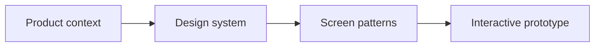
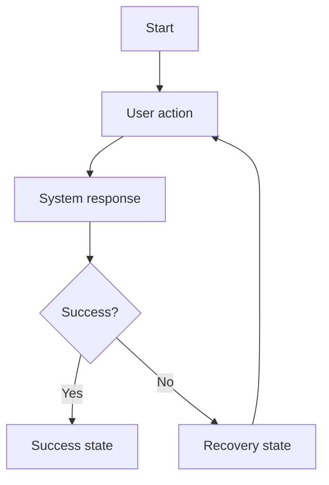
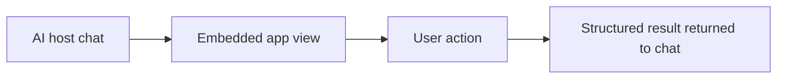

---
inputs:
  feature_name:
    description: "Name of the feature being designed"
    required: true
    default: ""
  designer:
    description: "Designer name (agent or person)"
    required: false
    default: "UX Designer Agent"
  date:
    description: "Design date (YYYY-MM-DD)"
    required: false
    default: "${current_date}"
---

# UX Design: ${feature_name}

**Status**: Draft | Review | Approved
**Designer**: ${designer}
**Date**: ${date}
**Related PRD**: `docs/artifacts/prd/PRD-{id}.md`

## 0. Design Language

- **Product Context**: `PRODUCT.md`
- **Visual System**: `DESIGN.md`
- **Detector Status**: PASS | BLOCKED | DEGRADED
- **Detector Evidence**: {Command, exit code, and audit report link}
- **Waivers**: {None, or links to accepted AgentX waivers}

### DEGRADED Record (if applicable)

| Field | Value |
|---|---|
| Design language check | DEGRADED |
| Reason | one of: no network / binary unresolved / node <22.18 / other |
| Required fallback checks | T1-T10 + Honest Placeholders + axe + Pass 9 critique |
| Actually run | {Commands, results and evidence; do not prefill success} |
| Not run | {Unavailable checks, reason and resulting limitations} |

## 1. Overview

### Feature Summary
{Brief description of what this feature does.}

### Design Goals
1. {Goal 1}
2. {Goal 2}
3. {Goal 3}

### Success Criteria
- {Measurable UX metric 1}
- {Measurable UX metric 2}
- {Measurable UX metric 3}

## 2. Design Research & Posture

### Product Posture
- **Primary Posture**: {Trust-led / Workflow-led / Emotion-led / Utility-led}
- **Confidence Level Needed**: {High precision, high clarity, high speed, or similar}

### Page Archetypes
- **Dominant Archetype**: {Proof-led landing / operations surface / guided utility / other}
- **Rationale**: {Why this archetype fits the user goal}

### Competitive Audit

| Product | Layout Strategy | Interaction Model | Takeaways (Use/Avoid) |
|---|---|---|---|
| {Company X} | {Notes} | {Notes} | {Adopt or avoid} |
| {Company Y} | {Notes} | {Notes} | {Adopt or avoid} |
| {Company Z} | {Notes} | {Notes} | {Adopt or avoid} |

### Anti-Patterns (What to Avoid)
- {Anti-pattern}
- {Anti-pattern}
- {Anti-pattern}

## 3. User Research

### User Personas (from PRD)

| Persona | Goals | Pain Points | Technical Skill | Device Preference |
|---|---|---|---|---|
| {Primary Persona} | {Goals} | {Pain points} | Beginner / Intermediate / Advanced | Mobile / Desktop / Both |
| {Secondary Persona} | {Goals} | {Pain points} | Beginner / Intermediate / Advanced | Mobile / Desktop / Both |

### User Needs
1. **{Need 1}**: {Description and why it matters}
2. **{Need 2}**: {Description and why it matters}
3. **{Need 3}**: {Description and why it matters}

## 4. User Flows

### 4.1 Primary Flow: {Action Name}
- **Trigger**: {What initiates this flow}
- **Goal**: {What the user wants to accomplish}
- **Preconditions**: {Required state before the flow}

### Detailed Steps

| Step | User Action | System Response | Screen / Surface | Notes |
|---|---|---|---|---|
| 1 | {Action} | {Response} | {Screen} | {Note} |
| 2 | {Action} | {Response} | {Screen} | {Note} |
| 3 | {Action} | {Response} | {Screen} | {Note} |

### Alternative Flows
- **4a. Validation Error**: {Recovery path}
- **4b. Existing State**: {Recovery path}
- **4c. Network or dependency error**: {Recovery path}

### 4.2 Secondary Flow: {Action Name}
{Repeat only when materially different from the primary flow.}

## 5. Wireframes

### Screen 1: {Screen Name}

| Element | Purpose | Priority | States |
|---|---|---|---|
| Header | {Purpose} | High | {Default and alternate states} |
| Main content | {Purpose} | High | {Default and alternate states} |
| Primary action | {Purpose} | High | {Enabled, disabled, loading} |
| Supporting panel | {Purpose} | Medium | {Expanded, collapsed, hidden} |

**Responsive Behavior:**
- Desktop: {Behavior}
- Tablet: {Behavior}
- Mobile: {Behavior}

### Screen 2: {Screen Name}

| Element | Purpose | Priority | States |
|---|---|---|---|
| Header | {Purpose} | High | {States} |
| Main content | {Purpose} | High | {States} |
| Status region | {Purpose} | Medium | {States} |
| Secondary action | {Purpose} | Medium | {States} |

### Screen 3: {Screen Name}
{Add only when a third screen materially clarifies the flow.}

## 6. Component Specifications

| Component | Purpose | States | Variants | Usage Notes |
|---|---|---|---|---|
| Primary action button | {Purpose} | Default, hover, active, disabled, loading | {Variants} | {Usage notes} |
| Input field | {Purpose} | Default, focus, error, success, disabled | {Variants} | {Usage notes} |
| Status card | {Purpose} | Empty, loading, success, error | {Variants} | {Usage notes} |

## 7. Design System

| Token Area | Rules |
|---|---|
| Layout & Grid | {Grid, container, breakpoint rules} |
| Typography | {Font families, scale, emphasis rules} |
| Color Palette | {Primary, semantic, and neutral token rules} |
| Spacing System | {Base unit and allowed spacing tokens} |
| Elevation | {Shadow or depth rules} |
| Border Radius | {Radius scale and allowed usage} |

## 8. Interactions & Animations

| Interaction | Default Behavior | Reduced Motion / Accessibility Rule |
|---|---|---|
| Hover | {Behavior} | {Rule} |
| Form submit | {Behavior} | {Rule} |
| Success feedback | {Behavior} | {Rule} |
| Error feedback | {Behavior} | {Rule} |
| Loading state | {Behavior} | {Rule} |

## 9. Accessibility (WCAG 2.1 AA)

| Area | Requirement | Evidence / Notes |
|---|---|---|
| Keyboard navigation | {Logical order, escape paths, visible focus} | {Evidence} |
| Screen readers | {Labels, live regions, semantic structure} | {Evidence} |
| Color contrast | {Minimum ratios and tested pairs} | {Evidence} |
| Error identification | {Not color only; clear recovery text} | {Evidence} |
| Text resizing | {Text remains usable at 200%} | {Evidence} |
| Reflow | {Usable at 320 CSS px width, except essential two-dimensional content} | {Evidence} |
| Motion sensitivity | {Respects reduced motion preferences} | {Evidence} |

## 10. Responsive Design

| Context | Layout Strategy | Navigation | Input / Accessibility Notes |
|---|---|---|---|
| Mobile (<768px) | {Single-column behavior} | {Menu or nav pattern} | {Touch target and font notes} |
| Tablet (768-1023px) | {Intermediate layout behavior} | {Menu or nav pattern} | {Touch target and focus notes} |
| Desktop (1024px+) | {Multi-column behavior} | {Menu or nav pattern} | {Hover and keyboard notes} |

## 11. AI & Conversational UX (if applicable)

> Include when the feature involves chat, LLM-powered interactions, AI agents, or conversational guidance.

| Concern | UX Contract |
|---|---|
| Input modes | {Text, quick actions, file upload, or structured form} |
| Response patterns | {Text reply, rich card, confirmation, wizard, or app view} |
| Transparency | {How AI-generated output is labeled} |
| Feedback | {How users rate, correct, or retry responses} |
| Escalation | {How users reach a human or non-AI path} |
| Accessibility | {Live regions, keyboard flow, announced state changes} |

## 12. MCP App UI Design (if applicable)

> Include when the feature renders interactive UI inside an AI host.

| Context | Width | Layout Strategy |
|---|---|---|
| VS Code side panel | ~400px | Single column, compact spacing, collapsible sections |
| VS Code editor tab | ~800px | Two-column, fuller data view |
| Claude Desktop | ~600px | Medium layout with foldable panels |
| Mobile host | <400px | Single column, touch-optimized |

Widths are illustrative starting points. Verify the actual host viewport,
theme and supported interaction APIs rather than assuming these dimensions.

### Interaction with Chat

| User Action in App | Result in Chat |
|---|---|
| Clicks a send or confirm action | Inserts structured result as a chat message |
| Submits a form | Returns validated output to the host |
| Selects items | Provides selection context for follow-up prompts |
| Closes view | Chat shows a concise summary of what was done |

## 13. Interactive Prototypes

> **`[WARN]` MANDATORY**: HTML/CSS prototypes are REQUIRED per AGENTS.md. Output to `docs/ux/prototypes/`.

### Prototype Links
- HTML/CSS Prototype: `docs/ux/prototypes/{feature-name}/index.html` **(MANDATORY)**
- Figma Prototype: {optional link}
- Interactive Demo: {optional link}

### Prototype Scope
- [ ] Primary user flow (happy path) verified
- [ ] Error states, validation and loading states verified
- [ ] Edge cases documented, including unimplemented prototype behavior
- Backend integration: {Simulated / Connected}; disclose fixtures and unavailable paths

## 14. Implementation Notes

### For Engineers

| Concern | Guidance |
|---|---|
| Existing components to reuse | {Named reusable components or patterns} |
| New components to create | {Only if required by the UX} |
| Styling approach | {Token source and styling system} |
| Responsive implementation | {Breakpoint-driven behavior to preserve} |
| Animation implementation | {State changes and reduced-motion behavior to preserve} |
| Assets needed | {Icons, illustrations, logo files, or none} |

### Testing Checklist
- [ ] Test on target desktop browsers
- [ ] Test on target mobile browsers or host contexts
- [ ] Test with keyboard only
- [ ] Test with screen reader
- [ ] Test at 200% zoom
- [ ] Test reflow at 320 CSS px width and applicable layout exceptions
- [ ] Test slow or degraded network conditions if relevant

## 15. Open Questions

| Question | Owner | Status | Resolution |
|---|---|---|---|
| {Question 1} | {Name} | Open | TBD |
| {Question 2} | {Name} | Resolved | {Answer} |

## 16. References

### Design Inspiration
- {Example 1}
- {Example 2}

### Research
- {User interview notes}
- {Usability test results}

### Standards
- [WCAG 2.1 Guidelines](https://www.w3.org/WAI/WCAG21/quickref/)
- {Other standard or design guidance}

**Generated by AgentX UX Designer Agent**  
**Last Updated**: {YYYY-MM-DD}  
**Version**: 1.0
