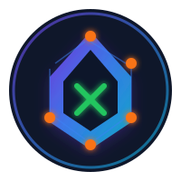
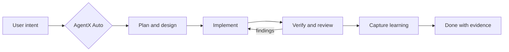

<div align="center">
  
  <h1>AgentX</h1>
  <p><strong>Structured AI software delivery for GitHub Copilot, Claude, OpenAI, local models, and the CLI.</strong></p>
  <p>
    <a href="https://github.com/jnPiyush/AgentX/releases/tag/v8.7.1"></a>
    <a href="https://marketplace.visualstudio.com/items?itemName=jnPiyush.agentx"></a>
    <a href="LICENSE"></a>
    <a href="https://securityscorecards.dev/viewer/?uri=github.com/jnPiyush/AgentX"></a>
  </p>
</div>

AgentX turns coding agents into a structured delivery team. Specialist roles plan, design, build, review, test, deploy, and capture what they learned while repo-local state and mechanical gates keep the work auditable.

> Code generation is one step. AgentX supplies the operating system around it.

[Install](#install-in-vs-code) | [See the workflow](#the-operating-loop) | [Meet the team](#the-agent-team) | [Explore skills](Skills.md) | [Read the guide](docs/GUIDE.md) | [Security](SECURITY.md)

---

## AgentX in 60 Seconds

| What you get | Current release |
|:-------------|:----------------|
| Specialist agents | **26 total**: 15 visible roles and 11 internal sub-agents |
| Production knowledge | **132 skills** across architecture, AI, data, development, design, testing, infrastructure, low-code, and domain consulting |
| Quality discipline | At least **5 evidenced iterations**, fresh verification, independent review, scrub, and completion gates |
| Durable artifacts | PRDs, ADRs, specs, UX prototypes, plans, reviews, learnings, issue state, and memory stored in the repository |
| Runtime surfaces | VS Code, GitHub Copilot Chat, GitHub Copilot CLI, Claude Code, Cursor, PowerShell, and Bash |
| Work tracking | Local mode, GitHub, or Azure DevOps |
| Model adapters | GitHub Copilot, Claude Subscription/API, OpenAI API, and Claude Code through LiteLLM + Ollama |

### The core idea



AgentX Auto can run that path in one session. For tighter control, select a specialist role for only the phase you need.

---

## Why AgentX

### Repository context before generation

Agents retrieve project instructions, approved product and architecture artifacts, relevant skills, prior decisions, and known pitfalls before they write. The repository is the system of record, not the model's memory.

### Evidence before completion

A passing-sounding response is not a gate. AgentX records test output, coverage, security scans, browser checks, artifact freshness, and independent review findings. HIGH and MEDIUM findings block handoff.

### Role contracts instead of generic personas

Each role has a defined pipeline, deliverables, boundaries, templates, and done criteria. Product Manager produces requirements. Architect evaluates options. Engineer implements. Reviewer verifies. The roles do not collapse into one unconstrained prompt.

### Learning that survives the chat window

Plans, progress, review findings, decisions, and promoted learnings remain in the workspace. Long-running work can compact or reset without losing the durable execution contract.

---

## The Operating Loop

AgentX uses six shared checkpoints across chat, CLI, issues, plans, reviews, and VS Code sidebars:

| Checkpoint | Purpose | Durable evidence |
|:-----------|:--------|:-----------------|
| **Brainstorm** | Frame the problem and retrieve prior learning | Issue or bounded task |
| **Plan** | Record scope, alternatives, risks, and verification | Execution plan and optional work contract |
| **Work** | Implement a bounded slice | Code, artifacts, progress, implementation evidence |
| **Review** | Test the real surface and classify findings | Test output, runtime evidence, review decision |
| **Compound Capture** | Preserve reusable outcomes or record a skip rationale | Learning artifact or closeout rationale |
| **Done** | Close only when delivery and evidence agree | Completed loop, review, and capture state |

### Quality gates

- **Iterative loop:** minimum five evidence-backed passes for every task class
- **Independent review:** a subagent sees the deliverable, not the author's rationale
- **Karpathy guidelines:** think before coding, keep it simple, change surgically, verify the goal
- **Model Council:** Analyst, Strategist, and Skeptic pressure-test high-stakes decisions
- **Deslop scrub:** flags stale comments, over-abstraction, generic UI, and unsafe empty catches
- **Skill quality:** deterministic 100-point rubric with blocking floors and no-regression checks
- **Fresh evidence:** reused or stale artifacts cannot complete the loop
- **Compound capture:** reusable decisions and pitfalls become repository knowledge

---

## The Agent Team

### 15 visible roles

| Role | Best used for | Primary output |
|:-----|:--------------|:---------------|
| **AgentX Auto** | End-to-end autonomous delivery | Routed specialist workflow |
| **Product Manager** | Product scope and outcomes | PRD, roadmap, backlog |
| **UX Designer** | User flows and accessible interfaces | UX spec and working prototype |
| **Architect** | Options, tradeoffs, and system boundaries | ADR and technical specification |
| **Engineer** | Production implementation | Code, tests, evidence |
| **Reviewer** | Functional, security, and architecture review | Approval or actionable findings |
| **Auto-Fix Reviewer** | Review plus bounded safe fixes | Review and verified corrections |
| **DevOps Engineer** | CI/CD and release automation | Pipelines, deployment, rollback |
| **Data Scientist** | Agent, RAG, prompt, and model quality | AI pipeline, eval plan, model card |
| **Tester** | Test strategy and release certification | Test suites and certification report |
| **Fabric Engineer** | Microsoft Fabric data products | Lakehouse, Warehouse, Spark, pipelines, lineage |
| **Power Platform Builder** | Portable low-code solution source | Dataverse, apps, flows, PCF, Pages, Copilot Studio |
| **Power BI Analyst** | Semantic models and reporting | DAX, Power Query, report specification |
| **Consulting Research** | Sourced domain analysis | Client-ready research brief |
| **Agile Coach** | Story creation and refinement | INVEST stories and acceptance criteria |

### 11 internal specialists

GitHub Ops, ADO Ops, AzDO PRD-to-WIT, Functional Reviewer, Architecture Reviewer, Prompt Engineer, Eval Specialist, Ops Monitor, RAG Specialist, Diagram Specialist, and Prototype Auditor are invoked by parent roles when deeper isolation is useful.

---

## 132 Production Skills

Skills are compact, versioned knowledge packages that load only when the task needs them. Each `SKILL.md` can include scripts, references, and assets.

| Area | Examples |
|:-----|:---------|
| **AI systems** | Agent Framework, Foundry SDK, LangGraph, RAG, evaluation, safety, observability, memory, routing, voice agents |
| **Architecture** | API design, security, database, performance, cost analysis, infrastructure governance, low-code vs pro-code |
| **Development** | Testing, error handling, debugging, configuration, type safety, code review, worktrees, verification |
| **Data and analytics** | Fabric, Databricks, Cosmos DB, Power BI, forecasting, data analysis |
| **Design** | UX/UI, accessibility, prototype craft, anti-slop, content design, visual regression |
| **Infrastructure** | Azure, Bicep, Terraform, containers, GitHub Actions, YAML pipelines, release management |
| **Low-code** | Dataverse schema, canvas/model-driven apps, Power Automate, Power Pages, PCF, security roles, PAC CLI |
| **Languages** | C, C++, C#, Python, Go, Rust, React, Blazor, PostgreSQL, SQL Server |
| **Consulting domains** | Financial services, audit, tax, legal, oil and gas, CLM, corporate governance |

The executable skill gate scores specification, discoverability, decision support, actionability, safety, maintainability, and efficiency. Existing debt remains visible; changed skills cannot regress.

---

## Platforms and Adapters

### VS Code and GitHub Copilot

The Marketplace extension provides declarative chat agents, sidebars, Command Palette workflows, workspace initialization, adapter setup, and the bundled AgentX runtime.

### LLM adapters

- **GitHub Copilot** for the default VS Code and CLI experience
- **Claude Subscription** through an authenticated local Claude Code CLI
- **Claude API** with workspace-scoped secret storage
- **OpenAI API** with workspace-scoped secret storage
- **Claude Code + LiteLLM + Ollama** for an Anthropic-compatible local gateway

Model names are advisory. Role boundaries, evidence requirements, and tool permissions remain the contract.

### Work adapters

- **Local:** filesystem-backed issues and state for solo or offline work
- **GitHub:** issues, pull requests, Projects V2 status, and Actions
- **Azure DevOps:** work items and provider-aware delivery workflows

### Editor and CLI portability

AgentX also ships GitHub Copilot CLI packs, Claude Code commands, Cursor rules/commands, and PowerShell/Bash launchers.

---

## Featured 8.7 Capabilities

### Fabric Engineer

Builds Microsoft Fabric Lakehouse and Warehouse structures, OneLake shortcuts, Spark notebooks, data pipelines, medallion products, quality checks, reconciliation, lineage, and recovery documentation.

### Power Platform Builder

Generates unpacked unmanaged solution source for Dataverse, canvas and model-driven apps, Power Automate cloud and desktop flows, Power Pages, PCF, plugins, security roles, environment variables, and Copilot Studio. The role is fail-closed for tenant mutation: it cannot authenticate, import, publish, export, or delete in a tenant.

### Cost and infrastructure governance

Adds cost-envelope analysis, deterministic resource naming, and governance checks for Terraform, Bicep, and ARM. The scanner catches missing companion controls such as disabled authentication without identity and role assignment.

### Secure WhatsApp companion

Controls a local AgentX workspace from an allowlisted account with read-only defaults, replay protection, short-lived sender-bound confirmation nonces, transcript-first voice handling, sandboxed Chromium, and bounded secret-reduced child execution.

### Deterministic skill rubric

Replaces the legacy structural score with a 100-point rubric, strict YAML parsing, stable JSON evidence, blocking floors, and trusted-base no-regression enforcement for changed skills.

---

## Security and Release Integrity

AgentX places controls outside the model prompt:

- blocked destructive command patterns and confirmation for unfamiliar commands
- workspace path sandboxing and secret redaction
- SSRF validation with private-address and metadata-endpoint blocking
- role-specific tool boundaries, including fail-closed Power Platform terminal policy
- pinned GitHub Actions, dependency audits, secret scanning, and SAST
- release SBOMs and GitHub artifact provenance attestations
- fresh-evidence hashing for quality-loop iterations and completion
- WCAG, browser interaction, and anti-slop gates for UI-bearing work

See [SECURITY.md](SECURITY.md) for the threat model, supported versions, and reporting process.

---

## Install in VS Code

### 1. Install the extension

```powershell
code --install-extension jnPiyush.agentx
```

Or install [AgentX from the Visual Studio Marketplace](https://marketplace.visualstudio.com/items?itemName=jnPiyush.agentx).

Requirements:

- VS Code 1.85+
- Git
- PowerShell 7.4+ on Windows, or Bash on Linux/macOS
- GitHub Copilot and GitHub Copilot Chat

### 2. Initialize the workspace

Open a repository and run this Command Palette action:

```text
AgentX: Initialize Local Runtime
```

Or use chat:

```text
@agentx initialize local runtime
```

AgentX uses a zero-copy runtime. Initialization creates local state, stable launchers, plans, reviews, and learning folders without copying the bundled agent/skill tree into your repository.

### 3. Add adapters when needed

```text
AgentX: Add Remote Adapter
AgentX: Add LLM Adapter
```

Secrets are collected through secure VS Code prompts and stored in secret storage, not committed to `.agentx/config.json`.

### 4. Start with one prompt

```text
[AgentX Auto selected]
Build a task tracker for small teams. Define the product, design the UX and architecture,
implement it, review the result, and capture reusable learning.
```

Or select a specialist and request one phase:

```text
[Architect selected]
Evaluate three deployment options for this service and create an ADR with the tradeoffs.
```

---

## Repository Map

| Path | Purpose |
|:-----|:--------|
| [AGENTS.md](AGENTS.md) | Workflow map, classifications, role pipelines, hard gates |
| [Skills.md](Skills.md) | Complete skill index and task-to-skill router |
| [docs/WORKFLOW.md](docs/WORKFLOW.md) | Checkpoints, status transitions, handoffs, evidence model |
| [docs/GUIDE.md](docs/GUIDE.md) | Setup, adapters, local mode, troubleshooting |
| [.github/agents/](.github/agents/) | Canonical agent role contracts |
| [.github/skills/](.github/skills/) | Canonical production skills |
| [.agentx/](.agentx/) | CLI, plugins, hooks, and workspace runtime state |
| [docs/artifacts/](docs/artifacts/) | PRDs, ADRs, specs, reviews, learnings |
| [docs/execution/](docs/execution/) | Living plans, progress, contracts, evidence |
| [vscode-extension/](vscode-extension/) | Extension source, tests, package, bundled runtime |
| [packs/](packs/) | Optional distribution packs |
| [evaluation/](evaluation/) | Datasets, rubrics, baselines, SkillOpt artifacts |

---

## New In 8.7.1

This patch release hardens the release path added after `8.7.0`:

- fixed-source recovery validates tag, release target, source version, master reachability, and checkout SHA before executing repository scripts
- recovered VSIX and MCP artifacts include SBOMs, SLSA provenance, and recovery-source attestations
- Marketplace publication verifies provenance plus the exact embedded publisher, extension name, and version without exposing the publish-only PAT to earlier steps
- clean release jobs install extension dependencies before synchronizing bundled runtime assets
- stamped-version detection works for both linear and merge commits
- version stamping supports both LF and CRLF package locks

Read [CHANGELOG.md](CHANGELOG.md) for validation evidence, limitations, and prior releases.

---

## Contributing

Start with [CONTRIBUTING.md](CONTRIBUTING.md). Contributions should begin with an issue, keep changes reviewable, add or update tests, and preserve the quality-loop and evidence contracts.

## License

AgentX is licensed under [Apache License 2.0](LICENSE). Third-party notices are in [NOTICE](NOTICE).
