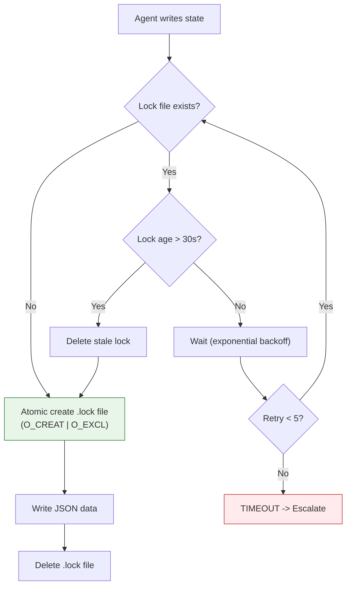
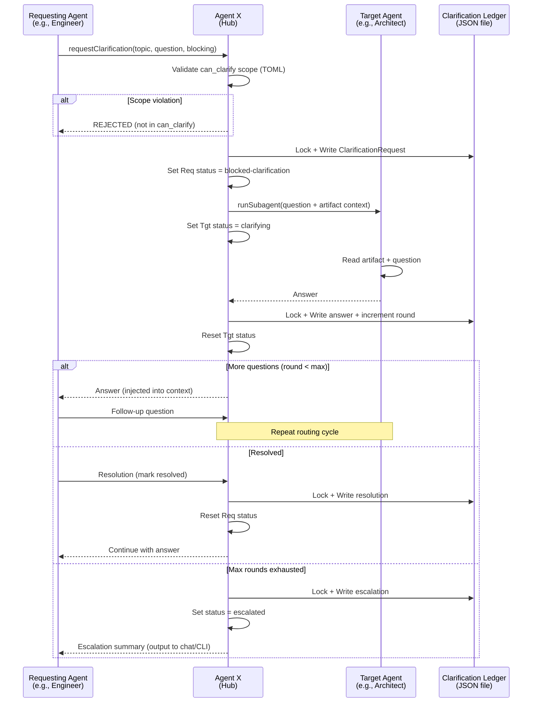
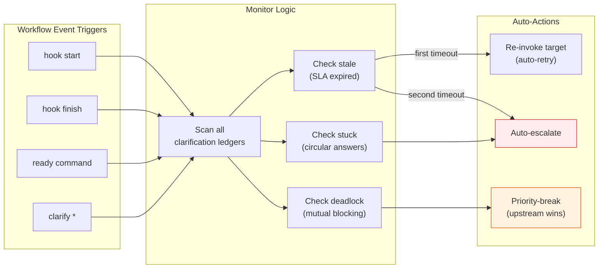
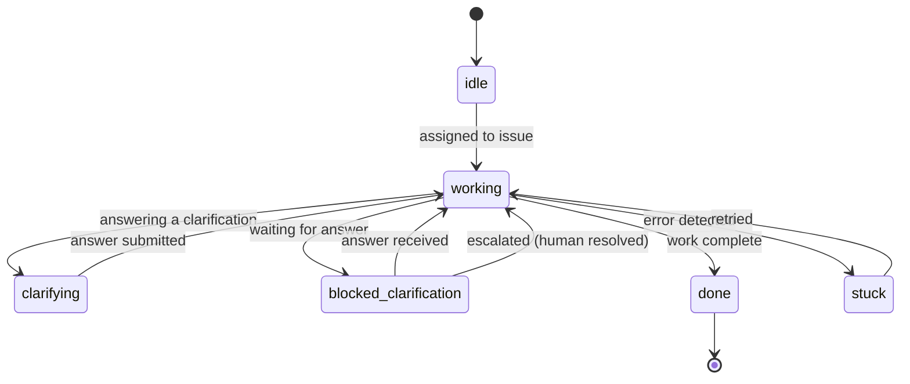
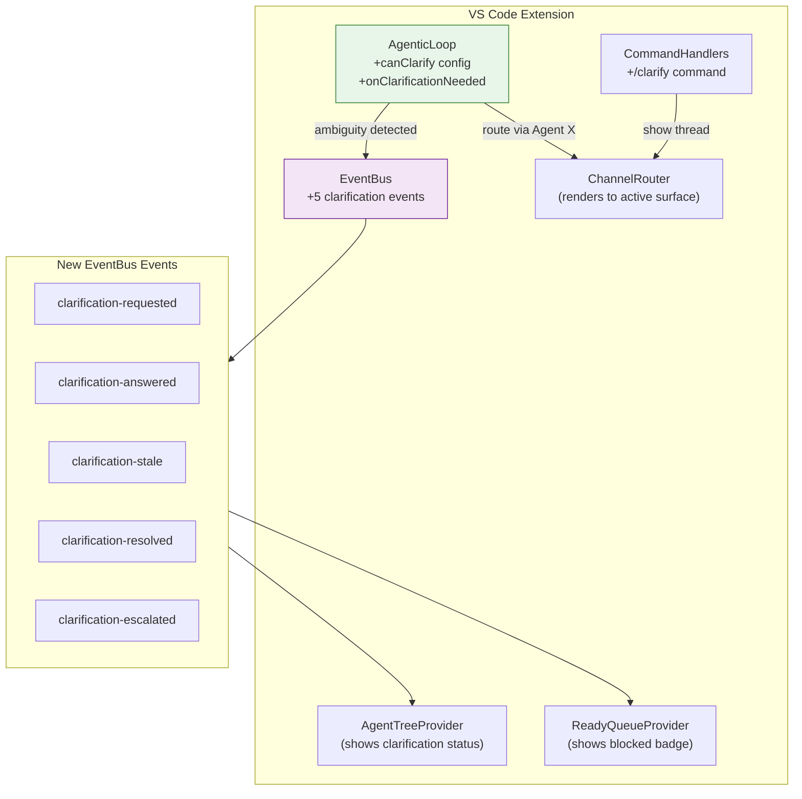

# ADR-1: Agent-to-Agent Clarification Protocol

**Status**: Accepted
**Date**: 2026-02-26
**Author**: Solution Architect Agent
**Epic**: #1
**Issue**: #1
**PRD**: [PRD-9.md](../prd/PRD-9.md)

---

## Table of Contents

1. [Context](#context)
2. [Decision](#decision)
3. [Options Considered](#options-considered)
4. [Rationale](#rationale)
5. [Consequences](#consequences)
6. [Implementation](#implementation)
7. [References](#references)
8. [Review History](#review-history)

---

## Context

AgentX uses a strictly unidirectional handoff pipeline (PM -> UX/Architect -> Engineer -> Reviewer). When a downstream agent encounters ambiguity in an upstream artifact -- an unclear requirement, a questionable design decision, or a missing constraint -- it has no mechanism to seek clarification. The agent either guesses (producing incorrect output) or builds on assumptions that compound into incorrect implementations discovered late in review.

**Requirements (from PRD-9):**
- Agents must be able to request clarification from specific upstream agents
- All communication must route through Agent X (hub-and-spoke preserved)
- Maximum 5 blocking rounds, 6 non-blocking rounds before auto-escalation
- Clarification conversations must be visible inline in Copilot Chat and CLI
- Must work identically in Local Mode (JSON files) and GitHub Mode
- Multiple agents or CLI sessions writing simultaneously must not corrupt state
- Stale, stuck, and deadlocked clarifications must be detected automatically
- No background daemons -- monitoring must be event-driven

**Constraints:**
- File-based only (JSON) -- no database, no external services
- PowerShell 7+ for CLI, TypeScript for VS Code extension
- ASCII-only source files per repository rules
- No UI buttons or panels -- conversation stream is the only interface
- Must integrate with existing TOML workflow definitions, EventBus, and AgenticLoop

**Background:**
The existing codebase has no file locking on JSON state writes (`Read-JsonFile`/`Write-JsonFile` are raw read/write). The TOML parser is a simple line-by-line regex parser that needs extension for new fields. The EventBus supports 11 typed events that tree views and chat subscribe to. The AgenticLoop orchestrates LLM-tool cycles and can be extended via `AgenticLoopConfig`.

---

## Decision

We will implement a **Hub-Routed Clarification Protocol** with file-level locking, per-issue clarification ledgers, and conversation-as-interface rendering.

**Key architectural choices:**

1. **Hub-routed, not direct**: All clarification requests go through Agent X, which validates scope, routes via `runSubagent`, and manages state. Agents never communicate directly.
2. **File-level locking with `.lock` files**: Atomic lock acquisition using `O_CREAT | O_EXCL` semantics, stale lock cleanup at 30 seconds, exponential backoff retry.
3. **Per-issue clarification ledger**: One JSON file per issue at `.agentx/state/clarifications/issue-{n}.json` -- avoids single-file bottleneck.
4. **Event-driven monitoring**: No daemon or cron. Monitor logic runs as side-effect of `hook start`, `hook finish`, `ready`, and `clarify` commands.
5. **Conversation-as-interface**: Clarification rounds stream inline in Copilot Chat (`response.markdown()`) and print as terminal output in CLI. No buttons, panels, or separate views.
6. **TOML-declared scope**: `can_clarify`, `clarify_max_rounds`, `clarify_sla_minutes`, `clarify_blocking_allowed` fields on workflow steps control what each agent can do.
7. **In-process AsyncMutex**: TypeScript extension uses an in-process mutex in addition to file locks, since multiple async operations can run in the same Node.js process.

---

## Options Considered

### Option 1: Hub-Routed Clarification Protocol (Selected)

**Description:**
Agent X mediates all clarification requests. Requesting agent creates a ClarificationRequest; Agent X validates scope against TOML `can_clarify` list, invokes target agent via `runSubagent`, writes answer to per-issue ledger file, and returns the answer to the requesting agent. File-level `.lock` files prevent concurrent corruption.

**Pros:**
- Preserves hub-and-spoke architecture -- no agent-to-agent coupling
- Per-issue files eliminate single-file bottleneck under concurrent load
- File locking is simple, proven, and works across processes (VS Code + CLI)
- TOML-declared scope makes behavior configurable per workflow without code changes
- Audit trail naturally captured in ledger JSON

**Cons:**
- File locking adds complexity (stale detection, retry logic) in two languages
- Extra round-trip latency per clarification (routing through Agent X)
- Each clarification round costs one additional LLM call

**Effort**: L
**Risk**: Low

---

### Option 2: Shared Scratchpad (Agent Writes, Agent Reads)

**Description:**
Agents write questions to a shared Markdown file (`docs/clarifications/CLR-{issue}.md`). Upstream agents check the file at session start and append answers. No real-time routing.

**Pros:**
- Extremely simple -- no routing logic, no locking needed for append
- Human-readable Markdown audit trail
- No changes to AgenticLoop or EventBus

**Cons:**
- No real-time response -- agents must be re-invoked to check for answers
- No guarantee the upstream agent will ever run again to see the question
- No escalation path -- questions can sit unanswered indefinitely
- Breaks the automated pipeline (requires manual re-triggering)

**Effort**: S
**Risk**: High

---

### Option 3: Discussion Thread with Direct Agent Communication

**Description:**
Agents communicate directly via a shared message queue (in-memory or file-based). Either agent can initiate a conversation at any time, with a mediator thread tracking state.

**Pros:**
- Most flexible -- any agent can talk to any other agent
- Enables multi-party discussions

**Cons:**
- Breaks hub-and-spoke architecture fundamentally
- Complex state management (who's talking to whom, ordering, conflicts)
- Scope creep risk -- agents debating endlessly without resolution
- Harder to enforce round limits and escalation

**Effort**: XL
**Risk**: High

---

## Rationale

We chose **Option 1 (Hub-Routed Clarification Protocol)** because:

1. **Architecture preservation**: The hub-and-spoke pattern is foundational to AgentX. Agent X already handles routing, status tracking, and validation. Adding clarification as another routing capability is natural and low-risk, whereas direct communication (Option 3) would require fundamental redesign.

2. **Deterministic behavior**: Hub routing with TOML-declared scope (`can_clarify`) makes clarification behavior predictable and auditable. Every clarification request is validated, logged, and bounded by round limits. Option 2's passive polling has no guarantees.

3. **File locking is proven**: OS-level atomic file creation (`O_CREAT | O_EXCL`) is a well-understood concurrency primitive. The 30-second stale threshold handles crashed processes. Per-issue files keep the lock contention window narrow (two agents rarely work on the same issue simultaneously).

4. **No infrastructure**: File-based locking and JSON ledgers work in Local Mode with zero dependencies. No database, no message queue, no external service. This matches the AgentX philosophy of local-first operation.

**Key decision factors:**
- Hub-and-spoke must not be broken (eliminates Option 3)
- Must work in automated pipeline (eliminates Option 2)
- Must work in Local Mode without external services (favors file-based approach)
- Must support concurrent access from multiple VS Code windows + CLI (requires locking)

---

## Consequences

### Positive
- Agents can resolve ambiguity before producing incorrect output, reducing rework
- All clarification conversations are automatically logged as audit trails
- Escalation is automatic -- humans only intervene for genuine deadlocks
- Works identically in Local Mode and GitHub Mode
- Extension points (EventBus events, LoopConfig callbacks) enable future UI enhancements

### Negative
- File locking adds implementation complexity in both PowerShell and TypeScript
- Each clarification round adds latency (LLM call + file I/O + routing)
- TOML parser needs extension to handle new array and boolean fields
- More LLM token consumption per issue (bounded by round limits: max 5-6 additional calls)

### Neutral
- New dependency on `.lock` files (listed in `.gitignore`, auto-cleaned)
- New agent statuses (`clarifying`, `blocked-clarification`) require sidebar view updates
- Clarification ledger files grow linearly per issue (bounded by round limits, self-cleaning)

---

## Implementation

**Detailed technical specification**: [SPEC-1.md](../specs/SPEC-1.md)

**High-level implementation plan:**

1. **Phase 1 (Foundation)**: File locking (PowerShell `Lock-JsonFile`/`Unlock-JsonFile` + TypeScript `JsonFileLock`), clarification ledger schema, agent status extensions
2. **Phase 2 (Core Protocol)**: Agent X routing logic, `runSubagent` invocation for target agent, chat/CLI streaming, round limits + escalation, TOML field parsing
3. **Phase 3 (Monitoring + Extension)**: Stale/stuck/deadlock detection, EventBus events, AgenticLoop integration, sidebar view updates
4. **Phase 4 (Polish)**: Weekly digest stats, GitHub issue sync, `/clarify` slash command

**Key milestones:**
- Phase 1 (Week 1-2): File locking tested with concurrent access; ledger schema validated
- Phase 2 (Week 3-4): End-to-end clarification working in both Local and GitHub modes
- Phase 3 (Week 5-6): Monitoring catches stale/stuck; extension integration complete
- Phase 4 (Week 7): Analytics and GitHub sync; all P0/P1 stories complete

---

## Critical Architecture Decisions

### Decision 1: File Locking Strategy



**Why file-level locking over alternatives:**

| Alternative | Why Not |
|---|---|
| Database locking | Requires external dependency; violates local-first |
| Named mutexes (OS) | Not cross-platform PowerShell + Node.js |
| Advisory file locking (`flock`) | Not available on Windows PowerShell |
| Single global lock file | Contention bottleneck; per-issue is better |

**Lock file format:**
```
.agentx/state/clarifications/issue-42.json      <-- data
.agentx/state/clarifications/issue-42.json.lock  <-- lock
```

Lock file content includes PID, timestamp, and agent name for diagnostics:
```json
{ "pid": 12345, "timestamp": "2026-02-26T10:00:00.123Z", "agent": "engineer" }
```

### Decision 2: Clarification Routing Flow



### Decision 3: Monitoring Architecture (Event-Driven, No Daemon)



**Why no daemon:**
- Local Mode must work without background services
- CLI hooks (`hook start`/`hook finish`) already run at every workflow boundary
- Extension `TaskScheduler` can optionally add periodic checks for enhanced monitoring
- Avoids process management complexity (orphans, startup, shutdown)

### Decision 4: Agent Status State Machine



**Two new statuses:**
- `clarifying`: Agent is composing an answer to a clarification request
- `blocked-clarification`: Agent is waiting for an answer (cannot proceed)

These are distinct from `working` and `stuck` because they indicate a specific, recoverable state related to the clarification protocol. The sidebar tree and CLI output display different icons/labels for these states.

### Decision 5: Conversation-as-Interface

```mermaid
graph TD
    subgraph Chat["Copilot Chat (response.markdown)"]
        direction TB
        C1["[Engineer] Implementing..."]
        C2["[Engineer -> Architect] Clarification needed:<br/>question text"]
        C3["[Routing to Architect automatically...]"]
        C4["[Architect] answer text"]
        C5["[Engineer] Clarification resolved. Continuing..."]
    end

    subgraph CLI["Terminal (agentx clarify --issue N)"]
        direction TB
        T1["[Round 1] engineer -> architect (timestamp)"]
        T2["  Q: question text"]
        T3["[Round 1] architect -> engineer (timestamp)"]
        T4["  A: answer text"]
        T5["[RESOLVED] engineer (timestamp)"]
    end

    style Chat fill:#E3F2FD,stroke:#1565C0
    style CLI fill:#E8F5E9,stroke:#2E7D32
```



**Why no buttons/panels:**
- Clarification is a transient conversation, not persistent UI state
- Buttons create click fatigue and break the flow of watching agents work
- Escalation is automatic (max rounds) -- no human button needed
- The same rendering works across all channels (chat, CLI, GitHub comments)

### Decision 6: Extension Integration Points



**LoopConfig extension:**
```
AgenticLoopConfig (existing)
  + canClarify: string[]        // agents this loop can clarify with
  + clarifyMaxRounds: number    // max rounds (default 5)
  + onClarificationNeeded:      // callback when ambiguity detected
      (topic, question) => Promise<ClarificationResult>
```

When the LLM signals ambiguity (e.g., via a `requestClarification` tool call), the loop pauses, invokes the callback, streams the round to `response.markdown()`, and resumes with the answer injected into context.

---

## References

### Internal
- [PRD-9: Agent-to-Agent Clarification Protocol](../prd/PRD-9.md)
- [Agent Delegation Protocol](../../.github/agent-delegation.md)
- [Feature Workflow TOML](../../.agentx/workflows/feature.toml)
- [EventBus](../../vscode-extension/src/utils/eventBus.ts)
- [AgenticLoop](../../vscode-extension/src/agentic/agenticLoop.ts)
- [ChannelRouter](../../vscode-extension/src/utils/channelRouter.ts)
- [CommandHandlers](../../vscode-extension/src/chat/commandHandlers.ts)
- [AgentX CLI](../../.agentx/agentx-cli.ps1)

### External
- File locking with `O_CREAT | O_EXCL`: POSIX standard atomic file creation
- Node.js `fs.open` with `wx` flag: equivalent to `O_CREAT | O_EXCL`
- PowerShell `[System.IO.File]::Open` with `FileMode.CreateNew`: equivalent semantics

---

## Review History

| Date | Reviewer | Status | Notes |
|------|----------|--------|-------|
| 2026-02-26 | Solution Architect Agent | Accepted | Initial architecture |

---

**Author**: Solution Architect Agent
**Last Updated**: 2026-02-26
**Version**: 1.0
