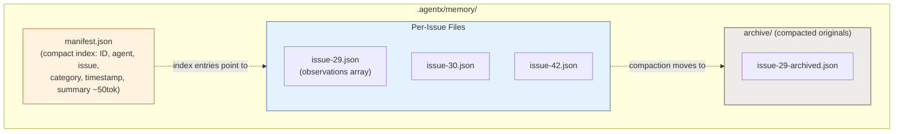
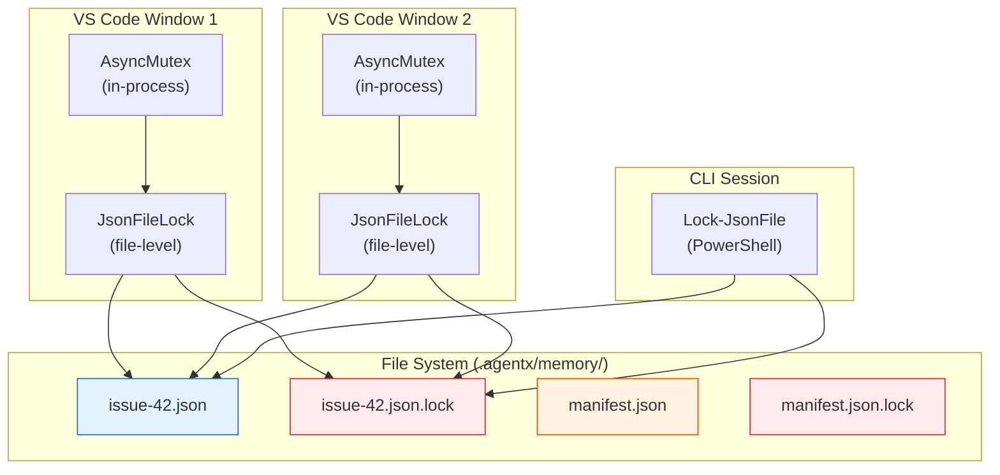
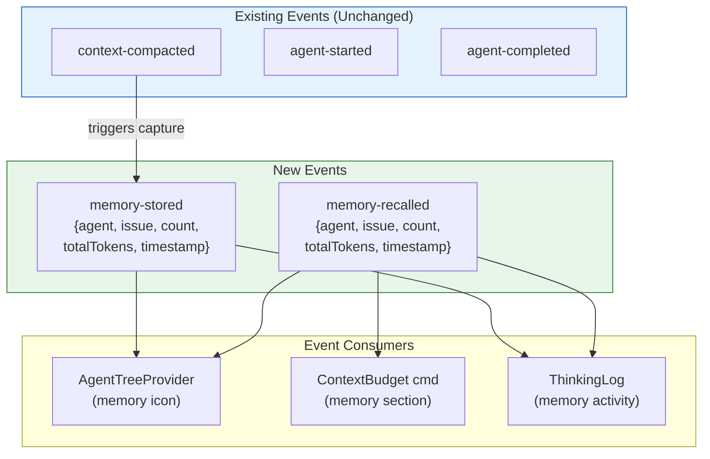
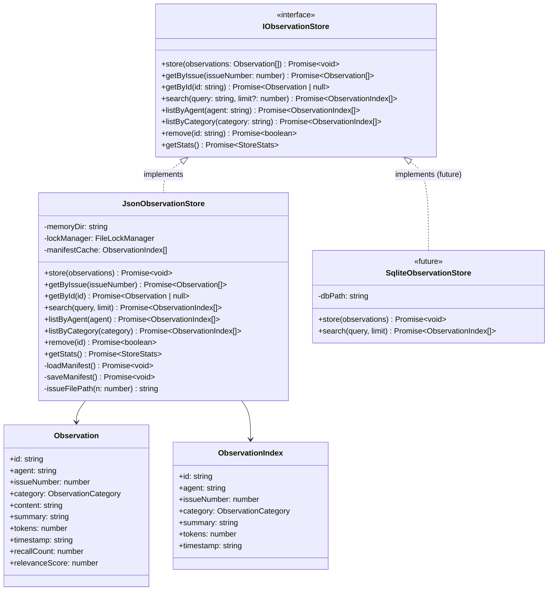

# ADR-29: Persistent Agent Memory Pipeline

**Status**: Accepted
**Date**: 2026-02-27
**Author**: Solution Architect Agent
**Epic**: #29
**Issue**: #29
**PRD**: [PRD-29.md](../prd/PRD-29.md)

---

## Table of Contents

1. [Context](#context)
2. [Decision](#decision)
3. [Options Considered](#options-considered)
4. [Rationale](#rationale)
5. [Consequences](#consequences)
6. [Implementation](#implementation)
7. [References](#references)
8. [Review History](#review-history)

---

## Context

AgentX's `ContextCompactor` provides in-session token budget tracking and regex-based conversation summarization. However, all agent knowledge is lost at session boundaries. When a new session starts, agents re-read files, re-parse history, and re-discover patterns they already identified -- wasting 30-60% of the context window on redundant priming. There is no persistent observation store, no layered retrieval, no automatic session-start injection, and no searchable history across sessions.

**Requirements (from PRD-29):**
- Automatically capture agent observations (decisions, code changes, errors, key facts) at session end
- Persist observations in a local, file-based store at `.agentx/memory/`
- Inject relevant past observations at session start within a configurable token budget
- Provide full-text search over all observations (<200ms for 10K records)
- Support progressive disclosure: compact index first, full detail on demand
- Wire capture/injection into existing lifecycle hooks (no manual steps)
- Extend context budget report to include recalled memory
- Support relevance scoring and periodic compaction (Phase 3)

**Constraints:**
- Local file storage only -- no external database server, no cloud
- No additional runtime dependencies beyond Node.js (prefer built-in `fs` + JSON)
- Must integrate with existing `ContextCompactor`, `AgentEventBus`, `SessionManager`, and `FileLockManager`
- Must work in both `github` and `local` modes
- Store format must be human-readable (no opaque binary blobs)
- ASCII-only in all source files per repository rules

**Background:**
The existing codebase provides several building blocks:
- `ContextCompactor` (contextCompactor.ts): Budget tracking, `compactConversation()` regex extraction, `trackItem()` with `memory` category already defined
- `AgentEventBus` (eventBus.ts): Typed event system with 16 events, `context-compacted` event already emits compaction summaries
- `SessionManager` + `FileSessionStorage` (sessionState.ts): Persists full session conversations to `.agentx/sessions/` as JSON; `AgenticLoop` calls `save()` at exit
- `FileLockManager` (fileLock.ts): Combined AsyncMutex + JsonFileLock for concurrent-safe JSON file writes
- Lifecycle hooks: `.agentx/agentx.ps1 hook -Phase start|finish` runs at every workflow boundary

The gap is a storage + retrieval layer that bridges session boundaries.

---

## Decision

We will implement a **Per-Issue JSON Observation Store with In-Memory Inverted Index** that integrates into the existing session lifecycle via EventBus subscriptions and lifecycle hook extensions.

**Key architectural choices:**

1. **Per-issue JSON files**: Observations stored in `.agentx/memory/issue-{n}.json` -- one file per issue. Matches the per-issue pattern from clarification ledgers (ADR-1), keeps files small, and allows partial loading.
2. **Global manifest for fast search**: A manifest file `.agentx/memory/manifest.json` contains a compact index (ID, agent, issue, category, timestamp, summary) for all observations. Enables <200ms search without loading all issue files.
3. **EventBus-driven capture**: Subscribe to `context-compacted` events to capture observations automatically when `compactConversation()` runs at session end. No hook script modifications needed for v1.
4. **ContextCompactor integration for injection**: Recalled observations are tracked as `memory` category items in `ContextCompactor`, enforcing a configurable memory token budget (default 10% of context limit = 20,000 tokens).
5. **FileLockManager for concurrent safety**: All writes to observation files and the manifest go through the existing `FileLockManager` -- dual-guard (AsyncMutex + JsonFileLock) ensures safety across VS Code windows and CLI sessions.
6. **Regex extraction reuse**: Leverage `ContextCompactor.compactConversation()` existing regex extractors (decisions, file changes, errors, key facts) as the observation producer. No new extraction logic needed for v1.

---

## Options Considered

### Option 1: Per-Issue JSON + In-Memory Manifest (Selected)

**Description:**
One JSON file per issue at `.agentx/memory/issue-{n}.json` containing an array of observations. A global manifest file at `.agentx/memory/manifest.json` holds a compact index entry (~50 tokens) per observation for fast search. The manifest is loaded into memory on first access and kept in sync on writes.

**Pros:**
- Matches the per-issue file pattern established in ADR-1 (clarification ledgers)
- Small files: typically 10-50 observations per issue, ~2-10KB each
- Partial loading: only load relevant issue(s) for injection
- Manifest enables fast FTS without loading all files
- Human-readable JSON, inspectable with any text editor
- Zero external dependencies (Node.js `fs` + JSON.parse)
- FileLockManager already tested for this exact pattern

**Cons:**
- Manifest must stay in sync with issue files (dual-write)
- Full-text search is in-memory (loads manifest ~500KB for 10K records)
- No built-in FTS ranking (must implement simple TF/keyword scoring)

**Effort**: M
**Risk**: Low

---

### Option 2: Single Append-Only JSON File

**Description:**
All observations in one file `.agentx/memory/observations.json` -- an ever-growing JSON array. Search is performed by loading and scanning the entire file.

**Pros:**
- Simplest possible implementation (single file, single lock)
- No manifest synchronization needed
- Trivial backup (one file)

**Cons:**
- File grows unbounded: 50K observations at 200 words each = ~40MB JSON file
- Every search loads entire file into memory (40MB parse at 50K records)
- Lock contention: every write locks the same file
- JSON.parse on 40MB blocks the event loop for ~200-500ms
- No partial loading possible

**Effort**: S
**Risk**: High (performance degrades rapidly beyond 5K observations)

---

### Option 3: SQLite via better-sqlite3

**Description:**
Use `better-sqlite3` (synchronous, bundled native addon) for a proper database with FTS5 full-text search. Store at `.agentx/memory/memory.db`.

**Pros:**
- FTS5 provides fast, ranked full-text search out of the box
- Handles 50K+ records with consistent performance
- ACID transactions -- no manual locking needed
- Mature, well-tested technology

**Cons:**
- Adds a native Node.js dependency (`better-sqlite3` requires node-gyp or prebuild)
- Binary DB file is not human-readable (requires `sqlite3` CLI to inspect)
- Cross-platform build issues on Windows ARM, Alpine Linux
- Increases extension size (~5MB for prebuild binaries)
- Cannot reuse existing FileLockManager (different concurrency model)
- Breaks the "no additional runtime dependencies" constraint

**Effort**: M
**Risk**: Medium (native dependency management, platform compatibility)

---

### Option 4: LevelDB / IndexedDB-like Key-Value Store

**Description:**
Use `level` (LevelDB wrapper) or a similar embedded key-value store with secondary indexes for search.

**Pros:**
- Fast reads/writes with LSM-tree architecture
- No SQL needed -- simple get/put/range queries
- Available as pure JS implementation (`classic-level`)

**Cons:**
- Not human-readable (binary LSM files)
- No built-in FTS (must build inverted index manually anyway)
- Adds a dependency (~2MB)
- Less familiar to team than JSON
- Overkill for the data volume (JSON handles 50K records fine)

**Effort**: M
**Risk**: Medium (additional complexity for marginal benefit at our scale)

---

## Rationale

We chose **Option 1 (Per-Issue JSON + In-Memory Manifest)** because:

1. **Zero dependencies**: The PRD explicitly constrains the implementation to "prefer built-in `fs` + JSON." Options 3 and 4 add native/binary dependencies that complicate cross-platform distribution and increase extension size.

2. **Pattern consistency**: Per-issue JSON files with FileLockManager are the established pattern in AgentX (clarification ledgers in ADR-1). Reusing the same architecture reduces cognitive load and leverages tested infrastructure.

3. **Sufficient at scale**: The manifest file for 10K observations is ~500KB (~50 tokens x 4 chars x 10K = 200KB of content + JSON overhead). Loading and searching this in memory easily meets the <200ms target. Even at 50K observations (~2.5MB manifest), in-memory search is sub-200ms on modern hardware.

4. **Human-readable**: JSON files can be inspected, debugged, and manually edited. This aligns with AgentX's local-first philosophy and is critical for developer trust in the memory system.

5. **Migration path**: If performance degrades beyond 50K observations, the `ObservationStore` interface can be swapped to a SQLite backend without changing any consumer code. The architecture is backend-agnostic by design.

**Key decision factors:**
- No native dependencies allowed (eliminates Options 3, 4)
- Pattern consistency with existing codebase (favors per-issue files)
- Performance sufficient for target scale (10K-50K records)
- Human-readability required

---

## Consequences

### Positive
- Agents retain knowledge across sessions -- decisions, errors, code changes persist
- Token savings of 40%+ on multi-session features via memory-informed priming
- Searchable agent history enables audit and debugging of agent behavior
- Zero new dependencies -- uses only existing `fs`, `JSON`, and `FileLockManager`
- Pattern-consistent with ADR-1's per-issue file + lock architecture

### Negative
- Manifest dual-write adds complexity (must stay in sync with issue files)
- In-memory search does not scale beyond ~50K observations without architecture change
- Regex-based extraction (inherited from `compactConversation()`) may miss important observations
- Additional disk I/O at session start (manifest load) and session end (observation write)

### Neutral
- New `.agentx/memory/` directory (gitignored, auto-created)
- Two new EventBus events (`memory-stored`, `memory-recalled`) added to `AgentEventMap`
- `ContextCompactor.trackItem('memory', ...)` already supported (category exists in type)
- ObservationStore interface enables future backend swap (SQLite, vector DB)

---

## Implementation

**Detailed technical specification**: [SPEC-29.md](../specs/SPEC-29.md)

**High-level implementation plan:**

1. **Phase 1 (Foundation -- Weeks 1-2)**: `ObservationStore` class with per-issue JSON storage, manifest management, CRUD + FTS, FileLockManager integration, unit tests
2. **Phase 2 (Integration -- Weeks 3-4)**: EventBus-driven capture (`context-compacted` subscription), session-start injection via `MemoryPipeline`, VS Code commands, extended budget report
3. **Phase 3 (Optimization -- Weeks 5-6)**: Relevance scoring (recency + recall count), observation compaction/summarization, CLI subcommand, performance benchmarks

**Key milestones:**
- Phase 1: ObservationStore passes all CRUD + FTS tests; 10K observation benchmark under 200ms
- Phase 2: End-to-end capture + inject working in extension; memory section visible in budget report
- Phase 3: Relevance scoring improves recall quality; compaction reduces store size by 50%+

---

## Critical Architecture Decisions

### Decision 1: Storage Layout



**Why per-issue files over a single file:**

| Approach | Read (injection) | Write (capture) | Search | Scale |
|----------|-----------------|-----------------|--------|-------|
| Single file | Load all (slow) | Lock all (contention) | Linear scan | Poor >5K |
| Per-issue files | Load 1-2 files (fast) | Lock 1 file (minimal) | Via manifest | Good to 50K |
| SQLite | Fast query | Auto-managed | FTS5 built-in | Excellent |

Per-issue files win on the "no dependency + consistent pattern" axes.

### Decision 2: Capture Pipeline

```mermaid
sequenceDiagram
    participant AL as AgenticLoop
    participant SM as SessionManager
    participant CC as ContextCompactor
    participant EB as AgentEventBus
    participant MP as MemoryPipeline
    participant OS as ObservationStore
    participant FS as File System

    Note over AL: Session ends (text_response / max_iterations)
    AL->>SM: save(sessionId)
    AL->>CC: compactConversation(messages, agentName)
    CC->>CC: Extract decisions, code changes, errors, key facts
    CC->>EB: emit('context-compacted', {summary, agent, tokens})

    EB->>MP: on('context-compacted', callback)
    MP->>MP: Parse summary into individual observations
    MP->>OS: store(observations[])
    OS->>OS: FileLockManager.withSafeLock()
    OS->>FS: Write issue-{n}.json
    OS->>FS: Update manifest.json
    OS->>EB: emit('memory-stored', {count, tokens, issue})

    style MP fill:#F3E5F5,stroke:#6A1B9A
    style OS fill:#E3F2FD,stroke:#1565C0
```

**Why EventBus subscription over lifecycle hook modification:**
- `context-compacted` event already fires when `compactConversation()` runs
- No modification to `agentx.ps1 hook` scripts needed for v1
- Memory pipeline is a passive subscriber -- does not block the session lifecycle
- Future hook integration (Phase 2) can add explicit capture at `hook finish` for CLI sessions where the extension EventBus is not available

### Decision 3: Injection Pipeline

```mermaid
sequenceDiagram
    participant AG as Agent (Session Start)
    participant MP as MemoryPipeline
    participant OS as ObservationStore
    participant RS as RelevanceScorer
    participant CC as ContextCompactor
    participant EB as AgentEventBus

    Note over AG: New session starts
    AG->>MP: injectMemory(agentName, issueNumber)
    MP->>OS: query(agent, issue)
    OS->>OS: Read manifest.json (in-memory)
    OS-->>MP: ObservationIndex[] (matching entries)

    MP->>RS: score(observations, context)
    RS->>RS: Compute recency + recall count + keyword overlap
    RS-->>MP: Scored + sorted observations

    MP->>MP: Select top-k within memory token budget
    MP->>OS: getFullObservations(selectedIds)
    OS->>OS: Read issue-{n}.json files
    OS-->>MP: Full observation content

    MP->>MP: Format as "Memory Recall" section
    MP->>CC: trackItem('memory', 'recalled-observations', formattedContent)
    MP->>EB: emit('memory-recalled', {count, tokens, agent, issue})

    MP-->>AG: Formatted recall section (inject into system prompt)

    style MP fill:#F3E5F5,stroke:#6A1B9A
    style RS fill:#FFF3E0,stroke:#E65100
```

**Two-phase retrieval (progressive disclosure):**
1. **Index phase**: Read manifest only (~50 tokens per entry). Filter by agent + issue. Score and rank.
2. **Detail phase**: Load full observations only for top-k selected entries. This saves loading all issue files when only a few observations are relevant.

This matches the PRD's progressive disclosure requirement and keeps token cost predictable.

### Decision 4: Concurrency Model



**Write ordering:** When storing observations, both the issue file and manifest must be updated. The pipeline acquires locks in a fixed order (issue file first, then manifest) to prevent deadlocks. In practice, contention is extremely rare -- two agents rarely capture observations for the same issue simultaneously.

### Decision 5: EventBus Extensions



Two new events are additive-only changes to `AgentEventMap`. No existing events or consumers are modified.

### Decision 6: ObservationStore Interface (Backend-Agnostic)



The `IObservationStore` interface enables swapping `JsonObservationStore` for `SqliteObservationStore` in the future without changing any consumer code. All memory pipeline logic depends solely on the interface.

---

## References

### Internal
- [PRD-29: Persistent Agent Memory Pipeline](../prd/PRD-29.md)
- [ADR-1: Agent-to-Agent Clarification Protocol](ADR-1.md) (established per-issue JSON + FileLock pattern)
- [SPEC-29: Technical Specification](../specs/SPEC-29.md)
- [ARCH-29: Architecture Document](../architecture/ARCH-29.md)
- [ContextCompactor](../../vscode-extension/src/utils/contextCompactor.ts)
- [AgentEventBus](../../vscode-extension/src/utils/eventBus.ts)
- [SessionManager](../../vscode-extension/src/agentic/sessionState.ts)
- [AgenticLoop](../../vscode-extension/src/agentic/agenticLoop.ts)
- [FileLockManager](../../vscode-extension/src/utils/fileLock.ts)

### External
- Node.js `fs.open` with `wx` flag: atomic file creation (O_CREAT | O_EXCL semantics)
- JSON.parse performance: ~100MB/s on V8, ~200ms for 20MB file

---

## Review History

| Date | Reviewer | Status | Notes |
|------|----------|--------|-------|
| 2026-02-27 | Solution Architect Agent | Accepted | Initial architecture |

---

**Author**: Solution Architect Agent
**Last Updated**: 2026-02-27
**Version**: 1.0
