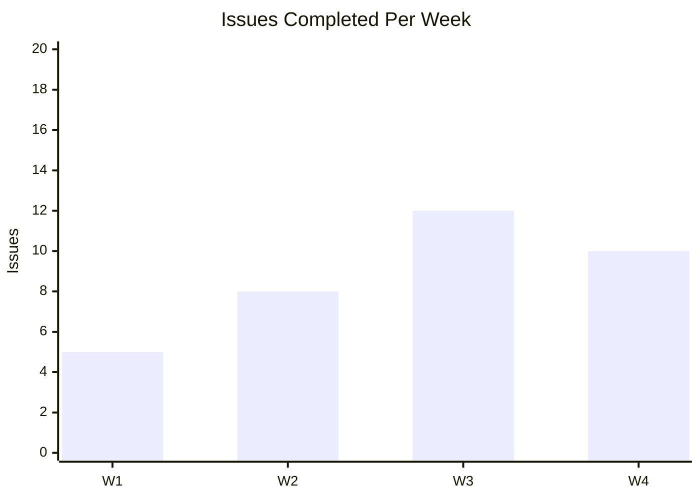
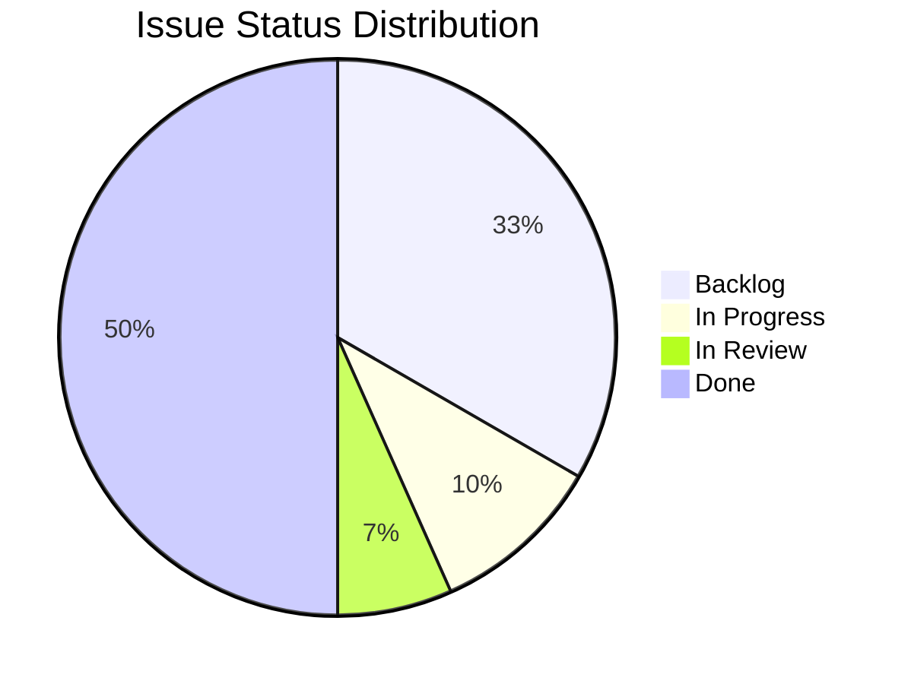

# Agent Analytics

> **Purpose**: Track agent performance, workflow efficiency, and identify bottlenecks.  
> **Issue**: #119  

---

## Metrics

### Handoff Time

Time between agent transitions (measured from progress logs).

| Transition | Target | Alert If |
|------------|--------|----------|
| PM → Architect | < 2 hrs | > 4 hrs |
| PM → UX | < 2 hrs | > 4 hrs |
| Architect → Engineer | < 1 hr | > 3 hrs |
| Engineer → Reviewer | < 4 hrs | > 8 hrs |
| Reviewer → Done | < 2 hrs | > 4 hrs |

### Issue Throughput

| Metric | How to Measure |
|--------|----------------|
| Issues completed/week | Count issues moved to Done |
| Average cycle time | Created → Done duration |
| WIP (Work in Progress) | Issues in In Progress status |

### Rework Rate

| Metric | Formula |
|--------|---------|
| Rework Rate | Issues with `needs:changes` / Total reviewed |
| Target | < 20% |
| Alert | > 30% |

### Token Consumption

Tracked per session from progress logs.

| Metric | Source |
|--------|--------|
| Tokens per session | Progress log session count |
| Sessions per issue | Total sessions in log |
| Avg sessions to complete | Mean across all issues |

---

## Data Collection

### From Progress Logs

Progress logs at `docs/progress/ISSUE-{id}-log.md` contain:
- Session timestamps
- Agent role per session  
- What was accomplished
- Blockers encountered

### From Git History

```bash
# Issues completed this week
git log --since="7 days ago" --oneline --grep="closes\|fixes\|resolves" | wc -l

# Commits per issue
git log --oneline --grep="#123" | wc -l

# Active contributors
git log --since="7 days ago" --format="%aN" | sort -u
```

### From GitHub Issues

```bash
# Issues closed this week
gh issue list --state closed --json closedAt,number,title \
  --jq '.[] | select(.closedAt > "2026-01-31")'

# Issues with rework
gh issue list --label "needs:changes" --state all --json number,title

# Average time in review
gh issue list --state closed --json number,createdAt,closedAt
```

---

## Weekly Report Template

```markdown
# AgentX Weekly Report - Week of YYYY-MM-DD

## Summary
- **Issues Completed**: X
- **Average Cycle Time**: X hours
- **Rework Rate**: X%
- **Active WIP**: X issues

## Throughput
| Status | Count |
|--------|-------|
| Completed | X |
| In Review | X |
| In Progress | X |
| Backlog | X |

## Bottlenecks
- [Describe any slowdowns]

## Handoff Times (Average)
| Transition | This Week | Target |
|------------|-----------|--------|
| PM → Arch | X hrs | < 2 hrs |
| Arch → Eng | X hrs | < 1 hr |
| Eng → Rev | X hrs | < 4 hrs |
| Rev → Done | X hrs | < 2 hrs |

## Rework
| Issue | Rework Count | Reason |
|-------|-------------|--------|
| #X | 1 | Missing tests |

## Actions
- [What to improve next week]
```

---

## Visualization

### Throughput Chart (Mermaid)



### Workflow Funnel (Mermaid)



### Agent Activity (Mermaid)

```mermaid
gantt
    title Agent Activity Timeline
    dateFormat  HH:mm
    section PM
    PRD #118           :done, pm1, 09:00, 2h
    section Architect
    ADR #118           :done, arch1, 11:00, 1h
    section Engineer
    Implement #118     :active, eng1, 12:00, 4h
    section Reviewer
    Review #118        :rev1, 16:00, 2h
```



---

## Grafana Export

Export metrics as JSON for Grafana dashboards:

```json
{
  "week": "2026-02-07",
  "issues_completed": 10,
  "avg_cycle_time_hours": 12.5,
  "rework_rate": 0.15,
  "handoff_times": {
    "pm_to_architect": 1.5,
    "architect_to_engineer": 0.8,
    "engineer_to_reviewer": 3.2,
    "reviewer_to_done": 1.1
  },
  "token_usage": {
    "total_sessions": 25,
    "avg_sessions_per_issue": 2.5
  }
}
```

---

## Scripts

### Collect Metrics

```powershell
# Run weekly
.\.github\scripts\collect-metrics.ps1

# Output: docs/analytics/report-YYYY-MM-DD.md
```

See `.github/scripts/collect-metrics.ps1` for the collection script.

---

**Related**: [Session Persistence](../../session-persistence.md) • [AGENTS.md](../../../AGENTS.md)

**Last Updated**: February 7, 2026
