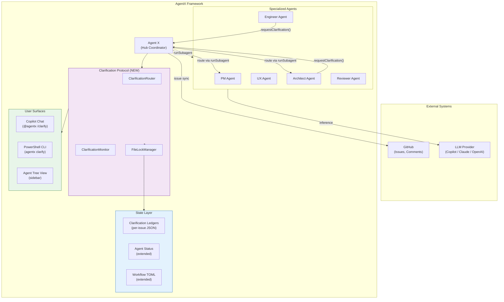
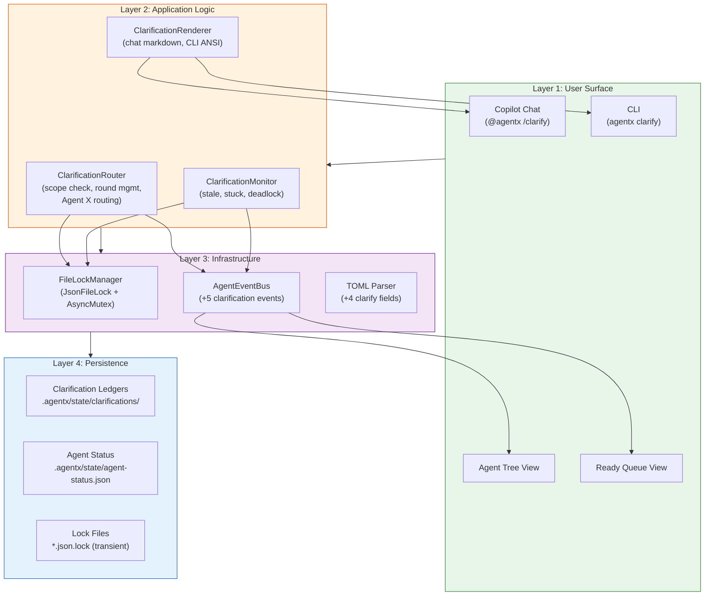
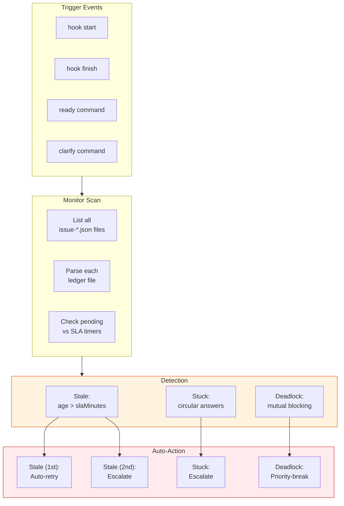
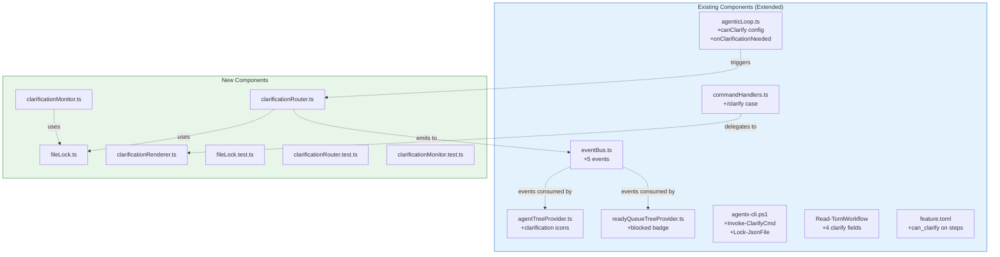
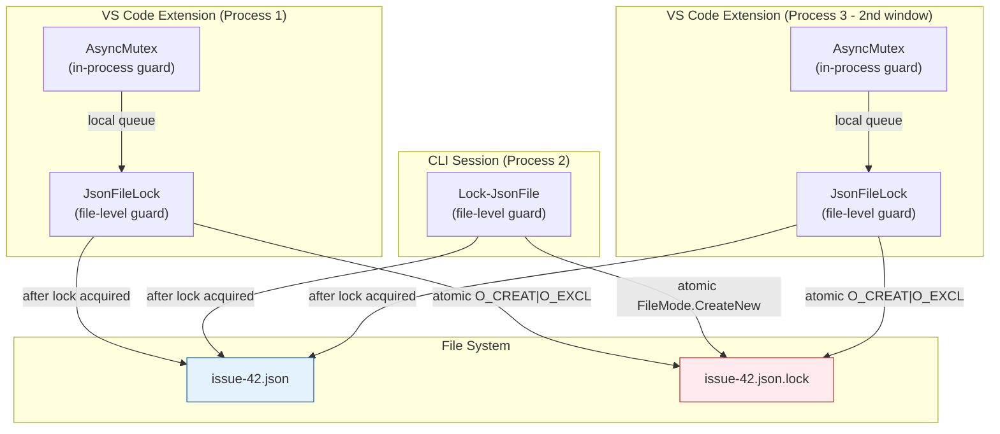
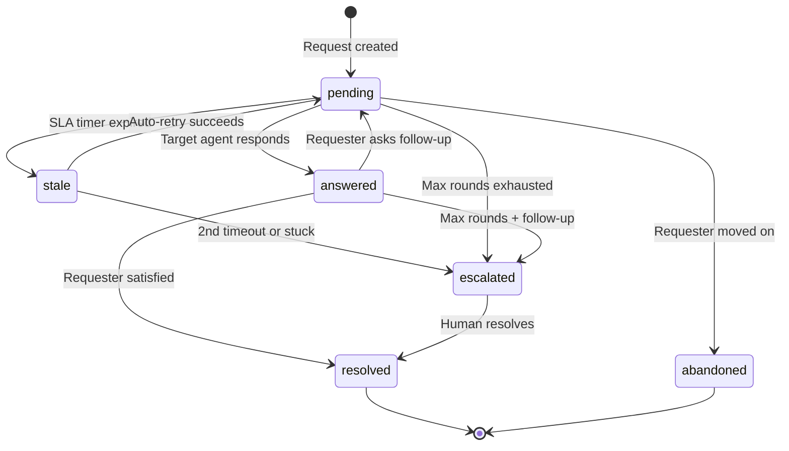
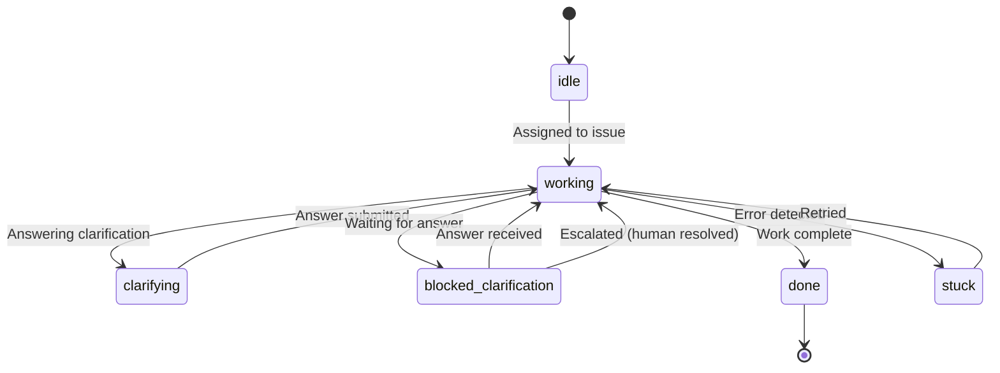
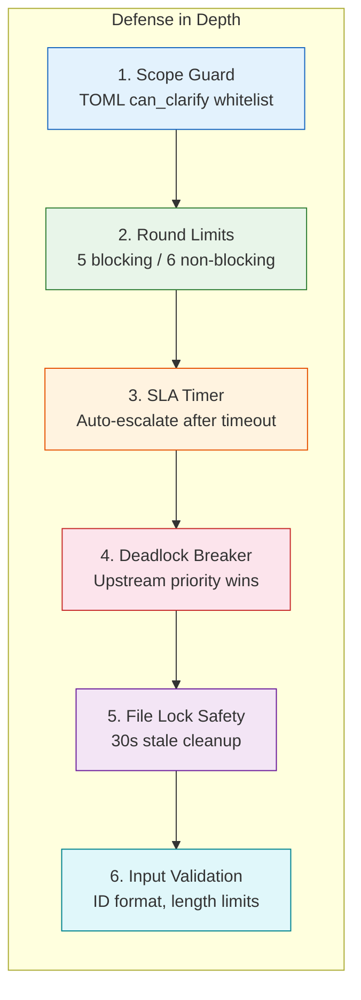

# Architecture: Agent-to-Agent Clarification Protocol

**Epic**: #1
**Date**: 2026-02-26
**Author**: Solution Architect Agent
**Related**: [ADR-1](../adr/ADR-1.md) | [SPEC-1](../specs/SPEC-1.md) | [PRD-9](../prd/PRD-9.md)

---

## 1. System Context

The Clarification Protocol extends AgentX's existing hub-and-spoke architecture with a bidirectional communication layer. Agent X remains the sole coordinator -- agents never communicate directly.



---

## 2. Component Architecture

### 2.1 Layer Diagram



### 2.2 Component Responsibility Matrix

| Component | Layer | Language | Responsibility |
|-----------|-------|----------|----------------|
| ClarificationRouter | Application | TS + PS | Scope validation, round management, Agent X routing |
| ClarificationMonitor | Application | TS + PS | Stale/stuck/deadlock detection, auto-retry, priority-break |
| ClarificationRenderer | Application | TS + PS | Format output for chat markdown and CLI ANSI |
| FileLockManager | Infrastructure | TS | JsonFileLock (file) + AsyncMutex (in-process) |
| Lock-JsonFile / Unlock-JsonFile | Infrastructure | PS | File locking for CLI operations |
| AgentEventBus (+5 events) | Infrastructure | TS | Lifecycle event dispatch for UI refresh |
| TOML Parser (+4 fields) | Infrastructure | PS | Read clarification config from workflow steps |
| Clarification Ledgers | Persistence | JSON | Per-issue clarification state |
| Agent Status (extended) | Persistence | JSON | Agent status with clarification fields |

---

## 3. Data Flow

### 3.1 Clarification Request Flow

```mermaid
graph LR
    subgraph Request["1. Request"]
        A1["Agent detects<br/>ambiguity"]
        A2["Creates<br/>ClarificationRequest"]
    end

    subgraph Validate["2. Validate"]
        B1["Agent X checks<br/>TOML can_clarify"]
        B2["Checks round<br/>limit"]
    end

    subgraph Lock["3. Lock + Write"]
        C1["Acquire .lock"]
        C2["Write ledger"]
        C3["Release .lock"]
    end

    subgraph Route["4. Route"]
        D1["runSubagent<br/>(target agent)"]
        D2["Target reads<br/>artifact + question"]
        D3["Target composes<br/>answer"]
    end

    subgraph Answer["5. Answer"]
        E1["Acquire .lock"]
        E2["Write answer<br/>to ledger"]
        E3["Release .lock"]
    end

    subgraph Render["6. Render"]
        F1["Stream to chat<br/>or print to CLI"]
        F2["Fire EventBus<br/>event"]
    end

    Request --> Validate --> Lock --> Route --> Answer --> Render

    style Lock fill:#E8F5E9,stroke:#2E7D32
    style Answer fill:#E8F5E9,stroke:#2E7D32
```



### 3.2 Monitoring Data Flow



---

## 4. Integration Points

### 4.1 Existing Components Modified



### 4.2 Extension Point Summary

| Extension Point | What Changes | Impact |
|-----------------|-------------|--------|
| `AgentEventMap` (eventBus.ts) | 5 new event types + payload interfaces | Low - additive change, existing events untouched |
| `AgenticLoopConfig` (agenticLoop.ts) | 3 new optional fields | Low - existing configs work unchanged |
| `handleSlashCommand` (commandHandlers.ts) | New `case 'clarify'` | Low - extends switch, no modification to existing cases |
| `Read-TomlWorkflow` (agentx-cli.ps1) | 4 new field parsers | Low - defaults applied for missing fields |
| Agent status enum | 2 new values: `clarifying`, `blocked-clarification` | Medium - tree views need icon mapping |

---

## 5. Concurrency Model

### 5.1 File Locking Architecture



**Concurrency guarantees:**
- **Same process**: AsyncMutex serializes async operations (prevents race in Node.js event loop)
- **Cross-process**: .lock file with atomic create ensures only one process writes at a time
- **Cross-platform**: Node.js `fs.open('wx')` and PowerShell `FileMode.CreateNew` both use OS-level atomics
- **Stale recovery**: Locks older than 30s are automatically cleaned up (handles crashed processes)

### 5.2 Lock Lifecycle

```
ACQUIRE:
  1. AsyncMutex.acquire(filePath)         [TS only, in-process]
  2. fs.open(filePath + '.lock', 'wx')    [atomic create]
  3. Write PID + timestamp + agent        [diagnostic data]
  4. Read + modify + write data file      [protected region]
  5. fs.unlink(filePath + '.lock')        [release]
  6. AsyncMutex.release(filePath)         [TS only]

CONTENTION:
  Attempt 1: 0ms    -> try acquire
  Attempt 2: 200ms  -> exponential backoff
  Attempt 3: 400ms  -> exponential backoff
  Attempt 4: 800ms  -> exponential backoff
  Attempt 5: 1600ms -> TIMEOUT (total ~3s)

STALE DETECTION:
  If lock file exists AND age > 30,000ms:
    Delete lock file (orphaned by crashed process)
    Retry acquisition
```

---

## 6. State Machine

### 6.1 Clarification Status Transitions



### 6.2 Agent Status State Machine



---

## 7. Security Architecture



**Threat model summary:**

| Threat | Guard | Impact if bypassed |
|--------|-------|--------------------|
| Unauthorized agent-to-agent call | Scope Guard (TOML whitelist) | Agent invokes wrong target |
| Infinite clarification loop | Round Limits (hard cap) | Token waste, pipeline stall |
| Stale clarification blocks pipeline | SLA Timer (auto-escalate) | Indefinite blocking |
| Mutual deadlock | Priority-break (upstream wins) | Two agents stuck permanently |
| Concurrent file corruption | File lock + stale cleanup | Data loss in ledger |
| Malformed clarification ID | Regex validation | Parse errors downstream |

---

## 8. Deployment Topology

```
No new infrastructure required.

All components deploy within the existing AgentX framework:
- PowerShell CLI functions: Added to agentx-cli.ps1 (single file)
- TypeScript modules: Added to vscode-extension/src/utils/ (new files)
- State files: .agentx/state/clarifications/ (gitignored, auto-created)
- Lock files: .agentx/state/clarifications/*.lock (gitignored, transient)
- TOML config: Extended in .agentx/workflows/*.toml (committed)

Local Mode: Zero dependencies, file-based only
GitHub Mode: Adds issue comment posting for clarification sync
```

---

## 9. Feature-to-Issue Mapping

| Feature | Issues | Priority | Phase |
|---------|--------|----------|-------|
| F1: Clarification Ledger + File Locking | #2 (Feature), #9-#11 (Stories) | P0 | 1 |
| F2: Clarification Routing (Agent X) | #3 (Feature), #12-#14 (Stories) | P0 | 2 |
| F3: Agent Status Extensions | #4 (Feature), #15-#16 (Stories) | P0 | 1 |
| F4: Conversation-as-Interface | #5 (Feature), #17-#18 (Stories) | P0 | 2 |
| F5: Stale/Stuck Monitoring | #6 (Feature), #19-#22 (Stories) | P1 | 3 |
| F6: Workflow TOML + Agentic Loop | #7 (Feature), #23-#25 (Stories) | P1 | 2-3 |
| F7: Analytics + GitHub Sync | #8 (Feature), #26-#28 (Stories) | P2 | 4 |

---

## 10. Key Decisions Summary

| # | Decision | Rationale | See |
|---|----------|-----------|-----|
| 1 | Hub-routed (not direct) | Preserves hub-and-spoke architecture | [ADR-1 Decision](../adr/ADR-1.md#decision) |
| 2 | File locks (.lock files) | Cross-platform, no external deps | [ADR-1 Decision 1](../adr/ADR-1.md#decision-1-file-locking-strategy) |
| 3 | Per-issue ledger files | Avoids single-file bottleneck | [SPEC-1 Section 4](../specs/SPEC-1.md#4-data-model-diagrams) |
| 4 | Event-driven monitoring | No daemon, works in Local Mode | [ADR-1 Decision 3](../adr/ADR-1.md#decision-3-monitoring-architecture-event-driven-no-daemon) |
| 5 | Conversation-as-interface | No buttons/panels, stream-based UX | [ADR-1 Decision 5](../adr/ADR-1.md#decision-5-conversation-as-interface) |
| 6 | TOML-declared scope | Configurable per workflow without code | [SPEC-1 Section 4.5](../specs/SPEC-1.md#45-workflow-toml-extension) |
| 7 | AsyncMutex + file lock | Dual guard for same-process + cross-process | [ADR-1 Decision 6](../adr/ADR-1.md#decision-6-extension-integration-points) |

---

**Generated by AgentX Architect Agent**
**Last Updated**: 2026-02-26
**Version**: 1.0
