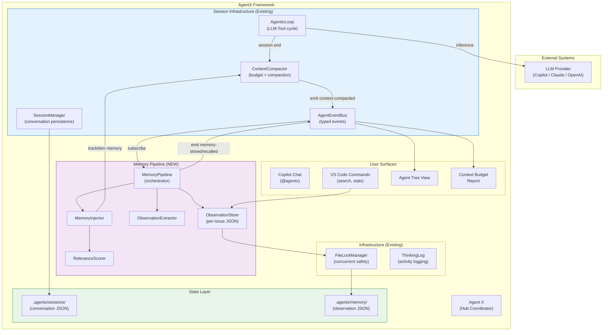
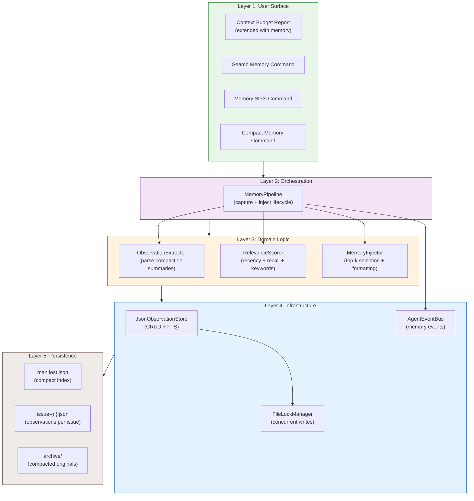
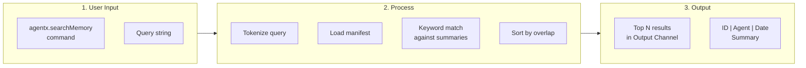
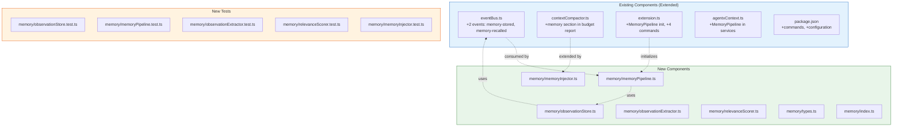
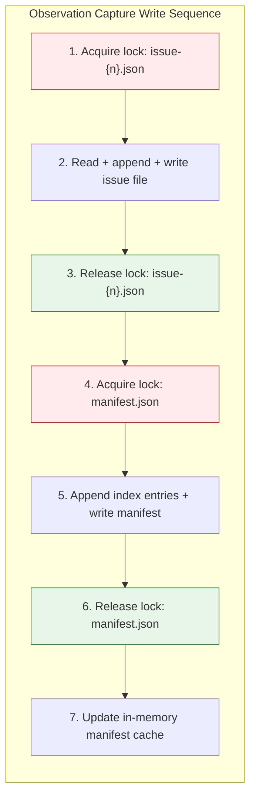
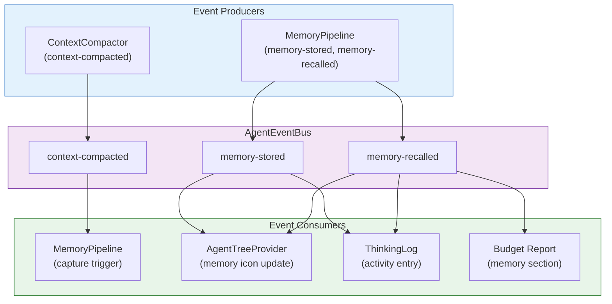
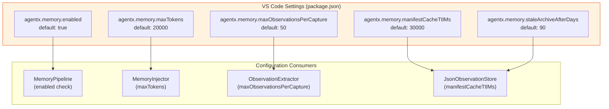
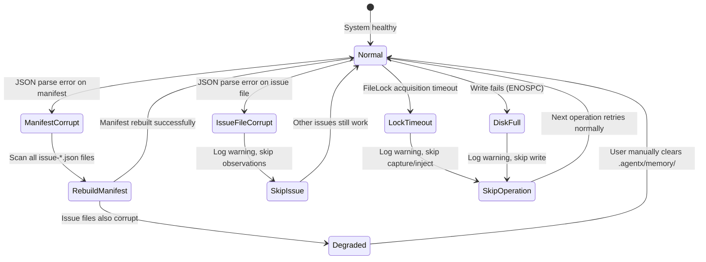

# Architecture: Persistent Agent Memory Pipeline

**Epic**: #29
**Date**: 2026-02-27
**Author**: Solution Architect Agent
**Related**: [ADR-29](../adr/ADR-29.md) | [SPEC-29](../specs/SPEC-29.md) | [PRD-29](../prd/PRD-29.md)

---

## 1. System Context

The Memory Pipeline extends AgentX's existing session infrastructure with a persistent observation layer that captures knowledge at session boundaries and recalls it at session start. All new components integrate into the existing extension architecture as passive subscribers and optional services.



---

## 2. Component Architecture

### 2.1 Layer Diagram



### 2.2 Component Responsibility Matrix

| Component | Layer | Responsibility |
|-----------|-------|----------------|
| MemoryPipeline | Orchestration | Lifecycle management: EventBus subscription, capture flow, injection flow |
| ObservationExtractor | Domain | Parse compaction summary into structured observations by category |
| RelevanceScorer | Domain | Compute relevance score from recency, recall count, keyword overlap |
| MemoryInjector | Domain | Select top-k within budget, format "Memory Recall" section |
| JsonObservationStore | Infrastructure | Per-issue JSON file CRUD, manifest management, FTS |
| FileLockManager | Infrastructure | Dual-guard (AsyncMutex + JsonFileLock) for safe concurrent writes |
| AgentEventBus | Infrastructure | Dispatch memory-stored and memory-recalled events to consumers |

---

## 3. Data Flow

### 3.1 Capture Flow (Session End)

```mermaid
graph LR
    subgraph End["1. Session End"]
        A1["AgenticLoop<br/>finishes"]
        A2["compactConversation()<br/>runs"]
    end

    subgraph Event["2. Event"]
        B1["context-compacted<br/>emitted via EventBus"]
    end

    subgraph Extract["3. Extract"]
        C1["Parse decisions"]
        C2["Parse code changes"]
        C3["Parse errors"]
        C4["Parse key facts"]
    end

    subgraph Sanitize["4. Sanitize"]
        D1["Strip secrets"]
        D2["Remove private tags"]
        D3["Truncate to 2000 chars"]
    end

    subgraph Store["5. Store"]
        E1["Lock issue file"]
        E2["Append observations"]
        E3["Update manifest"]
        E4["Emit memory-stored"]
    end

    End --> Event --> Extract --> Sanitize --> Store

    style Extract fill:#FFF3E0,stroke:#E65100
    style Store fill:#E3F2FD,stroke:#1565C0
```



### 3.2 Injection Flow (Session Start)

```mermaid
graph LR
    subgraph Start["1. Session Start"]
        A1["Agent session<br/>begins"]
    end

    subgraph Query["2. Query"]
        B1["Load manifest<br/>(cached)"]
        B2["Filter by agent<br/>+ issue"]
    end

    subgraph Score["3. Score"]
        C1["Recency"]
        C2["Recall count"]
        C3["Keyword overlap"]
        C4["Weighted sum"]
    end

    subgraph Select["4. Select"]
        D1["Sort by score"]
        D2["Take top-k<br/>within budget"]
        D3["Load full<br/>observations"]
    end

    subgraph Inject["5. Inject"]
        E1["Format as<br/>Memory Recall"]
        E2["trackItem<br/>memory category"]
        E3["Emit<br/>memory-recalled"]
    end

    Start --> Query --> Score --> Select --> Inject

    style Score fill:#FFF3E0,stroke:#E65100
    style Select fill:#F3E5F5,stroke:#6A1B9A
    style Inject fill:#E8F5E9,stroke:#2E7D32
```



### 3.3 Search Flow (User Command)



---

## 4. Integration Points

### 4.1 Existing Components Modified



### 4.2 Extension Point Summary

| Extension Point | What Changes | Impact |
|-----------------|-------------|--------|
| `AgentEventMap` (eventBus.ts) | 2 new event types + payload interfaces | Low - additive, existing events untouched |
| `formatBudgetReport()` (contextCompactor.ts) | New "Memory" section in report output | Low - extends string output, no API change |
| `activate()` (extension.ts) | Initialize MemoryPipeline, register 4 commands | Low - additive to activation sequence |
| `AgentXServices` (agentxContext.ts) | Optional `memoryPipeline` field | Low - optional, no breaking change |
| `package.json` contributes | 4 commands + 5 settings | Low - additive VS Code contributions |

---

## 5. Concurrency Model

### 5.1 Write Ordering



**Deadlock prevention**: Fixed lock ordering (issue file before manifest). Two concurrent captures for different issues hold different issue locks and only contend briefly on the manifest lock. Same-issue contention is serialized by the issue file lock.

### 5.2 Read Concurrency

Reads (injection, search) use the in-memory manifest cache and do not acquire locks. Issue file reads for `getById`/`getByIssue` are safe without locks because writes are atomic (write-to-temp, rename). A read during a concurrent write will see either the old or new version, both of which are valid complete JSON.

---

## 6. Storage Layout

```
.agentx/
  memory/                          # NEW - Memory pipeline storage
    manifest.json                  # Compact index of all observations
    manifest.json.lock             # Lock file (transient)
    issue-29.json                  # Observations for issue #29
    issue-29.json.lock             # Lock file (transient)
    issue-30.json                  # Observations for issue #30
    issue-42.json                  # Observations for issue #42
    archive/                       # Compacted originals
      issue-29-archived.json       # Archived observations from compaction
  sessions/                        # EXISTING - Session conversation JSON
    engineer-1709035100000-x7y8.json
  state/                           # EXISTING - Agent state + clarification ledgers
    agent-status.json
    clarifications/
      issue-42.json
```

**Sizing estimates:**

| Scale | Observations | manifest.json | Issue files (total) | Total disk |
|-------|-------------|---------------|--------------------|----|
| Small project | 500 | ~25KB | ~250KB | ~275KB |
| Medium project | 5,000 | ~250KB | ~2.5MB | ~2.75MB |
| Large project | 50,000 | ~2.5MB | ~25MB | ~27.5MB |

All sizes well within the PRD's 50MB target.

---

## 7. Event Architecture

### 7.1 Event Flow Diagram



### 7.2 Event Payload Types

| Event | Field | Type | Description |
|-------|-------|------|-------------|
| `memory-stored` | agent | string | Agent that produced the observations |
| | issueNumber | number | Issue the observations relate to |
| | count | number | Number of observations stored |
| | totalTokens | number | Total tokens across all stored observations |
| | observationIds | string[] | IDs of stored observations |
| | timestamp | number | Unix timestamp |
| `memory-recalled` | agent | string | Agent receiving the injection |
| | issueNumber | number | Issue context for the recall |
| | count | number | Number of observations recalled |
| | totalTokens | number | Tokens consumed by recalled content |
| | observationIds | string[] | IDs of recalled observations |
| | timestamp | number | Unix timestamp |

---

## 8. Configuration Architecture



---

## 9. Error Recovery

### 9.1 Failure Modes and Recovery



### 9.2 Manifest Rebuild Algorithm

```
1. List all files matching issue-*.json in .agentx/memory/
2. For each file:
   a. Parse JSON (skip if corrupt, log warning)
   b. Extract ObservationIndex entries from observations array
3. Merge all index entries into new manifest
4. Write manifest.json via FileLockManager
5. Log "Manifest rebuilt: {N} observations from {M} issue files"
```

---

## 10. Feature-to-Issue Mapping

| Feature | Issues | Priority | Phase |
|---------|--------|----------|-------|
| F1: Observation Store | #30 (Feature), #36-#38 (Stories) | P0 | 1 |
| F2: Session Memory Injection | #31 (Feature), #39-#40 (Stories) | P0 | 2a |
| F3: Progressive Disclosure Search | #32 (Feature), #41-#42 (Stories) | P1 | 2b |
| F4: Lifecycle Hook Integration (CLI) | #33 (Feature), #43-#44 (Stories) | P2 | 3 |
| F5: Memory Decay and Compaction | #34 (Feature), #45-#46 (Stories) | P2 | 3 |

---

## 11. Key Decisions Summary

| # | Decision | Rationale | See |
|---|----------|-----------|-----|
| 1 | Per-issue JSON files (not single file, not SQLite) | Zero deps, pattern consistency with ADR-1, sufficient at 50K scale | [ADR-29 sec 1](../adr/ADR-29.md#decision-1-storage-layout) |
| 2 | In-memory manifest for FTS (not disk-based index) | <200ms search at 10K, 30s cache TTL, lazy loading | [ADR-29 sec 3](../adr/ADR-29.md#decision-3-injection-pipeline) |
| 3 | EventBus-driven capture (not hook script modification) | context-compacted event already exists; passive subscriber | [ADR-29 sec 2](../adr/ADR-29.md#decision-2-capture-pipeline) |
| 4 | IObservationStore interface (backend-agnostic) | Enables SQLite/vector swap without consumer changes | [ADR-29 sec 6](../adr/ADR-29.md#decision-6-observationstore-interface-backend-agnostic) |
| 5 | ContextCompactor memory category (existing) | `memory` already in ContextItem category union -- zero changes | [SPEC-29 sec 5](../specs/SPEC-29.md#5-service-layer-diagrams) |
| 6 | FileLockManager reuse (not new locking) | Tested dual-guard from ADR-1; shared with clarification system | [ADR-29 sec 4](../adr/ADR-29.md#decision-4-concurrency-model) |
| 7 | Fixed lock ordering (issue file then manifest) | Prevents deadlocks on concurrent multi-issue captures | [SPEC-29 sec 5](../specs/SPEC-29.md#51-write-ordering) |

---

**Generated by AgentX Architect Agent**
**Last Updated**: 2026-02-27
**Version**: 1.0
