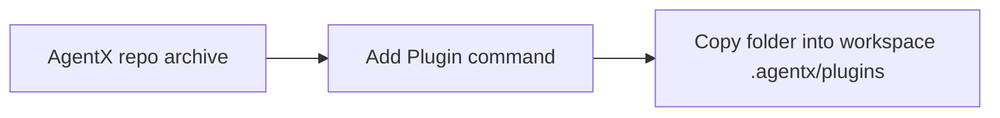
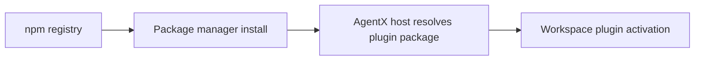
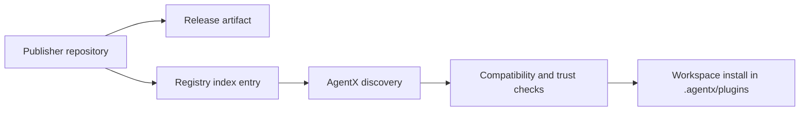
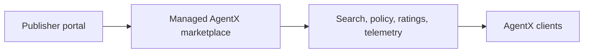

# ADR-234: Publish AgentX Plugins As Independent Packages On Top Of AgentX Core

**Status**: Accepted
**Date**: 2026-03-18
**Author**: AgentX Auto
**Epic**: N/A
**Issue**: #234
**PRD**: N/A - direct architecture initiative
**UX**: N/A - no dedicated UX artifact required for this architecture slice

---

## Table of Contents

1. [Context](#context)
2. [Decision](#decision)
3. [Options Considered](#options-considered)
4. [Rationale](#rationale)
5. [Consequences](#consequences)
6. [Implementation](#implementation)
7. [References](#references)
8. [Review History](#review-history)
9. [AI/ML Architecture](#aiml-architecture-if-applicable)

---

## Context

AgentX already has early plugin primitives, but they are not yet a publishable platform. The current state is:

**Requirements:**
- Enable independent plugin publication on top of AgentX core
- Preserve the current local-first workspace installation model under `.agentx/plugins`
- Support plugin types beyond Node.js, including PowerShell and Bash-based tools
- Define compatibility, discovery, trust, and lifecycle expectations clearly enough for later implementation

**Constraints:**
- Current install flow in `vscode-extension/src/commands/pluginsCommandInternals.ts` downloads the AgentX source archive and copies plugin folders from `.agentx/plugins`
- Current plugin contract in `.github/schemas/plugin-manifest.schema.json` has no explicit publisher identity, host compatibility range, permissions model, or distribution metadata
- Existing package forms already exist at the pack level in `packs/agentx-core/manifest.json` and `packs/agentx-copilot-cli/manifest.json`
- Current `convert-docs` plugin `.agentx/plugins/convert-docs/plugin.json` proves AgentX plugins can be shell-driven rather than Node-only

**Background:**
- Internal repo evidence shows that `agentx.addPlugin` is a local installer, not a package ecosystem. It loads manifests from the extracted repo archive and installs a selected folder into the workspace.
- External ecosystem research shows recurring patterns across mature plugin systems:
  - VS Code extensions use `publisher`, `name`, `version`, and `engines` to define identity and host compatibility, plus marketplace metadata and dependency declarations.
  - npm plugin packages rely on unique name/version identity, compatibility ranges through `peerDependencies`, platform constraints through `engines`, `os`, and `cpu`, and publication metadata such as `repository`, `bugs`, `homepage`, and `license`.
  - Atlassian Forge requires a manifest with top-level app identity, modules, permissions, runtime, and packaging declarations, which highlights the value of an explicit permissions contract.
  - Backstage treats plugins as first-class packages with multiple plugin package types rather than repo-local folders only.

**Failure modes researched:**
- Repo-archive catalog coupling forces plugin discovery and release cadence to follow the AgentX repo instead of plugin owners.
- npm-only publication would privilege Node packages and fit poorly with shell-first plugins already present in AgentX.
- Running arbitrary packaged scripts without an explicit permissions and trust model creates a supply-chain and operator-safety gap.
- Building a full custom marketplace too early would create governance and operations burden before the package contract stabilizes.

**Security and long-term viability assessment:**
- Confidence: HIGH - GitHub Releases plus a registry index is operationally durable for the current scale because AgentX already uses GitHub as the primary distribution surface.
- Confidence: HIGH - A publisher identity plus compatibility range is required before independent plugin publication, based on repeated patterns in VS Code and npm.
- Confidence: MEDIUM - Signature enforcement should be designed now but may arrive after checksum verification in the first rollout, because the trust UX and signer model still need implementation decisions.

---

## Decision

We will publish AgentX plugins as independent packages on top of `agentx-core`, using a registry index plus versioned release artifacts as the first production publication model.

**Key architectural choices:**
- `agentx-core` remains the host/runtime contract for plugin execution and lifecycle
- Each plugin becomes an independently versioned package with a globally unique publisher-qualified identity
- The plugin manifest evolves to a v2 contract that adds host compatibility, permissions, capabilities, distribution metadata, and trust metadata
- Discovery uses a registry index that describes available plugins and their latest compatible releases
- Distribution uses downloadable artifacts, with GitHub Releases as the initial artifact host
- Installation still lands inside workspace `.agentx/plugins`, preserving local review and workspace isolation
- Packs remain a higher-order bundle abstraction above plugins, not a replacement for plugins

---

## Options Considered

### Option 1: Keep The Current Repo-Archive Catalog Model

**Description:**
Continue using the AgentX repository archive as the plugin catalog and installation source.

**Pros:**
- Lowest implementation effort
- Reuses the current Add Plugin workflow unchanged
- Keeps all plugins close to the main repository

**Cons:**
- No independent plugin publication lifecycle
- No publisher identity or strong compatibility contract
- Discovery remains coupled to AgentX repo releases and structure
- Trust model stays implicit and weak

**Effort**: S
**Risk**: Medium
**Confidence**: LOW

---

### Option 2: Use npm As The Primary Plugin Publication Model

**Description:**
Publish AgentX plugins as npm packages and use package-manager semantics as the primary installation and compatibility model.

**Pros:**
- Mature versioning, naming, and ecosystem tooling
- Strong package metadata and compatibility patterns
- Familiar publication workflow for Node developers

**Cons:**
- Poor fit for PowerShell and Bash-first plugins already present in AgentX
- Would bias the platform toward Node packaging even when the runtime does not need it
- Introduces unnecessary dependency on npm account and package-manager conventions for all plugin authors
- Makes non-Node enterprise distribution less natural

**Effort**: M
**Risk**: Medium
**Confidence**: MEDIUM

---

### Option 3: Use A Registry Index Plus Versioned Release Artifacts

**Description:**
Define an AgentX registry index that points to independently versioned plugin artifacts, with GitHub Releases as the initial artifact host and local workspace installation preserved.

**Pros:**
- Supports PowerShell, Bash, and Node plugin packages without forcing npm packaging
- Adds independent versioning, identity, compatibility, and trust layers
- Aligns with the current local-first install model and existing GitHub-centered distribution
- Supports curated packs as bundles referencing plugins instead of copying them
- Creates a clean path to enterprise mirrors and allowlists later

**Cons:**
- Requires new registry/index contract and installer changes
- Needs a custom validation pipeline for compatibility, checksums, and permissions
- Marketplace features such as ratings and search ranking are limited in phase 1

**Effort**: M
**Risk**: Low
**Confidence**: HIGH

---

### Option 4: Build A Full AgentX Marketplace Service First

**Description:**
Build and operate a dedicated marketplace service before stabilizing the package contract.

**Pros:**
- Richest discovery and governance story
- Strong future enterprise policy and telemetry potential
- Centralized moderation and lifecycle controls

**Cons:**
- Highest operational and product cost
- Delays value while basic package and trust contracts are still evolving
- Risks overbuilding before author behavior and plugin demand are understood

**Effort**: XL
**Risk**: High
**Confidence**: LOW

---

## Rationale

We chose **Option 3** because it best fits the current AgentX runtime and growth stage.

### Evaluation Matrix

| Criteria | Option 1: Repo Archive | Option 2: npm Primary | Option 3: Registry + Releases | Option 4: Full Marketplace |
|---------|-------------------------|-----------------------|-------------------------------|-----------------------------|
| Independent publication | Poor | Good | Excellent | Excellent |
| Polyglot runtime fit | Good | Poor | Excellent | Excellent |
| Compatibility contract | Poor | Good | Excellent | Excellent |
| Trust and policy path | Poor | Medium | Good | Excellent |
| Implementation cost now | Excellent | Medium | Good | Poor |
| Long-term extensibility | Poor | Medium | Excellent | Excellent |

1. **Polyglot fit matters more than package-manager familiarity**: AgentX already supports plugins whose primary runtime is PowerShell or Bash, so the platform should not make Node packaging the mandatory center of gravity.
2. **Host/plugin compatibility must become explicit**: npm `peerDependencies` and VS Code `engines` both reinforce the same lesson - a plugin ecosystem needs a formal host compatibility contract. Option 3 lets AgentX adopt that contract without inheriting Node-only assumptions.
3. **Operational scope should stay proportional**: GitHub Release artifacts and a registry index provide enough structure for independent publishing, checksum verification, and curated discovery without the cost of building a full marketplace service prematurely.
4. **Packs remain valuable, but at a different layer**: VS Code extension packs demonstrate that bundles work best when the bundled units remain independently manageable. AgentX packs should follow the same principle and reference plugins rather than replace them.

**Key decision factors:**
- Support the plugin types AgentX already has, not only the ones a future package manager prefers
- Introduce identity, compatibility, and trust before scaling publication
- Preserve local workspace review and isolation
- Keep the first rollout simple enough to implement with existing GitHub-based distribution practices

---

## Consequences

### Positive
- Plugins gain independent publisher identity and release cadence
- AgentX can add compatibility enforcement without forcing all plugins into a Node-only distribution model
- The current workspace-local install behavior remains intact, which supports reviewability and safer adoption
- Packs become cleaner bundle artifacts built on stable plugin coordinates instead of copied content

### Negative
- The extension and CLI installers must be refactored away from repo-archive discovery
- A new registry schema and publisher workflow must be designed and supported
- Trust UX becomes more explicit, which adds operator prompts and policy handling

### Neutral
- Existing local plugins still need a backward-compatibility path during migration
- GitHub remains the first distribution host, but the design keeps room for alternative registries later

---

## Implementation

**Detailed technical specification**: [SPEC-234.md](../specs/SPEC-234.md)

**High-level implementation plan:**
1. Extend the plugin manifest to a v2 publication contract
2. Define a registry index and artifact publication format
3. Update AgentX discovery, compatibility, trust, install, and pack-resolution workflows

**Key milestones:**
- Phase 1: Stabilize package identity, compatibility, and trust metadata
- Phase 2: Ship registry-backed discovery and release-asset installation
- Phase 3: Layer packs, enterprise policy, and richer marketplace signals on top

---

## References

### Internal Evidence
- `vscode-extension/src/commands/pluginsCommandInternals.ts`
- `.github/schemas/plugin-manifest.schema.json`
- `.agentx/plugins/convert-docs/plugin.json`
- `packs/agentx-core/manifest.json`
- `packs/agentx-copilot-cli/manifest.json`

### External Sources
- VS Code Extension Manifest: https://code.visualstudio.com/api/references/extension-manifest
- npm package.json reference: https://docs.npmjs.com/cli/v11/configuring-npm/package-json
- Backstage plugin creation guidance: https://backstage.io/docs/plugins/create-a-plugin/
- Atlassian Forge manifest reference: https://developer.atlassian.com/platform/forge/manifest-reference/

---

## Review History

| Date | Reviewer | Notes |
|------|----------|-------|
| 2026-03-18 | AgentX Auto | Initial decision recorded after repo and ecosystem research |

---

## AI/ML Architecture (if applicable)

This decision affects an AI-agent platform, but the plugin publication problem itself is not best solved with GenAI or agentic runtime logic.

**AI-first assessment:**
- Option considered: Use an AI-mediated plugin discovery or trust layer as the primary mechanism
- Result: Rejected for the core platform contract
- Reason: Publication identity, compatibility, permissions, and supply-chain trust are deterministic platform concerns that require explicit metadata and validation. AI may assist future discovery, recommendation, or documentation workflows, but it should not replace the manifest, registry, or trust contract.

**Confidence**: HIGH