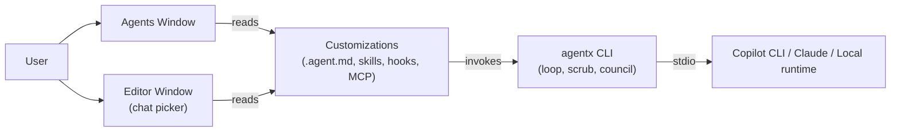
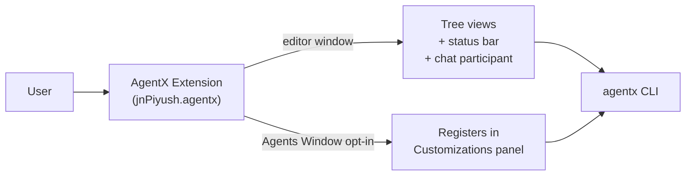
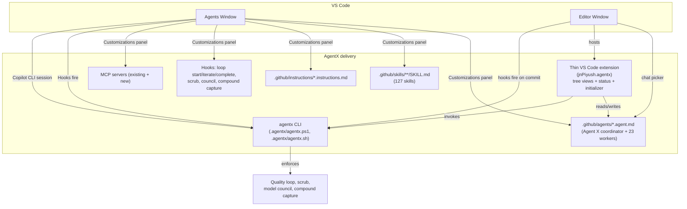
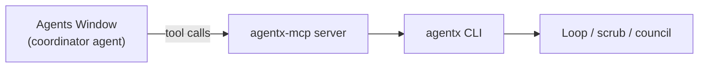

# ADR-400: AgentX integration model for the VS Code Agents Window

**Status**: Proposed
**Date**: 2026-05-29
**Author**: AgentX Architect
**PRD**: n/a (architect-initiated research; no upstream PRD yet)
**Council**: [docs/artifacts/adr/COUNCIL-400.md](COUNCIL-400.md)
**Spec**: [docs/artifacts/specs/SPEC-400.md](../specs/SPEC-400.md)

---

## Table of Contents

1. [Context](#context)
2. [Decision](#decision)
3. [Options Considered](#options-considered)
4. [Rationale](#rationale)
5. [Consequences](#consequences)
6. [Implementation](#implementation)
7. [References](#references)

---

## Context

VS Code has shipped a new agent-first surface called the **Agents Window** (Preview, May 2026) that is positioned as the strategic home for orchestrating long-running, multi-project AI agent work. Today, AgentX (`vscode-extension` v8.4.62) ships as a `chatParticipants`-based extension whose primary surfaces are the editor sidebar (tree views, status bar, commands) and a chat participant in the main VS Code chat view. AgentX must decide how its 24 agents, 127 skills, workflow gates, and quality-loop CLI show up inside the new Agents Window without forcing users to abandon the editor-window experience.

**Requirements:**

- Preserve the existing AgentX value loop: issue-first workflow, quality loop with minimum 5 iterations, model council, scrub, compound capture, and execution plans.
- Make AgentX usable from the Agents Window as a *first-class* customization, not a hidden side process.
- Keep the editor-window experience working unchanged for users who do not adopt the Agents Window.
- Support the three Agents Window-supported agent runtimes (Copilot CLI, Copilot Cloud, Claude agent). Do not assume a "Local agent / VS Code chat participant" runtime is available inside the Agents Window.
- Avoid duplicate UI: Agents Window already provides Sessions, Customizations, Changes, and integrated browser panels. AgentX SHOULD reuse, not re-implement, these.

**Constraints:**

- VS Code extension activation in the Agents Window is **opt-in** per extension ID via `extensions.supportAgentsWindow`. Anything we expose must keep working when that flag is off (editor-window only).
- The Agents Window currently does **not** route prompts through `vscode.chat.createChatParticipant`. Chat participants registered the old way are invisible in the Agents Window dropdown.
- The Agents Window agent dropdown is populated from `.agent.md` files in `.github/agents/` (workspace) and the user profile. AgentX already ships agents in this exact format.
- Sub-agent invocation is gated by the `runSubagent` tool and the `chat.subagents.allowInvocationsFromSubagents` setting; nested depth is capped at 5.
- Cloud agent sessions only support GitHub-backed repositories.
- The `model:` frontmatter is advisory; agents must remain model-agnostic per existing AgentX conventions.

**Background -- AgentX present state (verified 2026-05-29):**

| Surface | Today | Verified at |
|---------|-------|-------------|
| Chat participant `agentx.chat` | Registered via `contributes.chatParticipants` | `vscode-extension/package.json` line 550 |
| 24 agents in `.github/agents/*.agent.md` | Frontmatter already matches the VS Code `.agent.md` schema | repo structure |
| 127 skills under `.github/skills/**/SKILL.md` | Already in the format the Customizations panel expects under "Skills" | `Skills.md` |
| Quality loop CLI (`agentx.ps1 loop`) | Runs in PowerShell, gated by pre-commit hook | `.agentx/agentx-cli.ps1` |
| Tree views, status bar, commands | Editor-window only; not yet declared for Agents Window | `vscode-extension/src/extension.ts`, `views/`, `commands/` |

**Phase 2 -- Technology landscape scan (Agents Window surfaces):**

| Surface in Agents Window | What it expects | AgentX has equivalent? | Source |
|--------------------------|-----------------|------------------------|--------|
| Agents dropdown | `.agent.md` with frontmatter (`name`, `description`, `tools`, optional `model`, `user-invocable`, `disable-model-invocation`, `agents`) | Yes -- 24 `.agent.md` files | [Custom agents](https://code.visualstudio.com/docs/copilot/customization/custom-agents), verified 2026-05-29 |
| Customizations panel | Agents, Skills, Instructions, Hooks, MCP Servers, Plugins | Yes -- AgentX ships all six categories | [Agents window](https://code.visualstudio.com/docs/copilot/agents/agents-window#_customize-agents-for-your-project-and-workflow) |
| Sub-agent invocation | `runSubagent` tool + `agents:` allowlist in coordinator frontmatter | Partial -- Agent X (hub) routes specialists in body prose, not via `agents:` allowlist | [Subagents](https://code.visualstudio.com/docs/copilot/agents/subagents) |
| Hooks | Shell commands on lifecycle events (`session-start`, `pre-tool`, `post-tool`, `session-end`, ...) | Yes -- pre-commit hook + `agentic-runner.ps1`; need to bridge to Hook format | [Hooks](https://code.visualstudio.com/docs/copilot/customization/hooks) |
| Session runtime | Copilot CLI, Copilot Cloud, or Claude agent | AgentX's `agentic-runner.ps1` is CLI-shaped (PowerShell process, stdio output) | [Agents overview](https://code.visualstudio.com/docs/copilot/agents/overview#_types-of-agents) |
| Extension activation | Opt-in: `extensions.supportAgentsWindow: { "jnPiyush.agentx": true }` | Not declared yet; chat participant won't show in Agents Window even if opted in | [Use VS Code extensions in the Agents window](https://code.visualstudio.com/docs/copilot/agents/agents-window#_use-vs-code-extensions-in-the-agents-window) |
| Changes panel | File diffs from the active session worktree | Provided by VS Code; AgentX does not need to re-implement | same source |
| Integrated browser | Opens `localhost` links | Provided by VS Code; useful for our `agent-browser-default-testing` convention | same source |
| Plugins | Bundled customizations from marketplace | AgentX ships `.agentx/plugins/` already; format alignment needed | [Customizations overview](https://code.visualstudio.com/docs/copilot/customization/overview) |

**Phase 3 -- Architecture pattern research:**

The recommended VS Code pattern for "complex multi-role agent system" is the **coordinator + worker subagents** pattern (a top-level custom agent with `tools: ['agent']` and an `agents:` allowlist that names the specialist agents). This pattern is documented as the canonical orchestration shape in the [Subagents docs (Orchestration patterns -> Coordinator and worker pattern)](https://code.visualstudio.com/docs/copilot/agents/subagents). It maps almost 1:1 onto AgentX's existing Hub-and-Spoke architecture (Agent X as coordinator; Engineer, Architect, Reviewer, etc. as workers).

The Anthropic-style "sprint contract between generator and evaluator" pattern (used in AgentX bounded work contracts) maps onto the Multi-perspective code review pattern shown in the same VS Code docs, where the coordinator fans out parallel review subagents and synthesizes findings -- this is essentially AgentX's subagent review iteration (>= 1 history iteration whose summary contains "review").

**Phase 4 -- Failure modes and anti-patterns:**

| Risk | Source | Mitigation |
|------|--------|------------|
| Chat participant invisible in Agents Window | Agents Window does not use `chatParticipants` | Do not rely on `agentx.chat` participant; treat it as editor-window only |
| Tree views not rendering in Agents Window | Activity bar/tree view rendering in Agents Window is "still evolving" | Provide chat-driven and command-driven entry points; do not block on tree views |
| Sub-agent infinite loop | Recursive nesting capped at depth 5; off by default | Keep `chat.subagents.allowInvocationsFromSubagents` off unless a workflow explicitly needs it |
| Cloud agent on non-GitHub repos | Cloud sessions only work on GitHub-backed repos | Document Local/Cloud-mode behavior; do not require cloud for core loop |
| Worktree vs folder isolation drift | Default isolation differs by agent type | Document recommended isolation per AgentX phase (Engineer -> worktree; Reviewer -> folder) |
| Model lock via `model:` frontmatter | VS Code uses `model:` as a preference, but if the model is unavailable it silently falls back | Keep AgentX agents model-agnostic; treat `model:` as advisory (already the convention) |
| Quality loop bypassed in Agents Window | The pre-commit hook only fires at commit time, but the Agents Window auto-commit paths may stage and commit faster than the user can intervene | Wire `loop start`/`loop iterate`/`loop complete` into the Hooks system (session-start, post-tool, session-end) |
| Hook command portability | Hooks run as shell commands; PowerShell-only scripts break for mac/Linux users | Provide both `.ps1` and `.sh` entry points for hooks (already true for `agentx.ps1`/`agentx.sh`) |

**Phase 5 -- Benchmark and performance research:**

No published Agents Window benchmarks exist yet (Preview, May 2026). The relevant performance budget is **session start latency** (target < 3 s from "New" to first prompt input) and **subagent fan-out cost** (each subagent is a new model context; the user-facing cost is the token usage of the parent + summed subagents). AgentX's existing minimum-5-iterations rule is already a known cost driver; this ADR does not change it.

**Phase 6 -- Security and viability:**

- The Agents Window is in Preview but ships in Stable VS Code (`code --agents`), the Insiders build, and the browser at `insiders.vscode.dev/agents`. The agent-first direction is publicly documented as strategic, and the Agent Host Protocol is an open spec at `microsoft.github.io/agent-host-protocol/`.
- Folder trust is enforced -- agents cannot run in untrusted folders. AgentX already follows the workspace-trust model.
- Remote sessions via SSH or dev tunnels require authenticated tunnels; AgentX should warn users to never enable Autopilot on anonymous tunnels.
- Dependency health: VS Code core, no third-party runtime dependency added.

**Confidence on the landscape findings: HIGH.** All facts above were taken from the official VS Code documentation pages and verified against the current `vscode-extension/package.json`.

---

## Decision

We will adopt **Option C: Agents-Window-Native Customizations + CLI Bridge + Thin Extension**.

Specifically:

1. Promote the existing 24 `.agent.md` files to be the **primary delivery surface** for AgentX in the Agents Window. They are already in the right format; the only changes are frontmatter polish (`user-invocable`, `disable-model-invocation`, `agents:` allowlists) and registering the Customizations entries.
2. Package `agentic-runner.ps1` (and its shell sibling) as a **Copilot CLI-compatible runner** so an AgentX session can launch as either a Local agent (editor window) or a Copilot CLI session (Agents Window), with the same loop semantics.
3. Wire the quality-loop CLI (`loop start`, `loop iterate`, `loop complete`), the scrub script, and the model council script into the **VS Code Hooks** lifecycle, so the gates fire inside Agents Window sessions without requiring the pre-commit hook to be the only enforcer.
4. Refactor the existing VS Code extension into a **thin glue layer**: it stays as a chat participant + tree views for the editor window, and opts in to the Agents Window via `extensions.supportAgentsWindow` only for activation of the runtime initializer + status commands. All AgentX *orchestration* moves to `.agent.md` + Hooks + CLI; the extension is no longer the source of truth for routing.
5. Continue to ship the Hub-and-Spoke architecture, but express it in `.agent.md` frontmatter using the documented `tools: ['agent']` + `agents: ['Engineer', 'Reviewer', ...]` allowlist pattern, with the existing Agent X agent as the coordinator.

**Key architectural choices:**

- Agents Window-first delivery shape: Customizations panel (Agents, Skills, Instructions, Hooks, MCP Servers, Plugins) is the canonical surface.
- CLI bridge: `agentic-runner.ps1` and `agentx.sh` are the AgentX runtime; the extension does not host long-running orchestration.
- Hooks as gate enforcer: quality loop, scrub, council fire on `session-start`, `pre-tool` (for risky tools), and `session-end`.
- Sub-agent allowlists: each coordinator agent declares its allowed workers via `agents:`; recursive nesting stays off by default.
- Two-window contract: anything that exists in the Agents Window also works in the editor window via `agentx.ps1`; the editor-window tree views are syntactic sugar, not a separate code path.

---

## Options Considered

### Option A: Customizations-Only -- shrink the extension, ship `.agent.md` + skills + hooks; drop the chat participant

**Description:** Stop shipping a VS Code extension as the AgentX entry point. Distribute AgentX as a "Plugin" bundle (per the VS Code Plugins customization category) containing `.agent.md`, `SKILL.md`, instructions, hooks, MCP servers, and the CLI. Users install AgentX from the Customizations panel; the Agents Window picks it up natively. Editor-window users invoke AgentX agents via the standard chat agent picker (which also reads `.agent.md`).

**Pros:**

- Smallest surface area; no `extensions.supportAgentsWindow` opt-in needed.
- Future-proof: when VS Code adds more customization categories, AgentX inherits them.
- Removes ~half of the current `vscode-extension/` code (tree views, chat participant, status bar) -- less code to maintain.
- Aligns 1:1 with the documented "Plugins" delivery model.

**Cons:**

- Loses the AgentX status bar, sidebar tree views, and the "Show Agent Status" / "Show Workflow Steps" commands. These are heavily used by current users for editor-window discovery.
- Marketplace presence drops from "VS Code extension" (high discoverability) to "Customizations plugin" (lower discoverability today).
- Migration is breaking for existing v8.x users.

**Effort:** L 
**Risk:** Medium (UX regression for editor-window-only users)

---

### Option B: Dual-Surface Extension -- keep extension as-is, add Agents Window opt-in, gate features by surface

**Description:** Keep the current `chatParticipants`-based extension. Add `extensions.supportAgentsWindow: { "jnPiyush.agentx": true }` to the recommended workspace settings. Detect at runtime whether the extension is activating in the Agents Window vs the editor window; in the Agents Window, hide tree views and instead surface AgentX through the Customizations panel registration. Keep all existing commands and code paths.

**Pros:**

- Zero breaking change for existing users; everything they have today still works.
- Lowest implementation cost in the short term.
- Keeps marketplace discoverability and update channel.

**Cons:**

- The chat participant remains invisible in the Agents Window dropdown -- users will be confused that "AgentX" appears in the editor chat picker but not the Agents Window picker. We end up explaining the mismatch in docs forever.
- Doubles the activation surface: every command must be tested in two host environments.
- Long-term, AgentX accumulates two slightly different code paths for the same logical operation (sidebar tree view vs Customizations entry).
- Does not solve the real problem: orchestration still lives inside the extension, not inside the Agents Window's documented surfaces.

**Effort:** S 
**Risk:** Medium-High (UX confusion + long-term tech debt)

---

### Option C: Agents-Window-Native Customizations + CLI Bridge + Thin Extension (RECOMMENDED)

**Description:** Move AgentX's *orchestration* into the Agents Window's documented surfaces (`.agent.md`, Skills, Hooks, MCP, Plugins) and a CLI runner. Reduce the VS Code extension to a thin convenience layer: editor-window tree views, status bar, and one chat participant that just delegates into the same `.agent.md` agents through the standard chat picker. The extension opts in to the Agents Window only to register the Customizations entries and run the initializer; it does not try to host orchestration there.

**Pros:**

- AgentX agents show up natively in the Agents Window dropdown (because they are `.agent.md`) -- no UX mismatch.
- Customizations panel becomes the single source of truth for "what AgentX brings to this workspace"; users see Agents, Skills, Instructions, Hooks, MCP, Plugins in the same place as their other customizations.
- Hooks make the quality-loop gates enforceable inside the Agents Window without depending on the pre-commit hook firing.
- The CLI bridge means a single runtime that works for editor-window chat, Agents Window Copilot CLI, command line, and CI.
- The Hub-and-Spoke architecture maps cleanly to the documented Coordinator + Worker subagent pattern, including the `agents:` allowlist that prevents the model from picking an unintended worker.
- Lowest *long-term* maintenance cost: orchestration lives in plain-text customization files, not in extension TypeScript.
- Preserves marketplace presence and editor-window UX (tree views, status bar) as a convenience layer.

**Cons:**

- Higher near-term implementation cost than Option B; requires refactoring `.agent.md` frontmatter (add `agents:`, `user-invocable`, `disable-model-invocation` where appropriate), authoring a Hooks bundle, and packaging the CLI for Copilot CLI invocation.
- Requires sequencing a deprecation of the chat participant in favor of `.agent.md` invocation (low risk, but a docs/CHANGELOG concern).
- Depends on Customizations panel APIs that are still evolving; one feature (Customizations programmatic registration from an extension) may need a fallback path during Preview.

**Effort:** L 
**Risk:** Low-Medium

---

### Option D: Custom MCP Server -- expose AgentX as an MCP server, no .agent.md changes

**Description:** Package AgentX as a single MCP server (`agentx-mcp`) that exposes tools like `agentx.startLoop`, `agentx.iterate`, `agentx.completeLoop`, `agentx.routeIssue`, `agentx.runCouncil`. The Agents Window picks it up via the standard MCP customization. Agents in the Agents Window call AgentX tools; the existing 24 `.agent.md` files become optional context references rather than first-class agents.

**Pros:**

- Single integration point; AgentX appears as an MCP server users already know how to install.
- No dependence on `.agent.md` evolving.
- Easy to expose to non-VS Code clients (Claude Desktop, Cursor, etc.).

**Cons:**

- AgentX *agents* (PM, Architect, Engineer, Reviewer, ...) become invisible in the agent picker; their role contracts (Karpathy, no-code-policy, etc.) live behind tool calls and stop being legible to the model.
- The Hub-and-Spoke architecture cannot be expressed; coordinator must be a generic agent that "knows to call AgentX tools", which is fragile.
- Loses the entire "AgentX is a multi-role workflow" framing in the UI.
- MCP is the right place for *tools*, not for *agent personas*.

**Effort:** M 
**Risk:** High (loses the core AgentX product framing)

---

## Evaluation

| Criterion | Weight | Option A (Customizations-only) | Option B (Dual-surface) | Option C (Native + CLI bridge) | Option D (MCP-only) |
|-----------|--------|-------------------------------|--------------------------|-----------------------------|----------------------|
| Native fit with Agents Window | 25% | High | Low (chat participant invisible) | High | Medium (no agent personas) |
| Preserves editor-window UX | 20% | Low (loses tree views) | High | High | Medium |
| Long-term maintenance cost | 15% | Low | High (two code paths) | Low | Medium |
| Quality-loop enforceability | 15% | Medium (depends on hooks) | Medium | High (hooks + CLI + pre-commit) | Medium |
| Migration risk for v8.x users | 10% | High (breaking) | Low | Medium | High (changes mental model) |
| Discoverability (marketplace) | 10% | Low | High | High | Medium |
| Confidence | 5% | HIGH | HIGH | HIGH | MEDIUM |
| **Weighted score** | 100% | **2.55** | **2.95** | **4.30** | **2.50** |

(Scoring scale: Low=1, Medium=3, High=5; weighted score = sum(weight x score) / 100.)

**Confidence: HIGH** on the option ranking; **MEDIUM** on the exact effort for Option C until we prototype the Customizations programmatic-registration path.

---

## Rationale

We chose **Option C** because:

1. **It aligns AgentX with the documented VS Code agent model.** The `.agent.md` format and the Coordinator + Worker subagent pattern are exactly what AgentX already does; Option C just makes that alignment explicit instead of duplicating it in extension code.
2. **It solves the visibility problem cleanly.** Option B leaves AgentX agents invisible in the Agents Window dropdown -- the most common user-reported confusion to expect once the Agents Window goes Stable. Option C makes them first-class.
3. **It pushes orchestration into plain-text artifacts that the model can read.** This is consistent with the AgentX rule "Prefer retrieval-led reasoning over pre-training-led reasoning"; the agent definitions stay legible and reviewable.
4. **It keeps editor-window users supported.** The thin extension preserves the status bar, tree views, and commands that today's users rely on -- so Option C is not a breaking change, just a re-platforming.
5. **It collapses the runtime to one CLI.** A single `agentic-runner` invoked by both surfaces and by CI is cheaper than maintaining a TypeScript orchestration path plus a PowerShell one.
6. **The model council Skeptic flagged the biggest risk of Option C as dependency on Preview-era APIs.** Option C addresses this by treating extension-side Customizations registration as a "nice to have" fallback while the agent files and the CLI work without any extension support at all -- so AgentX continues to function even if the Agents Window APIs shift.

Key decision factors:

- Native Agents Window visibility
- Long-term maintenance cost
- Quality-loop enforceability
- Backward compatibility for editor-window users

---

## Consequences

### Positive

- AgentX agents become first-class citizens in the Agents Window dropdown across all three runtimes (Copilot CLI, Copilot Cloud where the repo is on GitHub, Claude).
- Customizations panel becomes a single, discoverable home for AgentX skills, instructions, hooks, MCP servers, and plugins.
- Quality-loop gates fire from Hooks, so the loop is enforced inside Agents Window sessions even before commit time.
- The VS Code extension shrinks to a maintainable surface (tree views, status bar, initializer) without owning orchestration.
- A single CLI is the runtime for chat, Agents Window, and CI -- one code path for one set of tests.
- Hub-and-Spoke architecture is now expressible in `.agent.md` frontmatter (`tools: ['agent']`, `agents: [...]`), which is reviewable by humans and by the model.

### Negative

- We accept a near-term refactor cost: frontmatter updates across 24 `.agent.md` files, packaging the Hooks bundle, and a CLI invocation contract document.
- We accept that some chat-participant features (e.g., custom chat slash commands) need to be re-expressed as `.agent.md` argument hints or hook prompts.
- We accept a temporary dependency on Preview-era Customizations programmatic-registration APIs for the polished UX; the fallback (manual install from `.agentx/plugins/`) keeps AgentX working if those APIs change.
- We accept that any reliance on tree-view-only UX in current docs needs to be rewritten to mention the Agents Window Customizations panel as the canonical surface.

### Neutral

- Pre-commit hook stays in place as a hard gate; it is no longer the *only* gate.
- Sub-agent recursive nesting stays off by default; AgentX does not enable `chat.subagents.allowInvocationsFromSubagents` without explicit opt-in per workflow.
- `model:` frontmatter remains advisory; agents remain model-agnostic.

---

## Implementation

The detailed technical specification, including the Selected Tech Stack, lives in [SPEC-400.md](../specs/SPEC-400.md).

High-level implementation plan (sequencing -- not a sprint plan):

1. **Frontmatter alignment** -- audit the 24 `.agent.md` files; add `user-invocable`, `disable-model-invocation`, and `agents:` allowlists where appropriate. Lock Agent X as the only `user-invocable: true` coordinator that lists all specialists in `agents:`. Promote the internal sub-agents (`.github/agents/internal/`) to `user-invocable: false`.
2. **Hooks bundle** -- author `session-start`, `pre-tool`, `post-tool`, and `session-end` hooks that wrap `agentx.ps1 loop start | iterate | complete`, `scripts/scrub.ps1`, and the model council script. Ship a Windows (`.ps1`) and POSIX (`.sh`) variant per hook.
3. **Customizations packaging** -- package AgentX as a Plugin bundle so the Agents Window Customizations panel can install Agents + Skills + Instructions + Hooks + MCP from one entry. Continue to ship via VS Code Marketplace too.
4. **Extension slim-down** -- add `extensions.supportAgentsWindow: { "jnPiyush.agentx": true }` to recommended workspace settings; restrict extension activation in the Agents Window to the initializer + status commands. Mark the chat participant as editor-window-only in docs.
5. **CLI invocation contract** -- document how Copilot CLI invokes `agentic-runner.ps1`/`.sh` with the agent name, task, and isolation mode. Ensure both PowerShell and Bash entry points produce the same loop state.
6. **Docs + migration notes** -- update AGENTS.md, WORKFLOW.md, CLAUDE.md, copilot-instructions.md to describe both surfaces. Add a "Run AgentX in the Agents Window" page to docs/GUIDE.md.

Key milestones (sequenced, no calendar dates):

- Phase 1: frontmatter + Hooks bundle ready; AgentX agents visible in Agents Window dropdown.
- Phase 2: extension slim-down + Customizations packaging shipped; both surfaces feature-parity for the quality loop.
- Phase 3: docs migration + deprecation notice on legacy chat-participant-only paths.

---

## AI/ML Architecture

This ADR is itself about an AI agent system, but the *implementation* does not change the AI/ML contract -- AgentX remains model-agnostic, agents continue to declare an advisory `model:` preference, and the quality loop, evaluation, prompt-versioning, and council workflows are unchanged. The only AI-relevant addition is that the **VS Code Hooks lifecycle** becomes a new place where evaluation and council scripts fire, in addition to the existing pre-commit hook and CI gates.

The full implementation-facing AI contract (model selection table, prompt ownership, evaluation hooks, guardrails, observability) is captured in [SPEC-400.md](../specs/SPEC-400.md) section 13.

---

## References

- VS Code Agents Window (Preview): https://code.visualstudio.com/docs/copilot/agents/agents-window -- verified 2026-05-29
- VS Code Custom Agents: https://code.visualstudio.com/docs/copilot/customization/custom-agents -- verified 2026-05-29
- VS Code Subagents: https://code.visualstudio.com/docs/copilot/agents/subagents -- verified 2026-05-29
- VS Code Agents Overview: https://code.visualstudio.com/docs/copilot/agents/overview -- verified 2026-05-29
- VS Code Chat Extension Tutorial: https://code.visualstudio.com/api/extension-guides/ai/chat-tutorial -- verified 2026-05-29
- Agent Host Protocol: https://microsoft.github.io/agent-host-protocol/ -- verified 2026-05-29
- AgentX `vscode-extension/package.json` -- verified `chatParticipants` contribution at line 550
- AgentX existing convention: `Model frontmatter is advisory` (`.github/instructions/project-conventions.instructions.md`)
- AgentX zero-copy runtime rule (`.github/instructions/project-conventions.instructions.md`)

---

## Model Council

See [COUNCIL-400.md](COUNCIL-400.md) for the Analyst / Strategist / Skeptic deliberation and the Synthesis section. The recorded Decision (Option C) matches the council consensus; the Skeptic-raised risk of Preview-API dependency is reflected in Consequences and in the SPEC risk register.

---

## Review History

| Date | Reviewer | Decision | Notes |
|------|----------|----------|-------|
| 2026-05-29 | AgentX Architect | Proposed | Initial ADR drafted from deep research on VS Code Agents Window Preview |
