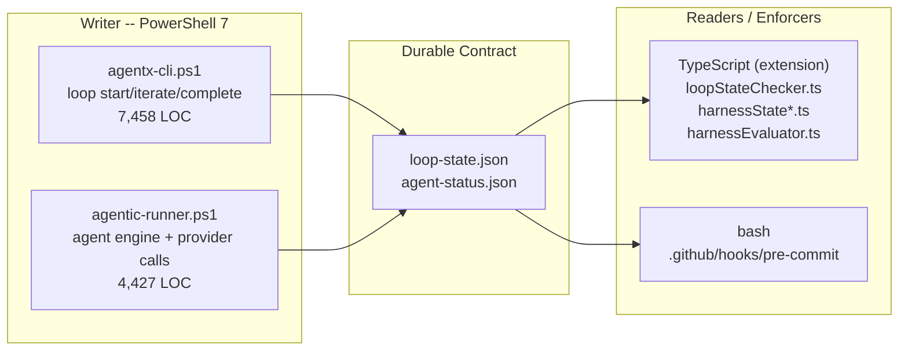
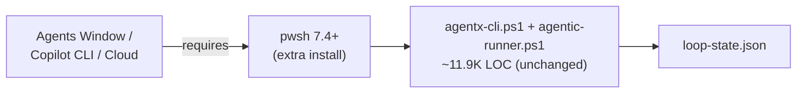
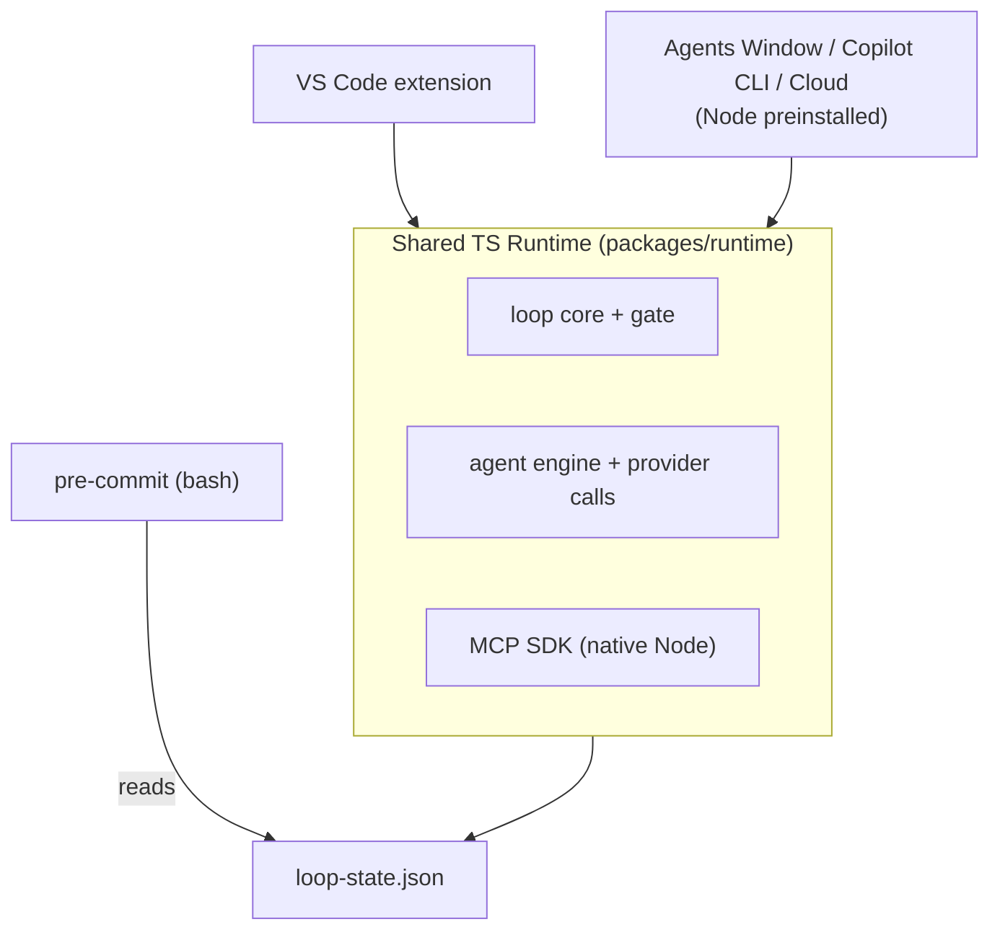
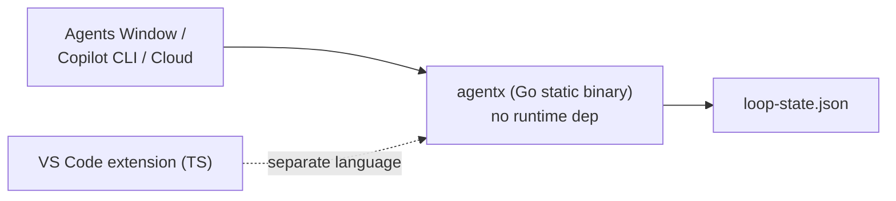
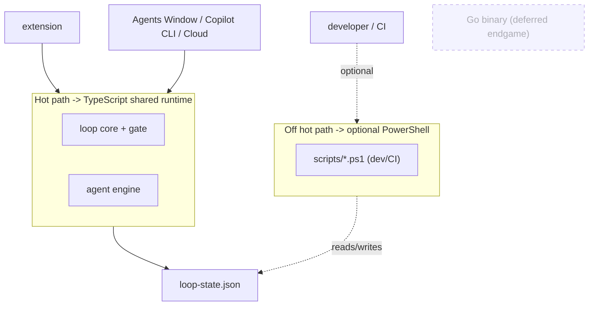
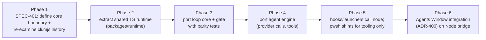

# ADR-401: AgentX CLI Runtime Selection (PowerShell vs TypeScript/Node vs Go)

**Status**: Proposed
**Date**: 2026-05-29
**Deciders**: AgentX Architect (with Model Council)
**Issue**: #401
**Related**: [ADR-341](ADR-341.md) (always-on Node host), [ADR-400](ADR-400.md) (Agents Window integration), [SPEC-400](../specs/SPEC-400.md) s.1.1 + s.5
**Council**: [COUNCIL-401.md](COUNCIL-401.md)

---

## Context

The user request: *"before we move to Agents Window, implement the best possible approach for AgentX -- deep research on whether to port to TypeScript, keep PowerShell, or port to Go for effective execution and enforcement."*

This decision is a prerequisite to the Agents Window work (ADR-400) because ADR-400 Option C ships a **CLI bridge** whose runtime must be reliably present inside the VS Code Agents Window, Copilot CLI, and Copilot Cloud agent runtimes. The enforcement-critical path -- the quality loop gate (`loop start` / `iterate` / `complete` / `status`) -- must run on a runtime those surfaces are guaranteed to have, or the gate becomes silently skippable.

### Current Architecture (verified 2026-05-29)

The runtime is **not** monolithic PowerShell. Enforcement already spans three languages around a single durable JSON contract (`.agentx/state/loop-state.json`):

| Fact | Evidence | Source / Verification |
|------|----------|------------------------|
| The CLI brain already replaced a Node implementation | `agentx-cli.ps1` header: "Replaces cli.mjs" | `.agentx/agentx-cli.ps1` L1-12, 2026-05-29 |
| PowerShell footprint | 182 `.ps1` files / 40,127 LOC | repo scan, 2026-05-29 |
| Enforcement-critical core | `agentx-cli.ps1` 7,458 LOC + `agentic-runner.ps1` 4,427 LOC = ~11.9K LOC | LOC count, 2026-05-29 |
| Long-tail tooling | `scripts/*.ps1` = 4,299 LOC (dev/CI helpers, not on the runtime hot path) | LOC count, 2026-05-29 |
| Editor-time enforcement is already TypeScript | `loopStateChecker.ts`, `harnessState*.ts`, `harnessEvaluator.ts` read `loop-state.json` | `vscode-extension/src/utils/`, 2026-05-29 |
| Commit-time gate is bash, not PowerShell | `#!/usr/bin/env bash` | `.github/hooks/pre-commit` L1, 2026-05-29 |
| Institutional precedent set | ADR-341: "we will not introduce a third runtime stack"; chose Node host; MCP SDK is Node/Python-first; PowerShell MCP parity is "a permanent tax" | `ADR-341.md` L43-123, 2026-05-29 |
| Extension is Node/TypeScript | `main: ./out/extension.js`, `engines.vscode ^1.85.0` | `vscode-extension/package.json`, 2026-05-29 |

### AI-First Assessment (mandatory)

This is an infrastructure/runtime decision, not a product feature; GenAI does not *replace* the runtime. However, the runtime choice directly shapes AgentX's AI capability surface: the agent engine (`agentic-runner.ps1`) calls GitHub Models, Copilot, OpenAI, and Anthropic APIs and routes tool calls. The decisive AI consideration is **MCP SDK availability**: the Model Context Protocol SDK is Node/Python-first (per ADR-341). A runtime aligned with Node makes every future MCP tool and agent-framework integration cheaper; a runtime that is not (PowerShell, Go) pays a recurring "MCP tax." This is captured as a first-class evaluation criterion below.

### Constraints

- Cross-platform parity required: Windows, macOS, Linux, plus headless Copilot CLI / Cloud runtimes.
- The quality-loop gate must run on a runtime guaranteed present in the Agents Window surfaces (ADR-400).
- ADR-341 standing constraint: do not introduce a third runtime stack solely for one surface.
- The durable contract (`loop-state.json`) and its file-backed state directories must remain process- and language-agnostic.
- A full rewrite must not regress the existing enforcement behavior (min-5-iteration gate, subagent-review history check, stale/stuck detection).

### Quality Attributes (prioritized)

| # | Attribute | Why it dominates |
|---|-----------|------------------|
| 1 | Enforcement integrity in Agents Window | The gate must not be silently skippable on mac/Linux/Cloud |
| 2 | Runtime availability (preinstall) | Copilot CLI/Cloud ship Node; PowerShell 7 is an extra install |
| 3 | Language unification with the extension | Reduce the writer/reader drift that already exists |
| 4 | MCP / agent-framework leverage | Node-first SDK ecosystem |
| 5 | Migration cost & risk | ~11.9K LOC core; re-migration history raises caution |
| 6 | Install footprint & startup latency | Hooks fire frequently; cold start matters |
| 7 | Maintainability / two-language tax | Fewer languages on the hot path is better |

---

## Options Considered

### Option A: Keep PowerShell 7 (status quo + hardening)

Retain `agentx-cli.ps1` and `agentic-runner.ps1` as the runtime. Add a session-start preflight check that fails fast when `pwsh` is absent, document the PowerShell 7.4+ requirement on every surface, and add a bash fallback shim only where a surface cannot guarantee `pwsh`.

**Pros**: zero rewrite; preserves the only validated enforcement implementation; smallest immediate change; keeps the recently-stabilized pwsh codebase (see `memories/pitfalls.md` pwsh-syntax fixes).
**Cons**: PowerShell 7 is **not** guaranteed in Copilot CLI/Cloud runtimes -- the gate can silently no-op there; perpetuates the writer(PS)/reader(TS) language split; pays the ADR-341 MCP tax on the agent engine; leaves the strategic question unresolved before the Agents Window work depends on it.
**Effort**: XS - **Risk**: Medium (enforcement gap on non-pwsh surfaces).

### Option B: Port the enforcement-critical core to TypeScript/Node (shared runtime)

Move the loop core (`loop start/iterate/complete/status` + gate logic) and the agent engine (`agentic-runner.ps1`) into the **shared TypeScript runtime** that ADR-341 already mandates (`packages/runtime/` or `vscode-extension/src/runtime/`). Hooks and launchers call `node`/`npx`. The PowerShell launchers become thin shims; the extension consumes the same runtime package directly instead of through the JSON file only.

**Pros**: unifies the runtime with the existing extension (one language on the hot path); Node is preinstalled in Copilot CLI/Cloud, so the gate runs everywhere; directly realizes the ADR-341 shared-runtime direction; native MCP SDK removes the MCP tax; collapses the writer/reader split (extension can call the runtime in-process).
**Cons**: ~11.9K LOC rewrite of validated enforcement code -- highest-risk surface; reverses the prior cli.mjs->ps1 migration, so the original migration drivers must be re-examined and not silently reintroduced; requires careful behavior-parity testing of the gate; PowerShell long-tail scripts still exist (two languages remain in the repo, though off the hot path).
**Effort**: L - **Risk**: Medium-High (rewrite of enforcement core; mitigated by the existing JSON contract and TS test harness).

### Option C: Port to Go (single static binary)

Rewrite the CLI as a single statically-linked Go binary shipped per-platform. Zero runtime dependency, fastest cold start, trivial distribution.

**Pros**: zero runtime preinstall -- the gate runs anywhere a binary can; fastest startup for frequently-fired hooks; smallest and most portable distribution artifact; strong static typing and concurrency.
**Cons**: introduces a **third runtime stack**, which ADR-341 explicitly forbids; the MCP/agent-framework SDK is Node/Python-first, so Go pays a *worse* MCP tax than PowerShell; cannot share code with the TS extension -- doubles the maintenance surface as the agent ecosystem evolves; a second full re-migration (Node->PS->Go) with the largest rewrite and the least code reuse; per-platform binary build/sign/distribute pipeline is new operational work.
**Effort**: XL - **Risk**: High (third stack, MCP tax, zero code reuse).

### Option D: Hybrid -- TS for the enforcement core, PowerShell retained for long-tail tooling (RECOMMENDED)

Adopt Option B's TypeScript shared runtime **only** for the enforcement-critical and agent-engine path. Keep the ~4,299 LOC of `scripts/*.ps1` dev/CI helpers and the long tail of one-off `.ps1` utilities as optional PowerShell tooling -- they are not on the Agents Window hot path and do not gate commits. Position Go as a deferred, separately-decided endgame for a distributable zero-dependency binary, only if Node preinstall ever proves insufficient.

**Pros**: puts the runtime that *must* be present (the gate) on Node, which the Agents Window surfaces preinstall, closing the enforcement gap; bounds the rewrite to the ~11.9K LOC that matters rather than all 40K LOC; avoids the ADR-341 third-stack violation; preserves working PowerShell tooling without forcing a big-bang rewrite; keeps a clean, separately-justified door open to Go later.
**Cons**: the repo remains bilingual (TS hot path + PS tooling), so contributors need both for full-repo work; the boundary between "core" and "tooling" must be drawn precisely or scope creeps; still a substantial core rewrite with parity risk.
**Effort**: L - **Risk**: Medium.

---

## Evaluation

Weighted against the prioritized quality attributes (5 = best). Weights reflect the attribute priority order in Context.

| Criterion (weight) | A: PowerShell | B: TypeScript | C: Go | D: Hybrid (TS core) |
|--------------------|:-------------:|:-------------:|:-----:|:-------------------:|
| Enforcement integrity in Agents Window (x5) | 2 | 5 | 5 | 5 |
| Runtime availability / preinstall (x5) | 2 | 5 | 4 | 5 |
| Language unification with extension (x4) | 1 | 5 | 1 | 4 |
| MCP / agent-framework leverage (x4) | 2 | 5 | 1 | 5 |
| Migration cost & risk (x3) | 5 | 2 | 1 | 3 |
| Install footprint & startup latency (x2) | 3 | 3 | 5 | 3 |
| Maintainability / two-language tax (x2) | 3 | 4 | 2 | 3 |
| **Weighted total (max 125)** | **51** | **104** | **70** | **107** |

Scoring notes: A loses heavily on the two highest-weighted attributes (the gate is not guaranteed to run on non-pwsh surfaces). C scores well on raw availability/startup but is capped by the third-stack violation, the worse MCP tax, and zero code reuse. B and D are close; D edges B by bounding migration risk to the core while preserving working tooling, at a small maintainability cost.

---

## Decision

**Adopt Option D**: port the **enforcement-critical core and agent engine to the shared TypeScript/Node runtime** mandated by ADR-341, while **retaining the PowerShell long-tail dev/CI scripts as optional tooling**, and **defer Go** as a separately-justified future endgame for a distributable zero-dependency binary.

[Confidence: MEDIUM-HIGH] for the TypeScript core direction (strongly supported by ADR-341 precedent, existing TS enforcement surfaces, and Node preinstall in target runtimes). [Confidence: MEDIUM] for the precise core/tooling boundary (must be ratified in SPEC-401). [Confidence: LOW] for Go ever being needed (kept only as a contingency).

This decision is consistent with the Model Council consensus recorded in [COUNCIL-401.md](COUNCIL-401.md): the Analyst and Strategist both ranked the TypeScript shared runtime first; the Skeptic's strongest objection -- that a second re-migration of validated enforcement code is the real risk, not the language -- is accepted and addressed by bounding scope to the core and requiring behavior-parity tests against the existing `loop-state.json` contract before cutover.

### Why not the others

- **A (PowerShell)** fails the single most important attribute: the quality-loop gate is not guaranteed to execute in Copilot CLI/Cloud, making the core enforcement promise silently skippable on exactly the surfaces ADR-400 targets.
- **C (Go)** violates the standing ADR-341 "no third runtime stack" constraint, pays a *larger* MCP tax than PowerShell, shares no code with the extension, and is the largest rewrite -- a poor trade for marginal startup/footprint gains.
- **B (full TypeScript)** is the right direction but a bigger blast radius than necessary; D delivers the same strategic benefit while ring-fencing migration risk.

---

## Consequences

### Positive

- The quality-loop gate runs on Node, which the Agents Window, Copilot CLI, and Copilot Cloud preinstall -- the ADR-400 CLI bridge and SPEC-400 s.5 Hooks lifecycle become reliable cross-platform.
- The writer/reader language split collapses: the extension can consume the loop core in-process instead of only through the JSON file.
- Native MCP SDK eliminates the recurring MCP tax flagged in ADR-341.
- Migration risk is bounded to ~11.9K LOC of core rather than the full 40K LOC.

### Negative / Trade-offs (accepted)

- The repository remains bilingual (TS hot path + PowerShell tooling); full-repo contributors need both runtimes.
- A core rewrite of validated enforcement code carries parity risk; mitigated by the durable JSON contract and the existing TS test harness (`loopStateChecker.test.ts`, `harnessEvaluator.test.ts`).
- This is the *second* re-migration of the CLI brain (Node -> PowerShell -> TypeScript). The original cli.mjs->ps1 drivers MUST be re-examined in SPEC-401 so they are not silently reintroduced. (Council Skeptic finding; promoted to the risk register.)

### Failure Modes & Vendor Risks (from Model Council)

| Risk | Source | Mitigation |
|------|--------|------------|
| Re-migration silently reintroduces the problem cli.mjs was retired to fix | Skeptic | SPEC-401 must document the original cli.mjs->ps1 rationale and prove the TS design avoids it before cutover |
| Behavior drift in the gate during port (min-iteration, review-history, stale/stuck) | Analyst | Golden-file parity tests against `loop-state.json`; run old and new writers against the same fixtures |
| Node version skew across Copilot CLI/Cloud/local | Skeptic | Pin a Node LTS floor; preflight check; document in SPEC-401 Selected Tech Stack |
| Core/tooling boundary creep (more PS scripts pulled onto the hot path) | Strategist | SPEC-401 enumerates the exact files in the core; anything else stays tooling |
| Two-runtime contributor friction | Skeptic | Keep PowerShell tooling optional and non-gating; document the split clearly |

### Migration / Sequencing

### Impact on related artifacts

- **SPEC-400** s.1.1 (Selected Tech Stack) and s.5 (Hooks lifecycle) must be amended: the CLI bridge runtime becomes Node/TypeScript, not PowerShell 7.4+.
- **ADR-341** is reinforced, not contradicted: this ADR extends the shared-TS-runtime direction from the daemon surface to the CLI core.
- **SPEC-401** will carry the implementation-facing detail: exact file boundary, Node LTS floor, parity-test plan, and the cli.mjs post-mortem.

---

## References

### External sources (verified 2026-05-29)

- Node.js Release schedule / LTS policy: https://nodejs.org/en/about/previous-releases -- basis for the Node LTS floor pin and version-skew mitigation
- Model Context Protocol SDK availability (Node/Python-first): https://modelcontextprotocol.io/docs/sdk -- basis for the native-MCP advantage of the TypeScript runtime and the MCP-tax on PowerShell/Go
- Go distribution model (single static binary): https://go.dev/doc/install -- basis for the deferred Option C zero-dependency endgame

### Internal artifacts

- [ADR-341](ADR-341.md) -- always-on Node host; "no third runtime stack"; MCP-tax rationale
- [ADR-400](ADR-400.md) / [SPEC-400](../specs/SPEC-400.md) -- Agents Window integration + CLI bridge
- [COUNCIL-401.md](COUNCIL-401.md) -- Model Council deliberation
- `.agentx/agentx-cli.ps1` (L1-12 "Replaces cli.mjs"), `.agentx/agentic-runner.ps1` (agent engine)
- `vscode-extension/src/utils/loopStateChecker.ts`, `harnessState*.ts`, `harnessEvaluator.ts` -- existing TS enforcement readers
- `.github/hooks/pre-commit` -- bash commit-time gate
