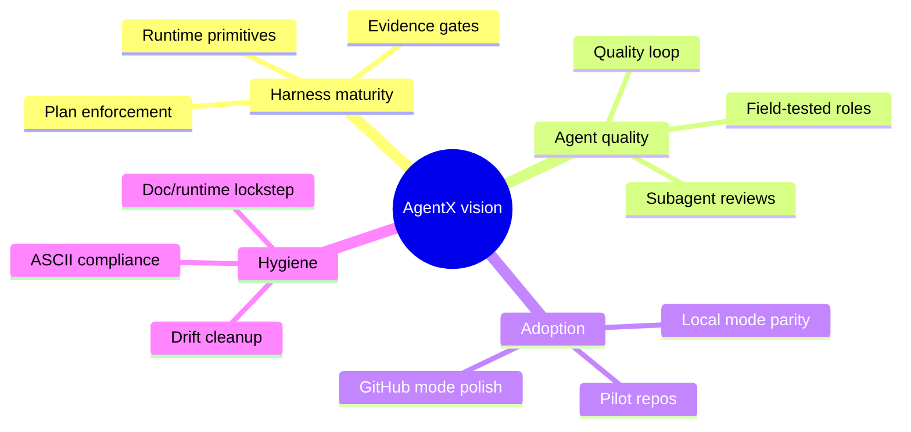
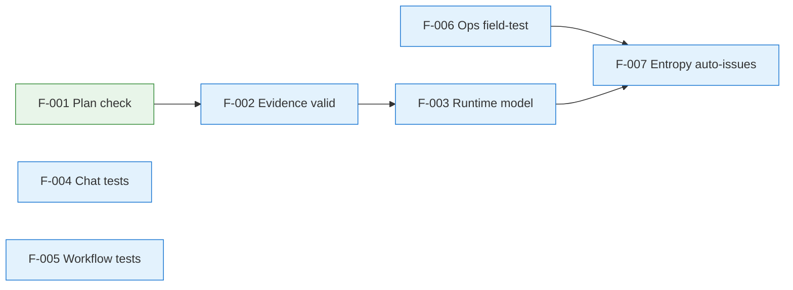
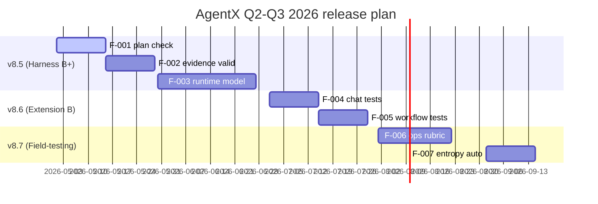
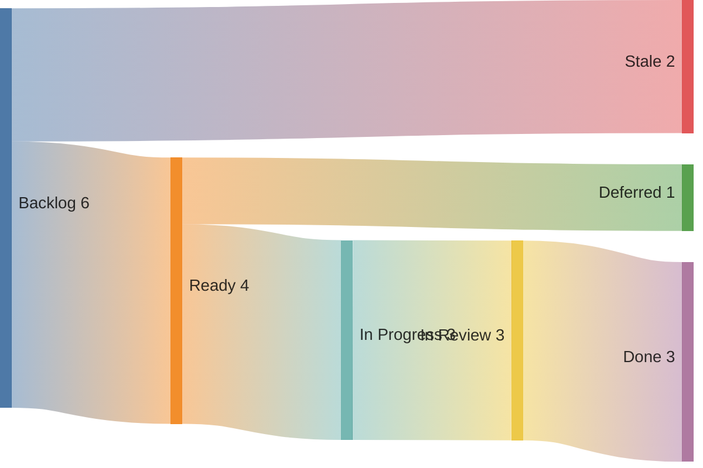
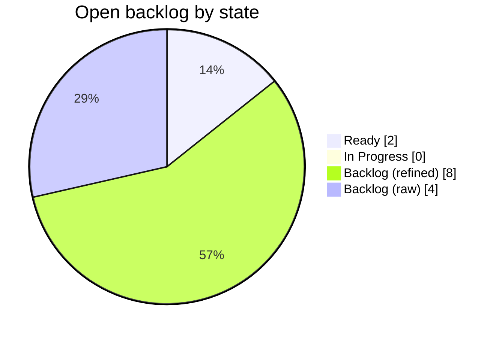

<!-- Inputs: AgentX, jnPiyush, 2026-05-01, Q2-Q3 2026 -->

# Product Backlog: AgentX

> **Owner**: jnPiyush
> **Last updated**: 2026-05-01
> **Planning horizon**: Q2-Q3 2026
> **Source of truth**: This file (rollup) + GitHub Issues / Projects V2 (authoritative status)
> **Template**: [.github/templates/BACKLOG-TEMPLATE.md](../../../.github/templates/BACKLOG-TEMPLATE.md)

This is the live product backlog for AgentX itself. Update this file whenever items are added, re-prioritized, or completed. The full template (with all sections, frameworks, and rich diagrams) lives at the link above.

---

## 1. Vision and North Star

- **Vision**: An open, agent-native engineering harness that turns a single workspace into an autonomous, durable, multi-agent SDLC pipeline.
- **North Star metric**: Issues completed end-to-end (Backlog -> Done) per active workspace per week, with quality loop passing on first review.
- **Strategic outcomes (Q2-Q3 2026)**:
  - Harness enforcement reaches B+ across plan, evidence, and runtime gates
  - VS Code extension test coverage moves from C to B
  - All 21 agents pass field-test rubric in 3+ pilot repos
  - Documentation and runtime stay in lockstep (no drift > 1 release)
- **Non-goals**: replacing GitHub/ADO as the issue tracker; building a hosted SaaS; supporting non-VS Code editors as primary surface.

---

## 2. Active Backlog

### 2.1 Epics

| ID | Title | Outcome | Status | Priority | Target | Owner | Notes |
|----|-------|---------|--------|----------|--------|-------|-------|
| E-001 | Harness enforcement to B+ | Plan + evidence + runtime gates active | Discovery | P0 | Q2 2026 | jnPiyush | TD-012, TD-013, TD-015 |
| E-002 | VS Code extension test coverage | Coverage C -> B; chat + workflow paths covered | Backlog | P1 | Q3 2026 | jnPiyush | TD-001 |
| E-003 | Preview agent field-testing | 7 internal sub-agents reach B+ | Backlog | P1 | Q3 2026 | jnPiyush | TD-005 |
| E-004 | Drift cleanup automation | Doc-gardening + entropy remediation in CI | Backlog | P2 | Q3 2026 | jnPiyush | TD-014 |

### 2.2 Features (current + next quarter)

| ID | Epic | Title | RICE | MoSCoW | Status | Owner | ETA |
|----|------|-------|------|--------|--------|-------|-----|
| F-001 | E-001 | Mechanical execution-plan presence check in pre-commit | 360 | Must | Ready | jnPiyush | 2026-05-15 |
| F-002 | E-001 | Evidence-link validation in quality-gates.yml | 320 | Must | Backlog | jnPiyush | 2026-05-30 |
| F-003 | E-001 | Thread/turn/item runtime model in extension | 280 | Should | Backlog | jnPiyush | 2026-06-30 |
| F-004 | E-002 | Chat participant test suite | 240 | Must | Backlog | jnPiyush | 2026-07-15 |
| F-005 | E-002 | Workflow command regression suite | 200 | Should | Backlog | jnPiyush | 2026-07-30 |
| F-006 | E-003 | GitHub Ops + ADO Ops field-test rubric | 180 | Must | Backlog | jnPiyush | 2026-08-15 |
| F-007 | E-004 | Weekly entropy report -> auto-issue creation | 150 | Could | Backlog | jnPiyush | 2026-09-15 |

### 2.3 Stories (current sprint)

| ID | Feature | Title | Points | Status | Owner | Issue |
|----|---------|-------|--------|--------|-------|-------|
| S-001 | F-001 | Add execution-plan presence check to pre-commit hook | 3 | Ready | jnPiyush | TBD |
| S-002 | F-001 | Plan-freshness check (>= 1 update per active week) | 2 | Ready | jnPiyush | TBD |
| S-003 | F-002 | Add evidence-file link validator to quality-gates.yml | 5 | Backlog | jnPiyush | TBD |
| S-004 | (this work) | BACKLOG-TEMPLATE.md + repo backlog file | 2 | Done | jnPiyush | (this commit) |

### 2.4 Bugs

| ID | Title | Severity | Status | Owner | Reported |
|----|-------|----------|--------|-------|----------|
| (none open) | | | | | |

### 2.5 Spikes

| ID | Question | Time-box | Status | Owner | Findings |
|----|----------|----------|--------|-------|----------|
| K-001 | Can we auto-derive evidence freshness from git log without timestamps drift? | 2 days | Open | jnPiyush | pending |

---

## 3. Prioritization (RICE - current quarter)

| ID | Title | Reach | Impact | Confidence | Effort (wks) | RICE | Rank |
|----|-------|-------|--------|------------|-------------|------|------|
| F-001 | Plan presence check | 100 | 3 | 0.9 | 0.75 | 360 | 1 |
| F-002 | Evidence link validation | 100 | 3 | 0.8 | 0.75 | 320 | 2 |
| F-003 | Runtime thread/turn model | 100 | 3 | 0.7 | 0.75 | 280 | 3 |
| F-004 | Chat test suite | 100 | 2 | 0.8 | 0.67 | 240 | 4 |
| F-005 | Workflow regression suite | 100 | 2 | 0.7 | 0.7 | 200 | 5 |

---

## 4. Dependency Graph

---

## 5. Release Plan

---

## 6. Flow Metrics (last 30 days)

---

## 7. Backlog Health

---

## 8. Definitions

- **DoR / DoD / INVEST**: see [.github/templates/BACKLOG-TEMPLATE.md](../../../.github/templates/BACKLOG-TEMPLATE.md) sections 4-6
- **Tech-debt items** referenced (TD-*) are in [docs/tech-debt-tracker.md](../../tech-debt-tracker.md)
- **Status field** values: Backlog, Ready, In Progress, In Review, Validating, Done (see [docs/WORKFLOW.md](../../WORKFLOW.md))

---

## 9. Refinement Cadence

| Ceremony | Frequency | Outcome |
|----------|-----------|---------|
| Self-refinement | Weekly | Top 5 stories meet DoR |
| Self-review (loop) | Per task | All gates pass, subagent review APPROVED |
| Quality score audit | Per release | docs/QUALITY_SCORE.md updated |
| Tech-debt review | Per release | docs/tech-debt-tracker.md updated |
