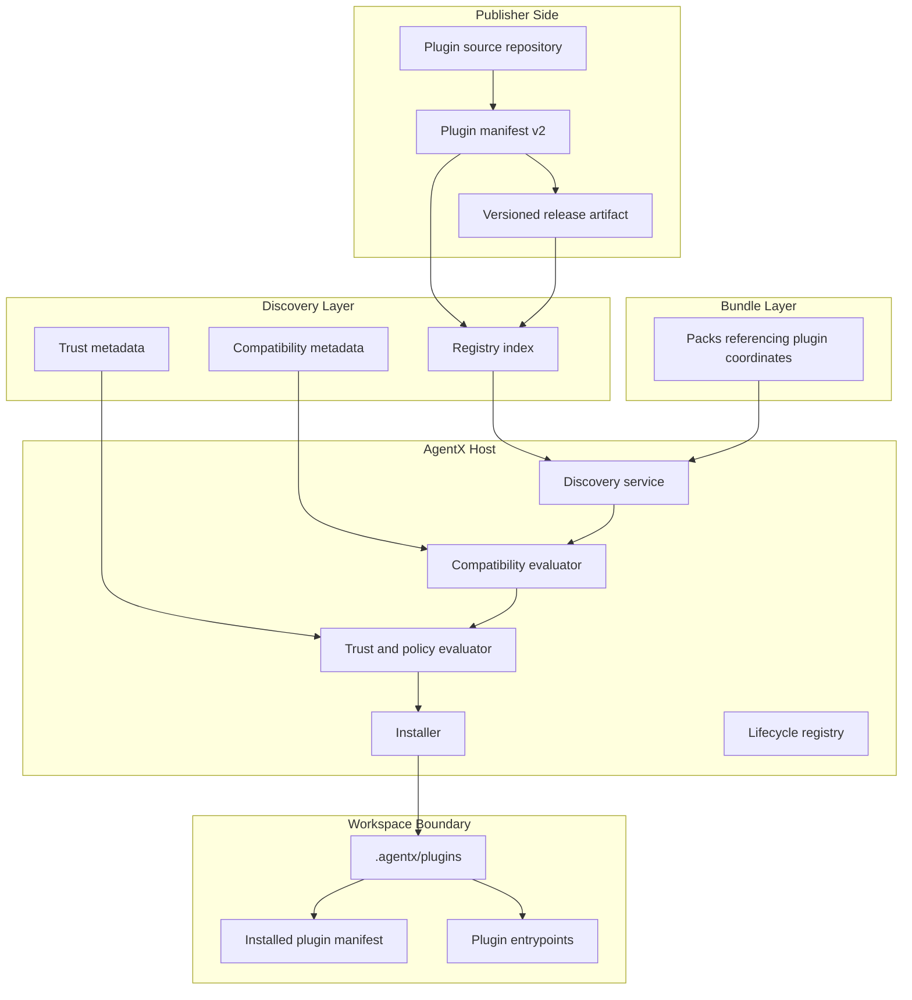
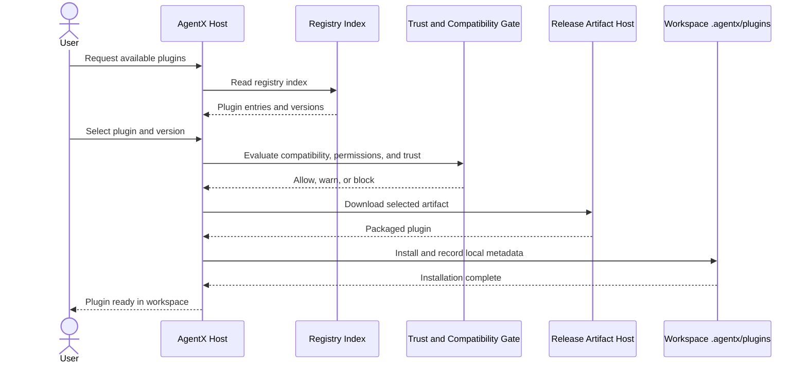
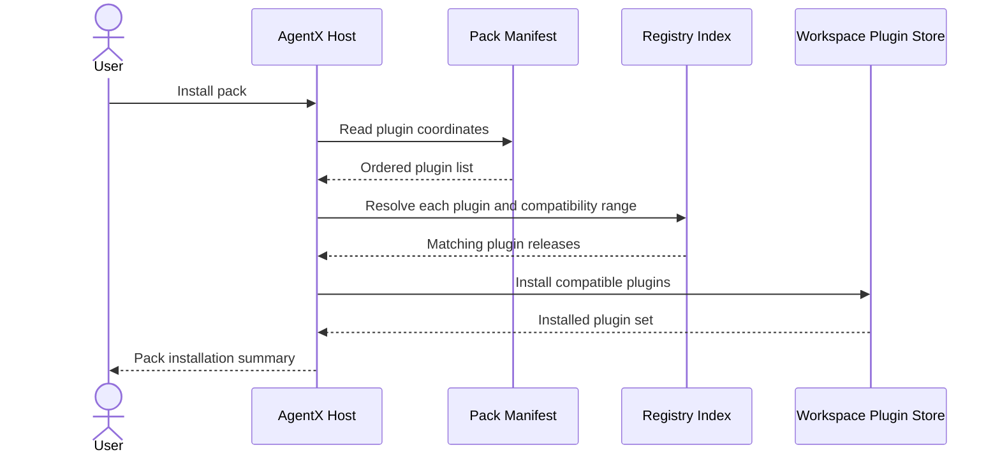
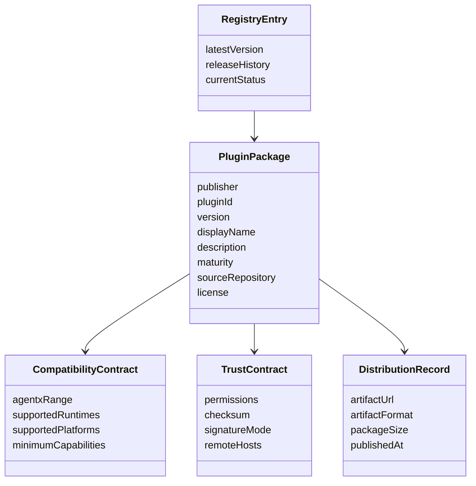
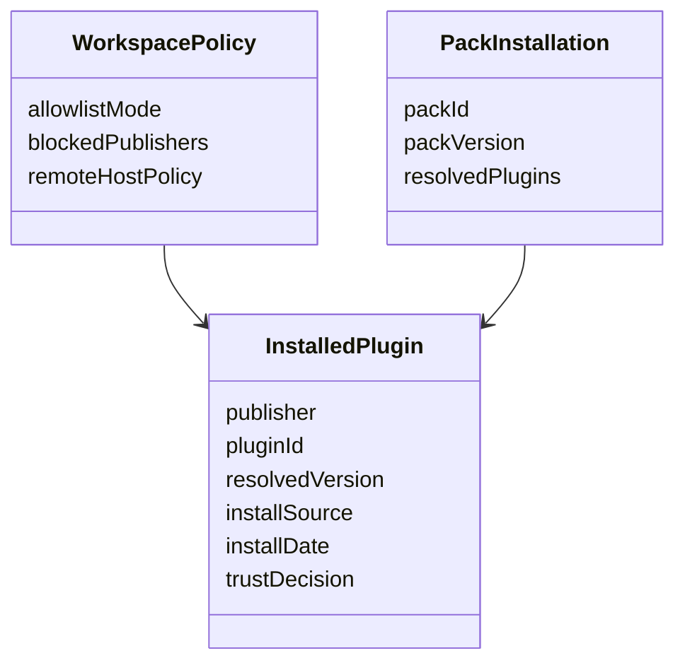
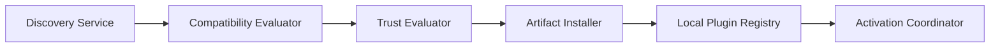
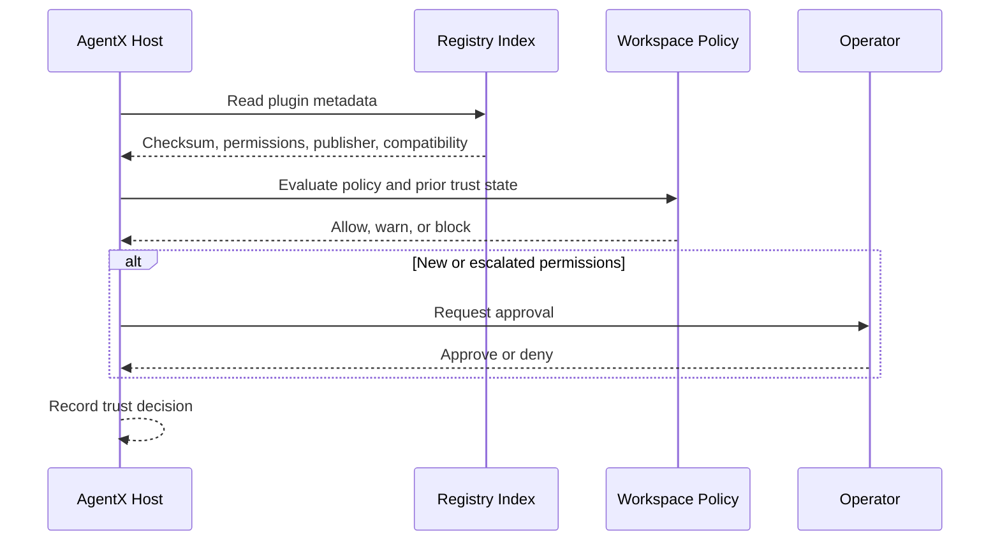

# Technical Specification: AgentX Plugin Publication Platform

**Issue**: #234
**Epic**: N/A
**Status**: Draft
**Author**: AgentX Auto
**Date**: 2026-03-18
**Related ADR**: [ADR-234.md](../adr/ADR-234.md)
**Related UX**: N/A

> **Acceptance Criteria**: Defined by issue #234. This specification covers the package, registry, compatibility, trust, and rollout contract for independently publishable plugins on top of AgentX core.

---

## Table of Contents

1. [Overview](#1-overview)
2. [Architecture Diagrams](#2-architecture-diagrams)
3. [API Design](#3-api-design)
4. [Data Model Diagrams](#4-data-model-diagrams)
5. [Service Layer Diagrams](#5-service-layer-diagrams)
6. [Security Diagrams](#6-security-diagrams)
7. [Performance](#7-performance)
8. [Testing Strategy](#8-testing-strategy)
9. [Implementation Notes](#9-implementation-notes)
10. [Rollout Plan](#10-rollout-plan)
11. [Risks & Mitigations](#11-risks--mitigations)
12. [Monitoring & Observability](#12-monitoring--observability)
13. [AI/ML Specification](#13-aiml-specification-if-applicable)
14. [MCP Server Specification](#14-mcp-server-specification-if-applicable)
15. [MCP App Specification](#15-mcp-app-specification-if-applicable)

---

## 1. Overview

This specification defines how AgentX evolves from a repo-local plugin catalog into a publishable plugin platform. The design keeps `agentx-core` as the runtime host, introduces independently versioned plugin packages, adds a registry-based discovery model, and preserves workspace-local installation into `.agentx/plugins`.

**Scope:**
- In scope: plugin identity, packaging contract, compatibility model, discovery model, trust model, installation lifecycle, pack composition, and rollout sequencing
- Out of scope: implementation code, marketplace ratings, billing, and non-plugin extension publication mechanics

**Success Criteria:**
- Plugin authors can publish independent plugin releases without changing the AgentX repo archive
- AgentX can decide whether a plugin is compatible and trustworthy before installation
- Existing local-first workspace installation remains the final activation boundary

### 1.1 Selected Tech Stack (REQUIRED before implementation)

> Engineers SHOULD NOT start implementation until this table is completed and the chosen stack is explicit.

| Layer / Concern | Selected Technology | Version / SKU | Why This Was Chosen | Rejected Alternatives |
|-----------------|---------------------|---------------|---------------------|-----------------------|
| Frontend / UI | Existing AgentX VS Code QuickPick and CLI prompt surfaces | AgentX 8.4.x host line | Reuses current operator surfaces and keeps plugin install local to the workspace | Dedicated marketplace UI first |
| Backend / Runtime | Existing AgentX TypeScript host plus PowerShell, Bash, and Node plugin runtimes | Current repo runtime set | Preserves polyglot plugin support already present in AgentX | Node-only host contract |
| API Style | Static registry index over HTTPS plus release artifact downloads | Versioned registry schema v1 | Simple to host, cache, mirror, and validate | Custom live marketplace API first |
| Data Store | Versioned registry index and release metadata | GitHub-backed phase 1 | Avoids new database infrastructure in the first release | Dedicated metadata service database |
| Hosting / Compute | GitHub repository and GitHub Releases for phase 1 | Existing repo host | Matches current distribution and contributor workflow | npm-only distribution, bespoke hosting |
| Authentication / Security | Publisher identity, compatibility gate, checksum verification, optional signature verification, allowlist policy | Manifest v2 and registry policy | Adds deterministic trust and policy controls before install | Implicit trust based on source archive only |
| Observability | Existing extension and CLI logs plus future install outcome telemetry | Current logging surfaces with future event schema | Keeps first phase lightweight while enabling later reporting | Central telemetry service first |
| CI/CD | GitHub Actions release and validation workflows | Existing repo automation model | Consistent with current release practices | Separate package-manager-specific release system |

**Implementation Preconditions:**
- The selected stack above is consistent with the ADR decision.
- Major runtime and host boundaries are explicit.
- Any unresolved trust-signing detail is captured as an open rollout dependency rather than hidden.

---

## 2. Architecture Diagrams

### 2.1 High-Level System Architecture

**Component Responsibilities:**
| Layer | Responsibility | Notes |
|-------|---------------|-------|
| Publisher Side | Build package metadata and release artifact | Owned by plugin publisher |
| Discovery Layer | Describe what exists and which versions are compatible | Registry index can be mirrored |
| AgentX Host | Resolve, validate, install, and track plugins | Lives inside VS Code extension and CLI workflows |
| Workspace Boundary | Final installed plugin state | Preserves local-first reviewability |
| Bundle Layer | Compose packs from independent plugin coordinates | Packs stay above plugins |

### 2.2 Sequence Diagram: Plugin Discovery And Installation

### 2.3 Sequence Diagram: Pack Resolution

---

## 3. API Design

AgentX phase 1 does not require a live service API. It uses versioned documents and downloadable artifacts.

### 3.1 Registry Resources

| Resource | Purpose | Required Fields | Notes |
|----------|---------|-----------------|-------|
| Registry index | Discoverable list of plugins and available releases | plugin id, publisher, version list, compatibility range, artifact location, checksum, trust metadata | Must be cacheable and mirrorable |
| Plugin package manifest v2 | Contract for one plugin release | id, publisher, version, engines, capabilities, permissions, runtimes, distribution, source metadata | Replaces the current minimal manifest as the publication contract |
| Pack manifest | Curated bundle of plugin coordinates | pack id, version, included plugin coordinates, compatibility envelope | Packs must not hide plugin identity |
| Installed plugin record | Local workspace state | resolved version, source, install date, trust decision, permission state | Stored inside workspace runtime state |

### 3.2 Required Manifest Extensions

| Field Group | Purpose |
|-------------|---------|
| Identity | Stable `publisher` + `id` + `version` tuple |
| Compatibility | `engines.agentx`, supported runtimes, host surface requirements |
| Capabilities | Declares what the plugin contributes: tool, skill, workflow, agent, channel, pack extension, future MCP surfaces |
| Permissions | Declares filesystem, network, process, secret, and remote-host needs |
| Distribution | Artifact URL, checksum, optional signature metadata, package size, packaged files summary |
| Provenance | source repository, license, homepage, issue tracker, author/maintainer metadata |

### 3.3 Compatibility Contract

| Rule | Behavior |
|------|----------|
| Host range mismatch | Block install by default |
| Runtime missing but optional | Warn and allow user override only if policy permits |
| Runtime missing and required | Block install |
| Permission escalation compared to prior installed version | Require explicit re-approval |
| Pack includes conflicting plugin ranges | Fail resolution with a clear conflict summary |

---

## 4. Data Model Diagrams

### 4.1 Publication Model

### 4.2 Local Installation Model

---

## 5. Service Layer Diagrams

### 5.1 Host Services

**Service Responsibilities:**
| Service | Responsibility |
|---------|----------------|
| Discovery Service | Read registry and pack manifests, surface candidate plugins |
| Compatibility Evaluator | Check host version, runtime availability, and pack constraints |
| Trust Evaluator | Check checksum, signature mode, publisher policy, and permissions |
| Artifact Installer | Download, unpack, and place plugin contents into workspace `.agentx/plugins` |
| Local Plugin Registry | Record installed versions and user trust decisions |
| Activation Coordinator | Hand the installed plugin to the existing runtime activation path |

### 5.2 Lifecycle States

| State | Meaning |
|-------|---------|
| Discovered | Visible in registry but not yet selected |
| Resolved | A concrete compatible release has been selected |
| Verified | Trust and compatibility checks passed |
| Installed | Artifact is unpacked into workspace plugin storage |
| Activated | Plugin entrypoints are available to AgentX |
| Deprecated | Plugin remains installable only by override or migration path |
| Blocked | Compatibility or trust rules rejected the plugin |

---

## 6. Security Diagrams

### 6.1 Trust Gate Sequence

### 6.2 Security Requirements

| Concern | Requirement |
|---------|-------------|
| Supply chain | Every published artifact must include checksum metadata; signature support is designed into the contract |
| Publisher identity | Publisher-qualified plugin ids are mandatory |
| Permission visibility | Install prompt must summarize filesystem, network, process, and secret access requested |
| Remote execution risk | Plugins that call remote hosts must declare the host set for policy evaluation |
| Upgrade safety | Permission changes require re-approval |
| Enterprise governance | Registry mirrors and allowlists must be possible without changing plugin ids |

---

## 7. Performance

| Objective | Target | Notes |
|-----------|--------|-------|
| Registry fetch | Low-latency cached read | Registry index should be static and cache-friendly |
| Install resolution | Single compatible plugin resolved without manual conflict analysis in common case | Pack conflict cases can be slower but must remain deterministic |
| Startup impact | No plugin catalog fetch on normal host startup unless explicitly required | Preserve current startup discipline |
| Offline resilience | Previously installed plugins remain usable without registry access | Discovery may degrade, activation must not |

**Performance Strategy:**
- Keep the registry format static and compressible
- Cache registry metadata with freshness windows
- Separate discovery from activation so plugin lookups do not run on every startup
- Preserve local installed metadata to avoid repeated trust prompts and compatibility checks when nothing changed

---

## 8. Testing Strategy

| Test Layer | Coverage |
|-----------|----------|
| Schema validation | Manifest v2 and registry index validation for required identity, compatibility, and trust fields |
| Installer unit tests | Artifact resolution, checksum mismatch handling, permission escalation handling, path normalization |
| Compatibility tests | Host-version range checks, runtime availability checks, pack conflict detection |
| Lifecycle tests | Install, reinstall, upgrade, uninstall, and rollback behavior |
| Backward compatibility tests | Existing local plugins and current workspace plugin folder behavior |
| Security tests | Tampered artifact detection, blocked publisher policy, remote-host policy enforcement |

**Coverage Priorities:**
- Highest priority: compatibility and tamper detection
- Next priority: upgrade and permission re-approval behavior
- Third priority: pack resolution and enterprise policy paths

---

## 9. Implementation Notes

### 9.1 Migration Shape

| Phase | Behavior |
|-------|----------|
| Phase 1 | Support both current local plugin folders and registry-backed packages |
| Phase 2 | Prefer registry-backed discovery in the Add Plugin workflow |
| Phase 3 | Deprecate repo-archive catalog installation except for explicit development mode |

### 9.2 Manifest Evolution

| Current Manifest Area | Gap | Required v2 Change |
|-----------------------|-----|--------------------|
| `name` only identity | No publisher scope | Add publisher-qualified plugin identity |
| `version` only | No host contract | Add `engines.agentx` and supported runtimes |
| `entry` only | No capability or permission envelope | Add capabilities and permissions |
| `source` only | Weak provenance | Add repository, homepage, bugs, license, maintainer metadata |
| No distribution block | No artifact verification | Add artifact location and checksum metadata |

### 9.3 Pack Role Clarification

Packs remain installable bundle definitions that reference plugin coordinates and compatible ranges. Packs do not replace plugin publication. Their role is curation, bootstrap convenience, and scenario-level composition.

---

## 10. Rollout Plan

| Phase | Outcome | Exit Criteria |
|-------|---------|---------------|
| 1. Contract Stabilization | Manifest v2 and registry schema defined | Validation rules are explicit and documented |
| 2. Discovery Refactor | Add Plugin resolves from registry instead of repo archive | Host can browse and select compatible published plugins |
| 3. Trust Enforcement | Checksums, permissions, and policy prompts active | Unsafe or incompatible plugins are blocked by default |
| 4. Pack Composition | Packs resolve through plugin coordinates | Bundles install without hiding plugin identity |
| 5. Enterprise Extensions | Registry mirroring and allowlist modes | Controlled environments can govern plugin sources |

---

## 11. Risks & Mitigations

| Risk | Impact | Mitigation |
|------|--------|------------|
| Plugin authors bypass trust metadata | High | Registry validation rejects incomplete publication metadata |
| Host compatibility drift | High | Mandatory `engines.agentx` check before install |
| Shell-based plugin safety concerns | High | Explicit permission and remote-host declarations plus checksum verification |
| Registry fragmentation | Medium | Keep stable plugin coordinates independent of host registry location |
| Over-complex phase 1 | Medium | Use static index and release artifacts first, not a live marketplace service |
| Pack dependency conflicts | Medium | Deterministic resolver and clear failure summaries |

---

## 12. Monitoring & Observability

| Signal | Purpose |
|--------|---------|
| Registry fetch outcome | Detect broken discovery paths |
| Compatibility rejection reason | Detect host/plugin contract friction |
| Trust rejection reason | Detect supply-chain or policy issues |
| Install success/failure | Measure rollout health |
| Upgrade path outcome | Detect permission and migration regressions |

**Observability Notes:**
- Start with local logs and summarized install diagnostics
- Add structured event categories before adding remote telemetry
- Keep future telemetry opt-in and policy-aware

---

## 13. AI/ML Specification (if applicable)

This platform serves an AI-agent ecosystem, but the publication contract itself should stay deterministic.

| Concern | Decision |
|---------|----------|
| LLM selection | Not applicable to the publication contract |
| Prompt architecture | Not applicable |
| Agent orchestration | Plugins may contribute agent workflows later, but the package contract should not depend on model behavior |
| Evaluation pipeline | Future plugin recommendation features may use AI, but compatibility and trust enforcement must remain rule-based |

**AI-first assessment:** Traditional plugin-registry patterns are preferred for the core platform because compatibility, provenance, and permissions need explicit verifiable metadata.

---

## 14. MCP Server Specification (if applicable)

MCP support is not required for phase 1, but the capability model should reserve space for plugins that contribute MCP server surfaces later.

| Concern | Decision |
|---------|----------|
| MCP tool declaration | Future capability flag |
| MCP resource declaration | Future capability flag |
| MCP runtime requirements | Must be declared through the compatibility contract before activation |

---

## 15. MCP App Specification (if applicable)

MCP App support is not required for phase 1. The package contract should still reserve a capability family for future interactive plugin experiences so the identity and trust model does not need a second redesign later.

| Concern | Decision |
|---------|----------|
| Interactive UI plugins | Future capability category |
| Additional trust needs | Must declare remote hosts and packaged assets |
| Host integration | Should remain compatible with the same publisher, compatibility, and trust contract as other plugins |