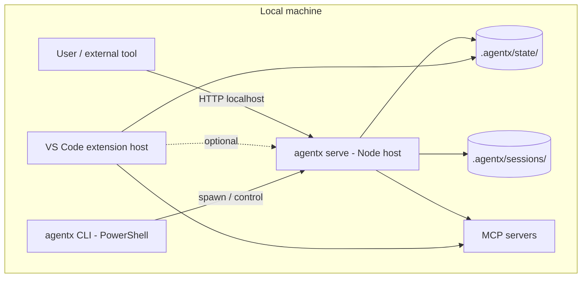
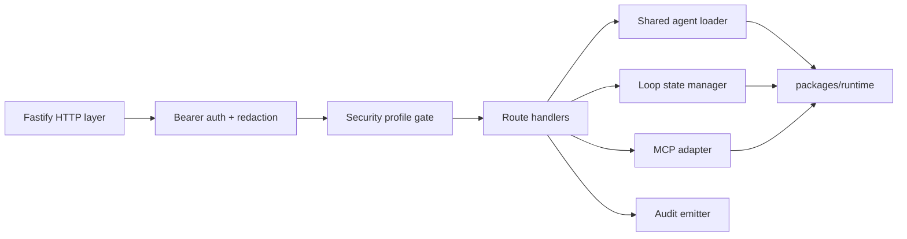

# Technical Specification: Self-Hosted Always-On Runtime Surface

**Issue**: #341
**Status**: Approved
**Author**: AgentX Auto (Architect phase)
**Date**: 2026-05-08
**Related ADR**: [ADR-341.md](../adr/ADR-341.md)
**Plan**: [EXEC-PLAN-341-self-hosted-runtime.md](../../execution/plans/EXEC-PLAN-341-self-hosted-runtime.md)

---

## Table of Contents

1. [Overview](#1-overview)
2. [Architecture](#2-architecture)
3. [Lifecycle](#3-lifecycle)
4. [Authentication](#4-authentication)
5. [API Surface](#5-api-surface)
6. [OpenAI Compatibility Mapping](#6-openai-compatibility-mapping)
7. [Streaming](#7-streaming)
8. [Security Profile Interaction](#8-security-profile-interaction)
9. [Concurrency, Back-Pressure, and Failure](#9-concurrency-back-pressure-and-failure)
10. [Testing Strategy](#10-testing-strategy)
11. [Rollout Plan](#11-rollout-plan)
12. [Risks & Mitigations](#12-risks--mitigations)
13. [Monitoring & Observability](#13-monitoring--observability)
14. [Open Questions](#14-open-questions)

---

## 1. Overview

This spec defines the always-on local runtime surface for AgentX, decided in [ADR-341](../adr/ADR-341.md). The surface is a standalone Node host launched via `agentx serve` that exposes AgentX agents over HTTP, including an OpenAI-compatible `/v1/chat/completions` endpoint.

**Scope:**
- In scope: lifecycle commands, auth model, endpoint contracts, streaming behavior, security-profile interaction, concurrency limits, observability hooks, testing strategy, phased rollout.
- Out of scope: audit-log internal format (separate issue), E-stop sentinel handling (separate issue), Teams/Outlook bridges, multi-tenant hosting, remote hosting hardening beyond TLS-on-localhost.

**Success criteria:**
- A user can run `agentx serve start`, then call `curl http://127.0.0.1:<port>/v1/chat/completions` with a bearer token and get a streaming response from a chosen AgentX agent.
- The daemon survives VS Code restart and continues serving requests.
- A test invocation through OpenAI Python SDK with `base_url=http://127.0.0.1:<port>/v1` succeeds against `model=agentx/engineer`.
- Closing the daemon (`agentx serve stop`) cleanly drains in-flight loops up to a 30s grace period.

### 1.1 Selected Tech Stack

| Layer / Concern | Selected Technology | Version / SKU | Version Source / Verified On | Why This Was Chosen | Rejected Alternatives |
|-----------------|---------------------|---------------|------------------------------|---------------------|-----------------------|
| Runtime | Node.js | >=20 LTS | nodejs.org/en/about/previous-releases, 2026-05-08 | Already required by the VS Code extension toolchain; mature MCP SDK | PowerShell (no MCP SDK), .NET (new stack tax) |
| HTTP framework | Fastify | 4.x | fastify.dev, 2026-05-08 | First-class SSE, schema validation, low overhead | Express (slower, no built-in schema), raw http (boilerplate) |
| Schema validation | Ajv via Fastify | bundled | fastify.dev/docs/latest/Reference/Validation-and-Serialization, 2026-05-08 | Same validators already used by extension MCP wiring | zod (extra dep), joi (slower) |
| Streaming | Server-Sent Events | n/a | OpenAI streaming spec public docs, 2026-05-08 | OpenAI ecosystem expectation; native browser support | WebSocket (extra protocol surface for chat) |
| Auth | Bearer token (HMAC-checked) | n/a | RFC 6750 | Drop-in for OpenAI clients; minimal surface | mTLS (overkill for localhost), API key in query (CSRF risk) |
| Process lifecycle | Native Node + PID file | n/a | n/a | No new dependency | pm2/forever (heavy), systemd (Linux-only) |
| Logging | Pino | 9.x | getpino.io, 2026-05-08 | Structured JSON, low overhead, redaction support | winston (slower, less ergonomic) |

**Implementation preconditions:**
- Tech stack consistent with ADR-341.
- Node >=20 LTS verified as a documented prerequisite; install scripts updated.
- Versions named explicitly above.
- Open questions in section 14 must be resolved before Engineer starts.

## 2. Architecture

### 2.1 Process Topology



### 2.2 Internal Layout



The shared runtime (`packages/runtime/` or equivalent) is consumed by both the VS Code extension and the daemon to prevent drift.

## 3. Lifecycle

### 3.1 Commands

| Command | Behavior |
|---------|----------|
| `agentx serve start [--port N] [--bind ADDR] [--profile NAME]` | Starts daemon if not already running. Writes PID to `.agentx/state/serve/serve.pid`. Logs to `.agentx/state/serve/serve.log`. Refuses to start if PID file exists and the process is alive. |
| `agentx serve stop [--timeout 30]` | Sends graceful-shutdown signal. Waits up to N seconds for in-flight loops to complete. Force-kills if exceeded. |
| `agentx serve status` | Reports running/stopped, PID, port, bind address, security profile, in-flight request count, uptime. |
| `agentx serve restart` | Equivalent to `stop` + `start`. |
| `agentx serve token rotate` | Generates a new bearer token, writes it to `.agentx/config.json`, emits to stdout once for capture. |

### 3.2 Files

| Path | Purpose |
|------|---------|
| `.agentx/state/serve/serve.pid` | PID of the running daemon |
| `.agentx/state/serve/serve.log` | Structured JSON log (Pino) |
| `.agentx/state/serve/serve.lock` | Advisory file lock to prevent two daemons racing |
| `.agentx/config.json` -> `serve.token` | Bearer token (generated on first `start` if missing) |
| `.agentx/config.json` -> `serve.port` | Persisted preferred port |
| `.agentx/config.json` -> `serve.bind` | `127.0.0.1` (default) or `0.0.0.0` |
| `.agentx/config.json` -> `serve.tlsCertPath` | Required if `bind != 127.0.0.1` |

### 3.3 Health & Readiness

`GET /health` returns 200 once Fastify is listening AND the shared agent loader has discovered at least one agent definition. Returns 503 during startup or if MCP servers fail to initialize within the configured timeout.

## 4. Authentication

### 4.1 Token Model

- Single bearer token per workspace, stored in `.agentx/config.json` under `serve.token`.
- Generated on first `agentx serve start` if absent. Length: 32 random bytes, base64url-encoded (43 chars).
- File ACL hardened: chmod 600 on POSIX, NTFS user-only on Windows. The CLI verifies and corrects ACL on every `start`.
- Rotation: `agentx serve token rotate` generates a new token, invalidates prior in-flight sessions, prints once.

### 4.2 Auth Middleware

| Header | Behavior |
|--------|----------|
| `Authorization: Bearer <token>` | Required on every endpoint except `GET /health`. |
| Missing/invalid | 401 with `{"error": {"type": "invalid_auth"}}` |
| Token comparison | Constant-time (`crypto.timingSafeEqual`). |
| Logging | `Authorization` header redacted in all log sinks (Pino redaction config). |

### 4.3 Remote Bind Hardening

If `serve.bind != 127.0.0.1`:
- TLS cert path is required; daemon refuses to start otherwise.
- `restricted` security profile rejects any `bind != 127.0.0.1` regardless of TLS.
- A warning is printed to stdout naming the additional risk surface.

## 5. API Surface

### 5.1 AgentX-native endpoints

| Method | Path | Purpose | Auth |
|--------|------|---------|------|
| GET | `/health` | Liveness + readiness | No |
| GET | `/v1/models` | List available agents as model IDs (`agentx/engineer`, `agentx/architect`, ...) | Yes |
| GET | `/agentx/agents` | Detailed agent metadata (description, deliverables, model defaults) | Yes |
| GET | `/agentx/sessions/{id}` | Read session state (loop iterations, evidence, status) | Yes |
| POST | `/agentx/loop/start` | Start a new loop (body: `{ prompt, agent, issueNumber? }`) | Yes |
| POST | `/agentx/loop/{id}/iterate` | Add an iteration (body: `{ summary, evidencePath }`) | Yes |
| POST | `/agentx/loop/{id}/complete` | Close a loop (body: `{ summary, evidencePath }`) | Yes |
| GET | `/agentx/loop/{id}/status` | Current loop state | Yes |

### 5.2 OpenAI-compatible endpoints

| Method | Path | Purpose |
|--------|------|---------|
| GET | `/v1/models` | Returns OpenAI-shaped model list, with `id` set to `agentx/<agent-name>` |
| POST | `/v1/chat/completions` | Maps to AgentX agent invocation (see section 6) |

### 5.3 Error Envelope

All errors return the OpenAI-compatible shape:

```json
{
	"error": {
		"type": "invalid_request" | "invalid_auth" | "rate_limited" | "tool_rejected" | "internal",
		"message": "human-readable",
		"agentx": { "code": "AGX_NN", "details": { } }
	}
}
```

`agentx.details` is omitted in `restricted` profile to avoid leaking internal state.

## 6. OpenAI Compatibility Mapping

### 6.1 Request Mapping

| OpenAI field | AgentX behavior |
|--------------|-----------------|
| `model` | MUST be `agentx/<agent-name>` (e.g., `agentx/engineer`). Other prefixes -> 400. |
| `messages` | Concatenated into the agent's initial prompt. `system` messages override the agent's default system message only if the security profile allows it (open/standard); rejected in controlled/restricted. |
| `stream` | `false` -> single JSON response. `true` -> SSE (see section 7). |
| `temperature`, `top_p`, `max_tokens` | Forwarded to the underlying model provider when the chosen agent does not pin them; ignored when pinned by agent definition. |
| `tools`, `tool_choice` | Reserved. v1 returns 400 if present. Tool use is governed by the agent definition + MCP wiring, not by per-request injection (security: prevents arbitrary-tool requests from external callers). |
| `response_format` | `text` and `json_object` honored. JSON-schema response_format honored when supplied. |
| `user` | Logged (hashed) for audit correlation; not used for routing. |
| Unknown fields | Ignored; not echoed back. |

### 6.2 Response Mapping

| OpenAI field | Source |
|--------------|--------|
| `id` | `chatcmpl-<base32(loopId)>` |
| `object` | `chat.completion` or `chat.completion.chunk` |
| `created` | Unix seconds |
| `model` | Echo of request `model` |
| `choices[0].message.content` | Final agent output |
| `choices[0].finish_reason` | `stop` (normal), `length` (truncated), `tool_rejected` (security profile blocked a tool) |
| `usage.prompt_tokens` | Computed by provider client when available, else `null` |
| `usage.completion_tokens` | Same |
| `usage.total_tokens` | Same |

### 6.3 Behavioral Notes

- Sessions: each `/v1/chat/completions` call creates a short-lived loop unless the caller passes `metadata.agentx_session_id`.
- Reasoning content (o-series, extended thinking): exposed under OpenAI's `choices[0].message.reasoning_content` when the underlying provider supports it; omitted otherwise.
- Tool rejection: if the agent attempts a tool blocked by the security profile, the response ends with `finish_reason: "tool_rejected"` and the audit log records the attempt.

## 7. Streaming

`stream: true` returns an SSE response with `Content-Type: text/event-stream` and the canonical OpenAI chunk format:

```
data: {"id":"chatcmpl-...","object":"chat.completion.chunk","choices":[{"delta":{"content":"Hello"},"index":0}]}

data: {"id":"chatcmpl-...","object":"chat.completion.chunk","choices":[{"delta":{"content":" world"},"index":0}]}

data: {"id":"chatcmpl-...","object":"chat.completion.chunk","choices":[{"delta":{},"index":0,"finish_reason":"stop"}]}

data: [DONE]
```

Heartbeat: a comment line (`: keepalive\n\n`) is sent every 15 seconds to keep proxies from timing out. Client disconnect is detected and triggers loop cancellation through the existing loop manager.

## 8. Security Profile Interaction

| Profile | Bind | Token rotation | Per-token concurrency | system message override | tools field | Audit detail in errors |
|---------|------|----------------|------------------------|--------------------------|-------------|------------------------|
| open | any | optional | unlimited | allowed | reserved (400) | full |
| standard (default) | 127.0.0.1 default | optional | 8 | allowed | reserved (400) | full |
| controlled | 127.0.0.1 default | required every 30 days | 4 | rejected | reserved (400) | redacted |
| restricted | 127.0.0.1 only | required every 7 days | 2 | rejected | reserved (400) | redacted |

The profile is read from `.agentx/config.json -> security.profile` (companion issue defines the file shape). The daemon rejects starting if profile is `controlled` or `restricted` and the token has not been rotated within the required window.

## 9. Concurrency, Back-Pressure, and Failure

- **In-flight cap**: per-token concurrency from the security profile table.
- **Queue policy**: requests beyond the cap return `429` with `Retry-After: <seconds>` and an OpenAI-compatible error body.
- **Loop cancellation**: client disconnect on a streaming response sets a cancellation flag the loop manager polls between iterations.
- **Crash recovery**: on `start`, the daemon scans `.agentx/state/serve/` for a stale PID and reclaims port/lock if the prior process is dead. Existing loop state in `.agentx/state/loop-state.json` remains the authority; the daemon does not retroactively resume orphaned loops, it only refuses to start new ones with the same loop id.
- **MCP failures**: if an MCP server fails during a request, the agent receives a structured `tool_error` and decides; the daemon does not restart MCP servers automatically (deferred to a separate observability issue).

## 10. Testing Strategy

| Layer | Approach |
|-------|----------|
| Unit | Auth middleware, request mapper (OpenAI -> AgentX), response mapper, profile gate. >=80% line coverage on `packages/runtime/serve/`. |
| Integration | Spin up daemon on ephemeral port; hit `/health`, `/v1/models`, non-stream `/v1/chat/completions`, stream `/v1/chat/completions` with a stub agent. |
| Contract | OpenAI Python SDK + Node SDK can call `chat.completions.create` with `base_url=http://127.0.0.1:<port>/v1`. Both SDKs MUST receive parseable responses for stream and non-stream. |
| Negative | Invalid token (401), unknown model prefix (400), `tools` field present (400), exceeded concurrency (429), client disconnect during stream (loop cancelled). |
| Security | Bearer token redaction in logs; constant-time comparison; remote-bind without TLS rejected; restricted profile rejects remote bind. |
| Lifecycle | `start` -> `status` -> `stop` -> `start` cycle leaves no stale PID; `stop` drains in-flight requests up to grace period. |
| Cross-platform | CI matrix on Windows + Linux + macOS for the lifecycle and integration suites. |

## 11. Rollout Plan

| Phase | Scope | Exit criteria |
|-------|-------|---------------|
| 0 - Shared runtime extraction | Move agent loader, MCP wiring, loop manager, JSON-Schema validators into `packages/runtime/`. Extension build green. | Extension regression suite passes; no public API change in the extension. |
| 1 - Skeleton daemon | `agentx serve start/stop/status`, `/health`, `/v1/models`, bearer auth. | Smoke test: `curl /health` 200; `curl /v1/models` returns agent list. |
| 2 - AgentX-native endpoints | `/agentx/loop/*`, `/agentx/sessions/*`. | CLI `agentx loop ...` can optionally proxy through the daemon. |
| 3 - OpenAI compat | `/v1/chat/completions` non-stream. | OpenAI Python SDK contract test green. |
| 4 - Streaming + concurrency | SSE, heartbeat, per-token concurrency, 429 semantics. | OpenAI SDK stream test green; back-pressure integration test green. |
| 5 - Security profile + audit | Profile gate enforced; audit emitter wired (depends on companion issue). | Restricted profile rejects remote bind; audit log records all tool calls. |

## 12. Risks & Mitigations

| Risk | Likelihood | Impact | Mitigation |
|------|------------|--------|------------|
| Two writers (extension + daemon) corrupt loop state | Medium | High | File-locking on `.agentx/state/loop-state.json` writes; CI test simulating concurrent writers. |
| Node runtime not present on user machine | Medium | Medium | Install scripts gated on Node >=20 detection; clear error message if missing. |
| Bearer token committed to git | Low | High | `.gitignore` already excludes `.agentx/config.json`; CI gitleaks scan verifies; ACL hardening on file. |
| OpenAI compatibility drift | Medium | Medium | Pin to a documented OpenAI API version in headers; contract tests against current SDK majors. |
| Memory growth from long-lived process | Medium | Medium | Pino log rotation; periodic loop-state pruning; surface RSS in `/agentx/metrics`. |

## 13. Monitoring & Observability

- Structured JSON logs via Pino at `.agentx/state/serve/serve.log` with rotation at 10 MB / 5 files.
- `/agentx/metrics` returns Prometheus-format counters: requests by route, by status, by agent, in-flight loops, queue depth, RSS, uptime.
- Audit-log integration is deferred to the companion issue. The daemon emits a typed event stream consumable by that subsystem when it lands.

## 14. Open Questions

| # | Question | Resolution Target |
|---|----------|-------------------|
| 1 | Should reasoning content from o-series models be exposed via `reasoning_content` by default or behind a flag? | Phase 3 |
| 2 | How do we surface "agent needs clarification" through OpenAI compat? Custom finish reason vs. tool-call shape vs. plain message? | Phase 3 |
| 3 | Where does `packages/runtime/` actually live -- new monorepo layout or nested under `vscode-extension/src/`? | Phase 0 |
| 4 | Default port -- pick a documented value or always ephemeral with persisted choice? | Phase 1 |

---

**Template**: [SPEC-TEMPLATE.md](../../../.github/templates/SPEC-TEMPLATE.md)
