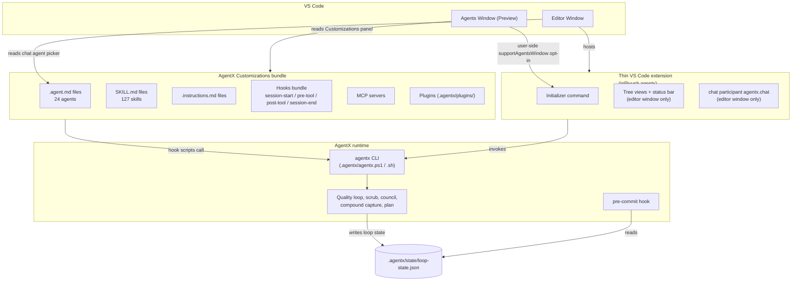
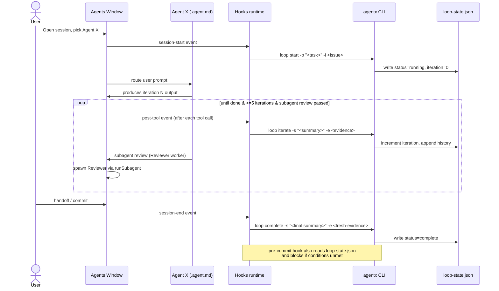
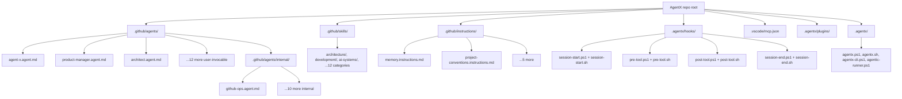

# Technical Specification: AgentX integration with the VS Code Agents Window

**Status**: Draft
**Author**: AgentX Architect
**Date**: 2026-05-29
**Related ADR**: [ADR-400.md](../adr/ADR-400.md)
**Related Council**: [COUNCIL-400.md](../adr/COUNCIL-400.md)

> **Acceptance Criteria**: see ADR-400 Decision and Consequences. No upstream PRD; this spec is the implementation-facing companion to the architecture decision.

---

## Table of Contents

1. [Overview](#1-overview)
2. [Architecture Diagrams](#2-architecture-diagrams)
3. [Surface Contracts](#3-surface-contracts)
4. [Customizations Bundle Layout](#4-customizations-bundle-layout)
5. [Hooks Lifecycle](#5-hooks-lifecycle)
6. [Security Considerations](#6-security-considerations)
7. [Performance Targets](#7-performance-targets)
8. [Testing Strategy](#8-testing-strategy)
9. [Implementation Notes](#9-implementation-notes)
10. [Rollout Plan](#10-rollout-plan)
11. [Risks and Mitigations](#11-risks-and-mitigations)
12. [Monitoring and Observability](#12-monitoring-and-observability)
13. [AI/ML Specification](#13-aiml-specification)

---

## 1. Overview

This spec describes how AgentX delivers its 24 agents, 127 skills, quality-loop CLI, hooks, MCP servers, and instructions into the **VS Code Agents Window** (Preview, May 2026) while preserving the current editor-window experience. It implements ADR-400 Option C: Agents-Window-Native Customizations + CLI Bridge + Thin Extension.

**Scope (in):**

- Mapping AgentX agents to VS Code `.agent.md` semantics including frontmatter and the Coordinator + Worker subagent pattern.
- Packaging AgentX as a Customizations bundle (Agents, Skills, Instructions, Hooks, MCP, Plugins) that the Agents Window picks up natively.
- Wiring the quality-loop CLI into VS Code Hooks (`session-start`, `pre-tool`, `post-tool`, `session-end`).
- Slimming the existing VS Code extension to a thin editor-window adapter.
- Per-user opt-in into the Agents Window via the user-side `extensions.supportAgentsWindow` setting (see Erratum E-1).

**Scope (out):**

- Implementation code (this is an Architect deliverable; the Engineer-phase plan will live in `docs/execution/plans/EXEC-PLAN-400.md`).
- Changes to the quality-loop *contract* (minimum 5 iterations, subagent review, Karpathy, council, scrub, compound capture all remain).
- Changes to the chat-participant API surface for the editor window beyond marking it editor-window-only.
- Cloud-only features (Copilot Cloud sessions remain GitHub-backed; Local Mode behaviour does not change).

**Success criteria:**

- AgentX agents appear in the Agents Window agent dropdown without further user setup beyond installing the AgentX Customizations bundle.
- Running `loop start | iterate | complete` is enforced from inside an Agents Window session via Hooks, not only at pre-commit time.
- A user can switch freely between the Agents Window and the editor window without losing session, settings, or workflow state.
- All editor-window tree views, status bar entries, and commands continue to function unchanged.

### 1.1 Selected Tech Stack

> Engineers MUST NOT start implementation until this table is confirmed against the latest VS Code release notes at implementation time.

| Layer / Concern | Selected Technology | Version / SKU | Version Source / Verified On | Why This Was Chosen | Rejected Alternatives |
|-----------------|---------------------|---------------|------------------------------|---------------------|-----------------------|
| Host platform | Visual Studio Code | 1.85.0+ (existing `engines.vscode`) | `vscode-extension/package.json` line 25, 2026-05-29 | Already declared engine; Agents Window ships in Stable | Insiders-only requirement (rejected -- limits reach) |
| Agent definition format | VS Code `.agent.md` | Schema per Custom Agents doc | https://code.visualstudio.com/docs/copilot/customization/custom-agents, 2026-05-29 | Native Agents Window surface; AgentX already uses this format | YAML manifest (rejected -- not the platform schema) |
| Sub-agent orchestration | `tools: ['agent']` + `agents:` allowlist | Per VS Code Subagents doc | https://code.visualstudio.com/docs/copilot/agents/subagents, 2026-05-29 | Documented Coordinator + Worker pattern; matches AgentX Hub-and-Spoke | Custom in-extension router (rejected -- duplicates platform feature) |
| Lifecycle gates | VS Code Hooks | Per Hooks doc | https://code.visualstudio.com/docs/copilot/customization/hooks, 2026-05-29 | First-class platform surface for `session-start`, `pre-tool`, `post-tool`, `session-end` | Pre-commit-only enforcement (rejected -- bypassable inside Agents Window) |
| Runtime / CLI | AgentX CLI (`.agentx/agentx.ps1` + `.agentx/agentx.sh`) | v8.x (existing) | Repository state, 2026-05-29 | Already CLI-shaped; works for Copilot CLI sessions | Long-running extension host process (rejected -- not compatible with Cloud agent runtime) |
| Per-user Agents Window opt-in | `extensions.supportAgentsWindow` (user-side `settings.json` map; see Erratum E-1) | Per Agents Window doc | https://code.visualstudio.com/docs/copilot/agents/agents-window, re-verified 2026-06-10 | Documented user-side opt-in; off-by-default model is correct for least-privilege; extension prompts the user to set it | Auto-activate everywhere (rejected -- not how VS Code allows it); author-side manifest field (rejected -- no such field exists) |
| Plugin packaging | VS Code Customizations Plugin bundle | Preview API | https://code.visualstudio.com/docs/copilot/customization/overview, 2026-05-29 | Single-install entry point for Agents + Skills + Hooks + MCP + Instructions | MCP-only delivery (rejected -- per ADR-400 Option D) |
| Marketplace distribution | VS Code Marketplace (existing `publisher: jnPiyush`) | n/a | `vscode-extension/package.json` lines 5-6, 2026-05-29 | Discoverability; existing channel | New marketplace identity (rejected -- breaks user upgrade path) |
| Hook script runtimes | PowerShell 7.4+ and POSIX shell (bash 4+) | Existing | AgentX repo, 2026-05-29 | Already shipped; required for cross-platform parity | PowerShell-only (rejected -- breaks mac/Linux Hooks) |

**Implementation Preconditions:**

- The selected stack is consistent with ADR-400 Option C.
- All Preview-era surfaces are flagged as such; manual install path via `.agentx/plugins/` is the always-works fallback.
- Each row's version source is re-verified at the start of the Engineer phase (Preview APIs may move).

> **Erratum E-1 (2026-06-10, Engineer phase re-verification):** This spec originally implied `extensions.supportAgentsWindow` was an author-side opt-in declared by the extension (e.g. a `package.json` manifest field). Re-verifying the live VS Code Agents Window docs at implementation time showed it is a **user-side `settings.json` setting** -- an object map keyed by extension id (`{ "jnPiyush.agentx": true }`), set with `ConfigurationTarget.Global`. There is no author-side manifest field. AgentX therefore opts in **per user**, not per workspace, at runtime: on first install and on each major-version upgrade the extension shows a one-time prompt that merges its id into the global map (preserving every other publisher), plus a manual `AgentX: Enable in Agents Window` command and a repo-cloner `.vscode/settings.json` courtesy entry. Implemented in `vscode-extension/src/utils/agentsWindowOptIn.ts` under CONTRACT-400-agents-window-slice2. Wherever this spec says "the extension opts in", read "the extension prompts the user to opt in".

---

## 2. Architecture Diagrams

### 2.1 Target two-surface delivery

### 2.2 Hub-and-Spoke expressed in `.agent.md` frontmatter

```mermaid
flowchart TB
  AX["Agent X (coordinator)<br/>user-invocable: true<br/>tools: ['agent', ...]<br/>agents: [Product Manager, Architect, ...]"]

  PM["Product Manager<br/>user-invocable: true<br/>agents: [GitHub Ops, ADO Ops]"]
  ARCH["Architect<br/>user-invocable: true<br/>agents: [Architecture Reviewer]"]
  UX["UX Designer<br/>user-invocable: true"]
  DS["Data Scientist<br/>user-invocable: true<br/>agents: [Prompt Engineer, Eval Specialist, Ops Monitor, RAG Specialist]"]
  ENG["Engineer<br/>user-invocable: true<br/>agents: [Prompt Engineer, RAG Specialist]"]
  REV["Reviewer<br/>user-invocable: true<br/>agents: [GitHub Ops, ADO Ops, Functional Reviewer, Architecture Reviewer, Eval Specialist]"]
  DEVOPS["DevOps Engineer<br/>user-invocable: true<br/>agents: [Ops Monitor]"]
  TEST["Tester<br/>user-invocable: true<br/>agents: [GitHub Ops, ADO Ops]"]
  PBI["Power BI Analyst<br/>user-invocable: true"]
  CR["Consulting Research<br/>user-invocable: true"]
  AC["Agile Coach<br/>user-invocable: true"]
  AFR["Auto-Fix Reviewer<br/>user-invocable: true"]

  subgraph INT["Internal sub-agents<br/>(.github/agents/internal/)<br/>user-invocable: false"]
    GO["GitHub Ops"]
    AO["ADO Ops"]
    AOP["AzDO PRD to WIT"]
    FR["Functional Reviewer"]
    AR["Architecture Reviewer"]
    PE["Prompt Engineer"]
    ES["Eval Specialist"]
    OM["Ops Monitor"]
    RS["RAG Specialist"]
    DSP["Diagram Specialist"]
    PA["Prototype Auditor"]
  end

  AX --> PM
  AX --> ARCH
  AX --> UX
  AX --> DS
  AX --> ENG
  AX --> REV
  AX --> DEVOPS
  AX --> TEST
  AX --> PBI
  AX --> CR
  AX --> AC
  AX --> AFR

  PM --> GO
  PM --> AO
  ARCH --> AR
  REV --> FR
  REV --> AR
  REV --> ES
  DS --> PE
  DS --> ES
  DS --> OM
  DS --> RS
  ENG --> PE
  ENG --> RS
  DEVOPS --> OM
  TEST --> GO
  TEST --> AO
```

### 2.3 Quality-loop sequence inside an Agents Window session

---

## 3. Surface Contracts

### 3.1 What Agents Window provides (consume, do not re-implement)

| Provided by Agents Window | AgentX consumes it as |
|---------------------------|------------------------|
| Sessions list, parallel sessions | Each AgentX issue maps to one session |
| Customizations panel (Agents/Skills/Instructions/Hooks/MCP/Plugins) | AgentX bundle entry point |
| Changes panel (per-session worktree diff) | Replaces editor-window diff views |
| Integrated browser (auto-opens `localhost`) | Used by `agent-browser-default-testing` convention |
| Chat input, agent dropdown | Where the user picks Agent X or a specialist |
| Worktree-vs-folder isolation toggle | AgentX recommends worktree for Engineer, folder for Reviewer |
| Hooks runtime | AgentX wires quality-loop CLI into the lifecycle |

### 3.2 What AgentX provides (deliver via Customizations)

| AgentX surface | Customizations category | File pattern | Notes |
|----------------|--------------------------|--------------|-------|
| 24 agents | Agents | `.github/agents/*.agent.md`, `.github/agents/internal/*.agent.md` | Agent X is the only top-level coordinator |
| 127 skills | Skills | `.github/skills/**/SKILL.md` | Already conform to agentskills.io |
| 7 instructions | Instructions | `.github/instructions/*.instructions.md` | Includes always-on `memory` and `project-conventions` |
| Hooks bundle | Hooks | `.agentx/hooks/*.{ps1,sh}` (new) | Pairs of PS1+SH per hook event |
| MCP servers | MCP | Existing `.vscode/mcp.json` plus optional `.agentx/mcp/` (new) | No new servers required by this spec |
| Plugins | Plugins | `.agentx/plugins/` (existing) | Existing convert/read plugins are unchanged |

### 3.3 Editor-window-only surfaces (do not register for Agents Window)

| Surface | Reason |
|---------|--------|
| Chat participant `agentx.chat` | Agents Window does not host chat participants; agents are picked via `.agent.md` |
| Tree views (AgentX Agents, AgentX Templates, Customizations Tree) | Agents Window has its own Customizations panel |
| Status bar item | Agents Window does not expose status bar; status is shown in session list |
| Workflow visualizer command | Agent X coordinator answers workflow questions via chat in Agents Window |

### 3.4 Frontmatter contract for `.agent.md` files

| Field | Required? | Value rule for AgentX |
|-------|-----------|------------------------|
| `name` | yes | Human-readable role (e.g. `Architect`) |
| `description` | yes | One-paragraph role contract summary |
| `tools` | yes | Includes `agent` for coordinators; specialists declare their tool needs |
| `agents` | conditional | Required for any agent that delegates to workers; lists allowed worker names |
| `model` | optional | Advisory only; agents remain model-agnostic |
| `user-invocable` | yes | `true` for the 13 visible agents; `false` for the 11 internal sub-agents |
| `disable-model-invocation` | conditional | `true` for agents the model must never auto-pick (e.g. Auto-Fix Reviewer where the user must explicitly approve) |

---

## 4. Customizations Bundle Layout

---

## 5. Hooks Lifecycle

| Event | What AgentX does | CLI call |
|-------|-------------------|----------|
| `session-start` | Resolve current issue, start the quality loop, write initial state | `agentx loop start -p "<task>" -i <issue>` |
| `pre-tool` (gate) | Run scrub against staged areas; block if HIGH findings | `pwsh scripts/scrub.ps1 -Path <changed-area>` |
| `post-tool` | Record an iteration if a verification command ran | `agentx loop iterate -s "
" -e <evidence>` |
| `session-end` | Mark the loop complete and surface the final delivery report; only succeeds if min iterations + subagent review pass | `agentx loop complete -s "
" -e <fresh-evidence>` |

**Portability rule:** every hook ships as a pair (`*.ps1`, `*.sh`). The Hooks bundle declares both; the platform picks the one matching the user's shell. CI enforces parity via `scripts/check-harness-compliance.ps1` (extended in the Engineer phase).

**Hooks do not replace the pre-commit hook** -- the pre-commit hook remains the last-line gate for commits. Hooks are the *first-line* enforcement that fires inside Agents Window sessions before the user reaches a commit boundary.

---

## 6. Security Considerations

| Concern | Specification |
|---------|----------------|
| Workspace trust | Hooks and CLI run only in trusted folders (VS Code enforces). AgentX adds nothing; document the trust requirement in `docs/GUIDE.md`. |
| Tunnel exposure | When a session runs over an SSH or dev tunnel, AgentX warns on Autopilot enablement. The warning lives in the `session-start` hook. |
| `runSubagent` recursion | `chat.subagents.allowInvocationsFromSubagents` stays off by default; AgentX coordinators do not require recursion. If a workflow ever needs it, the workflow doc must call it out explicitly and the user opts in per workspace. |
| Secrets | No new secret material introduced. Existing rules (env vars / Key Vault / never hardcoded) apply unchanged. |
| Auto-approve | The Agents Window's "Allow tool" prompts remain user-driven. AgentX's `disable-model-invocation: true` on Auto-Fix Reviewer ensures the model cannot silently invoke destructive automation. |
| Cloud session scope | Copilot Cloud sessions are GitHub-backed only; AgentX does not transmit local secrets or non-GitHub repo content to cloud sessions. |

---

## 7. Performance Targets

| Metric | Target | Why |
|--------|--------|-----|
| `session-start` hook latency | <= 300 ms p95 | Hooks block prompt input; budget must stay invisible |
| `agentx loop start` cold call | <= 500 ms p95 | One file write + JSON manipulation; well within budget |
| `post-tool` hook latency | <= 200 ms p95 | Runs after every tool call; cannot bottleneck the session |
| Customizations bundle install time | <= 5 s for full bundle on first activation | One-time cost; acceptable |
| Loop state file size | <= 1 MB per issue | Append-only history with iteration summaries; rotate on `loop complete` |
| Hook script memory ceiling | <= 50 MB resident | Lightweight CLI invocations only |

---

## 8. Testing Strategy

| Test category | Coverage |
|---------------|----------|
| Frontmatter validation | `scripts/validate-frontmatter.ps1` extended to enforce `user-invocable`, `agents:` allowlist consistency, and `disable-model-invocation` on internal sub-agents |
| Hook portability | New CI step runs both `*.ps1` and `*.sh` hook pairs on Windows and Ubuntu runners; outputs MUST be equivalent |
| Loop state contract | Existing `tests/loop-rollback-behavior.ps1` extended to cover hook-driven `iterate` calls |
| End-to-end Agents Window simulation | New `tests/cli-live-e2e.ps1` extension that simulates a Copilot CLI session: session-start hook -> N iterations -> session-end hook -> loop completion gate |
| Editor-window regression | Existing extension tests under `vscode-extension/src/test/` continue to pass; tree views, status bar, and chat participant tested against the editor window only |
| Quality-loop minimum | Existing 5-iteration enforcement test continues to gate; new test ensures hook-driven iteration counts are recorded identically to CLI-driven ones |
| Subagent allowlist | New test ensures every coordinator's `agents:` list intersects only with declared worker `.agent.md` files (no dangling references) |

Coverage target: existing >= 80% threshold (per repo standards) is unchanged.

---

## 9. Implementation Notes

These are guidance for Engineer-phase planning, not implementation prescriptions:

- The 24 `.agent.md` files already exist; the frontmatter audit is mechanical (a script that adds missing keys, then a human pass to confirm `user-invocable` and `agents:` semantics).
- Hook scripts should be thin wrappers that delegate to existing CLI subcommands; no new business logic in the hooks.
- The extension slim-down can be staged: keep all current contributions, but mark deprecated paths in the CHANGELOG and route docs to the new surfaces first.
- Customizations programmatic registration is Preview; treat the extension API path as a polish for v8.5 and ensure manual install via `.agentx/plugins/` works regardless.
- Documentation updates touch AGENTS.md, CLAUDE.md, copilot-instructions.md, docs/WORKFLOW.md, docs/GUIDE.md. The "two-window" framing should be explicit in each.

---

## 10. Rollout Plan

| Phase | Outcome | Gate to advance |
|-------|---------|-----------------|
| Phase 1 -- Frontmatter + Hooks | All 24 `.agent.md` files have the right frontmatter; Hooks bundle ships with PS1+SH pairs | Validation script green; Agents Window dropdown shows Agent X + 12 specialists |
| Phase 2 -- Extension slim-down | Extension prompts the user to opt in via the user-side `extensions.supportAgentsWindow` setting (see Erratum E-1); tree views/status/chat participant flagged editor-window-only | Existing extension test suite green; Agents Window opt-in does not regress editor-window UX |
| Phase 3 -- Customizations bundle | Plugin bundle installable from Customizations panel; manual fallback documented | Bundle install <= 5s; end-to-end Agents Window simulation test green |
| Phase 4 -- Docs migration | AGENTS.md / WORKFLOW.md / GUIDE.md / copilot-instructions.md describe both surfaces | Docs review approved; chat-participant-only paths marked deprecated |

Each phase is gated by the AgentX quality loop (min 5 iterations, subagent review, council where required).

---

## 11. Risks and Mitigations

| Risk | Severity | Source | Mitigation |
|------|----------|--------|------------|
| Customizations programmatic registration API changes during Preview | Medium | Council Skeptic | Keep manual install via `.agentx/plugins/` as the always-works fallback; extension API path is polish only |
| `.agent.md` frontmatter schema changes | Low-Medium | Council Skeptic | Extend `validate-frontmatter.ps1` with strict schema and run in CI; treat the 24 files as machine-validated |
| Hook portability between PowerShell and POSIX shells | Medium | Council Skeptic | Enforce PS1+SH pair per hook in CI via `check-harness-compliance.ps1` |
| Cloud agent runtime is GitHub-only | Low | Council Skeptic | Default Agents Window runtime is Copilot CLI; Cloud is an enhancement, not a requirement |
| Chat participant invisible in Agents Window confuses users | Low (once documented) | Analyst | Explicitly mark `agentx.chat` as editor-window-only in docs |
| Tree views absent from Agents Window | Low | Platform docs ("activity bar/tree view rendering in Agents Window is still evolving") | Provide chat-driven and command-driven entry points; do not depend on tree views inside the Agents Window |
| Sub-agent infinite loop | Low | VS Code Subagents doc (depth cap = 5, off by default) | Keep recursion off; document per-workflow opt-in if ever needed |
| Worktree vs folder isolation drift | Low | Platform default differs by agent type | Document recommended isolation per AgentX phase; Engineer uses worktree, Reviewer uses folder |
| Pre-commit hook bypass in Agents Window auto-commit paths | Medium | AgentX existing pitfall log | Hooks wire `loop start | iterate | complete` inside the session so the gate fires before commit time, not only at commit |

---

## 12. Monitoring and Observability

- **Loop state telemetry:** `loop-state.json` already records iteration count, status, history. Extend it with a `source` field (`hook` / `cli` / `extension`) so we can verify hook-driven enforcement in production.
- **Hook timing:** each hook writes a one-line log to `.agentx/state/hook-trace.jsonl` with event name, duration, exit code. Used for the performance targets above.
- **Customizations bundle install metric:** extension reports first-activation install latency to the existing AgentX status surface; no new telemetry sink.
- **Failure paths:** if a hook fails, the Agents Window session shows the hook output; AgentX additionally writes a structured error to `.agentx/state/hook-trace.jsonl` so post-mortem analysis is possible.

No new external observability dependency is introduced.

---

## 13. AI/ML Specification

AgentX is itself an AI agent system, but this spec does not change the AI/ML contract. The following items remain unchanged by ADR-400:

| Concern | Status |
|---------|--------|
| Model selection | Advisory only; `model:` frontmatter is a preference, not a requirement. Agents remain model-agnostic. |
| Prompt architecture | `prompts/` directory ownership unchanged. `.agent.md` body prose continues to be the role-prompt source of truth. |
| Agent orchestration | Hub-and-Spoke is now expressed via `tools: ['agent']` + `agents:` allowlist; semantics unchanged. |
| Structured outputs | Each agent's Done Criteria and Delivery Report tables continue to define the structured output contract. |
| RAG pipeline | Not affected by this spec. |
| Evaluation pipeline | Council, scrub, subagent review, score-output.ps1 unchanged; now fire from Hooks in addition to CLI/pre-commit. |
| AgentOps | Loop state + hook trace are the existing observability surfaces; no new tracing system required. |
| Model change management | Unchanged. |
| Drift management | Unchanged. |
| Multi-model strategy | Unchanged. |
| Guardrails | `disable-model-invocation` is now used on Auto-Fix Reviewer to prevent unsafe auto-pick by the model; otherwise unchanged. |
| Responsible AI | Unchanged. |

Implementation alignment with Data Scientist is not required for this ADR/Spec because no model contract, prompt schema, evaluation rubric, or guardrail is added or removed. If the Engineer phase discovers a need to add evaluation hooks that fire from Hooks (e.g. a council-on-spec gate), the Engineer must run the Architect/Data Scientist alignment checkpoint per WORKFLOW.md before implementing.

---

## Open Questions

- Should the Customizations bundle be a separate marketplace listing (e.g. `jnPiyush.agentx-customizations`) or a sub-package of the existing extension? Recommendation deferred to Engineer-phase planning; both options preserve the architecture.
- Does the Engineer phase want to add a `loop-progress` hook event in addition to `post-tool`, to record iteration summaries explicitly? Open until the Engineer phase profiles real hook traffic.
- Should Agent X's `agents:` allowlist include the internal sub-agents directly, or only the user-invocable specialists (which then list their own internal workers)? Recommendation: only user-invocable specialists at the top level, to keep the dropdown clean; verify in Engineer phase with a Reviewer pass.

---

## References

See ADR-400 References section.
