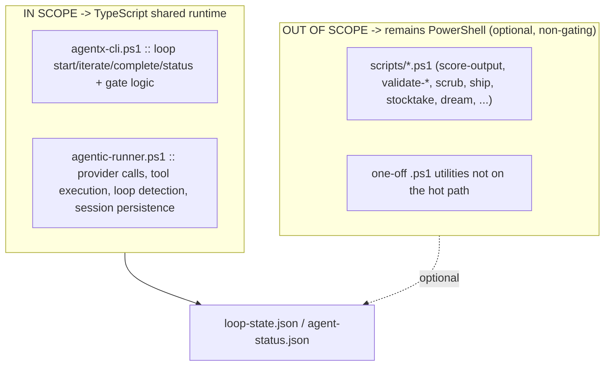
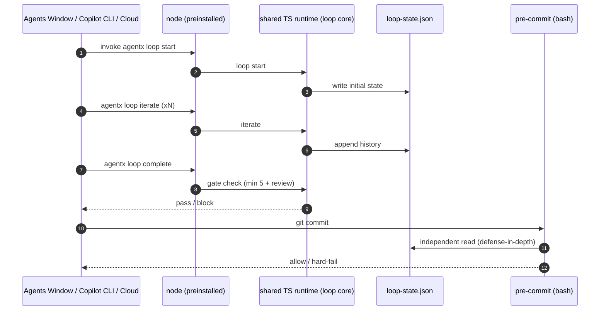

# SPEC-401: CLI Runtime Migration to Shared TypeScript Runtime

**Status**: Draft
**Date**: 2026-05-29
**Author**: AgentX Architect
**Issue**: #401
**Implements**: [ADR-401](../adr/ADR-401.md) (Option D)
**Amends**: [SPEC-400](SPEC-400.md) s.1.1 (Selected Tech Stack), s.5 (Hooks lifecycle)
**Council**: [COUNCIL-401.md](../adr/COUNCIL-401.md)

---

## 1. Overview

This spec defines the implementation-facing contract for migrating AgentX's **enforcement-critical CLI core and agent engine** from PowerShell 7 to the shared TypeScript/Node runtime established by ADR-341, while retaining PowerShell for long-tail dev/CI tooling. It does **not** prescribe internal code structure; it defines the runtime boundary, the durable contracts that must be preserved, the two gating prerequisites the Model Council made mandatory, and the cross-platform behavior the Agents Window surfaces require. [Confidence: MEDIUM-HIGH]

### 1.1 Selected Tech Stack

| Layer | Runtime | Version floor | Verification source / date |
|-------|---------|---------------|----------------------------|
| Enforcement core (`loop` commands + gate) | Node.js / TypeScript (shared runtime) | Node LTS 20.x floor (align with `vscode-extension` engines) | `vscode-extension/package.json` engines, 2026-05-29 |
| Agent engine (provider calls, tools, sessions) | Node.js / TypeScript (shared runtime) | Node LTS 20.x | same |
| Commit-time gate | bash (kept independent for defense-in-depth) | bash 4+ | `.github/hooks/pre-commit`, 2026-05-29 |
| Long-tail dev/CI tooling | PowerShell 7 (optional, non-gating) | pwsh 7.4+ | retained as-is |
| Durable state contract | JSON files under `.agentx/state/` | n/a (language-agnostic) | `loop-state.json`, `agent-status.json` |

The shared runtime SHOULD live where ADR-341 directs (`packages/runtime/` or `vscode-extension/src/runtime/`) so the extension consumes it in-process and the CLI/hook surfaces invoke it via `node`/`npx`. Node LTS schedule reference: https://nodejs.org/en/about/previous-releases

## 2. Goals and Non-Goals

| Goals | Non-Goals |
|-------|-----------|
| Run the quality-loop gate on a runtime preinstalled in Agents Window / Copilot CLI / Cloud | Rewriting the 4,299 LOC of `scripts/*.ps1` dev tooling |
| Preserve exact gate behavior (min-5-iteration, review-history, stale/stuck) | Changing the durable `loop-state.json` schema |
| Collapse the writer(PS)/reader(TS) split on the hot path | Introducing a third runtime stack (Go rejected per ADR-401) |
| Reuse the Node-native MCP SDK | Migrating before the two gating prerequisites exist |

## 3. Architecture and Runtime Boundary

The contract between surfaces is the JSON state, not the language. The extension already reads it (TypeScript); migrating the writer to TypeScript lets the extension consume the loop core in-process.

## 4. Component Boundary (the core)

The migration is bounded to the files enumerated below -- the anti-creep control the Council required. Anything not listed stays PowerShell tooling.

| In scope (migrate) | Out of scope (retain PowerShell) |
|--------------------|----------------------------------|
| `agentx-cli.ps1` loop subsystem + gate (~7,458 LOC, the enforcement parts) | `scripts/*.ps1` (~4,299 LOC dev/CI helpers) |
| `agentic-runner.ps1` agent engine (~4,427 LOC) | long-tail one-off `.ps1` utilities |

Any proposal to move an out-of-scope script onto the hot path requires a spec amendment.

## 5. Data Model and Durable Contracts

The TypeScript implementation MUST produce `loop-state.json` and `agent-status.json` that are behaviorally identical to the PowerShell implementation.

| Contract field/behavior | Requirement |
|-------------------------|-------------|
| Minimum iteration count | 5 (unchanged across all task classes) |
| Subagent-review history check | At least one history iteration summary contains "review" (case-insensitive) |
| `loopConsumed` semantics | False until handoff; same lifecycle as today |
| Stale / stuck detection | Same thresholds and transitions as the PowerShell writer |
| Concurrent-write safety | Extension and CLI may both write; locking/last-writer behavior preserved |
| State file locations | `.agentx/state/loop-state.json`, `.agentx/state/agent-status.json` (unchanged) |

## 6. API and CLI Contract

The externally-observable command surface MUST be preserved so all callers (hooks, launchers, extension, docs) keep working.

| Command | Behavior preserved |
|---------|--------------------|
| `agentx loop start -p <task> -i <issue>` | Initializes state; same focus sequence |
| `agentx loop iterate -s 
 -e <evidence>` | Appends history; evidence gate unchanged |
| `agentx loop complete -s 
 -e <evidence>` | Min-5 + review-history gate; sets complete |
| `agentx loop status` | Same status/health/gate output contract |
| `agentic-runner` invocation surface | Provider/tool/session behavior preserved |

## 7. Gating Prerequisites (MUST exist before any port begins)

Both are hard conditions from the Model Council. The port does not start until both are satisfied.

### 7.1 cli.mjs Post-Mortem (Prerequisite 1)

`agentx-cli.ps1` header states it "Replaces cli.mjs" -- a prior Node->PowerShell migration. Before reversing it, recover and document *why* Node was abandoned and prove the new shared-runtime TypeScript design does not reintroduce the original failure.

| Post-mortem must answer |
|--------------------------|
| What concrete problems drove cli.mjs -> PowerShell? (packaging? signing? dependency weight? cross-shell behavior?) |
| Which of those still apply to a *shared-runtime* TS design (vs the original standalone cli.mjs)? |
| For each still-applicable problem, what is the mitigation in the new design? |
| Explicit go/no-go statement |

### 7.2 Golden-File Parity Suite (Prerequisite 2)

A test suite that runs the existing PowerShell writer and the new TypeScript writer against identical fixtures and asserts byte-identical `loop-state.json` output (modulo timestamps/PIDs).

| Parity suite must cover |
|--------------------------|
| `loop start` -> `iterate` x5 -> `complete` happy path |
| Min-iteration gate rejection (complete attempted at <5) |
| Review-history check (complete blocked until a "review" summary exists) |
| Stale/stuck transitions |
| Concurrent `iterate` from CLI + extension |
| Partial-write / crash-recovery edge cases |

## 8. Security Considerations

| Concern | Requirement |
|---------|-------------|
| Provider credentials | Read from env vars / secret store only; never persisted to session JSON in plaintext |
| Tool execution sandbox | Preserve the existing command allowlist (`.github/security/allowed-commands.json`) and blocked-command list |
| State file integrity | Writes are atomic (temp + rename) to avoid partial-state acceptance by the gate |
| Defense-in-depth | bash commit-time gate remains independent of the TS runtime so a single-runtime bug cannot disable both writer and gate |
| Dependency surface | Node dependency tree scanned (`npm audit`) in CI; pin direct deps |

## 9. Performance Targets

| Metric | Target | Rationale |
|--------|--------|-----------|
| `loop status` cold start | <= current pwsh equivalent | hooks invoke it interactively |
| Gate evaluation (`complete`) | < 200 ms typical | must not slow commits |
| Agent-engine provider call overhead | parity with PowerShell baseline | no regression in token/latency budgets |

Performance is a second-order attribute (per Council Analyst): hooks are not a tight millisecond loop; correctness and availability dominate.

## 10. Error Handling and Recovery

| Failure | Behavior |
|---------|----------|
| Missing/preflight-failed Node version | Fail fast with actionable message; do not silently no-op the gate |
| Corrupt/partial `loop-state.json` | Detect, report STUCK, require reset (matches current behavior) |
| Concurrent write conflict | Last-writer-wins with lock; no lost min-iteration count |
| Provider/tool error in agent engine | Preserve current retry/backoff and loop-detection semantics |

## 11. Monitoring and Observability

| Signal | Preserved/added |
|--------|-----------------|
| Loop history + iteration count | Durable in `loop-state.json` (unchanged) |
| Agent session traces | `.agentx/sessions/` (unchanged location/format) |
| Gate pass/block events | Emitted by core; consumable by extension in-process |
| Drift signal | Parity-suite results tracked in CI as a regression guard |

## 12. Test and Parity Plan

The parity suite (s.7.2) is the primary regression guard. In addition:

| Layer | Coverage |
|-------|----------|
| Unit | TS loop core mirrors existing `loopStateChecker.test.ts` / `harnessEvaluator.test.ts` |
| Integration | CLI invocation through `node` produces identical state to pwsh baseline |
| Cross-platform | Gate runs on Windows, macOS, Linux, and Copilot Cloud without pwsh |
| Defense-in-depth | bash commit-time gate validated against TS-written state |

## 13. Migration Sequencing

| Phase | Deliverable | Exit gate |
|-------|-------------|-----------|
| 0 | Prerequisites 7.1 + 7.2 | Post-mortem go decision + parity suite green on PowerShell baseline |
| 1 | Extract shared TS runtime package (ADR-341 location) | Extension consumes it in-process; no behavior change |
| 2 | Port loop core + gate | Parity suite green for both writers |
| 3 | Port agent engine (provider calls, tools, sessions) | Provider-call + tool-exec behavior parity |
| 4 | Hooks/launchers call `node`; pwsh shims for tooling only | Gate runs on mac/Linux/Cloud without pwsh |
| 5 | Agents Window integration (ADR-400) on Node bridge | SPEC-400 acceptance criteria met |

SPEC-400 s.1.1 and s.5 are amended: the CLI bridge runtime is **Node/TypeScript**, not PowerShell 7.4+. PowerShell 7.4+ is downgraded from a hook runtime requirement to an *optional tooling* requirement.

## 14. AI-First Assessment (GenAI / Agentic AI)

This is infrastructure for the agentic loop rather than an AI feature itself, but the AI-first assessment still applies: the decisive reason the TypeScript runtime wins is that AgentX's *agentic* capabilities depend on the **Model Context Protocol SDK, which is Node/Python-first** (https://modelcontextprotocol.io/docs/sdk). A Node runtime makes MCP tool integration native; PowerShell and Go both pay an ongoing MCP-interop tax (ADR-341). The agent engine (`agentic-runner.ps1`) -- provider calls, tool execution, loop detection -- is the AI-bearing component and benefits most from converging on the runtime the AI tooling ecosystem targets. No standalone LLM model selection is introduced here; existing provider/model contracts are preserved unchanged by the parity requirement. [Confidence: HIGH]

## 15. Risks

| Risk | Mitigation | Confidence |
|------|------------|:----------:|
| Re-migration reintroduces cli.mjs-era failure | Prerequisite 7.1 post-mortem before cutover | [Confidence: MEDIUM] |
| Gate behavior drift during port | Prerequisite 7.2 golden-file parity suite | [Confidence: MEDIUM-HIGH] |
| Node version skew across surfaces | Pin Node LTS 20.x floor + preflight check | [Confidence: HIGH] |
| Core/tooling boundary creep | Section 4 enumeration; amendments required to expand | [Confidence: HIGH] |
| Loss of 3-language defense-in-depth | Keep bash commit-time gate independent of TS runtime | [Confidence: HIGH] |

## 16. Open Questions

| # | Question | Owner |
|---|----------|-------|
| 1 | Exact home of the shared runtime: `packages/runtime/` vs `vscode-extension/src/runtime/` (ADR-341 leaves both open) | Architect + Engineer |
| 2 | Does the agent engine port (Phase 3) need its own bounded work contract separate from the loop core? | Engineer |
| 3 | Minimum Node LTS: pin to 20.x floor or track the extension's `engines` exactly? | DevOps |
| 4 | Are any `scripts/*.ps1` actually on the hot path today and must be reclassified as core? | Architect |

## 17. Acceptance Criteria

- [ ] Prerequisites 7.1 (post-mortem) and 7.2 (parity suite) exist and pass before Phase 1.
- [ ] Quality-loop gate executes on Agents Window / Copilot CLI / Cloud without a PowerShell install.
- [ ] `loop-state.json` output is parity-identical between PowerShell and TypeScript writers.
- [ ] Min-5-iteration and review-history gates behave identically.
- [ ] bash commit-time gate remains independent of the TS runtime.
- [ ] PowerShell long-tail tooling continues to work, non-gating, off the hot path.
- [ ] SPEC-400 s.1.1 + s.5 amended to Node/TypeScript CLI bridge runtime.

---

## References

- [ADR-401](../adr/ADR-401.md), [COUNCIL-401.md](../adr/COUNCIL-401.md)
- [ADR-341](../adr/ADR-341.md), [ADR-400](../adr/ADR-400.md), [SPEC-400](SPEC-400.md)
- Node.js LTS schedule: https://nodejs.org/en/about/previous-releases
- MCP SDK: https://modelcontextprotocol.io/docs/sdk
- `.agentx/agentx-cli.ps1`, `.agentx/agentic-runner.ps1`, `.github/hooks/pre-commit`
- `vscode-extension/src/utils/loopStateChecker.ts`, `harnessState*.ts`, `eval/harnessEvaluator.ts`

