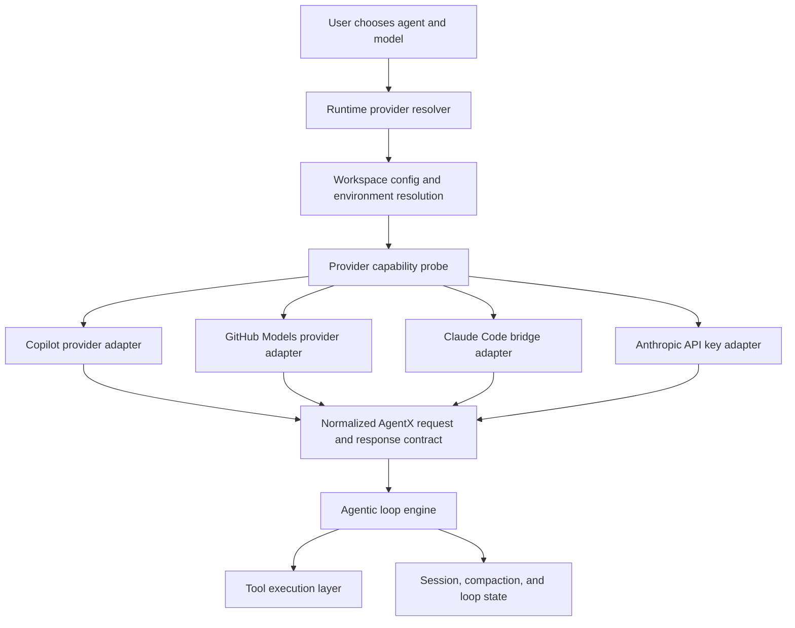
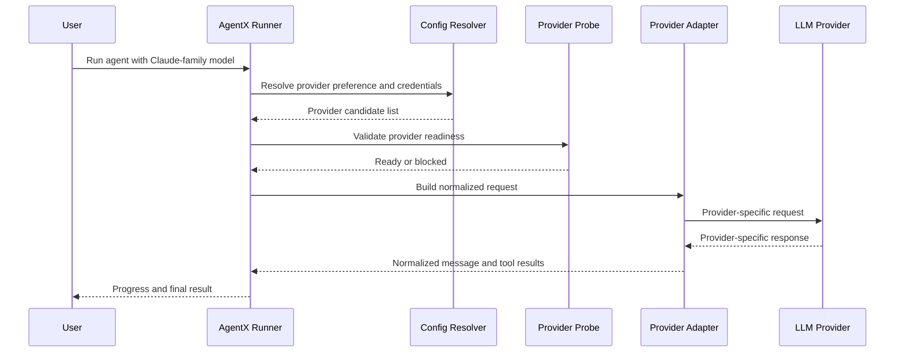
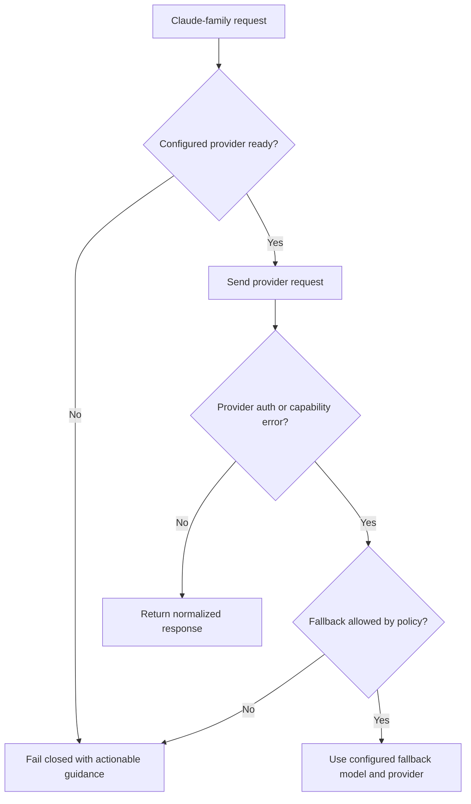
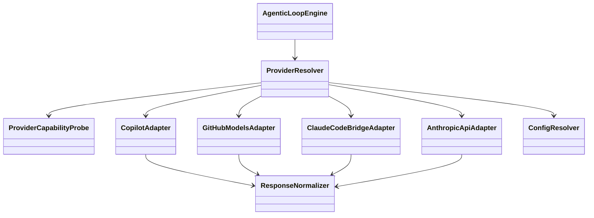
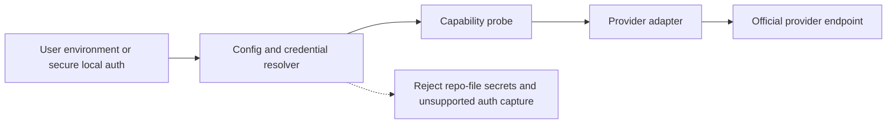

# Technical Specification: Claude Direct Subscription Runtime Adapter For AgentX

**Issue**: #N/A
**Epic**: #N/A
**Status**: Draft
**Author**: AgentX Auto
**Date**: 2026-04-01
**Related ADR**: N/A
**Related UX**: N/A
**Related Plan**: [EXEC-PLAN-claude-direct-subscription.md](../../execution/plans/EXEC-PLAN-claude-direct-subscription.md)

> **Acceptance Criteria**: This specification defines the architecture required to support Claude-family execution without GitHub Copilot, but only through an officially supported Anthropic-authenticated runtime path. It does not authorize implementation through browser-session reuse, token scraping, or any unsupported consumer-web integration.

> **Constraint**: The implementation must remain native to AgentX. No third-party coding assistant may be introduced as a dependency, bridge, wrapper, compatibility target, or user-facing requirement.

---

## 1. Overview

This specification defines how AgentX can add a third LLM runtime path for Claude-family models that is independent of GitHub Copilot while preserving the existing Copilot and GitHub Models paths. The current feasibility outcome from official Anthropic documentation is that Claude Pro and Max support official login-based use through Claude Code, while Anthropic's direct API requires Console API keys. Accordingly, the supported subscription-backed architecture should pivot to a Claude Code bridge rather than a raw HTTP adapter that assumes subscription entitlements can authenticate API calls.

The design should also adopt several proven operator-experience patterns from mature multi-provider tooling: credentials should be accepted through multiple safe configuration surfaces, provider readiness should be checked before the first request, model aliases should resolve consistently to canonical model ids, and model capability metadata should drive feature toggles instead of ad hoc string checks spread across the runtime.

The same design should intentionally leave room for adjacent provider paths. In particular, OpenAI API-key-backed usage and any future official Codex subscription-backed runtime should fit the same provider registry, readiness, and normalization contracts rather than creating a second special-case transport path.

**Scope:**
- In scope: provider abstraction, auth-path contract, model-routing contract, configuration schema, adapter interfaces, diagnostics, fallback behavior, test strategy, and rollout guidance.
- Out of scope: unofficial browser automation, scraped tokens, reverse-engineered web sessions, unrelated provider changes, and broad model-governance redesign beyond what is needed for a third provider.
- Out of scope: embedding, depending on, or routing through any third-party coding assistant in any execution or setup path.

**Success Criteria:**
- AgentX can distinguish runtime provider from model label and select an officially supported execution path deterministically.
- Existing GitHub-backed flows remain unchanged and green.
- Claude-family models can run without Copilot only when the configured provider passes explicit readiness checks.
- Subscription-backed Claude execution uses an official Claude Code login-backed runtime path rather than unsupported raw API auth.
- Users receive clear errors when Claude-family models are selected but the required provider/auth path is unavailable.
- Users can supply provider credentials through CLI, environment, `.env`, or workspace config without changing runtime semantics.
- Provider diagnostics show missing prerequisites and supported settings before execution instead of failing deep in the request path.

### 1.1 Selected Tech Stack

| Layer / Concern | Selected Technology | Version / SKU | Why This Was Chosen | Rejected Alternatives |
|-----------------|---------------------|---------------|---------------------|-----------------------|
| Frontend / UI | Existing VS Code extension surfaces | Current workspace extension | No new UI framework is needed; existing command, environment-check, and status surfaces are sufficient | New dedicated settings UI |
| Backend / Runtime | PowerShell-based AgentX runner | PowerShell 7+ | Current runner already owns provider selection, tool routing, compaction, and loop execution | Rewriting the runner in TypeScript for this slice |
| API Style | Provider adapter contract over chat-completions-style orchestration | N/A | Preserves one normalized AgentX message/tool contract while allowing per-provider translation | Endpoint-specific branching scattered through the runner |
| Data Store | `.agentx/config.json` plus environment variables | Current repo-local config contract | Matches existing AgentX workspace runtime model | Global machine-only config |
| Hosting / Compute | Local workstation runtime | N/A | This feature is for local CLI and extension-backed execution | Remote hosted execution redesign |
| Authentication / Security | Official provider-authenticated runtime only | Claude Code login for subscription-backed usage; API key for direct Anthropic API usage | Supportability and security require official auth only | Browser cookie reuse, token scraping, unsupported web-session replay |
| Observability | Existing AgentX runner logs and diagnostics surfaces | Current runtime | Minimizes scope while preserving debuggability | New standalone telemetry subsystem |
| CI/CD | Existing PowerShell and extension test suites | Current repo contract | Keeps rollout aligned with current regression gates | Separate ad hoc validation path |

**Implementation Preconditions:**
- The provider/auth path is officially supported by Anthropic for local tool execution.
- The selected auth surface can be represented without storing hardcoded secrets in repo files.
- The selected path can be validated deterministically in local diagnostics and tests.

---

## 2. Architecture Diagrams

### 2.1 High-Level Runtime Architecture

**Component Responsibilities:**

| Component | Responsibility | Confidence |
|----------|----------------|------------|
| Runtime provider resolver | Select provider from config, auth readiness, and model request | HIGH |
| Provider capability probe | Confirm whether a provider is available before first model call | HIGH |
| Provider adapter | Translate between AgentX runtime contract and provider-specific request/response shape | HIGH |
| Normalizer | Present one common response/tool-call contract to the agent loop | HIGH |
| Agentic loop engine | Continue to own prompts, tool routing, compaction, self-review, and fallback | HIGH |

### 2.2 Runtime Resolution Sequence

### 2.3 Failure and Fallback Flow

---

## 3. Runtime Contract Design

### 3.1 Provider Model

The current binary `ApiMode` design is replaced conceptually with a provider model.

| Runtime Provider | Purpose | Current State | Target State | Confidence |
|------------------|---------|---------------|--------------|------------|
| `copilot` | Full GitHub Copilot model access including Claude-family models | Implemented | Retained unchanged behind adapter seam | HIGH |
| `github-models` | Limited GitHub Models access | Implemented | Retained unchanged behind adapter seam | HIGH |
| `claude-code` | Official Claude Code runtime using Anthropic account login and subscription-backed access where supported | Not implemented | Preferred supported path for subscription-backed Claude usage | MEDIUM |
| `anthropic-api` | Direct Anthropic API access using Console API keys | Not implemented | Separate supported path for direct API usage | HIGH |
| `openai-api` | Direct OpenAI API access using API keys | Not implemented | Parallel API-key-backed provider path for GPT-family execution | MEDIUM |
| `codex-subscription` | Official subscription-backed Codex runtime path if OpenAI exposes a supported local login or brokered flow | Not implemented | Must remain separate from `openai-api` and behind an official-auth gate | LOW |

### 3.1.1 Provider Registry and Source Attribution

The provider system should be modeled as a registry, not a pile of conditional branches. The registry should merge shipped provider defaults, workspace config, environment inputs, and secure local auth state into one normalized provider view.

| Registry Concern | Requirement | Confidence |
|------------------|-------------|------------|
| Shipped defaults | Package defaults may define known providers, model ids, capability metadata, and safe defaults | HIGH |
| Workspace overrides | `.agentx/config.json` may override non-secret settings, enablement, aliases, and policy | HIGH |
| Environment overlay | Environment and `.env` values may supply credentials and runtime overrides | HIGH |
| Secure auth overlay | Login-backed or stored token state may attach renewable credentials without rewriting repo config | HIGH |
| Source attribution | Diagnostics must show whether the effective provider state came from defaults, config, env, dotenv, or secure auth storage | HIGH |
| Final normalization | The runner should only consume the merged provider record, not raw scattered inputs | HIGH |

### 3.2 Adapter Interface Contract

No provider may talk directly to the loop engine through ad hoc request shapes. Each provider adapter must satisfy the following contract.

| Contract Surface | Input | Output | Rules | Confidence |
|------------------|-------|--------|-------|------------|
| Capability probe | Config plus environment | Ready, blocked, or degraded status | Must not mutate runtime state; must produce actionable failure reasons | HIGH |
| Model resolution | Human-readable model label plus provider | Provider-specific model id | Must fail closed on unsupported labels; must not silently rebind to a different provider without policy | HIGH |
| Request translation | Normalized AgentX messages, tools, and request options | Provider-native payload | Must preserve tool-call intent, reasoning settings, and token budget intent where the provider supports them | MEDIUM |
| Response normalization | Provider-native response | Normalized message, tool calls, finish reason, usage summary | Must preserve enough detail for retries, fallbacks, and diagnostics | HIGH |
| Error normalization | Provider-native auth, quota, and transport failures | AgentX error category plus message | Must distinguish auth failure, unsupported model, transient service failure, and policy block | HIGH |

### 3.3 Auth Contract

The feature is conditioned on an official auth path.

| Requirement | Rule | Confidence |
|-------------|------|------------|
| Supported auth source | Must come from an official Anthropic-supported local or API-facing auth surface | HIGH |
| Secret handling | Secrets or renewable tokens must be supplied by environment or secure local configuration, never committed into repo files | HIGH |
| Unsupported auth | Browser cookies, scraped session tokens, devtools-exported headers, and replayed web-session credentials are prohibited | HIGH |
| Readiness validation | The provider must expose a deterministic readiness check before first model call | MEDIUM |

### 3.4 Operator Experience Contract

The runtime should borrow the strongest operational patterns from mature multi-provider tools without inheriting their runtime dependencies.

| Requirement | Rule | Confidence |
|-------------|------|------------|
| Credential surfaces | The same provider credential must be accepted from CLI flags, environment variables, `.env`, or workspace config when supported | HIGH |
| Precedence clarity | Credential and setting precedence must be deterministic and documented | HIGH |
| Early validation | Missing credentials, unsupported models, and unavailable provider features must be surfaced before the first expensive request | HIGH |
| Safe diagnostics | Readiness output may report whether a variable is set, but must never echo secret values | HIGH |
| Friendly model resolution | User-facing aliases should map to canonical model ids consistently across CLI and extension surfaces | HIGH |
| Discoverability | The runtime should be able to list supported models and explain why a requested model cannot run | MEDIUM |
| Source attribution | Diagnostics should report where provider settings were resolved from, such as `env`, `config`, `dotenv`, or secure auth state | HIGH |

### 3.5 Model Metadata and Capability Contract

Provider selection is only part of the design. The runtime also needs a structured model metadata layer so that Claude support does not depend on scattered string matching.

| Metadata Element | Purpose | Requirement | Confidence |
|------------------|---------|-------------|------------|
| Canonical model id | Stable provider-native execution id | Must be stored separately from user-facing alias | HIGH |
| Aliases | Friendly names like `sonnet` or `opus` | Must resolve deterministically to canonical ids | HIGH |
| Capability flags | Features like streaming, reasoning settings, thinking-token support, tool support, system-prompt support | Must drive request shaping and validation | HIGH |
| Model companions | Optional weak or editor model pairings | Must be explicit metadata, not hidden fallback behavior | MEDIUM |
| Context and token limits | Compaction, summarization, and request budgeting | Should be available from metadata or cached provider info | HIGH |
| Provider-specific extra params | Safe place for headers and provider-native request flags | Must be normalized through adapter boundaries | HIGH |

This metadata layer should support both package-shipped defaults and workspace-local overrides so AgentX can evolve without hard-coding every provider rule in `.agentx/agentic-runner.ps1`.

Recommended capability metadata fields for immediate adoption:

| Field | Use |
|-------|-----|
| `supportsStreaming` | Determines whether incremental progress can be shown or the runner must buffer |
| `supportsToolCalls` | Controls whether tool invocation is enabled or blocked early |
| `supportsReasoningControls` | Determines whether reasoning-level flags are passed through |
| `supportsAttachments` | Controls file and rich-input UX |
| `supportsSystemPrompts` | Determines whether the full system-prompt contract is sent directly or normalized |
| `supportsInputImages` / `supportsInputPdf` | Enables modality-safe prompt shaping |
| `contextWindow` / `maxOutputTokens` | Drives compaction and response budgeting |
| `providerParams` | Holds safe provider-native request flags or headers behind the adapter seam |

### 3.6 Provider Auth Plugins

Subscription-backed runtimes should not be hard-coded into the base provider transport. They should attach through a provider-auth plugin seam that can constrain models, rewrite endpoints, or inject renewable auth without contaminating the base API provider.

| Plugin Use Case | Requirement | Confidence |
|-----------------|-------------|------------|
| Claude subscription-backed runtime | A `claude-code` adapter may bridge to the official Claude Code runtime while keeping `anthropic-api` separate | HIGH |
| Codex subscription-backed runtime | Any future `codex-subscription` path must be modeled separately from `openai-api` and activated only through an official OpenAI-supported auth flow | MEDIUM |
| Model scoping | Auth plugins may restrict which models are valid for a given auth mode | HIGH |
| Cost policy | Plugins may override displayed or estimated cost behavior when a subscription path is not metered like raw API calls | MEDIUM |
| Request rewrite | Plugins may inject auth headers or redirect to an official runtime endpoint, but only within the plugin boundary | MEDIUM |

**Current feasibility result:**

| Path | Official Evidence | Status |
|------|-------------------|--------|
| Claude subscription-backed local runtime | Claude Code overview says most surfaces require a Claude subscription or Anthropic Console account; CLI reference documents `claude auth login` and distinguishes `--console` for API billing instead of Claude subscription | Supported direction |
| Anthropic direct API with subscription auth | API docs require Anthropic Console account and API key, with `x-api-key` on requests | Not supported by current evidence |

---

## 4. Configuration Schema

### 4.1 Workspace Config Additions

The current workspace config should gain explicit LLM provider configuration rather than inferring everything from GitHub auth.

| Field | Type | Required | Example Value | Purpose | Notes |
|------|------|----------|---------------|---------|-------|
| `llmProvider` | string | No | `copilot`, `github-models`, `claude-code`, `anthropic-api`, `auto` | Primary runtime provider preference | Default should remain compatible with current behavior |
| `llmFallbackProviders` | array of strings | No | `copilot`, `github-models` | Ordered fallback providers | Must be explicit; no hidden provider switching |
| `llmAuthMode` | string | No | `subscription-login`, `api-key`, `runtime-broker`, `auto` | Describes the expected auth path | `subscription-login` is for Claude Code-backed usage |
| `llmEndpointOverride` | string | No | provider-specific endpoint | Advanced override for supported enterprise variants | Must be validated strictly |
| `llmModelPolicy` | object | No | provider and fallback mapping set | Separates requested labels from allowed runtime bindings | Useful for policy-driven environments |
| `llmReadinessMode` | string | No | `strict`, `advisory` | Controls whether missing provider blocks execution immediately | Default should be `strict` for direct-provider paths |
| `llmProviders` | object | No | nested provider records | Stores per-provider non-secret options, aliases, and policy overrides | Preferred over flat per-feature branching as providers grow |

Recommended per-provider record shape:

| Field | Purpose |
|-------|---------|
| `enabled` | Explicitly allow or disable a provider |
| `sourcePolicy` | Define which input surfaces are accepted for that provider |
| `aliases` | Map friendly names to canonical provider model ids |
| `options` | Provider-native non-secret runtime options |
| `whitelist` / `blacklist` | Constrain model availability by policy |
| `defaultModel` | Preferred provider-local default |

### 4.2 Environment Contract

| Variable Class | Purpose | Required When | Rules |
|---------------|---------|---------------|-------|
| Provider credential variable | Supplies token, key, or official runtime credential reference | Selected provider requires explicit credential | Must never be written by AgentX into repo files |
| Provider endpoint variable | Supports official endpoint selection where required | Provider supports custom or enterprise endpoint | Must be validated against allowed URL rules |
| Provider feature toggle variable | Enables preview or explicit provider support | Preview or gated rollout | Must not bypass auth or capability checks |
| Secure auth state | Renewable login-backed credential material stored outside tracked repo files | Provider uses subscription or OAuth-style auth | Must be discoverable by readiness checks without printing secrets |

### 4.3 Configuration Inputs and Precedence

The runtime should accept provider settings through multiple surfaces while normalizing them into one in-memory provider configuration.

| Input Surface | Example Use | Requirement | Confidence |
|--------------|-------------|-------------|------------|
| CLI flags | One-off auth and model selection | Highest precedence for the current run | HIGH |
| Environment variables | Stable machine or shell configuration | Must override workspace-file defaults | HIGH |
| `.env` file | Local developer setup | Must be supported for local workflows when safe | HIGH |
| Workspace config | Repo-local non-secret defaults and provider policy | Must never be the only place secrets are expected | HIGH |

Recommended precedence order:

1. CLI flags and explicit command arguments
2. Environment variables
3. `.env` values loaded for the session
4. `.agentx/config.json` defaults

If multiple sources specify the same setting, the selected source should be visible in diagnostics as a source class such as `cli`, `env`, `dotenv`, or `config`, without printing the underlying secret.

If secure local auth state participates in provider resolution, diagnostics should expose that source as `auth` or `secure-auth` so users can tell whether a provider is running from API keys or a login-backed runtime state.

### 4.4 Model Availability Contract

| User-Facing Label | Allowed Providers | Blocking Behavior When Provider Missing |
|-------------------|------------------|----------------------------------------|
| Claude Sonnet family | `copilot`, `claude-code`, `anthropic-api` | Must block with provider-specific readiness guidance |
| Claude Opus family | `copilot`, `claude-code`, `anthropic-api` | Must block with provider-specific readiness guidance |
| GPT family | `copilot`, `github-models`, `openai-api`, other future providers as configured | Existing behavior retained |
| Codex family | `openai-api`, `codex-subscription` when officially supported | Must distinguish API-key usage from subscription-backed runtime availability |

The runtime should also support alias-driven lookup so the same canonical resolution logic can back both CLI and extension UX. Model lookup should prefer exact match first, then alias match, and only then suggestion-style diagnostics for near matches.

---

## 5. Service Layer Diagrams

### 5.1 Provider Adapter Relationships

### 5.2 Responsibility Boundaries

| Layer | Responsibility | Must Not Own |
|-------|----------------|--------------|
| Config resolver | Read workspace config and environment references | Network calls or model fallback policy |
| Capability probe | Validate credentials and provider readiness | Message translation |
| Provider adapter | Translate request and response shapes plus provider-native capability flags | Tool execution or loop-state decisions |
| Auth plugin | Attach login-backed or subscription-specific auth behavior to a provider without redefining the whole transport | Loop logic or general provider policy |
| Loop engine | Planning, prompts, tools, retries, self-review, compaction | Provider-specific transport details |

---

## 6. Security Diagrams

### 6.1 Credential Handling Flow

### 6.2 Security Requirements

| Concern | Requirement | Confidence |
|--------|-------------|------------|
| Secret storage | No provider secret may be stored in tracked repo files | HIGH |
| Token scope | Provider credentials must be least-privilege and renewable when supported | MEDIUM |
| Endpoint validation | Any endpoint override must pass SSRF-safe validation | HIGH |
| Auth provenance | Only official auth paths are allowed | HIGH |
| Auditability | Provider selection and failure reasons must be visible in diagnostics without exposing secrets | HIGH |

---

## 7. Performance

| Target | Requirement | Confidence |
|--------|-------------|------------|
| Provider resolution overhead | Provider selection and readiness checks should add minimal startup latency relative to the first model call | MEDIUM |
| Session stability | Compaction and token budgeting must continue to use model-specific context-window assumptions | HIGH |
| Fallback behavior | Fallback should occur only on policy-approved provider or model failures, not all generic transport errors | HIGH |

---

## 8. Testing Strategy

| Test Layer | What Must Be Verified | Confidence |
|-----------|------------------------|------------|
| Unit tests | Provider resolution, config parsing, model availability policy, error normalization | HIGH |
| Mocked integration tests | Anthropic-direct request translation, response normalization, auth failure handling, unsupported-model errors | HIGH |
| Regression tests | Current Copilot and GitHub Models flows remain unchanged | HIGH |
| Smoke validation | Provider readiness messages and fallback guidance are actionable in CLI and extension | MEDIUM |
| Diagnostics tests | Source precedence, missing-key reporting, alias resolution, and capability-gated setting validation | HIGH |
| Auth-plugin tests | Subscription-backed provider plugins scope models and credentials correctly without changing raw API provider behavior | HIGH |

**Minimum regression expectations:**

| Surface | Required Outcome |
|--------|------------------|
| `.agentx/agentic-runner.ps1` | Existing Copilot and GitHub Models paths still execute successfully |
| `tests/test-framework.ps1` | Remains green |
| `vscode-extension` tests | Remain green |
| Coverage gate | Remains above current thresholds |

---

## 9. Implementation Notes

This feature should be implemented in two bounded slices.

### 9.1 Slice 1: Provider-Seam Refactor

| Goal | Outcome |
|------|---------|
| Decouple provider transport from loop logic | Existing GitHub-backed behavior runs through adapter boundaries |
| Introduce explicit provider config | Runtime no longer assumes GitHub auth is the only path |
| Preserve behavior | No user-visible regression for current installs |

### 9.2 Slice 2: Claude-Backed Adapters

| Goal | Outcome |
|------|---------|
| Add supported Claude-backed runtime paths | Claude-family models can execute independently of Copilot when configured |
| Add readiness guidance | Users get explicit environment and provider diagnostics |
| Add fallback rules | Policy-based fallback remains deterministic and visible |

### 9.3 Follow-On Provider Targets

This Claude slice should leave the system ready for two follow-on paths without another architectural rewrite.

| Follow-On Path | Architectural Requirement |
|----------------|--------------------------|
| `openai-api` | Reuse the provider registry, capability metadata, and readiness diagnostics without introducing a parallel config system |
| `codex-subscription` | Reuse the auth-plugin seam so any official subscription-backed Codex flow remains distinct from API-key-backed OpenAI usage |

---

## 10. Rollout Plan

| Phase | Scope | Exit Gate |
|------|-------|-----------|
| Feasibility | Confirm official supported auth/runtime path | Explicit yes or no decision recorded |
| Refactor | Provider seam added without behavior drift | Existing tests green |
| Preview | Claude-backed path behind explicit config | Mocked integration and regression tests green |
| General Availability | Provider readiness guidance and docs complete | Operator setup is clear and stable |

---

## 11. Risks & Mitigations

| Risk | Impact | Mitigation | Confidence |
|------|--------|------------|------------|
| Claude Code bridge output may not expose enough low-level detail to fully emulate AgentX's current direct provider transport | Some runner behaviors may need adaptation or a looser bridge contract | Validate CLI output, session control, and noninteractive modes before coding | MEDIUM |
| Provider-specific response shape differs materially from current assumptions | Runner regressions or broken tool calls | Introduce strict response normalization contract before adapter rollout | HIGH |
| Silent provider fallback hides operational mistakes | Users believe they are running Claude directly when they are not | Make provider selection and fallback visible in logs and diagnostics | HIGH |
| Config sprawl confuses users | Support burden and incorrect setup | Keep provider settings minimal and show clear readiness messaging | MEDIUM |

---

## 12. Monitoring & Observability

| Signal | Purpose |
|--------|---------|
| Selected provider at runtime | Confirms actual execution path |
| Config source class | Confirms whether the chosen setting came from CLI, env, dotenv, or config |
| Provider readiness result | Explains why a path was chosen or blocked |
| Normalized auth failure category | Distinguishes unsupported setup from transient failures |
| Fallback events | Makes model or provider failover visible |
| Capability-gated setting rejection | Shows when a model does not support a requested feature such as thinking tokens |
| Auth mode at runtime | Distinguishes API-key-backed execution from login-backed or bridged subscription execution |

---

## 13. AI/ML Specification

### 13.1 AI Runtime Contract

| Concern | Decision | Confidence |
|---------|----------|------------|
| Primary AI concern | Runtime provider flexibility for Claude-family execution | HIGH |
| Prompt architecture | Existing prompt-file contract remains unchanged | HIGH |
| Agent orchestration | Existing single-loop and multi-agent orchestration remain unchanged | HIGH |
| Structured outputs | Provider adapters must preserve normalized tool-call and response structure | HIGH |
| Model change management | Claude-family execution outside Copilot must remain explicit and provider-bound | HIGH |
| Guardrails | Fail closed on unsupported auth, provider mismatch, and unavailable models | HIGH |
| Responsible AI | No change in higher-level content-safety posture in this slice | MEDIUM |

### 13.2 Multi-Provider Policy

| Policy Area | Rule |
|-------------|------|
| Requested model label | Must not imply provider availability |
| Provider fallback | Must be policy-defined and visible |
| Capability mismatch | Must block or fall back according to explicit readiness mode |
| Unsupported direct subscription path | Must produce a clear configuration error, not a hidden provider switch |
| Subscription/API separation | Login-backed subscription modes must remain separate from raw API-key provider modes even when both target the same vendor |

---

## 14. Open Questions

| Question | Why It Matters | Owner |
|----------|----------------|-------|
| Does Claude Code expose enough machine-readable noninteractive behavior for AgentX to bridge to it safely? | Determines whether a Claude Code adapter is viable without degrading AgentX behavior | AgentX Auto |
| Should Anthropic API key support be implemented alongside or after the Claude Code bridge? | Determines the sequence of supported non-Copilot Claude paths | AgentX Auto |
| What subset of AgentX runner features must be preserved in a Claude Code bridge versus remaining GitHub-runner-only? | Determines adapter contract boundaries and fallback UX | AgentX Auto |
| How much model metadata should be workspace-overridable versus package-shipped by default? | Determines how quickly AgentX can adapt to provider changes without editing core runner logic | AgentX Auto |
| Does OpenAI expose an official local login-backed Codex runtime path suitable for AgentX, or should AgentX limit Codex support to API-key-backed paths until that exists? | Determines whether `codex-subscription` is a real provider target or only a reserved design slot | AgentX Auto |

---

## 15. Confidence Summary

| Area | Confidence | Rationale |
|------|------------|-----------|
| Need for provider-adapter refactor | HIGH | Current runner is tightly coupled to a two-mode GitHub-auth model |
| Safety requirement to avoid unofficial auth reuse | HIGH | Security and supportability constraints are clear |
| Ability to preserve existing GitHub-backed behavior during refactor | HIGH | Adapter seam can wrap current behavior first |
| Feasibility of subscription-backed Claude support through Claude Code | MEDIUM | Official docs support login-backed Claude Code usage, but bridge viability still depends on automation and output-shape validation |
| Feasibility of raw direct Anthropic API support using only Pro/Max subscription entitlements | LOW | Official API docs require Console API keys, not consumer subscription auth |
| Value of registry plus auth-plugin architecture for future Codex/OpenAI paths | HIGH | It reduces future provider growth to configuration and adapter work instead of another runner rewrite |
