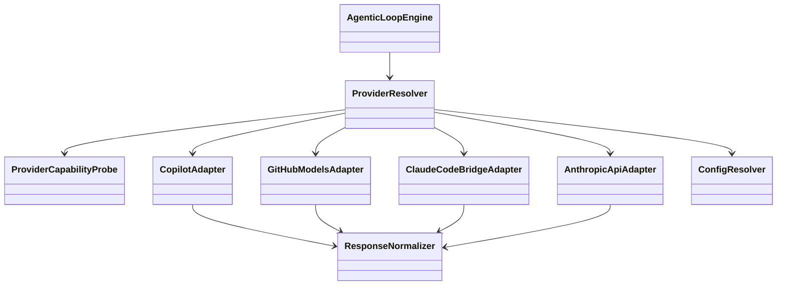
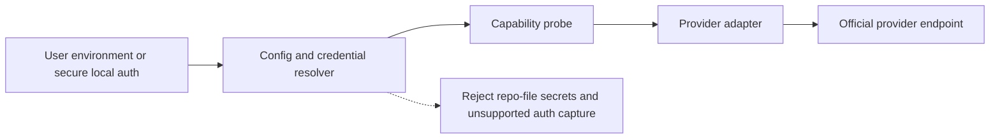

# split-spec-claude-direct-subscription-supplement

> Source: [SPEC-claude-direct-subscription.md](SPEC-claude-direct-subscription.md)
> Source hash (LF-normalized original file): `30AED79B9DC502B894D768A09CDF67F0C45095DE78221F16AC17039062A559C3`
> Relocation manifest:
- `## 5. Service Layer Diagrams` -> original lines 319-532
> Preservation rule: retained verbatim except for file-level routing and any required link rebases.

---

## 5. Service Layer Diagrams

### 5.1 Provider Adapter Relationships

### 5.2 Responsibility Boundaries

| Layer | Responsibility | Must Not Own |
|-------|----------------|--------------|
| Config resolver | Read workspace config and environment references | Network calls or model fallback policy |
| Capability probe | Validate credentials and provider readiness | Message translation |
| Provider adapter | Translate request and response shapes plus provider-native capability flags | Tool execution or loop-state decisions |
| Auth plugin | Attach login-backed or subscription-specific auth behavior to a provider without redefining the whole transport | Loop logic or general provider policy |
| Loop engine | Planning, prompts, tools, retries, self-review, compaction | Provider-specific transport details |

---

## 6. Security Diagrams

### 6.1 Credential Handling Flow

### 6.2 Security Requirements

| Concern | Requirement | Confidence |
|--------|-------------|------------|
| Secret storage | No provider secret may be stored in tracked repo files | HIGH |
| Token scope | Provider credentials must be least-privilege and renewable when supported | MEDIUM |
| Endpoint validation | Any endpoint override must pass SSRF-safe validation | HIGH |
| Auth provenance | Only official auth paths are allowed | HIGH |
| Auditability | Provider selection and failure reasons must be visible in diagnostics without exposing secrets | HIGH |

---

## 7. Performance

| Target | Requirement | Confidence |
|--------|-------------|------------|
| Provider resolution overhead | Provider selection and readiness checks should add minimal startup latency relative to the first model call | MEDIUM |
| Session stability | Compaction and token budgeting must continue to use model-specific context-window assumptions | HIGH |
| Fallback behavior | Fallback should occur only on policy-approved provider or model failures, not all generic transport errors | HIGH |

---

## 8. Testing Strategy

| Test Layer | What Must Be Verified | Confidence |
|-----------|------------------------|------------|
| Unit tests | Provider resolution, config parsing, model availability policy, error normalization | HIGH |
| Mocked integration tests | Anthropic-direct request translation, response normalization, auth failure handling, unsupported-model errors | HIGH |
| Regression tests | Current Copilot and GitHub Models flows remain unchanged | HIGH |
| Smoke validation | Provider readiness messages and fallback guidance are actionable in CLI and extension | MEDIUM |
| Diagnostics tests | Source precedence, missing-key reporting, alias resolution, and capability-gated setting validation | HIGH |
| Auth-plugin tests | Subscription-backed provider plugins scope models and credentials correctly without changing raw API provider behavior | HIGH |

**Minimum regression expectations:**

| Surface | Required Outcome |
|--------|------------------|
| `.agentx/agentic-runner.ps1` | Existing Copilot and GitHub Models paths still execute successfully |
| `tests/test-framework.ps1` | Remains green |
| `vscode-extension` tests | Remain green |
| Coverage gate | Remains above current thresholds |

---

## 9. Implementation Notes

This feature should be implemented in two bounded slices.

### 9.1 Slice 1: Provider-Seam Refactor

| Goal | Outcome |
|------|---------|
| Decouple provider transport from loop logic | Existing GitHub-backed behavior runs through adapter boundaries |
| Introduce explicit provider config | Runtime no longer assumes GitHub auth is the only path |
| Preserve behavior | No user-visible regression for current installs |

### 9.2 Slice 2: Claude-Backed Adapters

| Goal | Outcome |
|------|---------|
| Add supported Claude-backed runtime paths | Claude-family models can execute independently of Copilot when configured |
| Add readiness guidance | Users get explicit environment and provider diagnostics |
| Add fallback rules | Policy-based fallback remains deterministic and visible |

### 9.3 Follow-On Provider Targets

This Claude slice should leave the system ready for two follow-on paths without another architectural rewrite.

| Follow-On Path | Architectural Requirement |
|----------------|--------------------------|
| `openai-api` | Reuse the provider registry, capability metadata, and readiness diagnostics without introducing a parallel config system |
| `codex-subscription` | Reuse the auth-plugin seam so any official subscription-backed Codex flow remains distinct from API-key-backed OpenAI usage |

---

## 10. Rollout Plan

| Phase | Scope | Exit Gate |
|------|-------|-----------|
| Feasibility | Confirm official supported auth/runtime path | Explicit yes or no decision recorded |
| Refactor | Provider seam added without behavior drift | Existing tests green |
| Preview | Claude-backed path behind explicit config | Mocked integration and regression tests green |
| General Availability | Provider readiness guidance and docs complete | Operator setup is clear and stable |

---

## 11. Risks & Mitigations

| Risk | Impact | Mitigation | Confidence |
|------|--------|------------|------------|
| Claude Code bridge output may not expose enough low-level detail to fully emulate AgentX's current direct provider transport | Some runner behaviors may need adaptation or a looser bridge contract | Validate CLI output, session control, and noninteractive modes before coding | MEDIUM |
| Provider-specific response shape differs materially from current assumptions | Runner regressions or broken tool calls | Introduce strict response normalization contract before adapter rollout | HIGH |
| Silent provider fallback hides operational mistakes | Users believe they are running Claude directly when they are not | Make provider selection and fallback visible in logs and diagnostics | HIGH |
| Config sprawl confuses users | Support burden and incorrect setup | Keep provider settings minimal and show clear readiness messaging | MEDIUM |

---

## 12. Monitoring & Observability

| Signal | Purpose |
|--------|---------|
| Selected provider at runtime | Confirms actual execution path |
| Config source class | Confirms whether the chosen setting came from CLI, env, dotenv, or config |
| Provider readiness result | Explains why a path was chosen or blocked |
| Normalized auth failure category | Distinguishes unsupported setup from transient failures |
| Fallback events | Makes model or provider failover visible |
| Capability-gated setting rejection | Shows when a model does not support a requested feature such as thinking tokens |
| Auth mode at runtime | Distinguishes API-key-backed execution from login-backed or bridged subscription execution |

---

## 13. AI/ML Specification

### 13.1 AI Runtime Contract

| Concern | Decision | Confidence |
|---------|----------|------------|
| Primary AI concern | Runtime provider flexibility for Claude-family execution | HIGH |
| Prompt architecture | Existing prompt-file contract remains unchanged | HIGH |
| Agent orchestration | Existing single-loop and multi-agent orchestration remain unchanged | HIGH |
| Structured outputs | Provider adapters must preserve normalized tool-call and response structure | HIGH |
| Model change management | Claude-family execution outside Copilot must remain explicit and provider-bound | HIGH |
| Guardrails | Fail closed on unsupported auth, provider mismatch, and unavailable models | HIGH |
| Responsible AI | No change in higher-level content-safety posture in this slice | MEDIUM |

### 13.2 Multi-Provider Policy

| Policy Area | Rule |
|-------------|------|
| Requested model label | Must not imply provider availability |
| Provider fallback | Must be policy-defined and visible |
| Capability mismatch | Must block or fall back according to explicit readiness mode |
| Unsupported direct subscription path | Must produce a clear configuration error, not a hidden provider switch |
| Subscription/API separation | Login-backed subscription modes must remain separate from raw API-key provider modes even when both target the same vendor |

---

## 14. Open Questions

| Question | Why It Matters | Owner |
|----------|----------------|-------|
| Does Claude Code expose enough machine-readable noninteractive behavior for AgentX to bridge to it safely? | Determines whether a Claude Code adapter is viable without degrading AgentX behavior | AgentX Auto |
| Should Anthropic API key support be implemented alongside or after the Claude Code bridge? | Determines the sequence of supported non-Copilot Claude paths | AgentX Auto |
| What subset of AgentX runner features must be preserved in a Claude Code bridge versus remaining GitHub-runner-only? | Determines adapter contract boundaries and fallback UX | AgentX Auto |
| How much model metadata should be workspace-overridable versus package-shipped by default? | Determines how quickly AgentX can adapt to provider changes without editing core runner logic | AgentX Auto |
| Does OpenAI expose an official local login-backed Codex runtime path suitable for AgentX, or should AgentX limit Codex support to API-key-backed paths until that exists? | Determines whether `codex-subscription` is a real provider target or only a reserved design slot | AgentX Auto |

---

## 15. Confidence Summary

| Area | Confidence | Rationale |
|------|------------|-----------|
| Need for provider-adapter refactor | HIGH | Current runner is tightly coupled to a two-mode GitHub-auth model |
| Safety requirement to avoid unofficial auth reuse | HIGH | Security and supportability constraints are clear |
| Ability to preserve existing GitHub-backed behavior during refactor | HIGH | Adapter seam can wrap current behavior first |
| Feasibility of subscription-backed Claude support through Claude Code | MEDIUM | Official docs support login-backed Claude Code usage, but bridge viability still depends on automation and output-shape validation |
| Feasibility of raw direct Anthropic API support using only Pro/Max subscription entitlements | LOW | Official API docs require Console API keys, not consumer subscription auth |
| Value of registry plus auth-plugin architecture for future Codex/OpenAI paths | HIGH | It reduces future provider growth to configuration and adapter work instead of another runner rewrite |
