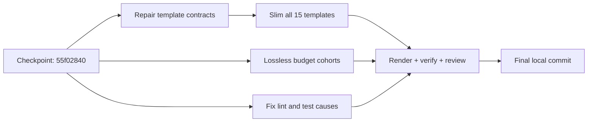

# Execution Plan: Quality Debt and Focused Visual Templates

**Date**: 2026-09-06
**Status**: Implementation accepted; final delivery tracked by quality loop and Git history
**Baseline**: `55f02840` (requested checkpoint committed; no push)

## Purpose / Big Picture

Resolve the previously reported budget, lint and test failures, repair template
consumer contracts, and make all 15 canonical templates concise and visual.
Do not exchange correctness for smaller files or green-looking checks.

## Alternatives Considered

Recorded in the clarification ledger before this plan:

| Option | Decision | Reason |
|--------|----------|--------|
| Minor trims only | Reject | Leaves most debt and broken template inputs |
| Contract-first fixes and lossless disclosure | Selected by council synthesis | Preserves depth while lowering loaded context |
| Raise limits, exclude failures, delete detail or rewrite runtime | Reject | Conceals debt or creates unnecessary behavior risk |

## Research and Model Council

- GPT-5.4 template audit: all 15 templates reviewed; prefer B, repair consumers
  before compaction, preserve machine-sensitive contracts and validate renders.
- Gemini 3.7 Flash budget audit: prefer B; require full content retention,
  explicit reference routing, correct per-path budgets and no generic padding.
- Claude Sonnet 5 quality-failure audit/council: prefers B; requires explicit lint
  scope, machine-contract tests, bounded processes and reference reachability.
- Synthesis: select B with those safeguards. All three independently invoked
  models support contract-first, preservation-based remediation.
- Scope override: Sonnet proposed limiting ESLint to the prior ten findings.
  The user's new "all remaining" request justifies fixing all 356 errors and two
  warnings now inventoried, in explicit tested cohorts. Non-failing, deliberately
  accepted PSScriptAnalyzer baseline rules are not automatically defects; fix
  its two actual regressions without increasing ratchets.

## Context and Orientation

| Surface | Baseline / finding | Required outcome |
|---------|--------------------|------------------|
| Budget debt | 94 overages: 87 skill roots, 5 references, 1 ADO instruction, 1 SPEC | Strict whole-tree check: zero violations |
| Templates | 15 canonical sources; bloated repeated appendices | Crisp core sections and 1-3 relevant diagrams each |
| Template inputs | Sidebar parses zero inputs for all 15; registry misses 9 YAML declarations | Real input names, types, defaults and order agree |
| Artifact scoring | SPEC/PRD/ADR headings, confidence and code-fence policy misalign | Following templates satisfies actual contracts |
| Lint/test failures | 356 ESLint errors + 2 warnings; two SAST ratchet regressions; missing fake timer; sequential pipe-read deadlock risk | Clean lint and passing existing gates; no weaker checks |
| Diagram tooling | Existing `mmdc` 11.12.0 and Pandoc | Render every final template diagram locally |

Root budgets stay at 1,500 estimated tokens, skill references at 2,000,
instruction references under the instruction tree at 1,500, and the retained
SPEC at 8,000. No limits are raised. Counts use LF-normalized characters/4, not
provider billing. Full-library rubric scores are a baseline diagnostic, not
proof of semantic quality or a reason to add empty boilerplate.

## Plan of Work

1. Repair template-input parsing in the extension and registry generator. Reuse
   the existing YAML dependency; support canonical YAML and legacy input comments.
   Test real templates and invalid/missing metadata before changing content.
2. Preserve required inputs, headings and anchors while slimming templates.
   Replace tutorial code and duplicated diagram appendices with concise decision,
   evidence and contract tables plus artifact-specific Mermaid. Migrate any
   machine-sensitive heading deliberately with regression tests.
3. Resolve budget debt in measured cohorts. Preserve complete moved sections and
   fenced examples in reachable references; keep activation, safety, decisions and
   failure boundaries in roots. Use fence-aware segmentation and rebase links.
   Record content hashes and relocation maps before/after; curate exceptions.
4. Fix confirmed lint/SAST/test causes, including input-parser error handling and
   the historical PRD heading warning observed during the checkpoint hook.
   Do not merely increase timeouts, suppress diagnostics or raise ratchets.
5. Regenerate registries, manifests, bundle and pristine seed. Validate all
   references and consumer paths, then independently review the final scope.
6. Complete the quality loop and commit all verified changes with normal hooks.
   Do not push.

## Progress

| Step | Status | Gate |
|------|--------|------|
| Checkpoint commit | Complete | `55f02840`; hooks passed; clean worktree |
| Inventory and design | Complete | Three real council responses and root-cause inventory |
| Template contract repair | Review corrections verified | 125 registry checks and 42 sidebar/metadata tests passed |
| Template content | Verified | 79 semantic checks; all 34 final diagrams rendered locally |
| Budget cohorts | Verified with explicit preservation exceptions | All 640 budgeted files pass; all 88 changed roots pass score >=80 without baseline regression; outliers restored; bounded experience review has H0/M0 |
| Executable quality fixes | Verified | Extension lint/compile and 1,080 coverage tests pass; 15 runner assertions, 57 harness assertions, 50 standalone pre-commit assertions and both doc-drift suites pass; current pre-commit wrapper passes in 736.683 seconds |
| Integration and review | Independently approved | Initial implementation review: 93/100, H0/M1/L1; per-target scan-error isolation and its missing tests repaired. Re-review: 99/100, H0/M0. Full run: 274/282. All eight failures now pass targeted verification: pre-commit wrapper plus 22 compatibility, distribution and direct contract checks. Current distribution: 43/43. Fragment and repository file-link checks pass |
| Final commit | Commit-time gate | Requires completed loop, normal hooks and clean worktree; outcome recorded in Git history |

## Concrete Steps

Use existing `score-skill`, `validate-skill`, `token-counter`,
`validate-references`, `check-doc-drift`, framework/behavior tests, extension
lint/compile/tests and `mmdc`. Record exact commands and results as work proceeds.
Temporary bulk-refactoring helpers and render exports belong in session state,
not the shipped product. Preserve meaningful content, not fictitious helper
claims; document any evidence-backed correction separately from relocation.

## Validation and Acceptance

- [x] All 94 baseline budget items resolved; no new violations or higher limits.
- [x] Relocated paragraphs/fences accounted for, links rebased, roots route to all new references.
- [x] Changed skill roots score at least 80 without losing specialized contracts.
- [x] All 15 template input/section contracts verified in generator and extension.
- [x] Every template diagram rendered locally; no external rendering service receives content.
- [x] Current confirmed lint/SAST failures and formerly failing/stalled tests resolved.
- [x] Template/scorer/heading migrations covered by tests rather than weakened checks.
- [x] Canonical, bundle, seed and installed paths/content remain consistent.
- [x] Mandatory documentation drift passes with semantic preservation and implementation review.
- [x] Independent v2.1 report approves the implementation with no HIGH/MEDIUM findings.

Final delivery requires at least three verified iterations, successful loop
closure, the requested commit with normal hooks, and a clean worktree. Verify
these commit-time outcomes in loop state and Git history rather than prefilling
success here. No push is authorized.

## Idempotence and Recovery

Use `55f02840` as the content-preservation baseline. Do not overwrite user changes
or mutate shared loop state from workers. If a transformation loses a contract,
repair that transformation, not its acceptance check. Test scratch must be
isolated, cleaned, and excluded from commits. The three already-pending pitch
deletions were documented separately in the checkpoint retention ledger.

## Blockers

Final delivery awaits final implementation review, loop completion and commit.
Preservation review is approved with no open findings. The completed full
framework run passed 274/282, not the
whole suite. Its eight failures were a pre-commit deadline, an obsolete source
location assertion, stale seed content, and five disclosure/evidence assertions.
The current pre-commit wrapper passes in 736.683 seconds, measured by Stopwatch.
All other failed cases pass in the current 22-check targeted framework rerun.
This combined evidence is not a claim that a second full framework run occurred.

Outliers and prose contracts are restored. Recover shared or expired loop state
only through the supported CLI with `--include-existing-changes`; never edit loop
JSON or retimestamp evidence. Do not disable platform protections to hide startup
costs. Temporary worker artifacts are retained in ignored session state, not
shipped with AgentX.

## Decision Log / Surprises

- The initial checkpoint unexpectedly included a pre-existing retired pitch
  package. Its obsolete content and lack of active consumers were verified and
  separately recorded; it was not silently restored or folded into the old ledger.
- A fresh full-library skill score run confirms many low heuristic scores.
  Treat those as inspection signals, not evidence of defects or model efficacy.
- Child-process helpers must drain stdout/stderr concurrently and report bounded
  failure. Test the large-stderr case; a larger suite timeout alone is not a fix.
- Do not replace `Invoke-Expression` with equivalent unchecked dynamic execution
  merely to evade an analyzer. Prefer a directly testable shared operation or
  another source-backed change that addresses the actual concern.
- A meaningful template diagram answers a stated question through labeled
  relationships, sequence, ownership or decisions; decorative diagrams do not
  satisfy the visual acceptance criterion.
- All 15 final templates total 27,683 LF-normalized estimated tokens, down from
  60,070 (53.9%). The initial smaller rewrite lost essential contracts and was
  rejected. The verified final set has 34 rendered diagrams and 79 passing
  semantic checks; token reduction alone was not accepted as quality evidence.
- Platform roots: 27/27 complete source-preservation passes and scores >=80.
  Engineering roots: 25 direct passes plus nine independently verified paragraph
  equivalences across the other nine roots. All original code fences are retained.
  Equivalences are documented path/anchor rebases, an ASCII correction and a
  broken baseline TOC correction, not a blanket exception for missing content.
- Whole-tree validation found a new Databricks reference overage missed by root
  checks. Its governance, vector-search and compute sections were relocated intact
  to the existing operations reference with mandatory topic links; strict
  Databricks budgets and all 27 platform preservation checks then passed.
- Two previously compacted outlier references reappeared at baseline size. The
  worker handback later confirmed restoration outside its root ownership. A
  preservation-only pass looked green while budgets regressed. Require current
  hashes and both gates, and include existing references in ownership boundaries.
- Windows process arguments must preserve paths with spaces and each argument's
  boundaries. Timeout cleanup must stop the tracked child tree, not only the
  immediate parent. An isolated smoke test does not replace actual-root execution.
- Independent runtime review found YAML alias failures escaping sidebar diagnostics
  and commented non-finite numbers bypassing standalone scalar validation. Narrow
  parsing-boundary handling and comment-before-coercion fixed both; 125 registry
  checks and 42 metadata/sidebar tests passed. Unexpected reader errors still
  propagate rather than becoming invalid-metadata results. The independent runtime
  reviewer then approved the corrected scope with no significant findings.
- The existing extension coverage command passed 1,080 tests: 82.84% statements
  and lines, 75.72% branches, and 81.05% functions. These are executed results,
  not inferred from the earlier test count or a single-file coverage percentage.
- The bounded runner now tests actual spaced arguments, large dual streams, real
  nonzero exits, descendant cleanup and inherited output handles. Exit completion
  does not imply stream completion: both must share a deadline. After parent exit,
  do not query and kill processes by a potentially reused parent PID; report the
  drain timeout, and clean up known fixture PIDs in the fixture's finally block.
- CLI packaging did not include the six new ADO instruction companions. Added
  them as supporting documents without changing the 15 auto-applied instructions.
  All 52 inventory/installation checks passed, including source hash parity in
  the installed workspace, extension bundle and pristine seed.
- Independent runner review caught `-NonInteractive` after `-File`, where it
  became a script argument. Separate host options from script arguments. A real
  noninteractive prompt regression rejects the old ordering; all 15 runner
  assertions and both doc-drift suites pass after correction.
- Actual PowerShell and Bash pack installation preserved the namespaced legal
  files; all six Bash-installed instruction companions matched source hashes.
  The writing-skill suite exposed stale legal-path and summary-wording assertions,
  plus missing root prose contracts. Correct assertions against established
  installer behavior; restore skill contracts rather than weakening their tests.
- Experience review found a PlantUML-primary row contradicting Mermaid-first
  routing. Restored the baseline Mermaid-primary row while retaining explicit
  native-lane exceptions and C4 renderer validation; independent re-review has
  H0/M0. Removed hidden/fenced legacy copies rather than gaming preservation.
- Experience preservation exceptions cover renamed headings, converted/rebased
  reference labels, explicit load order, and renderer qualification. All original
  executable fences remain exact. Corrected the working-prototype root's stale
  six-pass audit claim to the actual ten-pass contract and linked actual
  TypeScript instructions instead of a nonexistent skill.
- Final navigation audit: 87 budget roots, 341 reachable files, unchanged
  frontmatter, and zero broken internal or incoming fragments. Removed historical
  headings without live incoming references do not need fabricated aliases.
- Scrub is not a zero-duplicates claim. All 26 duplicate windows involving changed
  production TypeScript already occur unchanged at the baseline. Test signals
  include standalone assertion/fixture boilerplate and two intentionally separate
  process runners with different timeout return/throw contracts. Two verbose
  changed test comments were shortened; an unrelated dream-test comment and the
  deliberate empty-catch scrub fixture are not remediation defects.
- The pre-commit suite's old 900-second outer bound expired in the full run.
  A successful standalone log had a 902.7-second filesystem write span (not an
  exact runtime). The current wrapper completed both process and output capture
  in 736.683 seconds in isolation. Retain a bounded 1,200-second outer allowance
  for this suite only; per-process bounds and shared exit/drain deadlines remain.
- Source assertions now locate the seed constant in `initializeRuntimeAssets.ts`
  and verify its compatibility re-export rather than requiring the old module
  layout. Regeneration produced 1,715 assets and 705 seed files; fresh distribution
  parity passed after late source edits.
- Progressive-disclosure checks now follow the mandatory prototype report link,
  preserve all ten passes, and retain the three-cycle repair bound. The pinned
  offline Impeccable command remains explicit. Its DEGRADED report deliberately
  replaces a prefilled success claim with required, actually-run and not-run
  fields; this is a semantic correction, not verbatim preservation.
- All 15 final template hashes still match the accepted 34-render proof. The only
  remaining plain `git diff --check` reports are 12 intentional Markdown hard
  breaks in those templates; the check passes with end-of-line blanks allowed.
- Final loop recording exposed another sequential stdout/stderr collector in
  the production harness audit. Repair both adjacent audit collectors through
  one bounded capture helper, preserving arguments and workspace environment.
  Verify saturated streams, nonzero exit without a failure marker, and timeout
  handling before retrying the real loop. Do not suppress warnings or bypass it.
- Direct execution also identified the actual dirty-tree latency: compliance
  started a fresh PowerShell host for each changed file's scrub scan. Invoke the
  existing scanner in script scope instead, retaining its information output,
  exit codes and per-file behavior. Verify one host across multiple targets and
  fail-closed HIGH/error handling. This is separate from the reproduced pipe bug.
- The new saturated-stream regression timed out on the original collector.
  Corrected harness tests pass 52/52, including complete dual-stream capture,
  spaced arguments, nonzero-exit rejection, bounded timeout, and single-host scrub.
  Real compliance scanned 334 changed files with no HIGH findings and completed
  in 68.229 seconds. Configured analysis of all three changed harness files is clean.
- Final experience adjudication accepts 21 checker exceptions: 15 preserved or
  relocated equivalents and six deliberate improvements. The remaining stale
  six-pass references were corrected to ten passes, including the composition
  list; the TypeScript dependency now links the real instructions. Independent
  re-review is approved with H0/M0/L0. Both corrected prototype and prose roots
  score 96 without baseline regression.
- Final documentation drift validates 12 source claims and 2,029 local links
  across 739 Markdown files, including new references, with no issues. These
  structural checks accompany rather than replace independent semantic review.
- Independent implementation review scored 93/100 but blocked on lost per-target
  fault isolation: a thrown scrub exception aborted later scans and GitHub output.
  The real compliance regression reproduced four failures (53/57 passed). A narrow
  typed error boundary around each script invocation now records the target and
  cause, continues later scans, and preserves the overall failing result. Reverting
  to per-file host startup or accepting undocumented fail-fast behavior was rejected.
  All 57 harness assertions now pass, including thrown and stopping errors, later
  HIGH/successful targets, non-advisory exit 1, and post-batch metadata.
  PSScriptAnalyzer with repository settings reports zero findings in each corrected
  PowerShell file. This is distinct from scrub, whose three duplicate-logic MEDIUM
  findings in the test file were independently reproduced at the baseline.
- Independent re-review approves the correction with H0/M0 and independently
  reruns all 57 harness assertions. Post-correction distribution passes 43/43.
  Real non-advisory compliance completes 334 scans over 340 changed paths in
  65.306 seconds, with exit 0 and no HIGH findings, below the production 120-second
  audit limit. This measured run does not guarantee every future run's duration.

## Artifacts and Notes

Evidence: ignored `.agentx/state` retains current budget, preservation, template,
integration, lint, coverage and independent review reports. The committed plan
and learning retain the results; temporary fixtures and helper scripts do not ship.

## Outcomes & Retrospective

The requested budget and template optimization is implemented, verified and
independently approved. Final delivery requires normal quality-loop closure and
the requested local commit; their outcomes are recorded by loop state and Git
history. No push is authorized here.
Live VS Code Agents-window GUI execution and provider billing savings are not
claimed by the automated compatibility and estimated-token checks.
