# Technical Specification: Agent-to-Agent Clarification Protocol

**Issue**: #1
**Epic**: #1
**Status**: Draft
**Author**: Solution Architect Agent
**Date**: 2026-02-26
**Related ADR**: [ADR-1.md](../adr/ADR-1.md)

> **Acceptance Criteria**: Defined in the PRD user stories -- see [PRD-9.md](../prd/PRD-9.md#5-user-stories--features). Engineers should track AC completion against the originating Story issue.

---

## Table of Contents

1. [Overview](#1-overview)
2. [Architecture Diagrams](#2-architecture-diagrams)
3. [API Design](#3-api-design)
4. [Data Model Diagrams](#4-data-model-diagrams)
5. [Service Layer Diagrams](#5-service-layer-diagrams)
6. [Security Diagrams](#6-security-diagrams)
7. [Performance](#7-performance)
8. [Testing Strategy](#8-testing-strategy)
9. [Implementation Notes](#9-implementation-notes)
10. [Rollout Plan](#10-rollout-plan)
11. [Risks & Mitigations](#11-risks--mitigations)
12. [Monitoring & Observability](#12-monitoring--observability)

---

## 1. Overview

Add a structured clarification protocol to AgentX that enables downstream agents (e.g., Engineer, Architect) to request and receive clarification from upstream agents (e.g., PM, Architect) when they encounter ambiguity. Agent X mediates all clarification traffic (hub-and-spoke), with file-level locking for concurrent safety, per-issue JSON ledgers for state, and conversation-as-interface rendering in Copilot Chat and CLI.

**Scope:**
- In scope: Clarification ledger, file locking (PowerShell + TypeScript), routing via Agent X, round limits + escalation, stale/stuck/deadlock detection, CLI `clarify` subcommand, TOML field extensions, EventBus events, AgenticLoop integration, agent status extensions, conversation streaming, GitHub issue sync, `/clarify` slash command, weekly digest stats
- Out of scope: Direct agent-to-agent communication, UI buttons/panels, real-time WebSocket notifications, multi-party threads, cross-repository clarification

**Success Criteria:**
- Clarification auto-resolution rate >80% (no human needed)
- Review rejection rate due to misunderstanding <15%
- Works identically in Local Mode and GitHub Mode
- File locking tested with 3+ concurrent writers without corruption

---

## 2. Architecture Diagrams

### 2.1 High-Level System Architecture

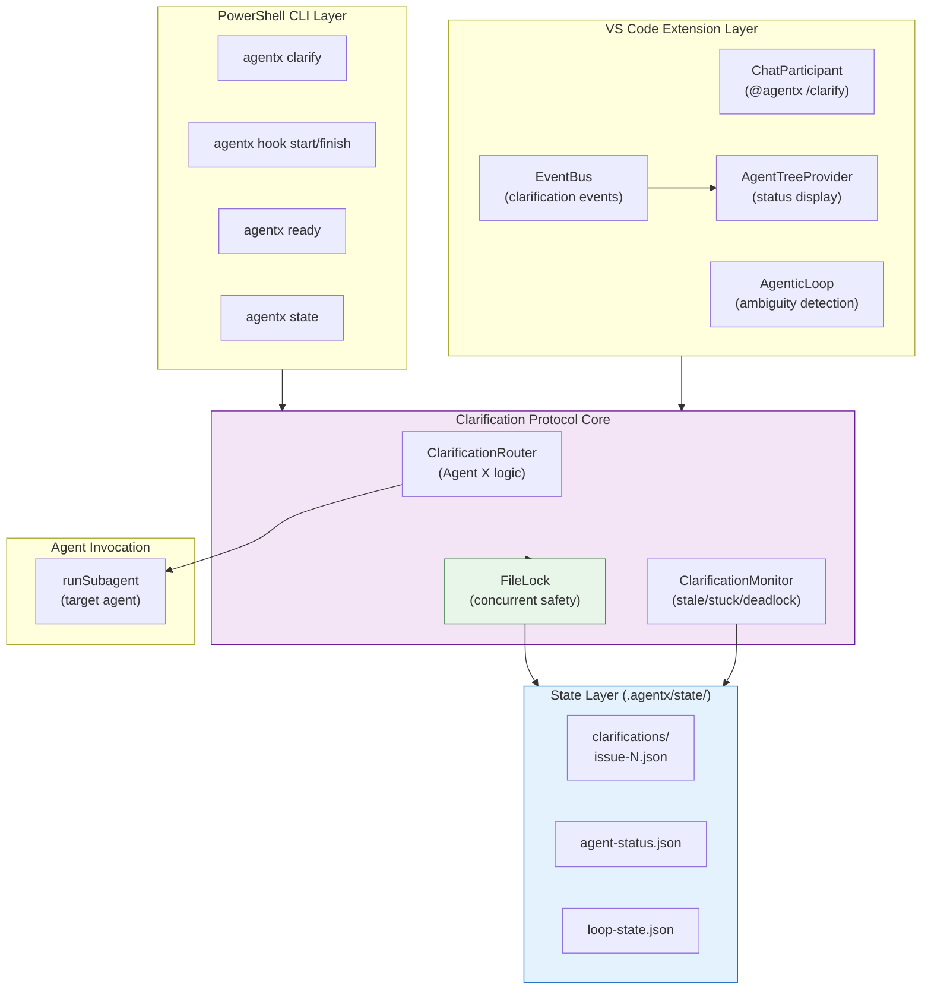

**Component Responsibilities:**

| Layer | Responsibility | Technology |
|-------|---------------|------------|
| **CLI Layer** | User-facing commands for clarification management | PowerShell 7+ |
| **Extension Layer** | Copilot Chat integration, agentic loop, sidebar views | TypeScript (VS Code API) |
| **Protocol Core** | Routing, monitoring, state management | PowerShell + TypeScript (shared logic) |
| **State Layer** | Persistent storage for clarification records | JSON files with file locking |
| **Agent Invocation** | Invoking target agents for answers | `runSubagent` (Copilot infra) |

### 2.2 Sequence Diagram: Blocking Clarification (Happy Path)

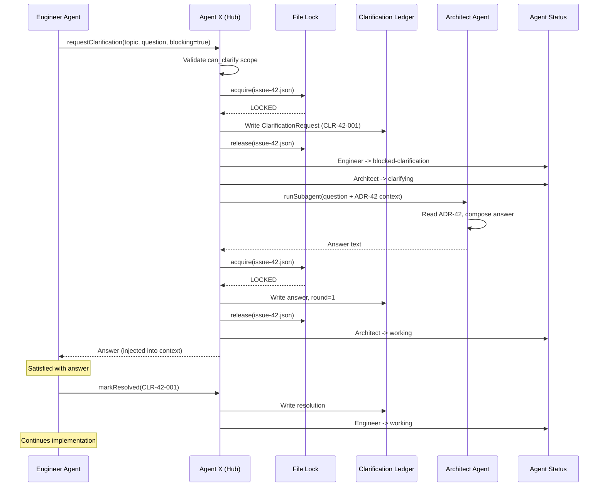

### 2.3 Sequence Diagram: Escalation After Max Rounds

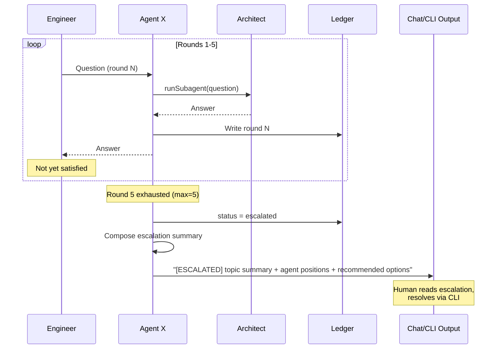

### 2.4 Sequence Diagram: Stale Detection + Auto-Retry

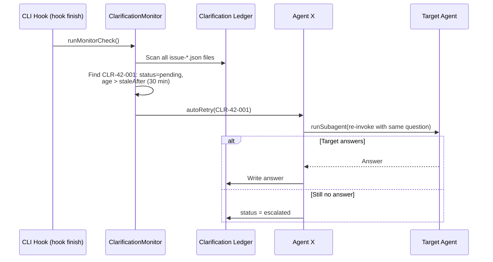

### 2.5 Class/Interface Diagram: Clarification Domain Model

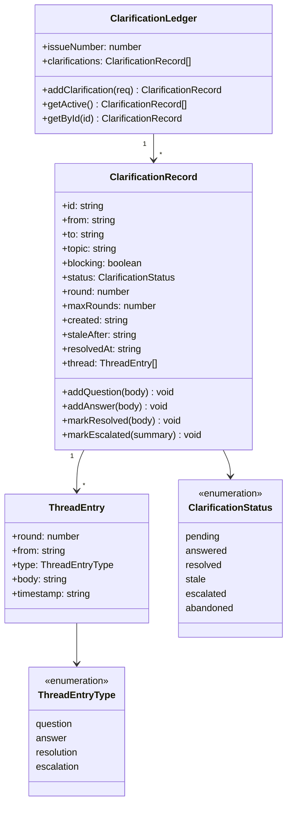

### 2.6 Class/Interface Diagram: File Locking

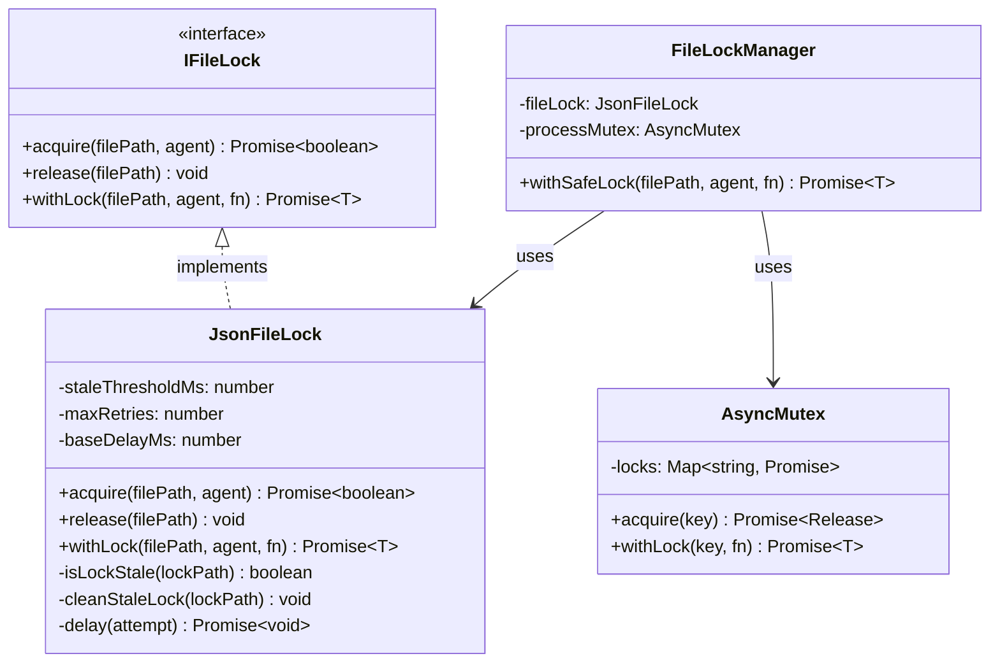

---

## 3. API Design

### 3.1 CLI Commands (PowerShell)

| Command | Description | Auth | Output |
|---------|-------------|------|--------|
| `agentx clarify` | List all active clarifications | None | Table |
| `agentx clarify --issue N` | Show clarification thread for issue | None | Thread |
| `agentx clarify stale` | Show stale/stuck clarifications | None | Table |
| `agentx clarify resolve CLR-N-NNN` | Manually resolve escalated clarification | None | Confirmation |
| `agentx clarify escalate CLR-N-NNN` | Manually escalate a clarification | None | Confirmation |
| `agentx clarify --json` | Machine-readable output | None | JSON |

### 3.2 Slash Commands (VS Code Extension)

| Command | Description | Input |
|---------|-------------|-------|
| `@agentx /clarify` | List active clarifications | None |
| `@agentx /clarify #42` | Show thread for issue #42 | Issue number |

### 3.3 Internal API: ClarificationRouter

```
ClarificationRouter
  requestClarification(options)
    Input:  { issueNumber, fromAgent, toAgent, topic, question, blocking, maxRounds }
    Output: { clarificationId, status }
    Errors: SCOPE_VIOLATION (not in can_clarify), LOCK_TIMEOUT, AGENT_ERROR

  answerClarification(options)
    Input:  { clarificationId, answer }
    Output: { round, status }
    Errors: NOT_FOUND, LOCK_TIMEOUT, MAX_ROUNDS_EXCEEDED

  resolveClarification(options)
    Input:  { clarificationId, resolutionBody }
    Output: { status: 'resolved' }
    Errors: NOT_FOUND, LOCK_TIMEOUT

  escalateClarification(options)
    Input:  { clarificationId, summary }
    Output: { status: 'escalated' }
    Errors: NOT_FOUND, LOCK_TIMEOUT
```

### 3.4 Internal API: ClarificationMonitor

```
ClarificationMonitor
  runCheck()
    Input:  (none -- scans all ledger files)
    Output: { stale: ClarificationRecord[], stuck: ClarificationRecord[], deadlocked: ClarificationRecord[] }

  autoRetry(clarificationId)
    Input:  { clarificationId }
    Output: { retried: boolean, newStatus: string }

  breakDeadlock(clrA, clrB)
    Input:  { clrA: ClarificationRecord, clrB: ClarificationRecord }
    Output: { escalated: string, continued: string }
    Logic:  Upstream agent (PM > Architect > Engineer) keeps active; downstream auto-escalated
```

### 3.5 Error Responses

```
+-----------------------------------------------------------------------------+
| CLARIFICATION ERROR TYPES                                                    |
+-----------------------------------------------------------------------------+
|                                                                              |
| SCOPE_VIOLATION                  | LOCK_TIMEOUT                             |
| +---------------------------+   | +---------------------------+             |
| | Agent 'engineer' cannot   |   | | Failed to acquire lock   |             |
| | clarify with 'reviewer'.  |   | | for issue-42.json after  |             |
| | Allowed: [architect, pm]  |   | | 5 retries (5s timeout).  |             |
| +---------------------------+   | +---------------------------+             |
|                                                                              |
| MAX_ROUNDS_EXCEEDED              | NOT_FOUND                                |
| +---------------------------+   | +---------------------------+             |
| | CLR-42-001 reached max    |   | | Clarification CLR-42-001 |             |
| | rounds (5). Auto-escalated|   | | not found in ledger.     |             |
| +---------------------------+   | +---------------------------+             |
|                                                                              |
+------------------------------------------------------------------------------+
```

---

## 4. Data Model Diagrams

### 4.1 Clarification Ledger Schema (ERD)

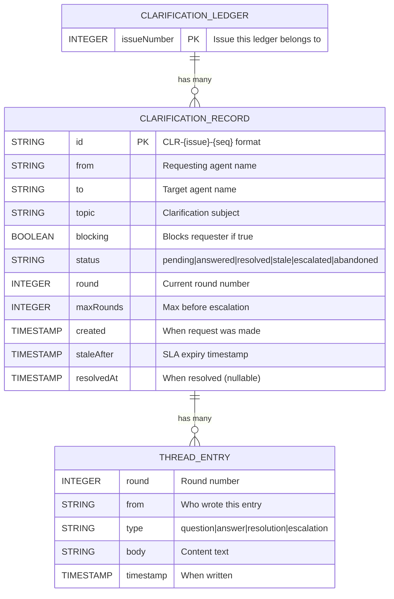

### 4.2 Clarification Ledger JSON Schema

```
File: .agentx/state/clarifications/issue-{N}.json

{
  "issueNumber": <integer>,
  "clarifications": [
    {
      "id":           <string>  "CLR-{issue}-{seq:03d}",
      "from":         <string>  agent name (e.g., "engineer"),
      "to":           <string>  agent name (e.g., "architect"),
      "topic":        <string>  short description,
      "blocking":     <boolean> true if requester is blocked,
      "status":       <enum>    "pending"|"answered"|"resolved"|"stale"|"escalated"|"abandoned",
      "round":        <integer> current round (starts at 1),
      "maxRounds":    <integer> from TOML or default (5 blocking, 6 non-blocking),
      "created":      <ISO8601> creation timestamp,
      "staleAfter":   <ISO8601> SLA expiry timestamp,
      "resolvedAt":   <ISO8601|null> resolution timestamp,
      "thread": [
        {
          "round":     <integer>,
          "from":      <string>,
          "type":      <enum>  "question"|"answer"|"resolution"|"escalation",
          "body":      <string>,
          "timestamp": <ISO8601>
        }
      ]
    }
  ]
}
```

### 4.3 Agent Status Extension Schema

```
File: .agentx/state/agent-status.json

{
  "<agent-name>": {
    "status":          <string>  "idle"|"working"|"clarifying"|"blocked-clarification"|"done"|"stuck",
    "issue":           <integer|null>,
    "lastActivity":    <ISO8601>,
    "clarificationId": <string|null>  "CLR-42-001" (when clarifying or blocked),
    "waitingOn":       <string|null>  agent name (when blocked-clarification),
    "respondingTo":    <string|null>  agent name (when clarifying)
  }
}
```

### 4.4 Lock File Schema

```
File: .agentx/state/clarifications/issue-{N}.json.lock

{
  "pid":       <integer>  process ID,
  "timestamp": <ISO8601>  lock acquisition time,
  "agent":     <string>   agent or process name
}
```

### 4.5 Workflow TOML Extension

```
New fields on [[steps]] entries:

  can_clarify             = ["architect", "product-manager"]   # array of agent names
  clarify_max_rounds      = 5                                  # integer, default 5
  clarify_sla_minutes     = 30                                 # integer, default 30
  clarify_blocking_allowed = true                              # boolean, default true
```

---

## 5. Service Layer Diagrams

### 5.1 PowerShell Service Architecture

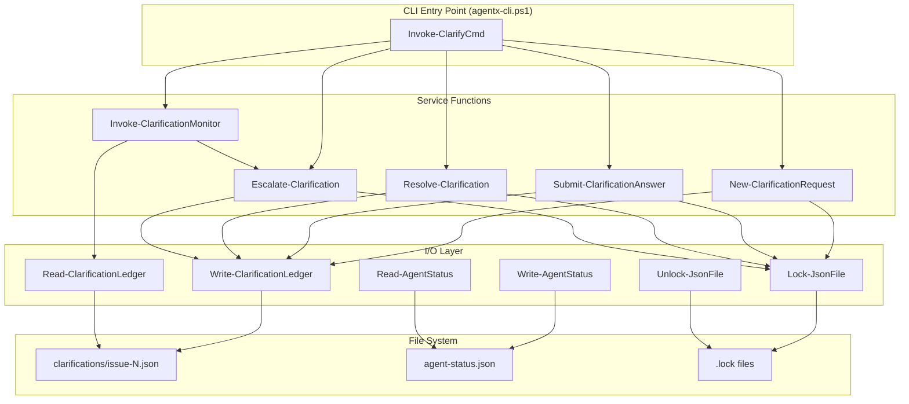

### 5.2 TypeScript Service Architecture (Extension)

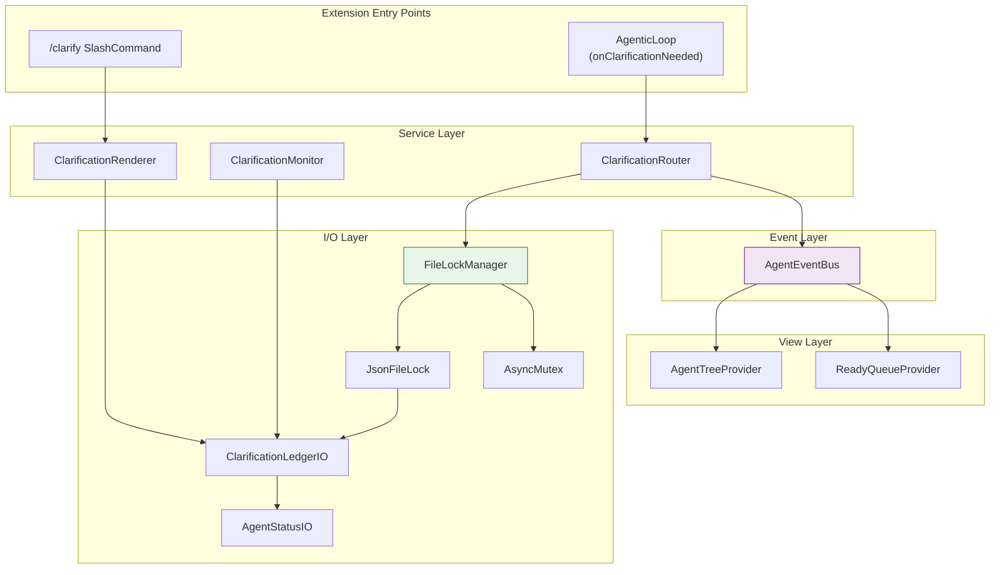

---

## 6. Security Diagrams

### 6.1 Scope Guard (Authorization Model)

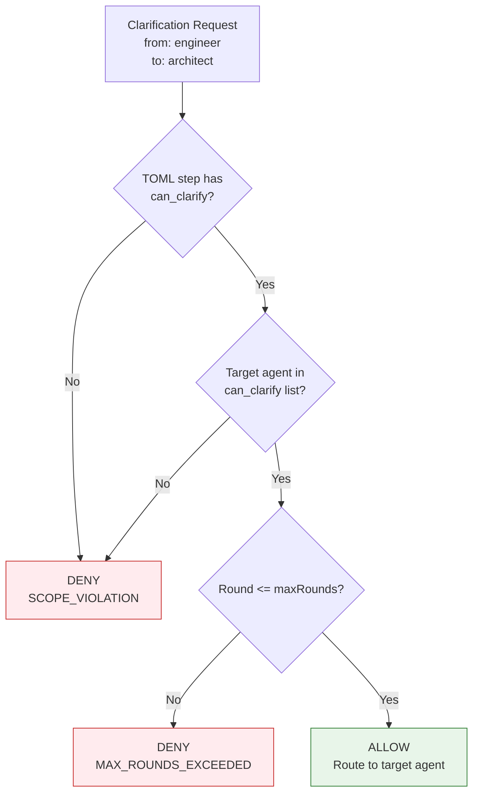

### 6.2 Defense in Depth

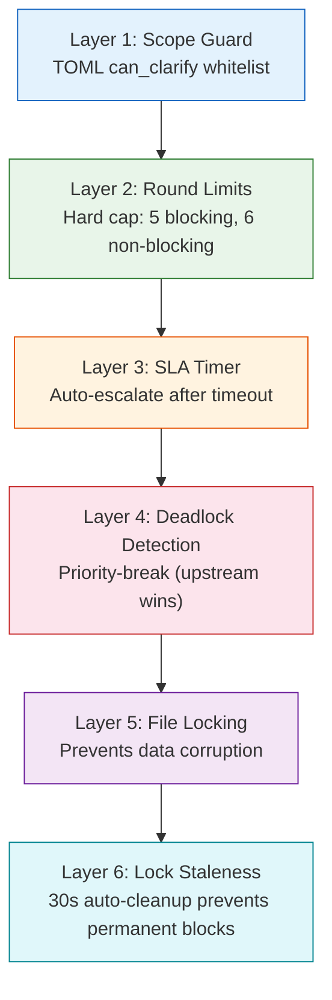

### 6.3 Input Validation

| Input | Validation | Constraint |
|-------|-----------|------------|
| `fromAgent` | Must be a known agent name | Enum check against registered agents |
| `toAgent` | Must be in `can_clarify` list | TOML scope check |
| `topic` | Non-empty string | Max 200 characters |
| `question` | Non-empty string | Max 2000 characters |
| `blocking` | Boolean | `true` or `false` only |
| `clarificationId` | Must match `CLR-{N}-{NNN}` pattern | Regex validation |
| `answer` | Non-empty string | Max 2000 characters |

---

## 7. Performance

### 7.1 Performance Requirements

| Metric | Target | Measurement |
|--------|--------|-------------|
| Clarification round-trip (question -> answer) | <15 seconds | Wall clock time (includes LLM call) |
| Lock acquisition | <1 second | File lock acquire + write + release |
| Lock retry total timeout | <5 seconds | 5 retries with exponential backoff |
| Ledger file read | <100ms | JSON parse from disk |
| Ledger file write | <100ms | JSON serialize + write to disk |
| Monitor scan (all ledgers) | <500ms (10 issues) | Scan `.agentx/state/clarifications/` |
| Stale lock check | <50ms | Single file stat operation |

### 7.2 Optimization Strategies

- **Per-issue files**: One JSON file per issue avoids single-file bottleneck; lock contention is rare (agents rarely work on same issue)
- **In-process mutex**: TypeScript `AsyncMutex` prevents redundant file lock attempts within same VS Code process
- **Lazy scanning**: Monitor only scans ledger files when triggered (not polling)
- **Bounded growth**: Thread arrays bounded by `maxRounds` (max 5-6 entries); no unbounded growth

### 7.3 Lock Timing Diagram

```
Attempt 1: Try acquire       -> 0ms
           (fail, lock held)
Attempt 2: Wait 200ms        -> 200ms
           Try acquire
           (fail, lock held)
Attempt 3: Wait 400ms        -> 600ms
           Try acquire
           (fail, lock held)
Attempt 4: Wait 800ms        -> 1400ms
           Try acquire
           (fail, lock held)
Attempt 5: Wait 1600ms       -> 3000ms
           Try acquire
           TIMEOUT at 5000ms -> Escalate
```

---

## 8. Testing Strategy

### 8.1 Test Pyramid

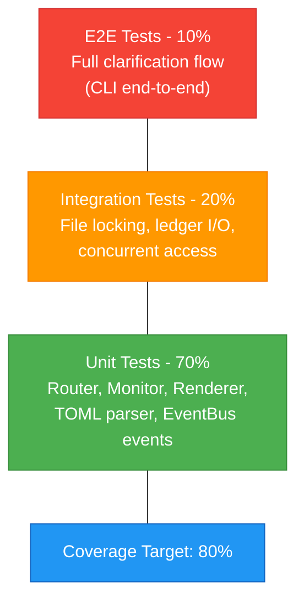

### 8.2 Test Types

| Test Type | Coverage | Framework | Scope |
|-----------|----------|-----------|-------|
| **Unit (PS)** | 80%+ | Pester | Lock-JsonFile, ClarificationRouter, Monitor, TOML parser |
| **Unit (TS)** | 80%+ | Mocha + VS Code Test | JsonFileLock, AsyncMutex, EventBus events, LoopConfig |
| **Integration (PS)** | Key flows | Pester | File locking concurrent access, ledger read/write |
| **Integration (TS)** | Key flows | Mocha | FileLockManager concurrent access, ClarificationRouter |
| **E2E** | Happy paths | test-framework.ps1 | Full clarification: request -> route -> answer -> resolve |

### 8.3 Critical Test Scenarios

| Scenario | Type | Description |
|----------|------|-------------|
| Lock acquire/release | Unit | Single process acquires and releases lock file |
| Stale lock cleanup | Unit | Lock older than 30s is detected and removed |
| Concurrent writers | Integration | 3 processes try to write same ledger simultaneously |
| Lock timeout | Unit | 5 retries exhausted, returns TIMEOUT |
| Scope validation | Unit | Request to agent not in `can_clarify` is rejected |
| Round limit enforcement | Unit | After max rounds, status set to `escalated` |
| Stale detection | Unit | Pending clarification past SLA is flagged stale |
| Stuck detection | Unit | Circular answers (same topic, direction flipped) detected |
| Deadlock detection | Unit | Mutual blocking detected, upstream priority-break applied |
| TOML parsing | Unit | New fields read correctly, defaults applied for missing fields |
| EventBus events | Unit | All 5 clarification events fire with correct payloads |
| Chat rendering | Unit | Markdown output matches expected format |
| CLI rendering | Unit | ANSI-colored output matches expected format |
| Full flow (happy path) | E2E | Request -> route -> answer -> resolve via CLI |
| Full flow (escalation) | E2E | Request -> 5 rounds -> auto-escalate -> human resolve |
| Local Mode parity | E2E | Same flow works in Local Mode |
| GitHub Mode sync | E2E | Clarification rounds posted as issue comments |

---

## 9. Implementation Notes

### 9.1 Directory Structure

```
.agentx/
  agentx-cli.ps1                    # Extended with clarify subcommand
  state/
    agent-status.json               # Extended with clarifying/blocked statuses
    clarifications/                  # NEW: per-issue clarification ledgers
      issue-1.json
      issue-42.json
      issue-42.json.lock            # Transient lock file (gitignored)
  workflows/
    feature.toml                    # Extended with can_clarify fields
    story.toml                      # Extended with can_clarify fields
    bug.toml                        # Extended with can_clarify fields
    epic.toml                       # Extended with can_clarify fields

vscode-extension/src/
  agentic/
    agenticLoop.ts                  # Extended with clarification support
  chat/
    commandHandlers.ts              # Extended with /clarify handler
  utils/
    eventBus.ts                     # Extended with 5 clarification events
    fileLock.ts                     # NEW: JsonFileLock + AsyncMutex
    clarificationRouter.ts          # NEW: Routing logic
    clarificationMonitor.ts         # NEW: Stale/stuck/deadlock detection
    clarificationRenderer.ts        # NEW: Chat/CLI output formatting
  views/
    agentTreeProvider.ts            # Extended with clarification status icons
    readyQueueTreeProvider.ts       # Extended with blocked badge
  test/
    utils/
      fileLock.test.ts              # NEW: Lock tests
      clarificationRouter.test.ts   # NEW: Router tests
      clarificationMonitor.test.ts  # NEW: Monitor tests
```

### 9.2 Files To Modify (Existing)

| File | Change Description |
|------|--------------------|
| `.agentx/agentx-cli.ps1` | Add `Invoke-ClarifyCmd`, `Lock-JsonFile`/`Unlock-JsonFile`, monitor integration |
| `.agentx/agentx-cli.ps1` (`Read-TomlWorkflow`) | Parse `can_clarify`, `clarify_max_rounds`, `clarify_sla_minutes`, `clarify_blocking_allowed` |
| `.agentx/workflows/feature.toml` | Add `can_clarify` fields to implement + architecture steps |
| `.agentx/workflows/story.toml` | Add `can_clarify` fields |
| `.agentx/workflows/bug.toml` | Add `can_clarify` fields |
| `vscode-extension/src/utils/eventBus.ts` | Add 5 event types + payload interfaces to `AgentEventMap` |
| `vscode-extension/src/agentic/agenticLoop.ts` | Extend `AgenticLoopConfig` with clarification fields |
| `vscode-extension/src/chat/commandHandlers.ts` | Add `case 'clarify'` to switch |
| `vscode-extension/src/views/agentTreeProvider.ts` | Add status icons for `clarifying`/`blocked-clarification` |
| `vscode-extension/src/views/readyQueueTreeProvider.ts` | Show blocked badge for clarification-pending issues |
| `.gitignore` | Add `*.lock` pattern for `.agentx/state/` |

### 9.3 Files To Create (New)

| File | Purpose |
|------|---------|
| `vscode-extension/src/utils/fileLock.ts` | `JsonFileLock`, `AsyncMutex`, `FileLockManager` |
| `vscode-extension/src/utils/clarificationRouter.ts` | Routing logic, scope validation, round management |
| `vscode-extension/src/utils/clarificationMonitor.ts` | Stale, stuck, deadlock detection |
| `vscode-extension/src/utils/clarificationRenderer.ts` | Chat markdown + CLI text formatting |
| `vscode-extension/src/test/utils/fileLock.test.ts` | Lock unit tests |
| `vscode-extension/src/test/utils/clarificationRouter.test.ts` | Router unit tests |
| `vscode-extension/src/test/utils/clarificationMonitor.test.ts` | Monitor unit tests |

### 9.4 Dependencies

| Dependency | Type | Purpose | Version |
|-----------|------|---------|---------|
| `vscode` | Existing | VS Code API | ^1.85.0 |
| `fs` (Node.js) | Built-in | File I/O with `wx` flag for atomic create | Node 18+ |
| PowerShell 7+ | Existing | CLI runtime | 7.0+ |
| No new npm packages | -- | File locking uses Node.js built-in `fs.open` with mode `wx` | -- |

### 9.5 Configuration

**TOML defaults (applied when fields are absent):**

| Field | Default | Note |
|-------|---------|------|
| `can_clarify` | `[]` (empty) | No clarification unless explicitly declared |
| `clarify_max_rounds` | `5` | Blocking clarifications |
| `clarify_sla_minutes` | `30` | Time before stale detection |
| `clarify_blocking_allowed` | `true` | Can block requesting agent |

**Lock defaults (hardcoded constants):**

| Constant | Value | Note |
|----------|-------|------|
| `STALE_LOCK_THRESHOLD_MS` | `30000` | 30 seconds |
| `MAX_LOCK_RETRIES` | `5` | Retry attempts |
| `BASE_LOCK_DELAY_MS` | `200` | Exponential backoff base |
| `MAX_LOCK_WAIT_MS` | `5000` | Total max wait time |

### 9.6 Development Workflow

1. Implement file locking (PowerShell `Lock-JsonFile`/`Unlock-JsonFile` + TypeScript `JsonFileLock`/`AsyncMutex`)
2. Implement clarification ledger schema + read/write with locking
3. Extend agent-status.json schema + CLI display
4. Implement ClarificationRouter (scope check, round management, Agent X routing)
5. Implement conversation rendering (chat markdown + CLI ANSI)
6. Extend TOML parser for new fields
7. Implement ClarificationMonitor (stale, stuck, deadlock detection)
8. Integrate with AgenticLoop (LoopConfig extension)
9. Add EventBus events + wire to tree providers
10. Add `/clarify` slash command
11. Implement GitHub issue sync (GitHub Mode overlay)
12. Add digest stats
13. Write tests at each step (TDD where possible)

---

## 10. Rollout Plan

### Phase 1: Foundation (Week 1-2)

**Stories**: US-1.1 (#9), US-1.2 (#10), US-1.3 (#11), US-3.1 (#15), US-3.2 (#16)

- File locking implementation (PowerShell + TypeScript)
- Clarification ledger JSON schema + read/write
- Agent status extensions (`clarifying`, `blocked-clarification`)
- `.gitignore` update for lock files
- Unit tests for locking + stale detection

**Deliverable**: Locking and state management working, tested with concurrent access

### Phase 2: Core Protocol (Week 3-4)

**Stories**: US-2.1 (#12), US-2.2 (#13), US-2.3 (#14), US-4.1 (#17), US-4.2 (#18), US-6.1 (#23)

- Agent X clarification routing logic
- `runSubagent` invocation for target agent
- Chat stream formatting (inline markdown)
- CLI `clarify` subcommand
- Round limit enforcement + auto-escalation
- TOML field parsing extension

**Deliverable**: End-to-end clarification in both Local and GitHub modes

### Phase 3: Monitoring + Extension (Week 5-6)

**Stories**: US-5.1 (#19), US-5.2 (#20), US-5.3 (#21), US-5.4 (#22), US-6.2 (#24), US-6.3 (#25)

- Stale, stuck, deadlock detection
- Event-driven monitoring (hook-triggered)
- AgenticLoop clarification support
- EventBus typed events
- Agent Tree + Ready Queue integration

**Deliverable**: Monitoring catches issues; extension fully integrated

### Phase 4: Polish (Week 7)

**Stories**: US-7.1 (#26), US-7.2 (#27), US-7.3 (#28)

- Weekly digest clarification stats
- GitHub issue comment mirroring
- `/clarify` slash command

**Deliverable**: All features complete; ready for review

---

## 11. Risks & Mitigations

| Risk | Impact | Probability | Mitigation |
|------|--------|-------------|------------|
| Concurrent lock contention | Medium | Low | Per-issue files minimize contention; exponential backoff handles transient collisions |
| Stale locks from crashed processes | Medium | Medium | 30-second auto-cleanup threshold; lock file includes PID for diagnostics |
| TOML parser breaks on new fields | Medium | Low | Existing parser uses default values for unknown keys; new fields have safe defaults |
| LLM fails during clarification round | High | Low | Catch errors, mark as escalated, agent continues with available information |
| Clarification context exceeds token budget | Medium | Medium | Context compaction applied before injecting clarification thread; summary replaces full thread post-resolution |
| EventBus event storms (many clarifications) | Low | Low | History buffer capped at 200 entries; listeners are lightweight |
| File lock works differently across OS | Medium | Low | Using Node.js `fs.open('wx')` and PowerShell `FileMode.CreateNew` -- both cross-platform |

---

## 12. Monitoring & Observability

### 12.1 Metrics

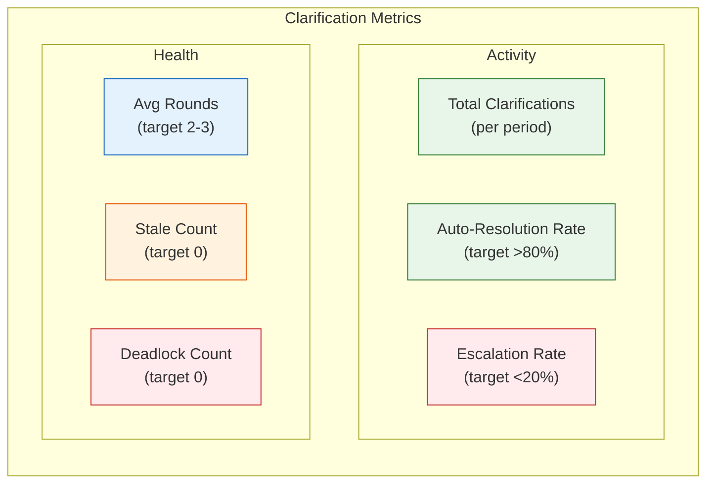

### 12.2 EventBus Events (Observability Points)

| Event | When Fired | Subscribers |
|-------|-----------|-------------|
| `clarification-requested` | Agent creates ClarificationRequest | AgentTreeProvider, ThinkingLog |
| `clarification-answered` | Target agent provides answer | AgentTreeProvider, ThinkingLog |
| `clarification-stale` | Monitor detects SLA expiry | AgentTreeProvider, ReadyQueueProvider |
| `clarification-resolved` | Requester marks resolved | AgentTreeProvider, ThinkingLog |
| `clarification-escalated` | Auto-escalation or manual | AgentTreeProvider, ReadyQueueProvider |

### 12.3 Logging

- Structured logging: All clarification operations logged with `{clarificationId, issueNumber, fromAgent, toAgent, round, status}`
- Lock operations: acquire/release logged with `{filePath, agent, durationMs}` for contention analysis
- Monitor results: scan results logged with `{staleCount, stuckCount, deadlockedCount}` on each trigger
- Escalation: full summary logged for human review

### 12.4 CLI Observability

| Command | What It Shows |
|---------|--------------|
| `agentx clarify` | All active clarifications with status, round, age |
| `agentx clarify stale` | Only stale/stuck clarifications |
| `agentx state` | Agent statuses including `clarifying`/`blocked-clarification` |
| `agentx ready` | Ready queue with `BLOCKED: Clarification pending` markers |

---

## Cross-Cutting Concerns Diagram

```mermaid
graph TD
    subgraph Pipeline["Clarification Pipeline"]
        direction LR
        REQ["Request"] --> SCOPE["Scope Check"] --> LOCK["File Lock"]
        LOCK --> WRITE["Write Ledger"] --> ROUTE["Route to Agent"]
        ROUTE --> ANS["Answer"] --> RENDER["Render Output"]
    end

    subgraph Row1[""]
        direction LR
        L["LOGGING<br/>Structured JSON - Per operation<br/>clarificationId - Round tracking"]
        M["MONITORING<br/>Stale detection - Stuck detection<br/>Deadlock detection - SLA timers"]
        E["EVENTS<br/>EventBus lifecycle events<br/>Tree view refresh - History"]
    end

    subgraph Row2[""]
        direction LR
        V["VALIDATION<br/>Scope guard - Round limits<br/>Input sanitization - ID format"]
        C["CONCURRENCY<br/>File locking - AsyncMutex<br/>Stale cleanup - Retry backoff"]
        R["RENDERING<br/>Chat markdown - CLI ANSI<br/>GitHub comments - Digest stats"]
    end

    Pipeline --- Row1
    Row1 --- Row2
```

---

**Generated by AgentX Architect Agent**
**Last Updated**: 2026-02-26
**Version**: 1.0
