# Technical Specification: Persistent Agent Memory Pipeline

**Issue**: #29
**Epic**: #29
**Status**: Draft
**Author**: Solution Architect Agent
**Date**: 2026-02-27
**Related ADR**: [ADR-29.md](../adr/ADR-29.md)

> **Acceptance Criteria**: Defined in the PRD user stories -- see [PRD-29.md](../prd/PRD-29.md#5-user-stories--features). Engineers should track AC completion against the originating Story issue.

---

## Table of Contents

1. [Overview](#1-overview)
2. [Architecture Diagrams](#2-architecture-diagrams)
3. [API Design](#3-api-design)
4. [Data Model Diagrams](#4-data-model-diagrams)
5. [Service Layer Diagrams](#5-service-layer-diagrams)
6. [Security Diagrams](#6-security-diagrams)
7. [Performance](#7-performance)
8. [Testing Strategy](#8-testing-strategy)
9. [Implementation Notes](#9-implementation-notes)
10. [Rollout Plan](#10-rollout-plan)
11. [Risks & Mitigations](#11-risks--mitigations)
12. [Monitoring & Observability](#12-monitoring--observability)

---

## 1. Overview

Build a persistent memory pipeline for AgentX that captures agent observations at session end, stores them in per-issue JSON files, and injects relevant past observations at session start. The pipeline extends the existing `ContextCompactor`, `AgentEventBus`, and `FileLockManager` infrastructure with a new `ObservationStore` storage layer and `MemoryPipeline` orchestrator.

**Scope:**
- In scope: ObservationStore (CRUD + FTS), MemoryPipeline (capture + inject), EventBus extensions (2 new events), ContextCompactor memory budget integration, VS Code commands (search memory, get observation), relevance scoring, observation compaction, CLI subcommand
- Out of scope: Vector/embedding search, cross-workspace memory, cloud sync, web viewer UI, LLM summarization

**Success Criteria:**
- Observations persist across sessions and are searchable in <200ms for 10K records
- Session-start injection surfaces relevant past decisions within a 20K token memory budget
- Context budget report includes recalled memory section
- No degradation in session start time beyond 500ms

---

## 2. Architecture Diagrams

### 2.1 High-Level System Architecture

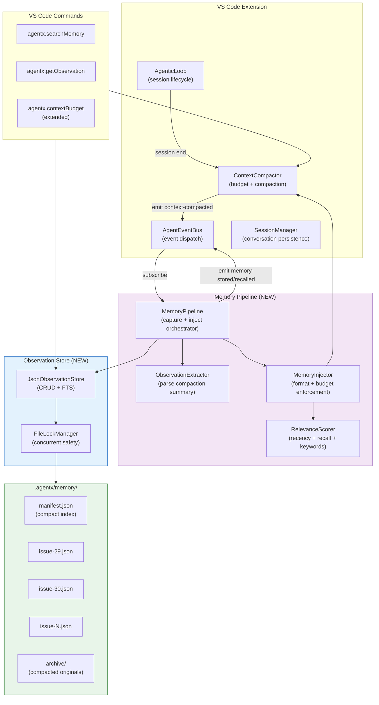

**Component Responsibilities:**

| Layer | Responsibility | Technology |
|-------|---------------|------------|
| **AgenticLoop** | Session lifecycle, calls compactConversation at end | TypeScript (existing) |
| **ContextCompactor** | Token budget tracking, regex-based compaction | TypeScript (existing, extended) |
| **MemoryPipeline** | Orchestrates capture at session end, injection at session start | TypeScript (new) |
| **ObservationExtractor** | Parses compaction summaries into structured observations | TypeScript (new) |
| **RelevanceScorer** | Ranks observations by recency, recall count, keyword overlap | TypeScript (new) |
| **MemoryInjector** | Selects top-k observations, formats for injection, enforces budget | TypeScript (new) |
| **JsonObservationStore** | CRUD + FTS over per-issue JSON files with manifest | TypeScript (new) |
| **FileLockManager** | Dual-guard concurrent file writes | TypeScript (existing, reused) |

---

### 2.2 Sequence Diagram: Observation Capture (Session End)

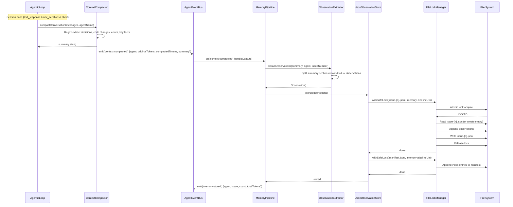

### 2.3 Sequence Diagram: Memory Injection (Session Start)

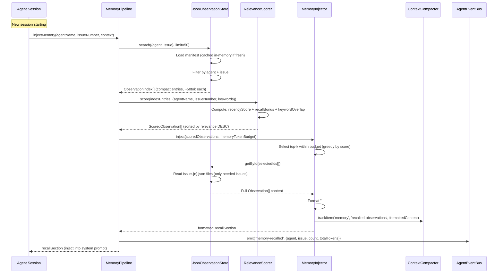

### 2.4 Class/Interface Diagram: Core Types

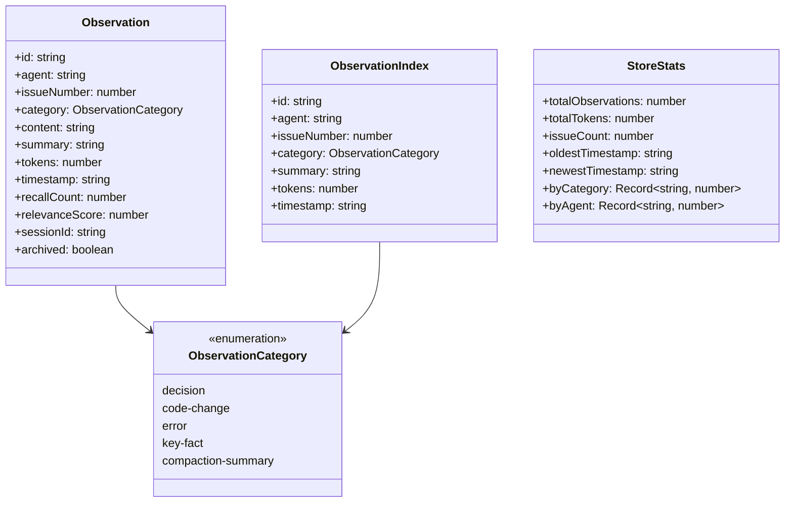

### 2.5 Class/Interface Diagram: Service Layer

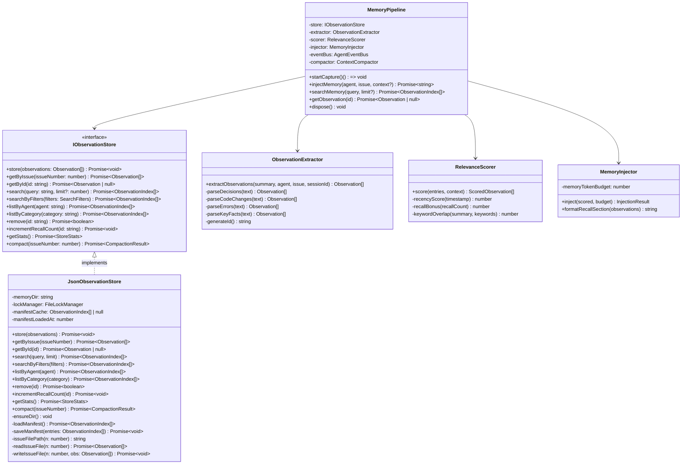

### 2.6 Dependency Injection Diagram

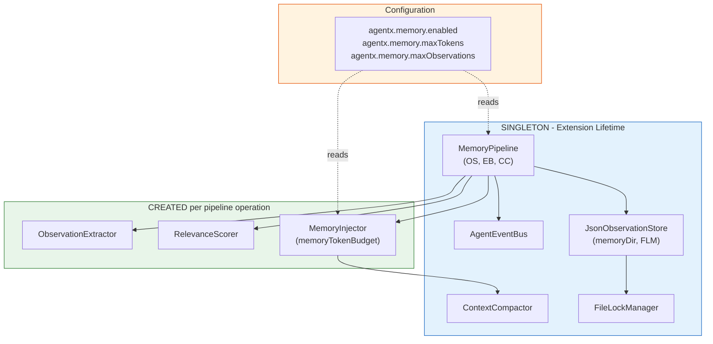

---

## 3. API Design

### 3.1 TypeScript Module API

#### ObservationStore

| Method | Signature | Description |
|--------|-----------|-------------|
| `store` | `store(observations: Observation[]): Promise<void>` | Persist observations + update manifest |
| `getByIssue` | `getByIssue(issueNumber: number): Promise<Observation[]>` | Load all observations for an issue |
| `getById` | `getById(id: string): Promise<Observation \| null>` | Load a single observation by ID |
| `search` | `search(query: string, limit?: number): Promise<ObservationIndex[]>` | Full-text search over manifest |
| `searchByFilters` | `searchByFilters(filters: SearchFilters): Promise<ObservationIndex[]>` | Filter by agent, issue, category, date range |
| `listByAgent` | `listByAgent(agent: string): Promise<ObservationIndex[]>` | List all observations by agent name |
| `listByCategory` | `listByCategory(category: string): Promise<ObservationIndex[]>` | List all observations by category |
| `remove` | `remove(id: string): Promise<boolean>` | Remove a single observation |
| `incrementRecallCount` | `incrementRecallCount(id: string): Promise<void>` | Bump recall count (for relevance scoring) |
| `getStats` | `getStats(): Promise<StoreStats>` | Return aggregate statistics |
| `compact` | `compact(issueNumber: number): Promise<CompactionResult>` | Merge related observations for an issue |

#### MemoryPipeline

| Method | Signature | Description |
|--------|-----------|-------------|
| `startCapture` | `startCapture(): () => void` | Subscribe to `context-compacted` events; returns unsubscribe fn |
| `injectMemory` | `injectMemory(agent: string, issue: number, context?: string): Promise<string>` | Retrieve + format + inject relevant observations |
| `searchMemory` | `searchMemory(query: string, limit?: number): Promise<ObservationIndex[]>` | Delegate to store search |
| `getObservation` | `getObservation(id: string): Promise<Observation \| null>` | Delegate to store getById |
| `dispose` | `dispose(): void` | Unsubscribe from EventBus, release resources |

### 3.2 VS Code Commands

| Command ID | Title | Description | Input | Output |
|------------|-------|-------------|-------|--------|
| `agentx.searchMemory` | AgentX: Search Memory | Search observations by keyword | Text input (query) | Output channel with compact results |
| `agentx.getObservation` | AgentX: Get Observation | Show full observation detail | Text input (ID) | Output channel with full content |
| `agentx.compactMemory` | AgentX: Compact Memory | Merge related observations | QuickPick (issue number) | Information message with result |
| `agentx.memoryStats` | AgentX: Memory Stats | Show store statistics | None | Output channel with stats |

### 3.3 EventBus Events (New)

```
+---------------------------------------------------------------------------+
| NEW EVENT DEFINITIONS                                                      |
+---------------------------------------------------------------------------+
|                                                                           |
| memory-stored                    | memory-recalled                        |
| +-----------------------------+ | +-----------------------------+        |
| | {                           | | | {                           |        |
| |   agent: string,            | | |   agent: string,            |        |
| |   issueNumber: number,      | | |   issueNumber: number,      |        |
| |   count: number,            | | |   count: number,            |        |
| |   totalTokens: number,      | | |   totalTokens: number,      |        |
| |   observationIds: string[], | | |   observationIds: string[], |        |
| |   timestamp: number         | | |   timestamp: number         |        |
| | }                           | | | }                           |        |
| +-----------------------------+ | +-----------------------------+        |
|                                                                           |
+---------------------------------------------------------------------------+
```

### 3.4 Configuration Settings

| Setting | Type | Default | Description |
|---------|------|---------|-------------|
| `agentx.memory.enabled` | boolean | `true` | Enable/disable memory pipeline |
| `agentx.memory.maxTokens` | number | `20000` | Max tokens for recalled memory (10% of 200K context) |
| `agentx.memory.maxObservationsPerCapture` | number | `50` | Max observations extracted per session end |
| `agentx.memory.manifestCacheTtlMs` | number | `30000` | In-memory manifest cache TTL (30s) |
| `agentx.memory.staleArchiveAfterDays` | number | `90` | Auto-archive observations older than N days |

---

## 4. Data Model Diagrams

### 4.1 Observation Schema

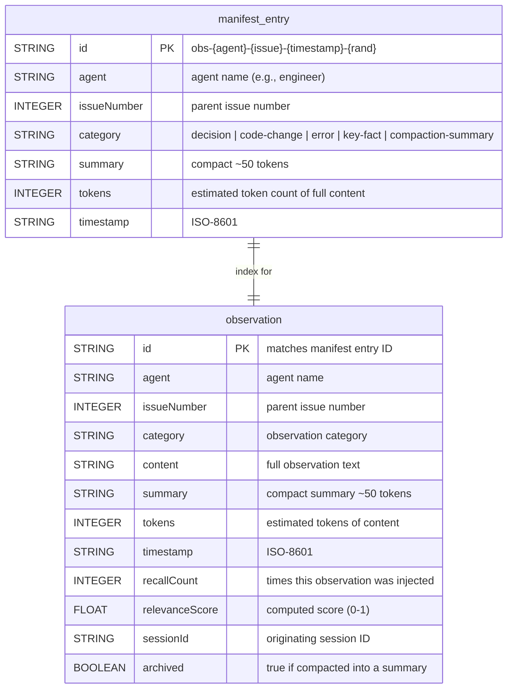

### 4.2 File Schemas

**manifest.json:**
```json
{
  "version": 1,
  "updatedAt": "2026-02-27T10:00:00.000Z",
  "entries": [
    {
      "id": "obs-engineer-29-1709035200000-a1b2c3",
      "agent": "engineer",
      "issueNumber": 29,
      "category": "decision",
      "summary": "Chose per-issue JSON files for observation storage",
      "tokens": 245,
      "timestamp": "2026-02-27T10:00:00.000Z"
    }
  ]
}
```

**issue-29.json:**
```json
{
  "version": 1,
  "issueNumber": 29,
  "updatedAt": "2026-02-27T10:00:00.000Z",
  "observations": [
    {
      "id": "obs-engineer-29-1709035200000-a1b2c3",
      "agent": "engineer",
      "issueNumber": 29,
      "category": "decision",
      "content": "Chose per-issue JSON files for observation storage. Evaluated SQLite, single JSON file, and LevelDB. JSON files match clarification ledger pattern from ADR-1 and have zero dependencies.",
      "summary": "Chose per-issue JSON files for observation storage",
      "tokens": 245,
      "timestamp": "2026-02-27T10:00:00.000Z",
      "recallCount": 0,
      "relevanceScore": 0.0,
      "sessionId": "engineer-1709035100000-x7y8z9",
      "archived": false
    }
  ]
}
```

### 4.3 Observation ID Format

```
obs-{agent}-{issueNumber}-{timestampMs}-{randomSuffix}

Example: obs-engineer-29-1709035200000-a1b2c3

Components:
  obs            - prefix (distinguishes from other IDs in the system)
  engineer       - agent name (lowercase, sanitized)
  29             - issue number
  1709035200000  - Unix timestamp in ms
  a1b2c3         - 6-char random suffix (collision avoidance)
```

---

## 5. Service Layer Diagrams

### 5.1 Memory Pipeline Architecture

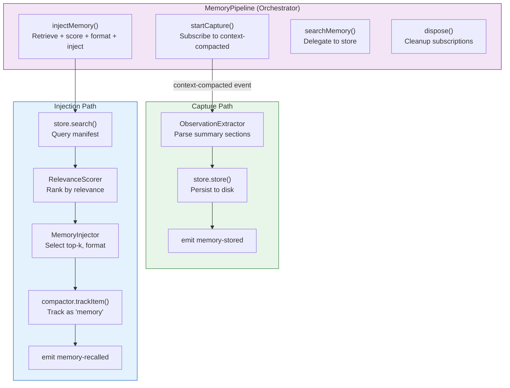

### 5.2 Relevance Scoring Algorithm

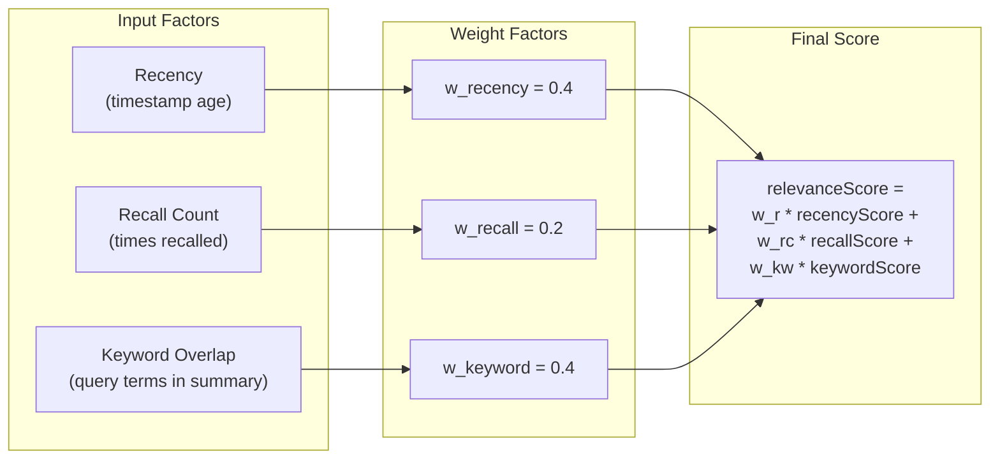

**Scoring formulas:**

| Factor | Formula | Range |
|--------|---------|-------|
| Recency | `1.0 / (1.0 + daysSinceCreation / 30)` | 0.0 - 1.0 (halves every 30 days) |
| Recall Count | `min(recallCount / 10, 1.0)` | 0.0 - 1.0 (saturates at 10 recalls) |
| Keyword Overlap | `matchingKeywords / totalQueryKeywords` | 0.0 - 1.0 |
| **Combined** | `0.4 * recency + 0.2 * recall + 0.4 * keyword` | 0.0 - 1.0 |

### 5.3 Full-Text Search Implementation

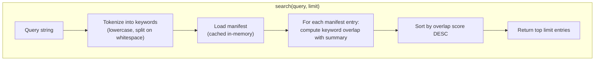

**Search implementation (pseudo-logic):**
1. Tokenize query: split on whitespace, lowercase, remove stop words
2. Load manifest into memory (cache for 30s)
3. For each manifest entry: count matching tokens in `summary` field
4. Sort by match count descending
5. Return top `limit` entries (default 20)

This is simple keyword matching, not TF-IDF or BM25. Sufficient for v1 where queries are typically agent names, issue numbers, or short phrases. The `IObservationStore` interface allows swapping to FTS5/BM25 backend later.

---

## 6. Security Diagrams

### 6.1 Data Protection Flow

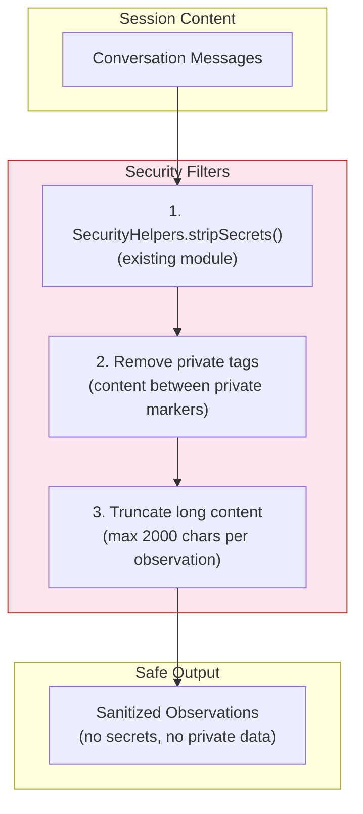

### 6.2 Security Controls

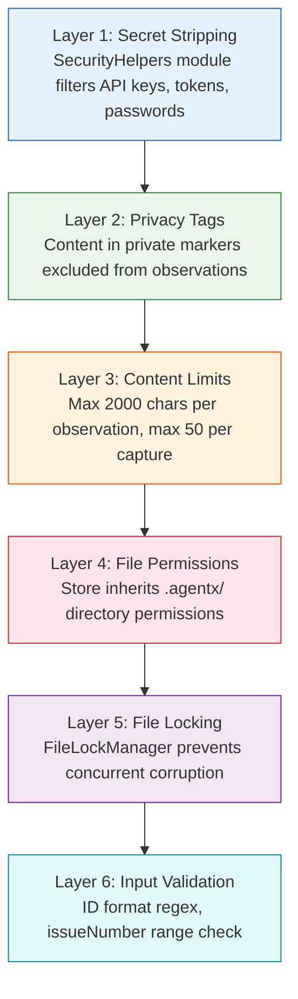

**Threat model:**

| Threat | Guard | Impact if bypassed |
|--------|-------|--------------------|
| API keys in observations | SecurityHelpers.stripSecrets() | Credential exposure in local files |
| Private user data persisted | `<private>` tag filter | Privacy violation |
| Unbounded observation size | 2000 char + 50 count limits | Disk exhaustion |
| Concurrent file corruption | FileLockManager (dual-guard) | Data loss |
| Malformed observation IDs | Regex validation on read | Parse errors |
| Path traversal in issue filenames | Sanitize issueNumber to digits only | File system access outside .agentx/ |

---

## 7. Performance

### 7.1 Performance Requirements

| Metric | Target | Measurement |
|--------|--------|-------------|
| Observation write latency | < 50ms per batch | Time from capture to disk write complete |
| Manifest load (cold) | < 100ms for 10K entries | First load from disk |
| Manifest load (cached) | < 1ms | In-memory cache hit |
| Full-text search (10K) | < 200ms | Query + score + sort + return |
| Session start injection | < 500ms total | Load manifest + query + score + format |
| Issue file read | < 20ms per file | Read + parse single issue JSON |
| Memory store size (50K obs) | < 50MB | Total disk usage |
| Manifest size (50K entries) | < 3MB | manifest.json file size |

### 7.2 Caching Strategy

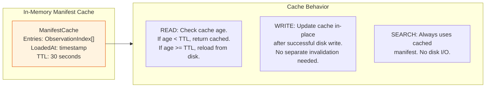

### 7.3 Optimization Strategies

- **Lazy loading**: Manifest loaded only on first access. Issue files loaded only when needed (injection or getById).
- **Cache with TTL**: Manifest cached in memory for 30s. Writes update cache in-place. Multiple searches within TTL window require zero disk I/O.
- **Partial file loading**: Injection loads only the issue files for the matching issue numbers, not all files.
- **Bounded search**: FTS stops after `limit` matches. Default limit=20 prevents scanning all 50K entries unnecessarily.
- **Observation size limits**: 2000 char max per observation. 50 observations max per capture. Prevents pathological cases.

---

## 8. Testing Strategy

### 8.1 Test Pyramid

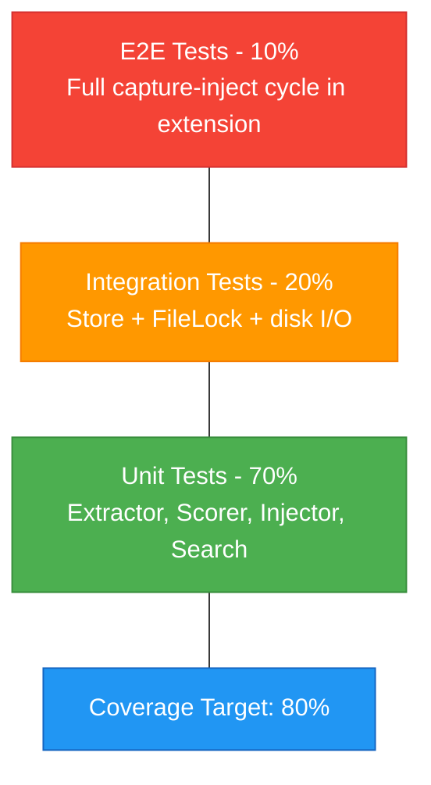

### 8.2 Test Types

| Test Type | Coverage | Framework | Scope |
|-----------|----------|-----------|-------|
| **Unit Tests** | 80%+ | Mocha + Chai (existing) | ObservationExtractor, RelevanceScorer, MemoryInjector, FTS algorithm |
| **Integration Tests** | Key flows | Mocha + temp directories | JsonObservationStore (disk I/O), FileLockManager concurrent writes |
| **E2E Tests** | Happy paths | VS Code extension test | Full capture -> store -> inject -> budget report cycle |
| **Performance Tests** | Critical paths | Mocha + timer assertions | 10K observation search <200ms, manifest load <100ms |

### 8.3 Key Test Scenarios

| # | Scenario | Type | Validates |
|---|----------|------|-----------|
| T1 | Extract observations from compaction summary | Unit | ObservationExtractor parses all categories |
| T2 | Store and retrieve observations by issue | Integration | JsonObservationStore CRUD + manifest sync |
| T3 | Full-text search returns relevant results | Unit | Keyword matching, ranking, limit enforcement |
| T4 | Concurrent writes do not corrupt data | Integration | FileLockManager dual-guard safety |
| T5 | Memory injection respects token budget | Unit | MemoryInjector stops at budget boundary |
| T6 | Relevance scorer ranks recency over stale | Unit | RelevanceScorer formula correctness |
| T7 | Empty memory store returns empty recall | Unit/Int | Graceful degradation on first run |
| T8 | Corrupt manifest triggers rebuild | Integration | Error recovery (rebuild from issue files) |
| T9 | Privacy tags excluded from observations | Unit | Security: private content not persisted |
| T10 | 10K observations search under 200ms | Performance | Performance benchmark |
| T11 | Observation compaction merges related entries | Unit | CompactObservations reduces count |
| T12 | EventBus events fire on store/recall | Integration | memory-stored and memory-recalled events |

---

## 9. Implementation Notes

### 9.1 Directory Structure

```
vscode-extension/src/
  memory/                            # NEW - Memory pipeline module
    index.ts                         # Public exports
    observationStore.ts              # IObservationStore + JsonObservationStore
    memoryPipeline.ts                # MemoryPipeline orchestrator
    observationExtractor.ts          # Parse compaction summaries
    relevanceScorer.ts               # Scoring algorithm
    memoryInjector.ts                # Top-k selection + formatting
    types.ts                         # Observation, ObservationIndex, StoreStats, etc.
  utils/
    contextCompactor.ts              # MODIFIED - Add memory section to budget report
    eventBus.ts                      # MODIFIED - Add memory-stored, memory-recalled events
  extension.ts                       # MODIFIED - Initialize MemoryPipeline, register commands

vscode-extension/src/test/
  memory/                            # NEW - Memory pipeline tests
    observationStore.test.ts
    memoryPipeline.test.ts
    observationExtractor.test.ts
    relevanceScorer.test.ts
    memoryInjector.test.ts
```

### 9.2 Modified Files

| File | Change | Impact |
|------|--------|--------|
| `utils/eventBus.ts` | Add `MemoryStoredEvent`, `MemoryRecalledEvent` to `AgentEventMap` | Low - additive, no existing events changed |
| `utils/contextCompactor.ts` | Add memory section to `formatBudgetReport()` | Low - extends output, no API change |
| `extension.ts` | Initialize `MemoryPipeline`, register 4 new commands | Low - additive to activation |
| `agentxContext.ts` | Expose `MemoryPipeline` via services | Low - optional service |
| `package.json` | Add 4 new command contributions + 5 new configuration settings | Low - additive |

### 9.3 New Dependencies

None. All implementation uses Node.js built-in `fs` and `path` modules plus existing AgentX infrastructure (`FileLockManager`, `AgentEventBus`, `ContextCompactor`).

### 9.4 Configuration

Add to `package.json` contributes:

```json
{
  "configuration": {
    "title": "AgentX Memory",
    "properties": {
      "agentx.memory.enabled": {
        "type": "boolean",
        "default": true,
        "description": "Enable persistent agent memory pipeline"
      },
      "agentx.memory.maxTokens": {
        "type": "number",
        "default": 20000,
        "description": "Maximum tokens for recalled memory injection"
      },
      "agentx.memory.maxObservationsPerCapture": {
        "type": "number",
        "default": 50,
        "description": "Maximum observations to extract per session"
      },
      "agentx.memory.manifestCacheTtlMs": {
        "type": "number",
        "default": 30000,
        "description": "Manifest in-memory cache TTL in milliseconds"
      },
      "agentx.memory.staleArchiveAfterDays": {
        "type": "number",
        "default": 90,
        "description": "Archive observations older than N days"
      }
    }
  }
}
```

### 9.5 Graceful Degradation

| Failure | Behavior | User Impact |
|---------|----------|-------------|
| Memory store does not exist | Create `.agentx/memory/` on first write | None (auto-created) |
| Manifest corrupt/missing | Rebuild from issue files (scan directory) | Extra 1-2s on first access |
| Issue file corrupt | Skip that issue, log warning, continue | Missing observations for that issue |
| FileLock timeout | Skip capture/inject, log warning | Observation not persisted or recalled |
| Memory disabled by setting | Pipeline returns empty strings immediately | No overhead |
| agentx.memory.maxTokens = 0 | No injection, capture still works | Memory store grows but no recall |

---

## 10. Rollout Plan

### Phase 1: Foundation -- Observation Store (Weeks 1-2)

**Stories**: #36, #37, #38

**Deliverables:**
- `vscode-extension/src/memory/types.ts` (all type definitions)
- `vscode-extension/src/memory/observationStore.ts` (JsonObservationStore)
- `vscode-extension/src/memory/observationExtractor.ts`
- `vscode-extension/src/memory/index.ts`
- Unit + integration tests (>=80% coverage)
- Performance benchmark: 10K observation search under 200ms

**Acceptance Gate:**
- [ ] All CRUD operations work with FileLockManager
- [ ] Manifest stays in sync with issue files
- [ ] FTS returns relevant results ranked by keyword overlap
- [ ] 10K observation benchmark passes

### Phase 2: Integration -- Capture & Injection (Weeks 3-4)

**Stories**: #39, #40, #41, #42, #43, #44

**Deliverables:**
- `vscode-extension/src/memory/memoryPipeline.ts`
- `vscode-extension/src/memory/relevanceScorer.ts`
- `vscode-extension/src/memory/memoryInjector.ts`
- Modified `eventBus.ts` (2 new events)
- Modified `contextCompactor.ts` (memory budget section)
- Modified `extension.ts` (pipeline init + 4 commands)
- Modified `package.json` (commands + configuration)
- VS Code commands: searchMemory, getObservation, memoryStats, compactMemory

**Acceptance Gate:**
- [ ] Session-end capture fires automatically via EventBus
- [ ] Session-start injection returns formatted recall section
- [ ] Budget report includes memory section with token counts
- [ ] All 4 VS Code commands work end-to-end
- [ ] Memory injection stays within configured token budget

### Phase 3: Optimization -- Scoring & Compaction (Weeks 5-6)

**Stories**: #45, #46

**Deliverables:**
- Relevance scoring (recency + recall count + keyword overlap)
- Observation compaction (merge N related into 1 summary)
- Archive directory for compacted originals
- CLI subcommand integration (if CLI hook extension scoped)
- Performance benchmarks for 50K observations

**Acceptance Gate:**
- [ ] Relevance scorer improves injection quality (manual review)
- [ ] Compaction reduces observation count by 50%+ for old issues
- [ ] 50K observation performance stays within targets
- [ ] No P0/P1 bugs open

---

## 11. Risks & Mitigations

| Risk | Impact | Probability | Mitigation |
|------|--------|-------------|------------|
| Manifest out of sync with issue files | Medium | Low | Rebuild manifest from issue files on mismatch detection; checksum validation |
| Regex extraction misses important observations | Medium | High | Track recall accuracy; plan hybrid extraction in future; allow manual observation add |
| Session start latency with large memory store | High | Low | Manifest cache (30s TTL); lazy loading; bounded search (limit=20) |
| File lock contention on manifest.json | Medium | Low | Write issue file first, then manifest; per-issue locks do not contend |
| Memory store grows unbounded | Medium | Medium | Phase 3 compaction; staleArchiveAfterDays config; getStats() monitoring |
| Observation content contains secrets | High | Low | SecurityHelpers.stripSecrets() before extraction; privacy tag filter |
| Concurrent VS Code windows + CLI corrupt data | High | Low | FileLockManager dual-guard (tested in ADR-1 implementation) |

---

## 12. Monitoring & Observability

### 12.1 Metrics

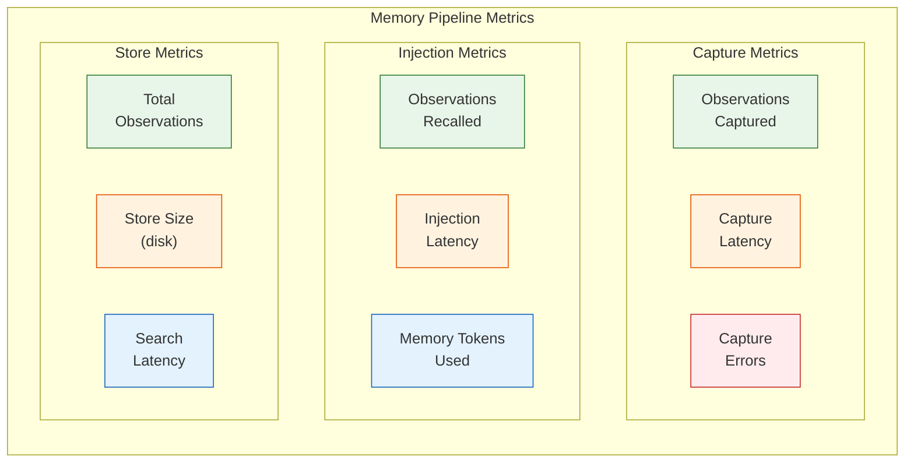

### 12.2 Observability Points

| Point | Event / Method | Data |
|-------|---------------|------|
| Observation captured | `memory-stored` event | Agent, issue, count, tokens |
| Observation recalled | `memory-recalled` event | Agent, issue, count, tokens |
| Search performed | ThinkingLog entry | Query, result count, latency |
| Budget check | `formatBudgetReport()` | Memory section with recalled items |
| Compaction run | ThinkingLog entry | Issue, before/after counts |
| Lock timeout | console.warn | File path, attempt count |
| Store rebuild | console.warn | Trigger (corrupt manifest), duration |

### 12.3 Alerts (via ThinkingLog)

| Condition | Level | Message |
|-----------|-------|---------|
| Manifest rebuild triggered | warning | "Memory manifest rebuilt from issue files (took {ms}ms)" |
| Lock timeout on capture | warning | "Memory capture skipped: lock timeout on {file}" |
| Store exceeds 40MB | warning | "Memory store exceeds 40MB. Run 'AgentX: Compact Memory' to reduce." |
| Observation count > 40K | warning | "Memory store has {n} observations. Consider compaction." |
| Capture produces 0 observations | info | "No observations extracted from session (empty summary)" |

---

## Cross-Cutting Concerns Diagram

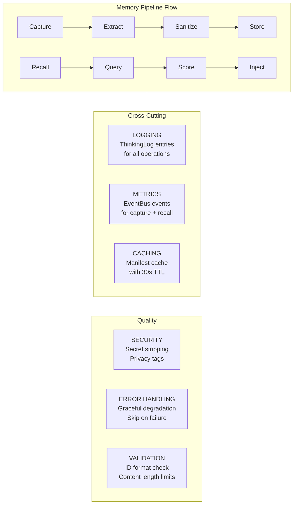

---

**Generated by AgentX Architect Agent**
**Last Updated**: 2026-02-27
**Version**: 1.0
