# Technical Specification: AgentX

**Author**: Solution Architect Agent
**Last Updated**: 2026-02-27

---

## Table of Contents

1. [Clarification Protocol Specification](#clarification-protocol-specification)
2. [Memory Pipeline Specification](#memory-pipeline-specification)
3. [Related Documents](#related-documents)

---

## Clarification Protocol Specification

> Originally SPEC-1.md | Date: 2026-02-26 | Epic: #1 | ADR: [ADR-AgentX.md](../adr/ADR-AgentX.md) | PRD: [PRD-AgentX.md](../prd/PRD-AgentX.md)
### 1. Overview

Add a structured clarification protocol to AgentX that enables downstream agents (e.g., Engineer, Architect) to request and receive clarification from upstream agents (e.g., PM, Architect) when they encounter ambiguity. Agent X mediates all clarification traffic (hub-and-spoke), with file-level locking for concurrent safety, per-issue JSON ledgers for state, and conversation-as-interface rendering in Copilot Chat and CLI.

**Scope:**
- In scope: Clarification ledger, file locking (PowerShell + TypeScript), routing via Agent X, round limits + escalation, stale/stuck/deadlock detection, CLI `clarify` subcommand, TOML field extensions, EventBus events, AgenticLoop integration, agent status extensions, conversation streaming, GitHub issue sync, `/clarify` slash command, weekly digest stats
- Out of scope: Direct agent-to-agent communication, UI buttons/panels, real-time WebSocket notifications, multi-party threads, cross-repository clarification

**Success Criteria:**
- Clarification auto-resolution rate >80% (no human needed)
- Review rejection rate due to misunderstanding <15%
- Works identically in Local Mode and GitHub Mode
- File locking tested with 3+ concurrent writers without corruption

---

### 2. Architecture Diagrams

#### 2.1 High-Level System Architecture

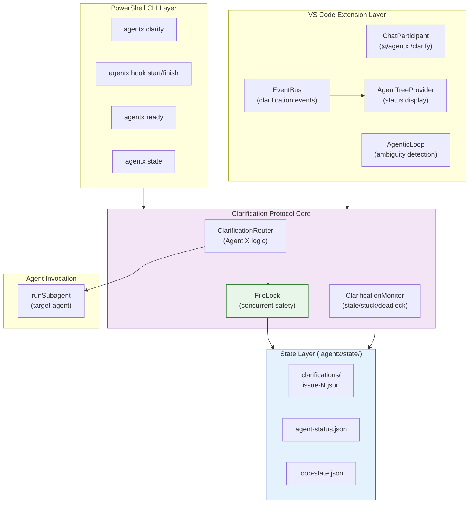
```mermaid
graph TD
    subgraph CLI["PowerShell CLI Layer"]
        C1["agentx clarify"]
        C2["agentx hook start/finish"]
        C3["agentx ready"]
        C4["agentx state"]
    end

    subgraph EXT["VS Code Extension Layer"]
        E1["ChatParticipant<br/>(@agentx /clarify)"]
        E2["AgenticLoop<br/>(ambiguity detection)"]
        E3["EventBus<br/>(clarification events)"]
        E4["AgentTreeProvider<br/>(status display)"]
    end

    subgraph CORE["Clarification Protocol Core"]
        CR["ClarificationRouter<br/>(Agent X logic)"]
        CM["ClarificationMonitor<br/>(stale/stuck/deadlock)"]
        FL["FileLock<br/>(concurrent safety)"]
    end

    subgraph STATE["State Layer (.agentx/state/)"]
        CL["clarifications/<br/>issue-N.json"]
        AS["agent-status.json"]
        LS["loop-state.json"]
    end

    subgraph AGENT["Agent Invocation"]
        RS["runSubagent<br/>(target agent)"]
    end

    CLI --> CORE
    EXT --> CORE
    CORE --> FL
    FL --> STATE
    CR --> RS
    CM --> STATE
    E3 --> E4

    style CORE fill:#F3E5F5,stroke:#6A1B9A
    style FL fill:#E8F5E9,stroke:#2E7D32
    style STATE fill:#E3F2FD,stroke:#1565C0
```

**Component Responsibilities:**

| Layer | Responsibility | Technology |
|-------|---------------|------------|
| **CLI Layer** | User-facing commands for clarification management | PowerShell 7+ |
| **Extension Layer** | Copilot Chat integration, agentic loop, sidebar views | TypeScript (VS Code API) |
| **Protocol Core** | Routing, monitoring, state management | PowerShell + TypeScript (shared logic) |
| **State Layer** | Persistent storage for clarification records | JSON files with file locking |
| **Agent Invocation** | Invoking target agents for answers | `runSubagent` (Copilot infra) |

#### 2.2 Sequence Diagram: Blocking Clarification (Happy Path)

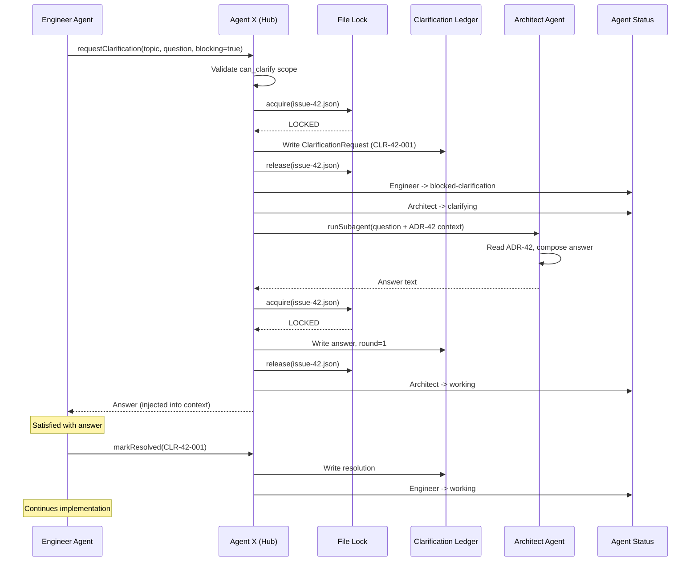
```mermaid
sequenceDiagram
    participant Eng as Engineer Agent
    participant AX as Agent X (Hub)
    participant Lock as File Lock
    participant Ledger as Clarification Ledger
    participant Arch as Architect Agent
    participant Status as Agent Status

    Eng->>AX: requestClarification(topic, question, blocking=true)
    AX->>AX: Validate can_clarify scope

    AX->>Lock: acquire(issue-42.json)
    Lock-->>AX: LOCKED
    AX->>Ledger: Write ClarificationRequest (CLR-42-001)
    AX->>Lock: release(issue-42.json)

    AX->>Status: Engineer -> blocked-clarification
    AX->>Status: Architect -> clarifying

    AX->>Arch: runSubagent(question + ADR-42 context)
    Arch->>Arch: Read ADR-42, compose answer
    Arch-->>AX: Answer text

    AX->>Lock: acquire(issue-42.json)
    Lock-->>AX: LOCKED
    AX->>Ledger: Write answer, round=1
    AX->>Lock: release(issue-42.json)

    AX->>Status: Architect -> working
    AX-->>Eng: Answer (injected into context)

    Note over Eng: Satisfied with answer
    Eng->>AX: markResolved(CLR-42-001)
    AX->>Ledger: Write resolution
    AX->>Status: Engineer -> working

    Note over Eng: Continues implementation
```

#### 2.3 Sequence Diagram: Escalation After Max Rounds

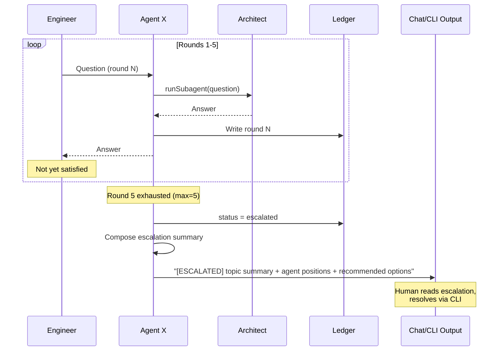
```mermaid
sequenceDiagram
    participant Eng as Engineer
    participant AX as Agent X
    participant Arch as Architect
    participant Ledger as Ledger
    participant Chat as Chat/CLI Output

    loop Rounds 1-5
        Eng->>AX: Question (round N)
        AX->>Arch: runSubagent(question)
        Arch-->>AX: Answer
        AX->>Ledger: Write round N
        AX-->>Eng: Answer
        Note over Eng: Not yet satisfied
    end

    Note over AX: Round 5 exhausted (max=5)
    AX->>Ledger: status = escalated
    AX->>AX: Compose escalation summary
    AX->>Chat: "[ESCALATED] topic summary + agent positions + recommended options"

    Note over Chat: Human reads escalation,<br/>resolves via CLI
```

#### 2.4 Sequence Diagram: Stale Detection + Auto-Retry

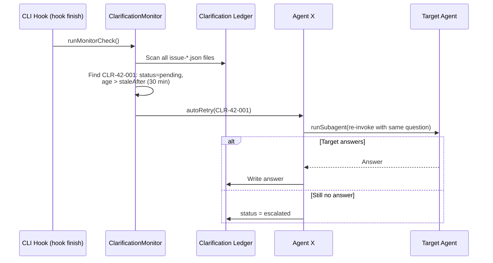
```mermaid
sequenceDiagram
    participant Hook as CLI Hook (hook finish)
    participant Monitor as ClarificationMonitor
    participant Ledger as Clarification Ledger
    participant AX as Agent X
    participant Tgt as Target Agent

    Hook->>Monitor: runMonitorCheck()
    Monitor->>Ledger: Scan all issue-*.json files
    Monitor->>Monitor: Find CLR-42-001: status=pending,<br/>age > staleAfter (30 min)

    Monitor->>AX: autoRetry(CLR-42-001)
    AX->>Tgt: runSubagent(re-invoke with same question)

    alt Target answers
        Tgt-->>AX: Answer
        AX->>Ledger: Write answer
    else Still no answer
        AX->>Ledger: status = escalated
    end
```

#### 2.5 Class/Interface Diagram: Clarification Domain Model

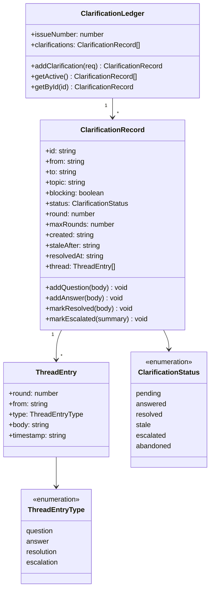
```mermaid
classDiagram
    class ClarificationLedger {
        +issueNumber: number
        +clarifications: ClarificationRecord[]
        +addClarification(req) ClarificationRecord
        +getActive() ClarificationRecord[]
        +getById(id) ClarificationRecord
    }

    class ClarificationRecord {
        +id: string
        +from: string
        +to: string
        +topic: string
        +blocking: boolean
        +status: ClarificationStatus
        +round: number
        +maxRounds: number
        +created: string
        +staleAfter: string
        +resolvedAt: string
        +thread: ThreadEntry[]
        +addQuestion(body) void
        +addAnswer(body) void
        +markResolved(body) void
        +markEscalated(summary) void
    }

    class ThreadEntry {
        +round: number
        +from: string
        +type: ThreadEntryType
        +body: string
        +timestamp: string
    }

    class ClarificationStatus {
        <<enumeration>>
        pending
        answered
        resolved
        stale
        escalated
        abandoned
    }

    class ThreadEntryType {
        <<enumeration>>
        question
        answer
        resolution
        escalation
    }

    ClarificationLedger "1" --> "*" ClarificationRecord
    ClarificationRecord "1" --> "*" ThreadEntry
    ClarificationRecord --> ClarificationStatus
    ThreadEntry --> ThreadEntryType
```

#### 2.6 Class/Interface Diagram: File Locking

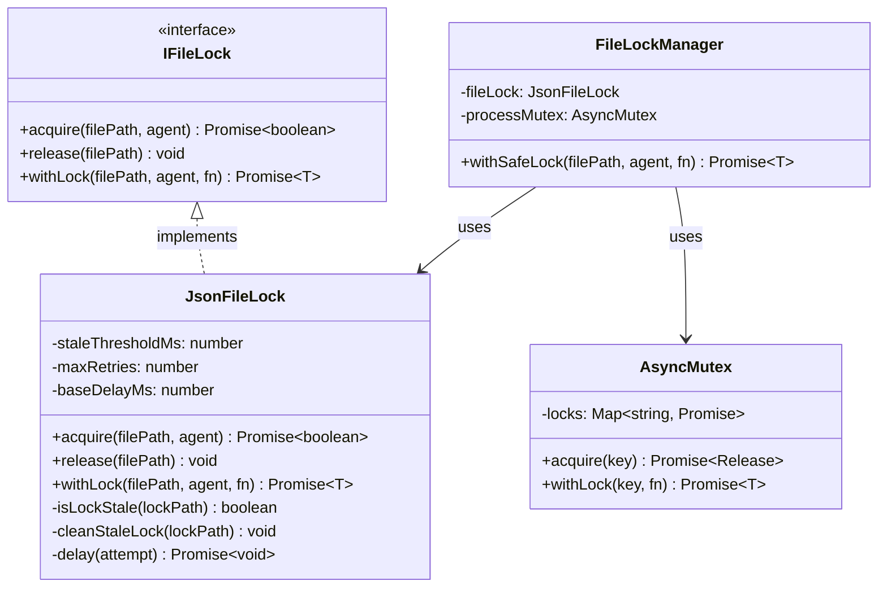
```mermaid
classDiagram
    class IFileLock {
        <<interface>>
        +acquire(filePath, agent) Promise~boolean~
        +release(filePath) void
        +withLock(filePath, agent, fn) Promise~T~
    }

    class JsonFileLock {
        -staleThresholdMs: number
        -maxRetries: number
        -baseDelayMs: number
        +acquire(filePath, agent) Promise~boolean~
        +release(filePath) void
        +withLock(filePath, agent, fn) Promise~T~
        -isLockStale(lockPath) boolean
        -cleanStaleLock(lockPath) void
        -delay(attempt) Promise~void~
    }

    class AsyncMutex {
        -locks: Map~string, Promise~
        +acquire(key) Promise~Release~
        +withLock(key, fn) Promise~T~
    }

    class FileLockManager {
        -fileLock: JsonFileLock
        -processMutex: AsyncMutex
        +withSafeLock(filePath, agent, fn) Promise~T~
    }

    IFileLock <|.. JsonFileLock : implements
    FileLockManager --> JsonFileLock : uses
    FileLockManager --> AsyncMutex : uses
```

---

### 3. API Design

#### 3.1 CLI Commands (PowerShell)

| Command | Description | Auth | Output |
|---------|-------------|------|--------|
| `agentx clarify` | List all active clarifications | None | Table |
| `agentx clarify --issue N` | Show clarification thread for issue | None | Thread |
| `agentx clarify stale` | Show stale/stuck clarifications | None | Table |
| `agentx clarify resolve CLR-N-NNN` | Manually resolve escalated clarification | None | Confirmation |
| `agentx clarify escalate CLR-N-NNN` | Manually escalate a clarification | None | Confirmation |
| `agentx clarify --json` | Machine-readable output | None | JSON |

#### 3.2 Slash Commands (VS Code Extension)

| Command | Description | Input |
|---------|-------------|-------|
| `@agentx /clarify` | List active clarifications | None |
| `@agentx /clarify #42` | Show thread for issue #42 | Issue number |

#### 3.3 Internal API: ClarificationRouter

```
ClarificationRouter
  requestClarification(options)
    Input:  { issueNumber, fromAgent, toAgent, topic, question, blocking, maxRounds }
    Output: { clarificationId, status }
    Errors: SCOPE_VIOLATION (not in can_clarify), LOCK_TIMEOUT, AGENT_ERROR

  answerClarification(options)
    Input:  { clarificationId, answer }
    Output: { round, status }
    Errors: NOT_FOUND, LOCK_TIMEOUT, MAX_ROUNDS_EXCEEDED

  resolveClarification(options)
    Input:  { clarificationId, resolutionBody }
    Output: { status: 'resolved' }
    Errors: NOT_FOUND, LOCK_TIMEOUT

  escalateClarification(options)
    Input:  { clarificationId, summary }
    Output: { status: 'escalated' }
    Errors: NOT_FOUND, LOCK_TIMEOUT
```

#### 3.4 Internal API: ClarificationMonitor

```
ClarificationMonitor
  runCheck()
    Input:  (none -- scans all ledger files)
    Output: { stale: ClarificationRecord[], stuck: ClarificationRecord[], deadlocked: ClarificationRecord[] }

  autoRetry(clarificationId)
    Input:  { clarificationId }
    Output: { retried: boolean, newStatus: string }

  breakDeadlock(clrA, clrB)
    Input:  { clrA: ClarificationRecord, clrB: ClarificationRecord }
    Output: { escalated: string, continued: string }
    Logic:  Upstream agent (PM > Architect > Engineer) keeps active; downstream auto-escalated
```

#### 3.5 Error Responses

```
+-----------------------------------------------------------------------------+
| CLARIFICATION ERROR TYPES                                                    |
+-----------------------------------------------------------------------------+
|                                                                              |
| SCOPE_VIOLATION                  | LOCK_TIMEOUT                             |
| +---------------------------+   | +---------------------------+             |
| | Agent 'engineer' cannot   |   | | Failed to acquire lock   |             |
| | clarify with 'reviewer'.  |   | | for issue-42.json after  |             |
| | Allowed: [architect, pm]  |   | | 5 retries (5s timeout).  |             |
| +---------------------------+   | +---------------------------+             |
|                                                                              |
| MAX_ROUNDS_EXCEEDED              | NOT_FOUND                                |
| +---------------------------+   | +---------------------------+             |
| | CLR-42-001 reached max    |   | | Clarification CLR-42-001 |             |
| | rounds (5). Auto-escalated|   | | not found in ledger.     |             |
| +---------------------------+   | +---------------------------+             |
|                                                                              |
+------------------------------------------------------------------------------+
```

---

### 4. Data Model Diagrams

#### 4.1 Clarification Ledger Schema (ERD)

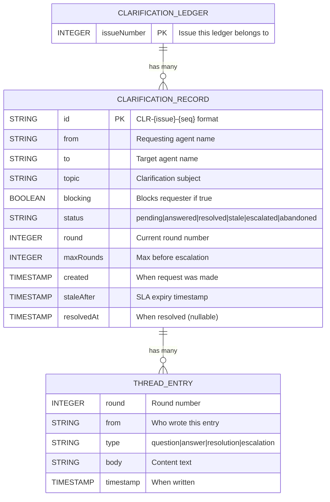
```mermaid
erDiagram
    CLARIFICATION_LEDGER {
        INTEGER issueNumber PK "Issue this ledger belongs to"
    }

    CLARIFICATION_RECORD {
        STRING id PK "CLR-{issue}-{seq} format"
        STRING from "Requesting agent name"
        STRING to "Target agent name"
        STRING topic "Clarification subject"
        BOOLEAN blocking "Blocks requester if true"
        STRING status "pending|answered|resolved|stale|escalated|abandoned"
        INTEGER round "Current round number"
        INTEGER maxRounds "Max before escalation"
        TIMESTAMP created "When request was made"
        TIMESTAMP staleAfter "SLA expiry timestamp"
        TIMESTAMP resolvedAt "When resolved (nullable)"
    }

    THREAD_ENTRY {
        INTEGER round "Round number"
        STRING from "Who wrote this entry"
        STRING type "question|answer|resolution|escalation"
        STRING body "Content text"
        TIMESTAMP timestamp "When written"
    }

    CLARIFICATION_LEDGER ||--o{ CLARIFICATION_RECORD : "has many"
    CLARIFICATION_RECORD ||--o{ THREAD_ENTRY : "has many"
```

#### 4.2 Clarification Ledger JSON Schema

```
File: .agentx/state/clarifications/issue-{N}.json

{
  "issueNumber": <integer>,
  "clarifications": [
    {
      "id":           <string>  "CLR-{issue}-{seq:03d}",
      "from":         <string>  agent name (e.g., "engineer"),
      "to":           <string>  agent name (e.g., "architect"),
      "topic":        <string>  short description,
      "blocking":     <boolean> true if requester is blocked,
      "status":       <enum>    "pending"|"answered"|"resolved"|"stale"|"escalated"|"abandoned",
      "round":        <integer> current round (starts at 1),
      "maxRounds":    <integer> from TOML or default (5 blocking, 6 non-blocking),
      "created":      <ISO8601> creation timestamp,
      "staleAfter":   <ISO8601> SLA expiry timestamp,
      "resolvedAt":   <ISO8601|null> resolution timestamp,
      "thread": [
        {
          "round":     <integer>,
          "from":      <string>,
          "type":      <enum>  "question"|"answer"|"resolution"|"escalation",
          "body":      <string>,
          "timestamp": <ISO8601>
        }
      ]
    }
  ]
}
```

#### 4.3 Agent Status Extension Schema

```
File: .agentx/state/agent-status.json

{
  "<agent-name>": {
    "status":          <string>  "idle"|"working"|"clarifying"|"blocked-clarification"|"done"|"stuck",
    "issue":           <integer|null>,
    "lastActivity":    <ISO8601>,
    "clarificationId": <string|null>  "CLR-42-001" (when clarifying or blocked),
    "waitingOn":       <string|null>  agent name (when blocked-clarification),
    "respondingTo":    <string|null>  agent name (when clarifying)
  }
}
```

#### 4.4 Lock File Schema

```
File: .agentx/state/clarifications/issue-{N}.json.lock

{
  "pid":       <integer>  process ID,
  "timestamp": <ISO8601>  lock acquisition time,
  "agent":     <string>   agent or process name
}
```

#### 4.5 Workflow TOML Extension

```
New fields on [[steps]] entries:

  can_clarify             = ["architect", "product-manager"]   # array of agent names
  clarify_max_rounds      = 5                                  # integer, default 5
  clarify_sla_minutes     = 30                                 # integer, default 30
  clarify_blocking_allowed = true                              # boolean, default true
```

---

### 5. Service Layer Diagrams

#### 5.1 PowerShell Service Architecture

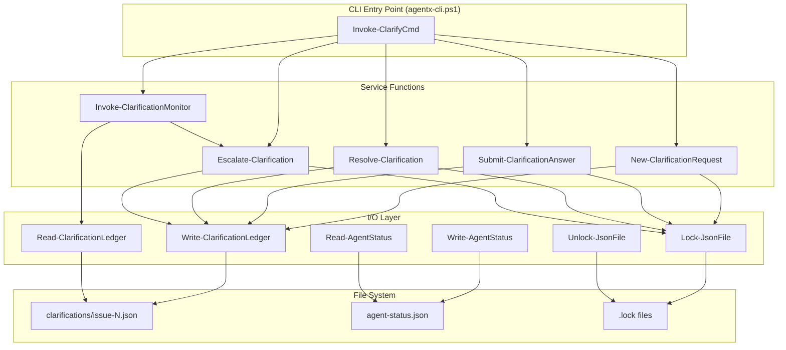
```mermaid
graph TD
    subgraph CLI["CLI Entry Point (agentx-cli.ps1)"]
        CMD["Invoke-ClarifyCmd"]
    end

    subgraph Services["Service Functions"]
        CR["New-ClarificationRequest"]
        CA["Submit-ClarificationAnswer"]
        CRes["Resolve-Clarification"]
        CEsc["Escalate-Clarification"]
        CMon["Invoke-ClarificationMonitor"]
    end

    subgraph IO["I/O Layer"]
        RL["Read-ClarificationLedger"]
        WL["Write-ClarificationLedger"]
        LF["Lock-JsonFile"]
        UF["Unlock-JsonFile"]
        RS["Read-AgentStatus"]
        WS["Write-AgentStatus"]
    end

    subgraph State["File System"]
        CF["clarifications/issue-N.json"]
        AS["agent-status.json"]
        LK[".lock files"]
    end

    CMD --> CR
    CMD --> CA
    CMD --> CRes
    CMD --> CEsc
    CMD --> CMon

    CR --> LF
    CR --> WL
    CA --> LF
    CA --> WL
    CRes --> LF
    CRes --> WL
    CEsc --> LF
    CEsc --> WL
    CMon --> RL
    CMon --> CEsc

    LF --> LK
    UF --> LK
    WL --> CF
    RL --> CF
    WS --> AS
    RS --> AS
```

#### 5.2 TypeScript Service Architecture (Extension)

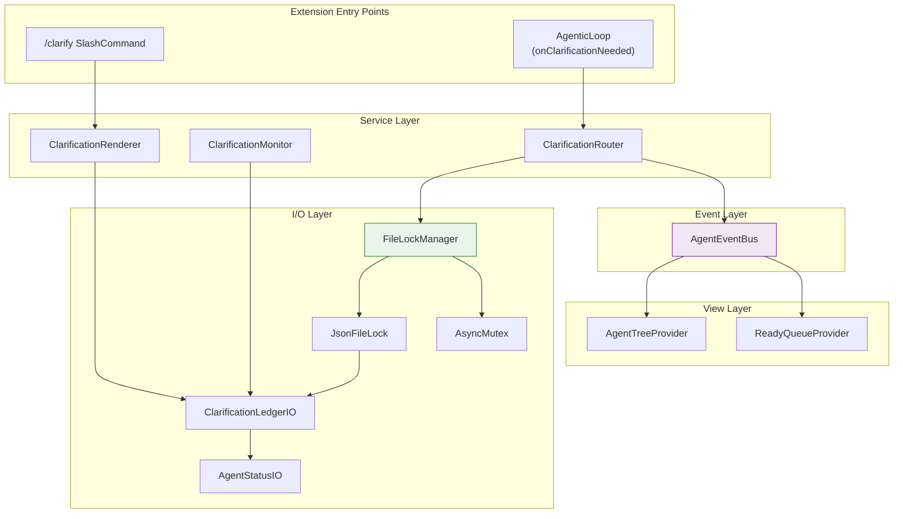
```mermaid
graph TD
    subgraph Ext["Extension Entry Points"]
        SCmd["/clarify SlashCommand"]
        ALoop["AgenticLoop<br/>(onClarificationNeeded)"]
    end

    subgraph Services["Service Layer"]
        CRouter["ClarificationRouter"]
        CMonitor["ClarificationMonitor"]
        CRenderer["ClarificationRenderer"]
    end

    subgraph IO["I/O Layer"]
        FLM["FileLockManager"]
        FLock["JsonFileLock"]
        AMutex["AsyncMutex"]
        LedgerIO["ClarificationLedgerIO"]
        StatusIO["AgentStatusIO"]
    end

    subgraph Events["Event Layer"]
        EB["AgentEventBus"]
    end

    subgraph Views["View Layer"]
        ATP["AgentTreeProvider"]
        RQP["ReadyQueueProvider"]
    end

    SCmd --> CRenderer
    ALoop --> CRouter
    CRouter --> FLM
    CRouter --> EB
    CMonitor --> LedgerIO
    CRenderer --> LedgerIO

    FLM --> FLock
    FLM --> AMutex
    FLock --> LedgerIO
    LedgerIO --> StatusIO

    EB --> ATP
    EB --> RQP

    style FLM fill:#E8F5E9,stroke:#2E7D32
    style EB fill:#F3E5F5,stroke:#6A1B9A
```

---

### 6. Security Diagrams

#### 6.1 Scope Guard (Authorization Model)

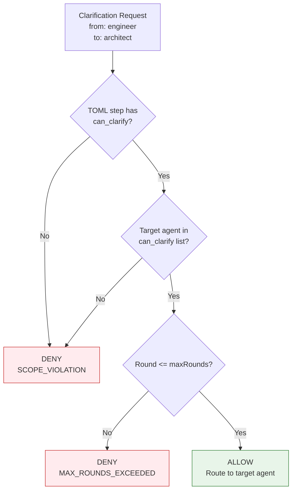
```mermaid
graph TD
    REQ["Clarification Request<br/>from: engineer<br/>to: architect"]
    V1{"TOML step has<br/>can_clarify?"}
    V2{"Target agent in<br/>can_clarify list?"}
    V3{"Round <= maxRounds?"}

    ALLOW["ALLOW<br/>Route to target agent"]
    DENY1["DENY<br/>SCOPE_VIOLATION"]
    DENY2["DENY<br/>MAX_ROUNDS_EXCEEDED"]

    REQ --> V1
    V1 -->|"No"| DENY1
    V1 -->|"Yes"| V2
    V2 -->|"No"| DENY1
    V2 -->|"Yes"| V3
    V3 -->|"No"| DENY2
    V3 -->|"Yes"| ALLOW

    style ALLOW fill:#E8F5E9,stroke:#2E7D32
    style DENY1 fill:#FFEBEE,stroke:#C62828
    style DENY2 fill:#FFEBEE,stroke:#C62828
```

#### 6.2 Defense in Depth

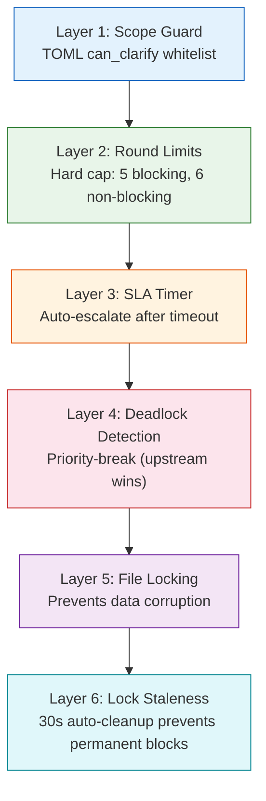
```mermaid
graph TD
    L1["Layer 1: Scope Guard<br/>TOML can_clarify whitelist"]
    L2["Layer 2: Round Limits<br/>Hard cap: 5 blocking, 6 non-blocking"]
    L3["Layer 3: SLA Timer<br/>Auto-escalate after timeout"]
    L4["Layer 4: Deadlock Detection<br/>Priority-break (upstream wins)"]
    L5["Layer 5: File Locking<br/>Prevents data corruption"]
    L6["Layer 6: Lock Staleness<br/>30s auto-cleanup prevents permanent blocks"]

    L1 --> L2 --> L3 --> L4 --> L5 --> L6

    style L1 fill:#E3F2FD,stroke:#1565C0
    style L2 fill:#E8F5E9,stroke:#2E7D32
    style L3 fill:#FFF3E0,stroke:#E65100
    style L4 fill:#FCE4EC,stroke:#C62828
    style L5 fill:#F3E5F5,stroke:#6A1B9A
    style L6 fill:#E0F7FA,stroke:#00838F
```

#### 6.3 Input Validation

| Input | Validation | Constraint |
|-------|-----------|------------|
| `fromAgent` | Must be a known agent name | Enum check against registered agents |
| `toAgent` | Must be in `can_clarify` list | TOML scope check |
| `topic` | Non-empty string | Max 200 characters |
| `question` | Non-empty string | Max 2000 characters |
| `blocking` | Boolean | `true` or `false` only |
| `clarificationId` | Must match `CLR-{N}-{NNN}` pattern | Regex validation |
| `answer` | Non-empty string | Max 2000 characters |

---

### 7. Performance

#### 7.1 Performance Requirements

| Metric | Target | Measurement |
|--------|--------|-------------|
| Clarification round-trip (question -> answer) | <15 seconds | Wall clock time (includes LLM call) |
| Lock acquisition | <1 second | File lock acquire + write + release |
| Lock retry total timeout | <5 seconds | 5 retries with exponential backoff |
| Ledger file read | <100ms | JSON parse from disk |
| Ledger file write | <100ms | JSON serialize + write to disk |
| Monitor scan (all ledgers) | <500ms (10 issues) | Scan `.agentx/state/clarifications/` |
| Stale lock check | <50ms | Single file stat operation |

#### 7.2 Optimization Strategies

- **Per-issue files**: One JSON file per issue avoids single-file bottleneck; lock contention is rare (agents rarely work on same issue)
- **In-process mutex**: TypeScript `AsyncMutex` prevents redundant file lock attempts within same VS Code process
- **Lazy scanning**: Monitor only scans ledger files when triggered (not polling)
- **Bounded growth**: Thread arrays bounded by `maxRounds` (max 5-6 entries); no unbounded growth

#### 7.3 Lock Timing Diagram

```
Attempt 1: Try acquire       -> 0ms
           (fail, lock held)
Attempt 2: Wait 200ms        -> 200ms
           Try acquire
           (fail, lock held)
Attempt 3: Wait 400ms        -> 600ms
           Try acquire
           (fail, lock held)
Attempt 4: Wait 800ms        -> 1400ms
           Try acquire
           (fail, lock held)
Attempt 5: Wait 1600ms       -> 3000ms
           Try acquire
           TIMEOUT at 5000ms -> Escalate
```

---

### 8. Testing Strategy

#### 8.1 Test Pyramid

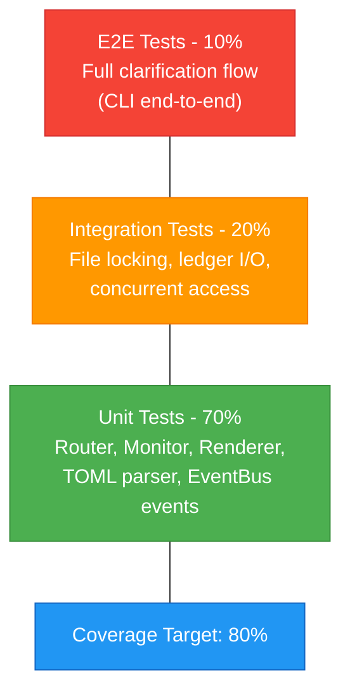
```mermaid
graph TD
    E2E["E2E Tests - 10%<br/>Full clarification flow<br/>(CLI end-to-end)"]
    INT["Integration Tests - 20%<br/>File locking, ledger I/O,<br/>concurrent access"]
    UNIT["Unit Tests - 70%<br/>Router, Monitor, Renderer,<br/>TOML parser, EventBus events"]
    COV["Coverage Target: 80%"]

    E2E --- INT --- UNIT --- COV

    style E2E fill:#F44336,color:#fff,stroke:#D32F2F
    style INT fill:#FF9800,color:#fff,stroke:#F57C00
    style UNIT fill:#4CAF50,color:#fff,stroke:#388E3C
    style COV fill:#2196F3,color:#fff,stroke:#1565C0
```

#### 8.2 Test Types

| Test Type | Coverage | Framework | Scope |
|-----------|----------|-----------|-------|
| **Unit (PS)** | 80%+ | Pester | Lock-JsonFile, ClarificationRouter, Monitor, TOML parser |
| **Unit (TS)** | 80%+ | Mocha + VS Code Test | JsonFileLock, AsyncMutex, EventBus events, LoopConfig |
| **Integration (PS)** | Key flows | Pester | File locking concurrent access, ledger read/write |
| **Integration (TS)** | Key flows | Mocha | FileLockManager concurrent access, ClarificationRouter |
| **E2E** | Happy paths | test-framework.ps1 | Full clarification: request -> route -> answer -> resolve |

#### 8.3 Critical Test Scenarios

| Scenario | Type | Description |
|----------|------|-------------|
| Lock acquire/release | Unit | Single process acquires and releases lock file |
| Stale lock cleanup | Unit | Lock older than 30s is detected and removed |
| Concurrent writers | Integration | 3 processes try to write same ledger simultaneously |
| Lock timeout | Unit | 5 retries exhausted, returns TIMEOUT |
| Scope validation | Unit | Request to agent not in `can_clarify` is rejected |
| Round limit enforcement | Unit | After max rounds, status set to `escalated` |
| Stale detection | Unit | Pending clarification past SLA is flagged stale |
| Stuck detection | Unit | Circular answers (same topic, direction flipped) detected |
| Deadlock detection | Unit | Mutual blocking detected, upstream priority-break applied |
| TOML parsing | Unit | New fields read correctly, defaults applied for missing fields |
| EventBus events | Unit | All 5 clarification events fire with correct payloads |
| Chat rendering | Unit | Markdown output matches expected format |
| CLI rendering | Unit | ANSI-colored output matches expected format |
| Full flow (happy path) | E2E | Request -> route -> answer -> resolve via CLI |
| Full flow (escalation) | E2E | Request -> 5 rounds -> auto-escalate -> human resolve |
| Local Mode parity | E2E | Same flow works in Local Mode |
| GitHub Mode sync | E2E | Clarification rounds posted as issue comments |

---

### 9. Implementation Notes

#### 9.1 Directory Structure

```
.agentx/
  agentx-cli.ps1                    # Extended with clarify subcommand
  state/
    agent-status.json               # Extended with clarifying/blocked statuses
    clarifications/                  # NEW: per-issue clarification ledgers
      issue-1.json
      issue-42.json
      issue-42.json.lock            # Transient lock file (gitignored)
  workflows/
    feature.toml                    # Extended with can_clarify fields
    story.toml                      # Extended with can_clarify fields
    bug.toml                        # Extended with can_clarify fields
    epic.toml                       # Extended with can_clarify fields

vscode-extension/src/
  agentic/
    agenticLoop.ts                  # Extended with clarification support
  chat/
    commandHandlers.ts              # Extended with /clarify handler
  utils/
    eventBus.ts                     # Extended with 5 clarification events
    fileLock.ts                     # NEW: JsonFileLock + AsyncMutex
    clarificationRouter.ts          # NEW: Routing logic
    clarificationMonitor.ts         # NEW: Stale/stuck/deadlock detection
    clarificationRenderer.ts        # NEW: Chat/CLI output formatting
  views/
    agentTreeProvider.ts            # Extended with clarification status icons
    readyQueueTreeProvider.ts       # Extended with blocked badge
  test/
    utils/
      fileLock.test.ts              # NEW: Lock tests
      clarificationRouter.test.ts   # NEW: Router tests
      clarificationMonitor.test.ts  # NEW: Monitor tests
```

#### 9.2 Files To Modify (Existing)

| File | Change Description |
|------|--------------------|
| `.agentx/agentx-cli.ps1` | Add `Invoke-ClarifyCmd`, `Lock-JsonFile`/`Unlock-JsonFile`, monitor integration |
| `.agentx/agentx-cli.ps1` (`Read-TomlWorkflow`) | Parse `can_clarify`, `clarify_max_rounds`, `clarify_sla_minutes`, `clarify_blocking_allowed` |
| `.agentx/workflows/feature.toml` | Add `can_clarify` fields to implement + architecture steps |
| `.agentx/workflows/story.toml` | Add `can_clarify` fields |
| `.agentx/workflows/bug.toml` | Add `can_clarify` fields |
| `vscode-extension/src/utils/eventBus.ts` | Add 5 event types + payload interfaces to `AgentEventMap` |
| `vscode-extension/src/agentic/agenticLoop.ts` | Extend `AgenticLoopConfig` with clarification fields |
| `vscode-extension/src/chat/commandHandlers.ts` | Add `case 'clarify'` to switch |
| `vscode-extension/src/views/agentTreeProvider.ts` | Add status icons for `clarifying`/`blocked-clarification` |
| `vscode-extension/src/views/readyQueueTreeProvider.ts` | Show blocked badge for clarification-pending issues |
| `.gitignore` | Add `*.lock` pattern for `.agentx/state/` |

#### 9.3 Files To Create (New)

| File | Purpose |
|------|---------|
| `vscode-extension/src/utils/fileLock.ts` | `JsonFileLock`, `AsyncMutex`, `FileLockManager` |
| `vscode-extension/src/utils/clarificationRouter.ts` | Routing logic, scope validation, round management |
| `vscode-extension/src/utils/clarificationMonitor.ts` | Stale, stuck, deadlock detection |
| `vscode-extension/src/utils/clarificationRenderer.ts` | Chat markdown + CLI text formatting |
| `vscode-extension/src/test/utils/fileLock.test.ts` | Lock unit tests |
| `vscode-extension/src/test/utils/clarificationRouter.test.ts` | Router unit tests |
| `vscode-extension/src/test/utils/clarificationMonitor.test.ts` | Monitor unit tests |

#### 9.4 Dependencies

| Dependency | Type | Purpose | Version |
|-----------|------|---------|---------|
| `vscode` | Existing | VS Code API | ^1.85.0 |
| `fs` (Node.js) | Built-in | File I/O with `wx` flag for atomic create | Node 18+ |
| PowerShell 7+ | Existing | CLI runtime | 7.0+ |
| No new npm packages | -- | File locking uses Node.js built-in `fs.open` with mode `wx` | -- |

#### 9.5 Configuration

**TOML defaults (applied when fields are absent):**

| Field | Default | Note |
|-------|---------|------|
| `can_clarify` | `[]` (empty) | No clarification unless explicitly declared |
| `clarify_max_rounds` | `5` | Blocking clarifications |
| `clarify_sla_minutes` | `30` | Time before stale detection |
| `clarify_blocking_allowed` | `true` | Can block requesting agent |

**Lock defaults (hardcoded constants):**

| Constant | Value | Note |
|----------|-------|------|
| `STALE_LOCK_THRESHOLD_MS` | `30000` | 30 seconds |
| `MAX_LOCK_RETRIES` | `5` | Retry attempts |
| `BASE_LOCK_DELAY_MS` | `200` | Exponential backoff base |
| `MAX_LOCK_WAIT_MS` | `5000` | Total max wait time |

#### 9.6 Development Workflow

1. Implement file locking (PowerShell `Lock-JsonFile`/`Unlock-JsonFile` + TypeScript `JsonFileLock`/`AsyncMutex`)
2. Implement clarification ledger schema + read/write with locking
3. Extend agent-status.json schema + CLI display
4. Implement ClarificationRouter (scope check, round management, Agent X routing)
5. Implement conversation rendering (chat markdown + CLI ANSI)
6. Extend TOML parser for new fields
7. Implement ClarificationMonitor (stale, stuck, deadlock detection)
8. Integrate with AgenticLoop (LoopConfig extension)
9. Add EventBus events + wire to tree providers
10. Add `/clarify` slash command
11. Implement GitHub issue sync (GitHub Mode overlay)
12. Add digest stats
13. Write tests at each step (TDD where possible)

---

### 10. Rollout Plan

#### Phase 1: Foundation (Week 1-2)

**Stories**: US-1.1 (#9), US-1.2 (#10), US-1.3 (#11), US-3.1 (#15), US-3.2 (#16)

- File locking implementation (PowerShell + TypeScript)
- Clarification ledger JSON schema + read/write
- Agent status extensions (`clarifying`, `blocked-clarification`)
- `.gitignore` update for lock files
- Unit tests for locking + stale detection

**Deliverable**: Locking and state management working, tested with concurrent access

#### Phase 2: Core Protocol (Week 3-4)

**Stories**: US-2.1 (#12), US-2.2 (#13), US-2.3 (#14), US-4.1 (#17), US-4.2 (#18), US-6.1 (#23)

- Agent X clarification routing logic
- `runSubagent` invocation for target agent
- Chat stream formatting (inline markdown)
- CLI `clarify` subcommand
- Round limit enforcement + auto-escalation
- TOML field parsing extension

**Deliverable**: End-to-end clarification in both Local and GitHub modes

#### Phase 3: Monitoring + Extension (Week 5-6)

**Stories**: US-5.1 (#19), US-5.2 (#20), US-5.3 (#21), US-5.4 (#22), US-6.2 (#24), US-6.3 (#25)

- Stale, stuck, deadlock detection
- Event-driven monitoring (hook-triggered)
- AgenticLoop clarification support
- EventBus typed events
- Agent Tree + Ready Queue integration

**Deliverable**: Monitoring catches issues; extension fully integrated

#### Phase 4: Polish (Week 7)

**Stories**: US-7.1 (#26), US-7.2 (#27), US-7.3 (#28)

- Weekly digest clarification stats
- GitHub issue comment mirroring
- `/clarify` slash command

**Deliverable**: All features complete; ready for review

---

### 11. Risks & Mitigations

| Risk | Impact | Probability | Mitigation |
|------|--------|-------------|------------|
| Concurrent lock contention | Medium | Low | Per-issue files minimize contention; exponential backoff handles transient collisions |
| Stale locks from crashed processes | Medium | Medium | 30-second auto-cleanup threshold; lock file includes PID for diagnostics |
| TOML parser breaks on new fields | Medium | Low | Existing parser uses default values for unknown keys; new fields have safe defaults |
| LLM fails during clarification round | High | Low | Catch errors, mark as escalated, agent continues with available information |
| Clarification context exceeds token budget | Medium | Medium | Context compaction applied before injecting clarification thread; summary replaces full thread post-resolution |
| EventBus event storms (many clarifications) | Low | Low | History buffer capped at 200 entries; listeners are lightweight |
| File lock works differently across OS | Medium | Low | Using Node.js `fs.open('wx')` and PowerShell `FileMode.CreateNew` -- both cross-platform |

---

### 12. Monitoring & Observability

#### 12.1 Metrics

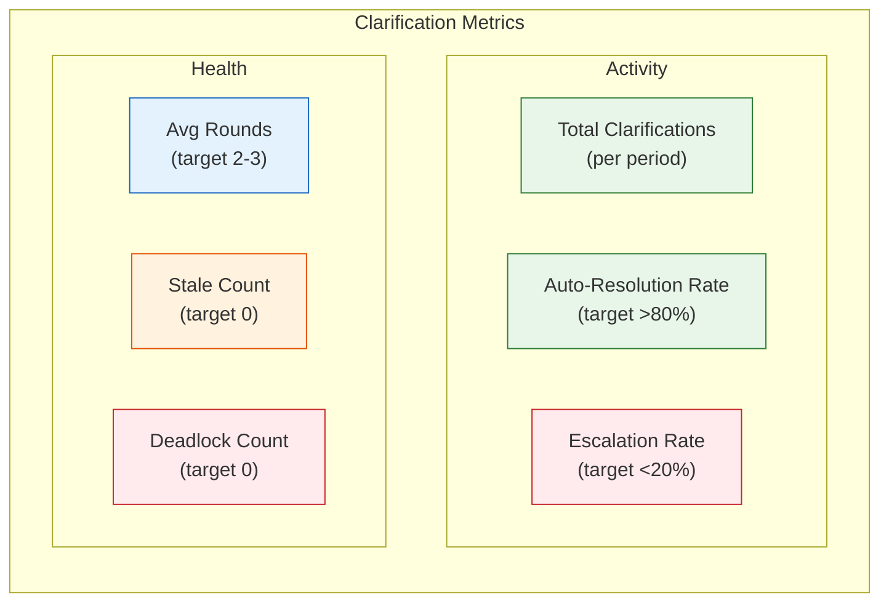
```mermaid
graph LR
    subgraph Dashboard["Clarification Metrics"]
        direction TB
        subgraph Row1["Activity"]
            direction LR
            TC["Total Clarifications<br/>(per period)"]
            AR["Auto-Resolution Rate<br/>(target >80%)"]
            ER["Escalation Rate<br/>(target <20%)"]
        end
        subgraph Row2["Health"]
            direction LR
            AVG["Avg Rounds<br/>(target 2-3)"]
            ST["Stale Count<br/>(target 0)"]
            DL["Deadlock Count<br/>(target 0)"]
        end
    end

    style TC fill:#E8F5E9,stroke:#2E7D32
    style AR fill:#E8F5E9,stroke:#2E7D32
    style ER fill:#FFEBEE,stroke:#C62828
    style AVG fill:#E3F2FD,stroke:#1565C0
    style ST fill:#FFF3E0,stroke:#E65100
    style DL fill:#FFEBEE,stroke:#C62828
```

#### 12.2 EventBus Events (Observability Points)

| Event | When Fired | Subscribers |
|-------|-----------|-------------|
| `clarification-requested` | Agent creates ClarificationRequest | AgentTreeProvider, ThinkingLog |
| `clarification-answered` | Target agent provides answer | AgentTreeProvider, ThinkingLog |
| `clarification-stale` | Monitor detects SLA expiry | AgentTreeProvider, ReadyQueueProvider |
| `clarification-resolved` | Requester marks resolved | AgentTreeProvider, ThinkingLog |
| `clarification-escalated` | Auto-escalation or manual | AgentTreeProvider, ReadyQueueProvider |

#### 12.3 Logging

- Structured logging: All clarification operations logged with `{clarificationId, issueNumber, fromAgent, toAgent, round, status}`
- Lock operations: acquire/release logged with `{filePath, agent, durationMs}` for contention analysis
- Monitor results: scan results logged with `{staleCount, stuckCount, deadlockedCount}` on each trigger
- Escalation: full summary logged for human review

#### 12.4 CLI Observability

| Command | What It Shows |
|---------|--------------|
| `agentx clarify` | All active clarifications with status, round, age |
| `agentx clarify stale` | Only stale/stuck clarifications |
| `agentx state` | Agent statuses including `clarifying`/`blocked-clarification` |
| `agentx ready` | Ready queue with `BLOCKED: Clarification pending` markers |

---

### Cross-Cutting Concerns Diagram

```mermaid
graph TD
    subgraph Pipeline["Clarification Pipeline"]
        direction LR
        REQ["Request"] --> SCOPE["Scope Check"] --> LOCK["File Lock"]
        LOCK --> WRITE["Write Ledger"] --> ROUTE["Route to Agent"]
        ROUTE --> ANS["Answer"] --> RENDER["Render Output"]
    end

    subgraph Row1[""]
        direction LR
        L["LOGGING<br/>Structured JSON - Per operation<br/>clarificationId - Round tracking"]
        M["MONITORING<br/>Stale detection - Stuck detection<br/>Deadlock detection - SLA timers"]
        E["EVENTS<br/>EventBus lifecycle events<br/>Tree view refresh - History"]
    end

    subgraph Row2[""]
        direction LR
        V["VALIDATION<br/>Scope guard - Round limits<br/>Input sanitization - ID format"]
        C["CONCURRENCY<br/>File locking - AsyncMutex<br/>Stale cleanup - Retry backoff"]
        R["RENDERING<br/>Chat markdown - CLI ANSI<br/>GitHub comments - Digest stats"]
    end

    Pipeline --- Row1
    Row1 --- Row2
```

---

**Generated by AgentX Architect Agent**
**Last Updated**: 2026-02-26
**Version**: 1.0


---

## Memory Pipeline Specification

> Originally SPEC-29.md | Date: 2026-02-27 | Epic: #29 | ADR: [ADR-AgentX.md](../adr/ADR-AgentX.md) | PRD: [PRD-AgentX.md](../prd/PRD-AgentX.md)
### 1. Overview

Build a persistent memory pipeline for AgentX that captures agent observations at session end, stores them in per-issue JSON files, and injects relevant past observations at session start. The pipeline extends the existing `ContextCompactor`, `AgentEventBus`, and `FileLockManager` infrastructure with a new `ObservationStore` storage layer and `MemoryPipeline` orchestrator.

**Scope:**
- In scope: ObservationStore (CRUD + FTS), MemoryPipeline (capture + inject), EventBus extensions (2 new events), ContextCompactor memory budget integration, VS Code commands (search memory, get observation), relevance scoring, observation compaction, CLI subcommand
- Out of scope: Vector/embedding search, cross-workspace memory, cloud sync, web viewer UI, LLM summarization

**Success Criteria:**
- Observations persist across sessions and are searchable in <200ms for 10K records
- Session-start injection surfaces relevant past decisions within a 20K token memory budget
- Context budget report includes recalled memory section
- No degradation in session start time beyond 500ms

---

### 2. Architecture Diagrams

#### 2.1 High-Level System Architecture

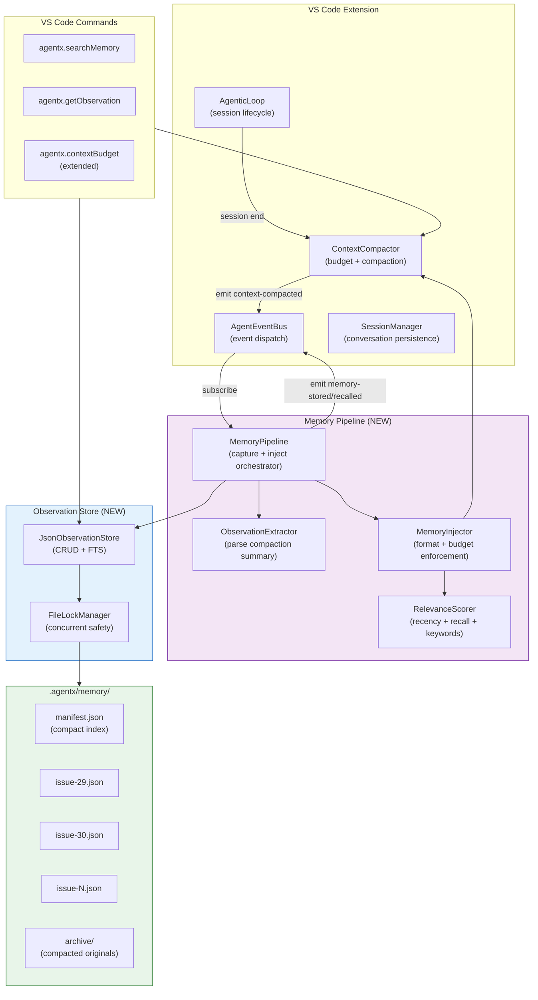
```mermaid
graph TD
    subgraph EXT["VS Code Extension"]
        AL["AgenticLoop<br/>(session lifecycle)"]
        CC["ContextCompactor<br/>(budget + compaction)"]
        EB["AgentEventBus<br/>(event dispatch)"]
        SM["SessionManager<br/>(conversation persistence)"]
    end

    subgraph MEMORY["Memory Pipeline (NEW)"]
        MP["MemoryPipeline<br/>(capture + inject orchestrator)"]
        OE["ObservationExtractor<br/>(parse compaction summary)"]
        RS["RelevanceScorer<br/>(recency + recall + keywords)"]
        MI["MemoryInjector<br/>(format + budget enforcement)"]
    end

    subgraph STORE["Observation Store (NEW)"]
        OS["JsonObservationStore<br/>(CRUD + FTS)"]
        FL["FileLockManager<br/>(concurrent safety)"]
    end

    subgraph DISK[".agentx/memory/"]
        MAN["manifest.json<br/>(compact index)"]
        IF1["issue-29.json"]
        IF2["issue-30.json"]
        IFN["issue-N.json"]
        ARC["archive/<br/>(compacted originals)"]
    end

    subgraph CMDS["VS Code Commands"]
        CMD1["agentx.searchMemory"]
        CMD2["agentx.getObservation"]
        CMD3["agentx.contextBudget<br/>(extended)"]
    end

    AL -->|"session end"| CC
    CC -->|"emit context-compacted"| EB
    EB -->|"subscribe"| MP
    MP --> OE
    MP --> MI
    MI --> RS
    MP --> OS
    OS --> FL
    FL --> DISK
    MI --> CC
    MP -->|"emit memory-stored/recalled"| EB
    CMDS --> OS
    CMDS --> CC

    style MEMORY fill:#F3E5F5,stroke:#6A1B9A
    style STORE fill:#E3F2FD,stroke:#1565C0
    style DISK fill:#E8F5E9,stroke:#2E7D32
```

**Component Responsibilities:**

| Layer | Responsibility | Technology |
|-------|---------------|------------|
| **AgenticLoop** | Session lifecycle, calls compactConversation at end | TypeScript (existing) |
| **ContextCompactor** | Token budget tracking, regex-based compaction | TypeScript (existing, extended) |
| **MemoryPipeline** | Orchestrates capture at session end, injection at session start | TypeScript (new) |
| **ObservationExtractor** | Parses compaction summaries into structured observations | TypeScript (new) |
| **RelevanceScorer** | Ranks observations by recency, recall count, keyword overlap | TypeScript (new) |
| **MemoryInjector** | Selects top-k observations, formats for injection, enforces budget | TypeScript (new) |
| **JsonObservationStore** | CRUD + FTS over per-issue JSON files with manifest | TypeScript (new) |
| **FileLockManager** | Dual-guard concurrent file writes | TypeScript (existing, reused) |

---

#### 2.2 Sequence Diagram: Observation Capture (Session End)

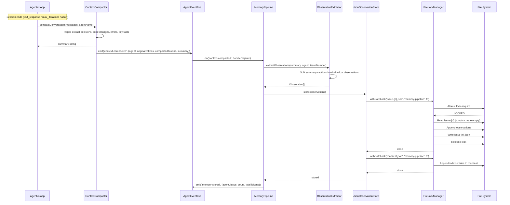
```mermaid
sequenceDiagram
    participant AL as AgenticLoop
    participant CC as ContextCompactor
    participant EB as AgentEventBus
    participant MP as MemoryPipeline
    participant OE as ObservationExtractor
    participant OS as JsonObservationStore
    participant FL as FileLockManager
    participant FS as File System

    Note over AL: Session ends (text_response / max_iterations / abort)
    AL->>CC: compactConversation(messages, agentName)
    CC->>CC: Regex extract decisions, code changes, errors, key facts
    CC-->>AL: summary string
    CC->>EB: emit('context-compacted', {agent, originalTokens, compactedTokens, summary})

    EB->>MP: on('context-compacted', handleCapture)
    MP->>OE: extractObservations(summary, agent, issueNumber)
    OE->>OE: Split summary sections into individual observations
    OE-->>MP: Observation[]

    MP->>OS: store(observations)
    OS->>FL: withSafeLock('issue-{n}.json', 'memory-pipeline', fn)
    FL->>FS: Atomic lock acquire
    FS-->>FL: LOCKED
    FL->>FS: Read issue-{n}.json (or create empty)
    FL->>FS: Append observations
    FL->>FS: Write issue-{n}.json
    FL->>FS: Release lock
    FL-->>OS: done

    OS->>FL: withSafeLock('manifest.json', 'memory-pipeline', fn)
    FL->>FS: Append index entries to manifest
    FL-->>OS: done

    OS-->>MP: stored
    MP->>EB: emit('memory-stored', {agent, issue, count, totalTokens})
```

#### 2.3 Sequence Diagram: Memory Injection (Session Start)

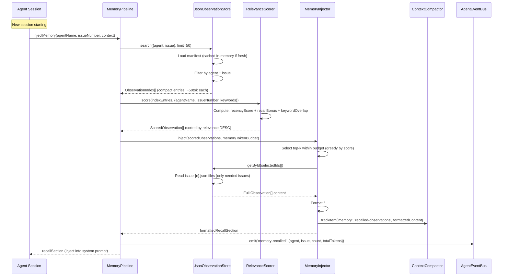
```mermaid
sequenceDiagram
    participant AG as Agent Session
    participant MP as MemoryPipeline
    participant OS as JsonObservationStore
    participant RS as RelevanceScorer
    participant MI as MemoryInjector
    participant CC as ContextCompactor
    participant EB as AgentEventBus

    Note over AG: New session starting
    AG->>MP: injectMemory(agentName, issueNumber, context)

    MP->>OS: search({agent, issue}, limit=50)
    OS->>OS: Load manifest (cached in-memory if fresh)
    OS->>OS: Filter by agent + issue
    OS-->>MP: ObservationIndex[] (compact entries, ~50tok each)

    MP->>RS: score(indexEntries, {agentName, issueNumber, keywords})
    RS->>RS: Compute: recencyScore + recallBonus + keywordOverlap
    RS-->>MP: ScoredObservation[] (sorted by relevance DESC)

    MP->>MI: inject(scoredObservations, memoryTokenBudget)
    MI->>MI: Select top-k within budget (greedy by score)
    MI->>OS: getById(selectedIds[])
    OS->>OS: Read issue-{n}.json files (only needed issues)
    OS-->>MI: Full Observation[] content

    MI->>MI: Format "## Memory Recall" section
    MI->>CC: trackItem('memory', 'recalled-observations', formattedContent)
    MI-->>MP: formattedRecallSection

    MP->>EB: emit('memory-recalled', {agent, issue, count, totalTokens})
    MP-->>AG: recallSection (inject into system prompt)
```

#### 2.4 Class/Interface Diagram: Core Types

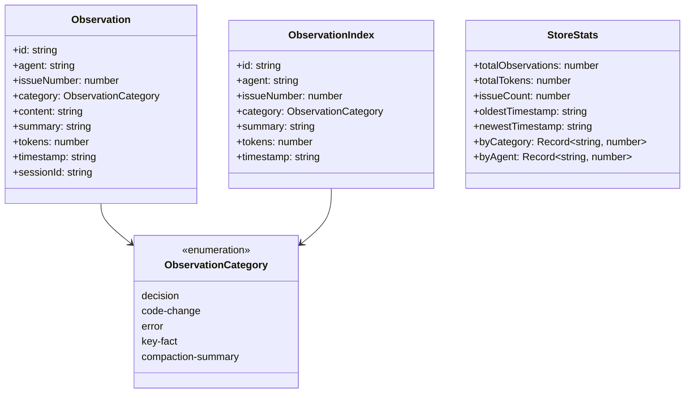
```mermaid
classDiagram
    class Observation {
        +id: string
        +agent: string
        +issueNumber: number
        +category: ObservationCategory
        +content: string
        +summary: string
        +tokens: number
        +timestamp: string
        +sessionId: string
    }
    %% Phase 3 additions: recallCount, relevanceScore, archived

    class ObservationIndex {
        +id: string
        +agent: string
        +issueNumber: number
        +category: ObservationCategory
        +summary: string
        +tokens: number
        +timestamp: string
    }

    class ObservationCategory {
        <<enumeration>>
        decision
        code-change
        error
        key-fact
        compaction-summary
    }

    class StoreStats {
        +totalObservations: number
        +totalTokens: number
        +issueCount: number
        +oldestTimestamp: string
        +newestTimestamp: string
        +byCategory: Record~string, number~
        +byAgent: Record~string, number~
    }

    Observation --> ObservationCategory
    ObservationIndex --> ObservationCategory
```

#### 2.5 Class/Interface Diagram: Service Layer

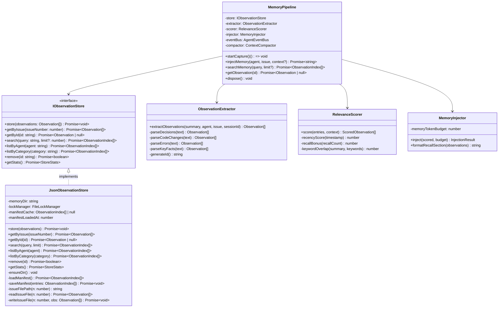
```mermaid
classDiagram
    class IObservationStore {
        <<interface>>
        +store(observations: Observation[]) Promise~void~
        +getByIssue(issueNumber: number) Promise~Observation[]~
        +getById(id: string) Promise~Observation | null~
        +search(query: string, limit?: number) Promise~ObservationIndex[]~
        +listByAgent(agent: string) Promise~ObservationIndex[]~
        +listByCategory(category: string) Promise~ObservationIndex[]~
        +remove(id: string) Promise~boolean~
        +getStats() Promise~StoreStats~
    }

    %% Phase 3 additions (not in v1 interface):
    %% +searchByFilters(filters: SearchFilters) Promise~ObservationIndex[]~
    %% +incrementRecallCount(id: string) Promise~void~
    %% +compact(issueNumber: number) Promise~CompactionResult~

    class JsonObservationStore {
        -memoryDir: string
        -lockManager: FileLockManager
        -manifestCache: ObservationIndex[] | null
        -manifestLoadedAt: number
        +store(observations) Promise~void~
        +getByIssue(issueNumber) Promise~Observation[]~
        +getById(id) Promise~Observation | null~
        +search(query, limit) Promise~ObservationIndex[]~
        +listByAgent(agent) Promise~ObservationIndex[]~
        +listByCategory(category) Promise~ObservationIndex[]~
        +remove(id) Promise~boolean~
        +getStats() Promise~StoreStats~
        -ensureDir() void
        -loadManifest() Promise~ObservationIndex[]~
        -saveManifest(entries: ObservationIndex[]) Promise~void~
        -issueFilePath(n: number) string
        -readIssueFile(n: number) Promise~Observation[]~
        -writeIssueFile(n: number, obs: Observation[]) Promise~void~
    }

    class MemoryPipeline {
        -store: IObservationStore
        -extractor: ObservationExtractor
        -scorer: RelevanceScorer
        -injector: MemoryInjector
        -eventBus: AgentEventBus
        -compactor: ContextCompactor
        +startCapture() () => void
        +injectMemory(agent, issue, context?) Promise~string~
        +searchMemory(query, limit?) Promise~ObservationIndex[]~
        +getObservation(id) Promise~Observation | null~
        +dispose() void
    }

    class ObservationExtractor {
        +extractObservations(summary, agent, issue, sessionId) Observation[]
        -parseDecisions(text) Observation[]
        -parseCodeChanges(text) Observation[]
        -parseErrors(text) Observation[]
        -parseKeyFacts(text) Observation[]
        -generateId() string
    }

    class RelevanceScorer {
        +score(entries, context) ScoredObservation[]
        -recencyScore(timestamp) number
        -recallBonus(recallCount) number
        -keywordOverlap(summary, keywords) number
    }

    class MemoryInjector {
        -memoryTokenBudget: number
        +inject(scored, budget) InjectionResult
        +formatRecallSection(observations) string
    }

    IObservationStore <|.. JsonObservationStore : implements
    MemoryPipeline --> IObservationStore
    MemoryPipeline --> ObservationExtractor
    MemoryPipeline --> RelevanceScorer
    MemoryPipeline --> MemoryInjector
```

#### 2.6 Dependency Injection Diagram

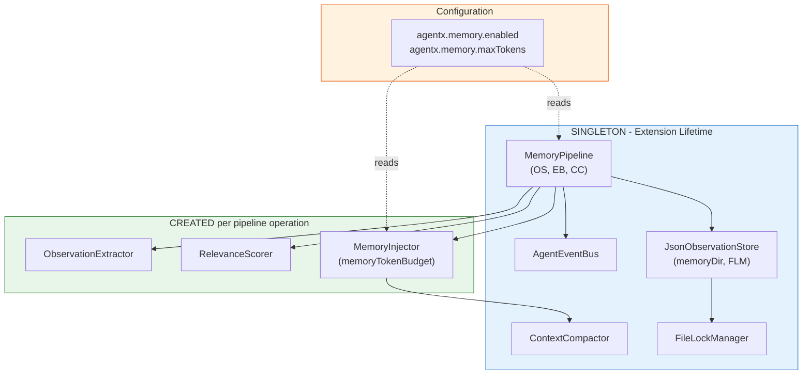
```mermaid
graph TD
    subgraph Singleton["SINGLETON - Extension Lifetime"]
        EB["AgentEventBus"]
        CC["ContextCompactor"]
        FLM["FileLockManager"]
        OS["JsonObservationStore<br/>(memoryDir, FLM)"]
        MP["MemoryPipeline<br/>(OS, EB, CC)"]
    end

    subgraph Created["CREATED per pipeline operation"]
        OE["ObservationExtractor"]
        RS["RelevanceScorer"]
        MI["MemoryInjector<br/>(memoryTokenBudget)"]
    end

    subgraph Config["Configuration"]
        CFG["agentx.memory.enabled<br/>agentx.memory.maxTokens"]
    end

    MP --> OS
    MP --> OE
    MP --> RS
    MP --> MI
    OS --> FLM
    MP --> EB
    MI --> CC
    CFG -.->|"reads"| MP
    CFG -.->|"reads"| MI

    style Singleton fill:#E3F2FD,stroke:#1565C0
    style Created fill:#E8F5E9,stroke:#2E7D32
    style Config fill:#FFF3E0,stroke:#E65100
```

---

### 3. API Design

#### 3.1 TypeScript Module API

##### ObservationStore

| Method | Signature | Description |
|--------|-----------|-------------|
| `store` | `store(observations: Observation[]): Promise<void>` | Persist observations + update manifest |
| `getByIssue` | `getByIssue(issueNumber: number): Promise<Observation[]>` | Load all observations for an issue |
| `getById` | `getById(id: string): Promise<Observation \| null>` | Load a single observation by ID |
| `search` | `search(query: string, limit?: number): Promise<ObservationIndex[]>` | Full-text search over manifest |
| `listByAgent` | `listByAgent(agent: string): Promise<ObservationIndex[]>` | List all observations by agent name |
| `listByCategory` | `listByCategory(category: string): Promise<ObservationIndex[]>` | List all observations by category |
| `remove` | `remove(id: string): Promise<boolean>` | Remove a single observation |
| `getStats` | `getStats(): Promise<StoreStats>` | Return aggregate statistics |

**Phase 3 additions** (not in v1 interface -- added when scoring/compaction is built):

| Method | Signature | Description |
|--------|-----------|-------------|
| `searchByFilters` | `searchByFilters(filters: SearchFilters): Promise<ObservationIndex[]>` | Filter by agent, issue, category, date range |
| `incrementRecallCount` | `incrementRecallCount(id: string): Promise<void>` | Bump recall count (for relevance scoring) |
| `compact` | `compact(issueNumber: number): Promise<CompactionResult>` | Merge related observations for an issue |

##### MemoryPipeline

| Method | Signature | Description |
|--------|-----------|-------------|
| `startCapture` | `startCapture(): () => void` | Subscribe to `context-compacted` events; returns unsubscribe fn |
| `injectMemory` | `injectMemory(agent: string, issue: number, context?: string): Promise<string>` | Retrieve + format + inject relevant observations |
| `searchMemory` | `searchMemory(query: string, limit?: number): Promise<ObservationIndex[]>` | Delegate to store search |
| `getObservation` | `getObservation(id: string): Promise<Observation \| null>` | Delegate to store getById |
| `dispose` | `dispose(): void` | Unsubscribe from EventBus, release resources |

#### 3.2 VS Code Commands

| Command ID | Title | Description | Input | Output | Phase |
|------------|-------|-------------|-------|--------|-------|
| `agentx.searchMemory` | AgentX: Search Memory | Search observations by keyword | Text input (query) | Output channel with compact results | 2a |
| `agentx.getObservation` | AgentX: Get Observation | Show full observation detail | Text input (ID) | Output channel with full content | 2a |
| `agentx.memoryStats` | AgentX: Memory Stats | Show store statistics | None | Output channel with stats | 2b |
| `agentx.compactMemory` | AgentX: Compact Memory | Merge related observations | QuickPick (issue number) | Information message with result | **3** |

#### 3.3 EventBus Events (New)

```
+---------------------------------------------------------------------------+
| NEW EVENT DEFINITIONS                                                      |
+---------------------------------------------------------------------------+
|                                                                           |
| memory-stored                    | memory-recalled                        |
| +-----------------------------+ | +-----------------------------+        |
| | {                           | | | {                           |        |
| |   agent: string,            | | |   agent: string,            |        |
| |   issueNumber: number,      | | |   issueNumber: number,      |        |
| |   count: number,            | | |   count: number,            |        |
| |   totalTokens: number,      | | |   totalTokens: number,      |        |
| |   observationIds: string[], | | |   observationIds: string[], |        |
| |   timestamp: number         | | |   timestamp: number         |        |
| | }                           | | | }                           |        |
| +-----------------------------+ | +-----------------------------+        |
|                                                                           |
+---------------------------------------------------------------------------+
```

#### 3.4 Configuration Settings

**User-facing settings (shipped in Phase 2a):**

| Setting | Type | Default | Description |
|---------|------|---------|-------------|
| `agentx.memory.enabled` | boolean | `true` | Enable/disable memory pipeline |
| `agentx.memory.maxTokens` | number | `20000` | Max tokens for recalled memory (10% of 200K context) |

**Internal constants (hardcoded, not user-exposed):**

| Constant | Value | Description |
|----------|-------|-------------|
| `MAX_OBSERVATIONS_PER_CAPTURE` | `50` | Max observations extracted per session end |
| `MANIFEST_CACHE_TTL_MS` | `30000` | In-memory manifest cache TTL (30s) |
| `STALE_ARCHIVE_AFTER_DAYS` | `90` | Archive threshold (Phase 3 only) |

---

### 4. Data Model Diagrams

#### 4.1 Observation Schema

```mermaid
erDiagram
    manifest_entry {
        STRING id PK "obs-{agent}-{issue}-{timestamp}-{rand}"
        STRING agent "agent name (e.g., engineer)"
        INTEGER issueNumber "parent issue number"
        STRING category "decision | code-change | error | key-fact | compaction-summary"
        STRING summary "compact ~50 tokens"
        INTEGER tokens "estimated token count of full content"
        STRING timestamp "ISO-8601"
    }

    observation {
        STRING id PK "matches manifest entry ID"
        STRING agent "agent name"
        INTEGER issueNumber "parent issue number"
        STRING category "observation category"
        STRING content "full observation text"
        STRING summary "compact summary ~50 tokens"
        INTEGER tokens "estimated tokens of content"
        STRING timestamp "ISO-8601"
        STRING sessionId "originating session ID"
    }
    %% Phase 3 additions: recallCount INTEGER, relevanceScore FLOAT, archived BOOLEAN

    manifest_entry ||--|| observation : "index for"
```

#### 4.2 File Schemas

**manifest.json:**
```json
{
  "version": 1,
  "updatedAt": "2026-02-27T10:00:00.000Z",
  "entries": [
    {
      "id": "obs-engineer-29-1709035200000-a1b2c3",
      "agent": "engineer",
      "issueNumber": 29,
      "category": "decision",
      "summary": "Chose per-issue JSON files for observation storage",
      "tokens": 245,
      "timestamp": "2026-02-27T10:00:00.000Z"
    }
  ]
}
```

**issue-29.json:**
```json
{
  "version": 1,
  "issueNumber": 29,
  "updatedAt": "2026-02-27T10:00:00.000Z",
  "observations": [
    {
      "id": "obs-engineer-29-1709035200000-a1b2c3",
      "agent": "engineer",
      "issueNumber": 29,
      "category": "decision",
      "content": "Chose per-issue JSON files for observation storage. Evaluated SQLite, single JSON file, and LevelDB. JSON files match clarification ledger pattern from ADR-1 and have zero dependencies.",
      "summary": "Chose per-issue JSON files for observation storage",
      "tokens": 245,
      "timestamp": "2026-02-27T10:00:00.000Z",
      "sessionId": "engineer-1709035100000-x7y8z9"
    }
  ]
}
```

#### 4.3 Observation ID Format

```
obs-{agent}-{issueNumber}-{timestampMs}-{randomSuffix}

Example: obs-engineer-29-1709035200000-a1b2c3

Components:
  obs            - prefix (distinguishes from other IDs in the system)
  engineer       - agent name (lowercase, sanitized)
  29             - issue number
  1709035200000  - Unix timestamp in ms
  a1b2c3         - 6-char random suffix (collision avoidance)
```

---

### 5. Service Layer Diagrams

#### 5.1 Memory Pipeline Architecture

```mermaid
graph TD
    subgraph Pipeline["MemoryPipeline (Orchestrator)"]
        SC["startCapture()<br/>Subscribe to context-compacted"]
        IM["injectMemory()<br/>Retrieve + score + format + inject"]
        SM["searchMemory()<br/>Delegate to store"]
        DI["dispose()<br/>Cleanup subscriptions"]
    end

    subgraph Capture["Capture Path"]
        OE["ObservationExtractor<br/>Parse summary sections"]
        ST["store.store()<br/>Persist to disk"]
        EV1["emit memory-stored"]
    end

    subgraph Inject["Injection Path"]
        QR["store.search()<br/>Query manifest"]
        RS["RelevanceScorer<br/>Rank by relevance"]
        MI["MemoryInjector<br/>Select top-k, format"]
        TI["compactor.trackItem()<br/>Track as 'memory'"]
        EV2["emit memory-recalled"]
    end

    SC -->|"context-compacted event"| OE --> ST --> EV1
    IM --> QR --> RS --> MI --> TI --> EV2

    style Pipeline fill:#F3E5F5,stroke:#6A1B9A
    style Capture fill:#E8F5E9,stroke:#2E7D32
    style Inject fill:#E3F2FD,stroke:#1565C0
```

#### 5.2 Relevance Scoring Algorithm

```mermaid
graph LR
    subgraph Input["Input Factors"]
        R["Recency<br/>(timestamp age)"]
        RC["Recall Count<br/>(times recalled)"]
        KW["Keyword Overlap<br/>(query terms in summary)"]
    end

    subgraph Weights["Weight Factors"]
        WR["w_recency = 0.4"]
        WRC["w_recall = 0.2"]
        WKW["w_keyword = 0.4"]
    end

    subgraph Score["Final Score"]
        FS["relevanceScore =<br/>w_r * recencyScore +<br/>w_rc * recallScore +<br/>w_kw * keywordScore"]
    end

    R --> WR --> FS
    RC --> WRC --> FS
    KW --> WKW --> FS
```

**Scoring formulas:**

| Factor | Formula | Range | Phase |
|--------|---------|-------|-------|
| Recency | `1.0 / (1.0 + daysSinceCreation / 30)` | 0.0 - 1.0 (halves every 30 days) | 2a |
| Keyword Overlap | `matchingKeywords / totalQueryKeywords` | 0.0 - 1.0 | 2b |
| Recall Count | `min(recallCount / 10, 1.0)` | 0.0 - 1.0 (saturates at 10 recalls) | **3** |
| **Phase 2a** | `recency` (sort by recency only) | 0.0 - 1.0 | 2a |
| **Phase 2b** | `0.5 * recency + 0.5 * keyword` | 0.0 - 1.0 | 2b |
| **Phase 3** | `0.4 * recency + 0.2 * recall + 0.4 * keyword` | 0.0 - 1.0 | 3 |

#### 5.3 Full-Text Search Implementation

```mermaid
graph TD
    subgraph Search["search(query, limit)"]
        Q["Query string"]
        T["Tokenize into keywords<br/>(lowercase, split on whitespace)"]
        LM["Load manifest<br/>(cached in-memory)"]
        FI["For each manifest entry:<br/>compute keyword overlap with summary"]
        SO["Sort by overlap score DESC"]
        LI["Return top limit entries"]
    end

    Q --> T --> LM --> FI --> SO --> LI
```

**Search implementation (pseudo-logic):**
1. Tokenize query: split on whitespace, lowercase, remove stop words
2. Load manifest into memory (cache for 30s)
3. For each manifest entry: count matching tokens in `summary` field
4. Sort by match count descending
5. Return top `limit` entries (default 20)

This is simple keyword matching, not TF-IDF or BM25. Sufficient for v1 where queries are typically agent names, issue numbers, or short phrases. The `IObservationStore` interface allows swapping to FTS5/BM25 backend later.

---

### 6. Security Diagrams

#### 6.1 Data Protection Flow

```mermaid
graph TD
    subgraph Input["Session Content"]
        MSG["Conversation Messages"]
    end

    subgraph Sanitize["Security Filters"]
        S1["1. SecurityHelpers.stripSecrets()<br/>(existing module)"]
        S2["2. Remove private tags<br/>(content between private markers)"]
        S3["3. Truncate long content<br/>(max 2000 chars per observation)"]
    end

    subgraph Store["Safe Output"]
        OBS["Sanitized Observations<br/>(no secrets, no private data)"]
    end

    MSG --> S1 --> S2 --> S3 --> OBS

    style Sanitize fill:#FCE4EC,stroke:#C62828
```

#### 6.2 Security Controls

```mermaid
graph TD
    L1["Layer 1: Secret Stripping<br/>SecurityHelpers module filters API keys, tokens, passwords"]
    L2["Layer 2: Privacy Tags<br/>Content in private markers excluded from observations"]
    L3["Layer 3: Content Limits<br/>Max 2000 chars per observation, max 50 per capture"]
    L4["Layer 4: File Permissions<br/>Store inherits .agentx/ directory permissions"]
    L5["Layer 5: File Locking<br/>FileLockManager prevents concurrent corruption"]
    L6["Layer 6: Input Validation<br/>ID format regex, issueNumber range check"]

    L1 --> L2 --> L3 --> L4 --> L5 --> L6

    style L1 fill:#E3F2FD,stroke:#1565C0
    style L2 fill:#E8F5E9,stroke:#2E7D32
    style L3 fill:#FFF3E0,stroke:#E65100
    style L4 fill:#FCE4EC,stroke:#C62828
    style L5 fill:#F3E5F5,stroke:#6A1B9A
    style L6 fill:#E0F7FA,stroke:#00838F
```

**Threat model:**

| Threat | Guard | Impact if bypassed |
|--------|-------|--------------------|
| API keys in observations | SecurityHelpers.stripSecrets() | Credential exposure in local files |
| Private user data persisted | `<private>` tag filter | Privacy violation |
| Unbounded observation size | 2000 char + 50 count limits | Disk exhaustion |
| Concurrent file corruption | FileLockManager (dual-guard) | Data loss |
| Malformed observation IDs | Regex validation on read | Parse errors |
| Path traversal in issue filenames | Sanitize issueNumber to digits only | File system access outside .agentx/ |

---

### 7. Performance

#### 7.1 Performance Requirements

| Metric | Target | Measurement |
|--------|--------|-------------|
| Observation write latency | < 50ms per batch | Time from capture to disk write complete |
| Manifest load (cold) | < 100ms for 10K entries | First load from disk |
| Manifest load (cached) | < 1ms | In-memory cache hit |
| Full-text search (10K) | < 200ms | Query + score + sort + return |
| Session start injection | < 500ms total | Load manifest + query + score + format |
| Issue file read | < 20ms per file | Read + parse single issue JSON |
| Memory store size (50K obs) | < 50MB | Total disk usage |
| Manifest size (50K entries) | < 3MB | manifest.json file size |

#### 7.2 Caching Strategy

```mermaid
graph LR
    subgraph Cache["In-Memory Manifest Cache"]
        MC["ManifestCache<br/>Entries: ObservationIndex[]<br/>LoadedAt: timestamp<br/>TTL: 30 seconds"]
    end

    subgraph Patterns["Cache Behavior"]
        R["READ: Check cache age.<br/>If age < TTL, return cached.<br/>If age >= TTL, reload from disk."]
        W["WRITE: Update cache in-place<br/>after successful disk write.<br/>No separate invalidation needed."]
        S["SEARCH: Always uses cached<br/>manifest. No disk I/O."]
    end

    MC --> Patterns

    style MC fill:#FFF3E0,stroke:#E65100
```

#### 7.3 Optimization Strategies

- **Lazy loading**: Manifest loaded only on first access. Issue files loaded only when needed (injection or getById).
- **Cache with TTL**: Manifest cached in memory for 30s. Writes update cache in-place. Multiple searches within TTL window require zero disk I/O.
- **Partial file loading**: Injection loads only the issue files for the matching issue numbers, not all files.
- **Bounded search**: FTS stops after `limit` matches. Default limit=20 prevents scanning all 50K entries unnecessarily.
- **Observation size limits**: 2000 char max per observation. 50 observations max per capture. Prevents pathological cases.

---

### 8. Testing Strategy

#### 8.1 Test Pyramid

```mermaid
graph TD
    E2E["E2E Tests - 10%<br/>Full capture-inject cycle in extension"]
    INT["Integration Tests - 20%<br/>Store + FileLock + disk I/O"]
    UNIT["Unit Tests - 70%<br/>Extractor, Scorer, Injector, Search"]
    COV["Coverage Target: 80%"]

    E2E --- INT --- UNIT --- COV

    style E2E fill:#F44336,color:#fff,stroke:#D32F2F
    style INT fill:#FF9800,color:#fff,stroke:#F57C00
    style UNIT fill:#4CAF50,color:#fff,stroke:#388E3C
    style COV fill:#2196F3,color:#fff,stroke:#1565C0
```

#### 8.2 Test Types

| Test Type | Coverage | Framework | Scope |
|-----------|----------|-----------|-------|
| **Unit Tests** | 80%+ | Mocha + Chai (existing) | ObservationExtractor, RelevanceScorer, MemoryInjector, FTS algorithm |
| **Integration Tests** | Key flows | Mocha + temp directories | JsonObservationStore (disk I/O), FileLockManager concurrent writes |
| **E2E Tests** | Happy paths | VS Code extension test | Full capture -> store -> inject -> budget report cycle |
| **Performance Tests** | Critical paths | Mocha + timer assertions | 10K observation search <200ms, manifest load <100ms |

#### 8.3 Key Test Scenarios

| # | Scenario | Type | Validates |
|---|----------|------|-----------|
| T1 | Extract observations from compaction summary | Unit | ObservationExtractor parses all categories |
| T2 | Store and retrieve observations by issue | Integration | JsonObservationStore CRUD + manifest sync |
| T3 | Full-text search returns relevant results | Unit | Keyword matching, ranking, limit enforcement |
| T4 | Concurrent writes do not corrupt data | Integration | FileLockManager dual-guard safety |
| T5 | Memory injection respects token budget | Unit | MemoryInjector stops at budget boundary |
| T6 | Relevance scorer ranks recency over stale | Unit | RelevanceScorer formula correctness |
| T7 | Empty memory store returns empty recall | Unit/Int | Graceful degradation on first run |
| T8 | Corrupt manifest triggers rebuild | Integration | Error recovery (rebuild from issue files) |
| T9 | Privacy tags excluded from observations | Unit | Security: private content not persisted |
| T10 | 10K observations search under 200ms | Performance | Performance benchmark |
| T11 | Observation compaction merges related entries | Unit | CompactObservations reduces count |
| T12 | EventBus events fire on store/recall | Integration | memory-stored and memory-recalled events |

---

### 9. Implementation Notes

#### 9.1 Directory Structure

```
vscode-extension/src/
  memory/                            # NEW - Memory pipeline module
    index.ts                         # Public exports
    observationStore.ts              # IObservationStore + JsonObservationStore
    memoryPipeline.ts                # MemoryPipeline orchestrator
    observationExtractor.ts          # Parse compaction summaries
    relevanceScorer.ts               # Scoring algorithm
    memoryInjector.ts                # Top-k selection + formatting
    types.ts                         # Observation, ObservationIndex, StoreStats, etc.
  utils/
    contextCompactor.ts              # MODIFIED - Add memory section to budget report
    eventBus.ts                      # MODIFIED - Add memory-stored, memory-recalled events
  extension.ts                       # MODIFIED - Initialize MemoryPipeline, register commands

vscode-extension/src/test/
  memory/                            # NEW - Memory pipeline tests
    observationStore.test.ts
    memoryPipeline.test.ts
    observationExtractor.test.ts
    relevanceScorer.test.ts
    memoryInjector.test.ts
```

#### 9.2 Modified Files

| File | Change | Impact |
|------|--------|--------|
| `utils/eventBus.ts` | Add `MemoryStoredEvent`, `MemoryRecalledEvent` to `AgentEventMap` | Low - additive, no existing events changed |
| `utils/contextCompactor.ts` | Add memory section to `formatBudgetReport()` | Low - extends output, no API change |
| `extension.ts` | Initialize `MemoryPipeline`, register 2 commands (Phase 2a), 1 more (Phase 2b) | Low - additive to activation |
| `agentxContext.ts` | Expose `MemoryPipeline` via services | Low - optional service |
| `package.json` | Add 3 command contributions (Phase 2a/2b) + 2 configuration settings | Low - additive |

#### 9.3 New Dependencies

None. All implementation uses Node.js built-in `fs` and `path` modules plus existing AgentX infrastructure (`FileLockManager`, `AgentEventBus`, `ContextCompactor`).

#### 9.4 Configuration

Add to `package.json` contributes:

```json
{
  "configuration": {
    "title": "AgentX Memory",
    "properties": {
      "agentx.memory.enabled": {
        "type": "boolean",
        "default": true,
        "description": "Enable persistent agent memory pipeline"
      },
      "agentx.memory.maxTokens": {
        "type": "number",
        "default": 20000,
        "description": "Maximum tokens for recalled memory injection"
      }
    }
  }
}
```

> **Internal constants** (hardcoded in source, not exposed as settings): `MAX_OBSERVATIONS_PER_CAPTURE = 50`, `MANIFEST_CACHE_TTL_MS = 30000`, `STALE_ARCHIVE_AFTER_DAYS = 90` (Phase 3 only).

#### 9.5 Graceful Degradation

| Failure | Behavior | User Impact |
|---------|----------|-------------|
| Memory store does not exist | Create `.agentx/memory/` on first write | None (auto-created) |
| Manifest corrupt/missing | Rebuild from issue files (scan directory) | Extra 1-2s on first access |
| Issue file corrupt | Skip that issue, log warning, continue | Missing observations for that issue |
| FileLock timeout | Skip capture/inject, log warning | Observation not persisted or recalled |
| Memory disabled by setting | Pipeline returns empty strings immediately | No overhead |
| agentx.memory.maxTokens = 0 | No injection, capture still works | Memory store grows but no recall |

---

### 10. Rollout Plan

#### Phase 1: Foundation -- Observation Store (Weeks 1-2)

**Stories**: #36, #37, #38

**Deliverables:**
- `vscode-extension/src/memory/types.ts` (all type definitions)
- `vscode-extension/src/memory/observationStore.ts` (JsonObservationStore)
- `vscode-extension/src/memory/observationExtractor.ts`
- `vscode-extension/src/memory/index.ts`
- Unit + integration tests (>=80% coverage)
- Performance benchmark: 10K observation search under 200ms
- **Extraction quality validation**: Run extractor on 3+ real past sessions, manually inspect results

**Acceptance Gate:**
- [ ] All CRUD operations work with FileLockManager
- [ ] Manifest stays in sync with issue files
- [ ] FTS returns relevant results ranked by keyword overlap
- [ ] 10K observation benchmark passes
- [ ] **Extraction quality confirmed**: Manual inspection shows useful, non-trivial observations from real sessions

#### Phase 2a: Core Integration -- Capture & Injection (Week 3)

**Stories**: #39, #40

**Deliverables:**
- `vscode-extension/src/memory/memoryPipeline.ts`
- `vscode-extension/src/memory/memoryInjector.ts` (recency-only sort for v1)
- Modified `eventBus.ts` (2 new events)
- Modified `contextCompactor.ts` (memory budget section)
- Modified `extension.ts` (pipeline init + 2 commands: searchMemory, getObservation)
- Modified `package.json` (2 commands + 2 configuration settings)

**Acceptance Gate:**
- [ ] Session-end capture fires automatically via EventBus
- [ ] Session-start injection returns formatted recall section
- [ ] Budget report includes memory section with token counts
- [ ] Memory injection stays within configured token budget
- [ ] searchMemory and getObservation commands work end-to-end

#### Phase 2b: Commands & Reporting (Week 4)

**Stories**: #41, #42

**Deliverables:**
- `vscode-extension/src/memory/relevanceScorer.ts` (recency + keyword, no recall count yet)
- VS Code command: memoryStats
- Token displacement counter in ThinkingLog
- Modified `extension.ts` (+1 command)
- Modified `package.json` (+1 command)

**Acceptance Gate:**
- [ ] Relevance scorer improves injection ordering (recency + keyword)
- [ ] memoryStats command shows observation count, disk size, token totals
- [ ] Token displacement logged: "Memory recall displaced N tokens of manual re-read"

#### Phase 3: Optimization -- Scoring & Compaction (Weeks 5-6)

**Stories**: #43, #44, #45, #46

**Deliverables:**
- Recall count tracking (`incrementRecallCount`, `searchByFilters` added to store)
- Full relevance scoring (recency + recall count + keyword overlap)
- Observation compaction (merge N related into 1 summary)
- Archive directory for compacted originals
- VS Code command: compactMemory
- CLI hook integration for standalone sessions (#43, #44)
- Performance benchmarks for 50K observations

**Acceptance Gate:**
- [ ] Relevance scorer improves injection quality (manual review)
- [ ] Compaction reduces observation count by 50%+ for old issues
- [ ] 50K observation performance stays within targets
- [ ] No P0/P1 bugs open

---

### 11. Risks & Mitigations

| Risk | Impact | Probability | Mitigation |
|------|--------|-------------|------------|
| Manifest out of sync with issue files | Medium | Low | Rebuild manifest from issue files on mismatch detection; checksum validation |
| Regex extraction misses important observations | Medium | High | **Phase 1 gate**: Run extractor on 3+ real sessions, manually inspect output. Track recall accuracy; plan hybrid extraction if quality insufficient; allow manual observation add |
| Session start latency with large memory store | High | Low | Manifest cache (30s TTL); lazy loading; bounded search (limit=20) |
| File lock contention on manifest.json | Medium | Low | Write issue file first, then manifest; per-issue locks do not contend |
| Memory store grows unbounded | Medium | Medium | Phase 3 compaction; staleArchiveAfterDays config; getStats() monitoring |
| Observation content contains secrets | High | Low | SecurityHelpers.stripSecrets() before extraction; privacy tag filter |
| Concurrent VS Code windows + CLI corrupt data | High | Low | FileLockManager dual-guard (tested in ADR-1 implementation) |

---

### 12. Monitoring & Observability

#### 12.1 Metrics

```mermaid
graph LR
    subgraph Dashboard["Memory Pipeline Metrics"]
        direction TB
        subgraph Row1["Capture Metrics"]
            direction LR
            CM1["Observations<br/>Captured"]
            CM2["Capture<br/>Latency"]
            CM3["Capture<br/>Errors"]
        end
        subgraph Row2["Injection Metrics"]
            direction LR
            IM1["Observations<br/>Recalled"]
            IM2["Injection<br/>Latency"]
            IM3["Memory Tokens<br/>Used"]
        end
        subgraph Row3["Store Metrics"]
            direction LR
            SM1["Total<br/>Observations"]
            SM2["Store Size<br/>(disk)"]
            SM3["Search<br/>Latency"]
        end
    end

    style CM1 fill:#E8F5E9,stroke:#2E7D32
    style CM2 fill:#FFF3E0,stroke:#E65100
    style CM3 fill:#FFEBEE,stroke:#C62828
    style IM1 fill:#E8F5E9,stroke:#2E7D32
    style IM2 fill:#FFF3E0,stroke:#E65100
    style IM3 fill:#E3F2FD,stroke:#1565C0
    style SM1 fill:#E8F5E9,stroke:#2E7D32
    style SM2 fill:#FFF3E0,stroke:#E65100
    style SM3 fill:#E3F2FD,stroke:#1565C0
```

#### 12.2 Observability Points

| Point | Event / Method | Data |
|-------|---------------|------|
| Observation captured | `memory-stored` event | Agent, issue, count, tokens |
| Observation recalled | `memory-recalled` event | Agent, issue, count, tokens |
| **Token displacement** | ThinkingLog entry | "Memory recall displaced {N} tokens of manual re-read" -- estimated tokens saved by injecting from memory vs re-reading source documents |
| Search performed | ThinkingLog entry | Query, result count, latency |
| Budget check | `formatBudgetReport()` | Memory section with recalled items |
| Compaction run | ThinkingLog entry | Issue, before/after counts |
| Lock timeout | console.warn | File path, attempt count |
| Store rebuild | console.warn | Trigger (corrupt manifest), duration |

#### 12.3 Alerts (via ThinkingLog)

| Condition | Level | Message |
|-----------|-------|---------|
| Manifest rebuild triggered | warning | "Memory manifest rebuilt from issue files (took {ms}ms)" |
| Lock timeout on capture | warning | "Memory capture skipped: lock timeout on {file}" |
| Store exceeds 40MB | warning | "Memory store exceeds 40MB. Run 'AgentX: Compact Memory' to reduce." |
| Observation count > 40K | warning | "Memory store has {n} observations. Consider compaction." |
| Capture produces 0 observations | info | "No observations extracted from session (empty summary)" |

---

### Cross-Cutting Concerns Diagram

```mermaid
graph TD
    subgraph Pipeline["Memory Pipeline Flow"]
        direction LR
        CAP["Capture"] --> EXT["Extract"] --> SAN["Sanitize"] --> STO["Store"]
        REC["Recall"] --> QRY["Query"] --> SCR["Score"] --> INJ["Inject"]
    end

    subgraph Row1["Cross-Cutting"]
        direction LR
        L["LOGGING<br/>ThinkingLog entries<br/>for all operations"]
        M["METRICS<br/>EventBus events<br/>for capture + recall"]
        C["CACHING<br/>Manifest cache<br/>with 30s TTL"]
    end

    subgraph Row2["Quality"]
        direction LR
        S["SECURITY<br/>Secret stripping<br/>Privacy tags"]
        E["ERROR HANDLING<br/>Graceful degradation<br/>Skip on failure"]
        V["VALIDATION<br/>ID format check<br/>Content length limits"]
    end

    Pipeline --- Row1
    Row1 --- Row2
```

---

**Generated by AgentX Architect Agent**
**Last Updated**: 2026-02-27
**Version**: 1.0


---

## Related Documents

- [PRD-AgentX.md](../prd/PRD-AgentX.md) - Product Requirements Document
- [ADR-AgentX.md](../adr/ADR-AgentX.md) - Architecture Decision Records
- [ARCH-AgentX.md](../architecture/ARCH-AgentX.md) - Architecture Document
- [AGENTS.md](../../AGENTS.md) - Workflow & orchestration rules
