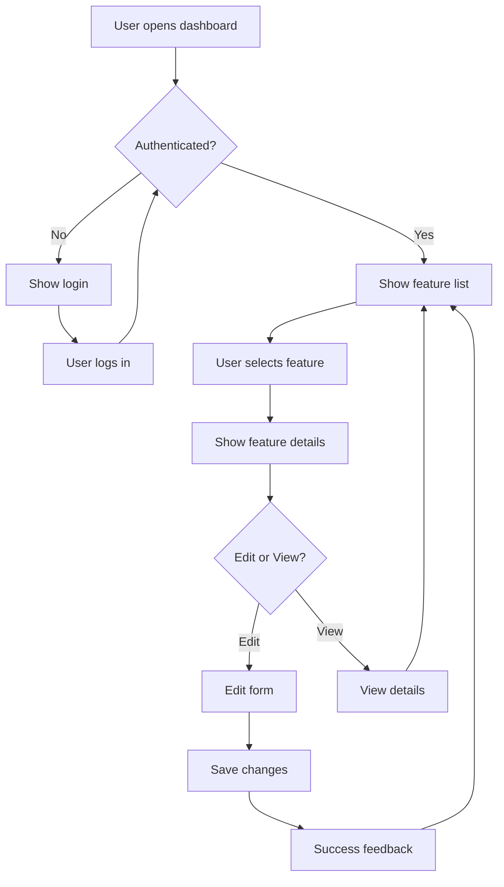

# UX Design: Primary User Capability

**Issue**: #51  
**Status**: Complete  
**Author**: UX Designer Agent  
**Date**: 2026-01-18

---

## 1. User Research

### 1.1 Target Users

| Persona | Description | Goals | Pain Points |
|---------|-------------|-------|-------------|
| Developer | Uses AgentX for coding | Efficient workflow | Manual tracking |
| Team Lead | Manages agent work | Visibility | Coordination |

### 1.2 User Needs
- **Must Have**: Clear status visibility, easy navigation
- **Should Have**: Quick actions, keyboard shortcuts
- **Nice to Have**: Customizable views

---

## 2. User Flows

### 2.1 Primary Flow (Happy Path)



### 2.2 Flow Steps

| Step | User Action | System Response | Notes |
|------|-------------|-----------------|-------|
| 1 | Opens app | Show loading | < 2s |
| 2 | Login | Authenticate | OAuth |
| 3 | View list | Display features | Paginated |
| 4 | Select item | Show details | Instant |
| 5 | Edit | Open form | Pre-filled |
| 6 | Save | Validate & save | Feedback |

---

## 3. Wireframes

### 3.1 Dashboard Screen

```
┌─────────────────────────────────────────────────────────┐
│  🤖 AgentX                    [Search 🔍]  [User ▼]     │
├─────────────────────────────────────────────────────────┤
│                                                         │
│  ┌───────────────────────────────────────────────────┐  │
│  │  Features (12)                    [+ New Feature] │  │
│  ├───────────────────────────────────────────────────┤  │
│  │  □ Feature A          Draft      Jan 15   [···]   │  │
│  │  □ Feature B          Active     Jan 16   [···]   │  │
│  │  □ Feature C          Complete   Jan 17   [···]   │  │
│  │  □ Feature D          Draft      Jan 18   [···]   │  │
│  └───────────────────────────────────────────────────┘  │
│                                                         │
│  [< Prev]  Page 1 of 3  [Next >]                        │
│                                                         │
├─────────────────────────────────────────────────────────┤
│  Status: Ready  |  Help  |  Settings                    │
└─────────────────────────────────────────────────────────┘
```

### 3.2 Feature Detail Screen

```
┌─────────────────────────────────────────────────────────┐
│  ← Back to Features          Feature A          [Edit]  │
├─────────────────────────────────────────────────────────┤
│                                                         │
│  Status: ● Draft                                        │
│                                                         │
│  ┌───────────────────────────────────────────────────┐  │
│  │  Description                                      │  │
│  │  ─────────────────────────────────────────────    │  │
│  │  This feature enables core functionality for      │  │
│  │  the multi-agent orchestration system.            │  │
│  │                                                   │  │
│  └───────────────────────────────────────────────────┘  │
│                                                         │
│  Created: Jan 18, 2026  |  Updated: Jan 18, 2026        │
│                                                         │
│  ┌─────────────┐  ┌──────────────┐  ┌─────────────┐    │
│  │  [Archive]  │  │  [Complete]  │  │   [Delete]  │    │
│  └─────────────┘  └──────────────┘  └─────────────┘    │
│                                                         │
└─────────────────────────────────────────────────────────┘
```

---

## 4. Interaction Design

### 4.1 Component States

| Component | Default | Hover | Active | Disabled | Error |
|-----------|---------|-------|--------|----------|-------|
| Button | Gray | Blue | DarkBlue | LightGray | N/A |
| Input | Border | BlueBorder | Focus | Gray | RedBorder |
| Card | White | Shadow | Selected | N/A | N/A |

### 4.2 Animations
- Page transitions: Fade 200ms
- Button feedback: Scale 0.98 100ms
- Loading: Skeleton shimmer

### 4.3 Accessibility
- ✅ WCAG AA color contrast
- ✅ Focus visible indicators
- ✅ Keyboard navigation
- ✅ Screen reader labels

---

## 5. Handoff to Architect/Engineer

### Key UX Requirements for Implementation
1. Page load < 2 seconds
2. Interaction response < 100ms
3. Mobile-responsive (768px breakpoint)
4. Accessible (WCAG 2.1 AA)

### Data Requirements
- Feature list with pagination (20 items/page)
- Real-time status updates
- Optimistic UI updates

---

*Generated by AgentX UX Designer Agent*
