# Workflow Visualization & Debugging

> **Purpose**: Visualize and debug agent workflows.  
> **Issue**: #125

---

## Overview

Generate visual diagrams of AgentX workflows for understanding, debugging, and documentation.

---

## Workflow Diagram

### Full Pipeline

```mermaid
flowchart LR
    subgraph Planning
        PM[📋 PM]
    end
    subgraph Design
        UX[🎨 UX]
        Arch[🏗️ Architect]
    end
    subgraph Build
        Eng[🔧 Engineer]
    end
    subgraph Quality
        Rev[🔍 Reviewer]
    end
    
    PM -->|PRD| UX
    PM -->|PRD| Arch
    UX -->|Designs| Eng
    Arch -->|Spec| Eng
    Eng -->|Code| Rev
    Rev -->|Approved| Done[✅ Done]
    Rev -->|Changes| Eng
```



### Simplified (Bug Fix)

```mermaid
flowchart LR
    Bug[🐛 Bug] --> Eng[🔧 Engineer]
    Eng -->|Fix| Rev[🔍 Reviewer]
    Rev -->|Approved| Done[✅ Done]
    Rev -->|Changes| Eng
```



---

## Issue Status Diagram

### Template

Use this to show current status of any issue:

```mermaid
flowchart LR
    Backlog[📝 Backlog] --> InProgress[⏳ In Progress]
    InProgress --> InReview[🔎 In Review]
    InReview --> Done[✅ Done]
    InReview -->|needs:changes| InProgress
    
    style InProgress fill:#FCD34D,color:#000
```



Replace the `style` line to highlight current status:
- **Backlog**: `style Backlog fill:#93C5FD,color:#000`
- **In Progress**: `style InProgress fill:#FCD34D,color:#000`
- **In Review**: `style InReview fill:#C4B5FD,color:#000`
- **Done**: `style Done fill:#86EFAC,color:#000`

---

## Agent Activity Timeline

Track which agent is active and when:


---

## Debug Mode

### Step-Through Workflow

Debug mode pauses before each handoff and shows:
1. Current agent and deliverables
2. Prerequisites for next agent
3. Validation results
4. Option to approve or block the transition

### Usage

```bash
# Validate handoff step by step
./.github/scripts/validate-handoff.sh <issue_number> <role>

# Example output:
# =========================================
#   AgentX Pre-Handoff Validation
# =========================================
# Issue: #123
# Role: engineer
# =========================================
#
# ✓ Tech Spec exists: docs/specs/SPEC-123.md
# ✓ All tests passing (coverage: 85%)
# ✓ Code committed with issue reference #123
# ✗ Progress log missing: docs/progress/ISSUE-123-log.md
#
# VALIDATION FAILED - 1 issue(s) found
```

### Debugging Checklist

When a workflow is stuck:

| Check | Command |
|-------|---------|
| Issue status | `gh issue view <number> --json state,labels` |
| Progress log | `cat docs/progress/ISSUE-<number>-log.md` |
| Recent commits | `git log --oneline --grep="#<number>"` |
| Test status | `dotnet test` / `pytest` / `npm test` |
| Validation | `./.github/scripts/validate-handoff.sh <number> <role>` |

---

## Export

### Mermaid to PNG/SVG

Using [mermaid-cli](https://github.com/mermaid-js/mermaid-cli):

```bash
# Install
npm install -g @mermaid-js/mermaid-cli

# Export
mmdc -i workflow.mmd -o workflow.png
mmdc -i workflow.mmd -o workflow.svg
```

### VS Code Preview

Install "Markdown Preview Mermaid Support" extension to preview diagrams inline:
- Extension ID: `bierner.markdown-mermaid`

---

## Templates

### Per-Issue Status Diagram

Copy and customize for any issue:


### Sprint Overview


---

**Related**: [AGENTS.md](../AGENTS.md) • [Analytics](analytics/METRICS.md)

**Last Updated**: February 7, 2026
