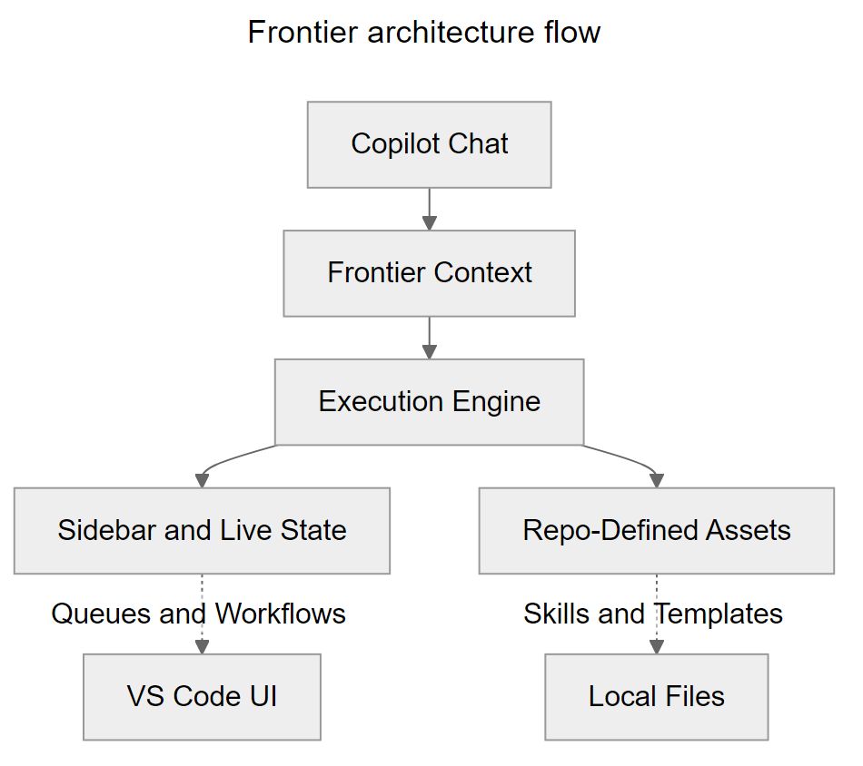
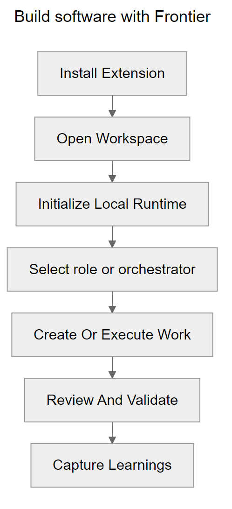

# Frontier for VS Code


**Frontier Corp's FDE fleet for Hypervelocity Engineering in VS Code**

[](https://marketplace.visualstudio.com/items?itemName=jnPiyush.agentx)
[](LICENSE)

Frontier deploys specialized Forward Deployed Engineers (FDEs) into your
workspace with governed workflows, live state, and repo-local evidence.

---

## Why Use the Extension?

Running autonomous engineering from the CLI can hide important context. The
Frontier extension exposes what each FDE is planning, validating, and changing
while preserving the repository as the system of record.

> **"Full autonomous orchestration, deeply integrated with your local workspace."**

---

## The Extension Surface

| Feature | Description |
|:--------|:------------|
| **26 Forward Deployed Engineers** | 15 visible lifecycle FDEs, including Frontier Orchestration FDE for end-to-end delivery, plus 11 hidden specialists that remain parent-invocable. |
| **Model Council (core)** | Multi-model deliberation on high-stakes decisions -- **Analyst + Strategist + Skeptic** debate PRD scope, ADR options, AI design, code reviews, and deep research before they ship. Agent-internal by default; optional `gh models` multi-vendor auto-invoke. Mandatory gate for PM, Architect, Reviewer, Data Scientist, and Consulting Research on high-stakes work. |
| **Copilot Chat Participant** | Native `@frontier` chat participant for triggering routines, brainstorm, learnings, and compound-loop inspection. |
| **Karpathy Guidelines (built-in)** | The `karpathy-guidelines` skill is auto-loaded for Engineer, Architect, Reviewer, Auto-Fix Reviewer, DevOps, Tester, and Data Scientist -- enforcing *think before coding*, surgical diffs, assumption audits, and goal-driven execution to block common LLM coding pitfalls at authoring and review time. |
| **Workspace Setup Wizard** | Local-runtime-first setup with optional remote adapters for GitHub or Azure DevOps and configurable LLM adapters. |
| **4 Sidebar Views** | **Work** (queues, workflow next step, brainstorm, learnings), **Status** (agent states, loop, dependencies, evaluation), **Templates** (output templates), **Skills** (134 production skills). |
| **50 Commands** | Workflow, loop management, knowledge compounding, AI evaluation, task bundles, bounded parallel delivery, and plugin management from the Command Palette. |
| **Knowledge Compounding** | Ranked learnings, compound-loop visibility, learning-capture scaffolds, durable review-finding promotion, and agent-native review parity checks. |
| **AI Evaluation** | Scaffold, run, and inspect AI evaluation contracts with rubric-based quality gates. |
| **Task Bundles & Bounded Parallel** | Create, resolve, and promote scoped task bundles; run and reconcile bounded parallel delivery slices. |
| **Plugin System** | Extend the workspace with `Add Skill`, `Add Agent`, and `Add Plugin` commands. |

---

## Architecture Flow



[Editable Mermaid source](resources/diagrams/architecture-flow.mmd).
Solid arrows show execution flow; dashed arrows show surfaced outputs.

* **Inputs:** VS Code Chat drives intent into the orchestrator.
* **Control:** The IDE tracks progress and state live via dedicated UI extensions.
* **Outputs:** Everything resolves natively into your repository as standard Markdown tracking, code, and CI manifests.

---

## Requirements

To run Frontier successfully within VS Code:

- **VS Code:** 1.134.0 or newer
- **System:** Git configured on your PATH
- **Runtime:** PowerShell 7.4+ (`pwsh`) on every OS; the Bash launcher delegates to PowerShell
- **Integrations:** gh (GitHub CLI) optional for extended GitHub mode operations

---

## Quick Start

1. **Install** the extension from the [VS Code Marketplace](https://marketplace.visualstudio.com/items?itemName=jnPiyush.agentx).
2. **Open** your target project workspace in VS Code.
3. **Use Frontier** in a trusted workspace, for example `@frontier run engineer "Explain this codebase"`. Private workspace state is created on first use, not on folder open.
4. **Optionally add a remote adapter** with `Frontier: Add Remote Adapter` or start it in chat with `@frontier connect github`, `@frontier connect ado`, `@frontier use local`, or `@frontier add remote adapter`.
5. **Optionally switch the workspace LLM adapter** with `Frontier: Add LLM Adapter` or start it in chat with `@frontier switch llm`, `@frontier connect claude`, `@frontier connect claude local`, `@frontier connect openai`, or `@frontier use copilot`.
6. **Select a role in Copilot Chat** and run the next step for that role, or select **Frontier Orchestration FDE** to orchestrate the full flow in one session.
7. **Capture reusable outcomes** with `Frontier: Create Learning Capture` once review confirms the result should compound future work.

### Automatic Workspace State

Only Frontier settings, commands, environment variables and credential namespaces
are supported. AgentX/HVE aliases no longer activate these interfaces. See
[Frontier-only interfaces](../docs/GUIDE.md#frontier-only-interfaces) for current
names. The published extension ID remains `jnPiyush.agentx`.

Installing the extension supplies the shared roles, skills and runtime. Ordinary
Frontier chat, commands and dynamically registered MCP tools do not need
per-repository initialization. State, sessions, pending input, graphs and gate
evidence stay in host-local extension storage, isolated by canonical folder and
remote authority. Source edits and requested deliverables still belong in the
repository.

Activation does not create a profile, scan the repository, switch remote
adapters, write MCP JSON or update project launchers. The first explicit operation
checks trust, provisions a profile and verifies runtime support. Missing
PowerShell, Node or provider credentials remain feature-specific errors.
Untrusted, virtual and network-share folders cannot start managed execution;
remote folders require the workspace-side extension.

The active editor selects the folder in a multi-root workspace. When ambiguous,
Frontier asks for a folder. Use `frontier.rootPath` for an explicit nested root;
recursive marker discovery no longer chooses a different repository.

Set `frontier.repositoryContext.enabled: false` to disable indexing, or
`frontier.automaticWorkspaceState: false` to require explicit repository setup.
Changing the indexing setting changes the MCP definition version; accept the
host's server-restart/refresh prompt to apply it to an already-running server.
Setting `repositoryContext.enabled` in the selected runtime config is read live
and can disable indexing without waiting for a server restart.
Existing repository-managed configuration remains supported. The first selected
mode is sticky; adding a config file does not move private history.

Private mode gates Frontier-owned workflows. It does not add repository hooks
or extend enforcement to direct editor-owned tools. A host/role without the
MCP tools can use Frontier chat or commands instead.

### Optional Repository Initialization

For portable terminal launchers, team-visible configuration or repository hooks:

```text
Frontier: Initialize Repository Support
```

Reinstall preserves existing provider settings and issue enforcement. Adapter
setup stores and removes credentials for the selected workspace folder, even
when another folder is the active Frontier root.

For `@frontier run` and clarification resumes, Chat Stop requests process-tree
termination and waits for the shell and termination helper to close. Agent runs
have a 30-minute deadline; other shell commands default to two minutes. Buffered
output is limited to 8 MiB. A failed or unconfirmed termination is reported as an
error, not a successful cancellation; check for remaining processes before retrying.

You can also start the same flow in chat with:

```text
@frontier initialize local runtime
```

This prepares the local Frontier runtime for the current workspace by:

- creating local runtime folders and state files
- creating empty output directories for plans, progress, reviews, and learnings in standard mode
- writing stable `.frontier/runtime/*` workspace entrypoints that delegate into the bundled runtime
- keeping the executable runtime bundled while workspace state stays local to the repo

This is an explicit repository modification, not required for ordinary extension
use. Switching from private mode requires confirmation and no active loop,
candidate, pending input or editor mutation. New repository configuration starts
with local defaults; private history and credentials are preserved, not exported,
and approvals are never copied. A failed switch keeps private mode selected;
requested setup files may remain if a concurrent operation blocks the final switch.
Restart an already-running MCP server after a successful storage-mode change.
For opted-in CLI symlink setups, activation detects dangling recorded targets
and matching versioned installs in this host's extension directory, including
older auto-refreshed links with stale metadata. It offers **Repair links** and
performs no relinking or support-file copying until
you approve repair; ordinary tab switches inside a folder do not refresh work queries.

Use `frontier_workspace` in MCP (or `workspace-state info` through the configured
runtime) to inspect the selected paths. If a process crashes during an editor
mutation or transition, an orphan `editor-leases` record or `transition.lock`
blocks switching. Close the relevant clients, verify their processes have stopped,
and remove only the orphan marker; do not delete the profile or approval history.

New secret references are identity-scoped. Existing local Windows repository
keys for ASCII paths remain readable; ambiguous case-folded or remote legacy references require
credential re-entry rather than cross-workspace guessing.

### Minimal Workspace Setup

To avoid starter memories and empty output directories, set these preferences
before running `Frontier: Initialize Repository Support`:

```json
{
  "frontier.initializationMode": "minimal",
  "frontier.seedRepoLocalAssets": false
}
```

The default `standard` mode keeps the existing scaffold. `minimal` creates only
four launchers under `.frontier/runtime/`, `.frontier/config.json`,
`.frontier/version.json`, `.frontier/state/agent-status.json`, and the Frontier
block in `.gitignore`. First-time GitHub remote detection can also configure
`.vscode/mcp.json`, as in standard mode.

Frontier terminal commands already work through those launchers; **Initialize
CLI is not required for Frontier's own CLI**:

```powershell
pwsh -NoProfile -File .\.frontier\runtime\frontier.ps1 help
```

The installed extension supplies the executable runtime and framework assets.
Commands create their own state and output directories when needed. Minimal
initialization does not copy memories, agents, skills, scripts, rubrics or
framework documentation. It rejects `seedRepoLocalAssets: true` before writing
files rather than silently expanding the footprint.

Changing to minimal mode does not delete previously generated or user-authored
files. Reinstall preserves existing configuration, state and memories. Choose
`standard` and run initialization again to add the starter scaffold.

For GitHub Copilot CLI, see the [native plugin and workspace seeding
options](../docs/GUIDE.md#using-frontier-with-github-copilot-cli-and-the-agents-window).
Native plugin discovery is separate from Frontier runtime initialization.

### Duplicate Agents in the Picker

If a workspace contains Frontier definitions in `.github/agents` while the
extension also contributes its bundled definitions, both sources can appear.
Renamed workspace agents and older bundled names are distinct picker entries,
not two installed copies of the extension.

Choose one agent source per workspace:

- Keep `frontier.useBundledAgents` enabled (the default) in projects without
  their own Frontier definitions.
- Set `frontier.useBundledAgents` to `false` in workspace settings when using
  local Frontier definitions. Keep `.github/agents` enabled in
  `chat.agentFilesLocations` for hosts that honor that setting.

Reload the VS Code window and start a new agent session after switching sources.
Existing sessions can retain their earlier customization snapshot. Disabling
bundled agents does not disable Frontier's skills, instructions, prompts,
commands, sidebars, or runtime. No agent file needs to be deleted.

This source repository selects local definitions; an installed release retains
the default bundled behavior in other workspaces.

When renaming a local agent, update the exact name used by its collaborators,
handoff targets, and prompt-file `agent:` fields too. The display name is also
the lookup identity for those references.

### Optional Remote Integration

If you want GitHub or Azure DevOps issue and workflow operations, run:

```text
Frontier: Add Remote Adapter
```

You can also start repo-adapter setup in chat with:

- `@frontier add remote adapter`
- `@frontier connect github`
- `@frontier connect ado`
- `@frontier use local`

The extension now keeps repo-adapter setup conversational. Non-secret values are collected in chat, pending setup survives between turns, and the chat UI offers follow-up actions to continue or cancel the flow.

Stay on local runtime only when you want repo-local planning, implementation, and review without remote backlog integration.

### Workspace LLM Adapter Setup

If you want to switch the workspace away from the default Copilot-backed path, run:

```text
Frontier: Add LLM Adapter
```

You can also start LLM setup in chat with:

- `@frontier switch llm`
- `@frontier connect claude`
- `@frontier connect claude local`
- `@frontier connect openai`
- `@frontier use copilot`

The extension now keeps LLM setup conversational. Non-secret values are collected in chat, pending setup survives between turns, and secret-bearing steps use VS Code's secure password prompt instead of asking you to paste keys into the chat transcript.

Available workspace LLM adapters include GitHub Copilot, Claude Subscription, Claude Code + LiteLLM + Ollama, Claude API, and OpenAI API. The local Claude option keeps `claude-code` as the execution transport while injecting Anthropic-compatible LiteLLM gateway settings and pinning the runner to the configured local coding model.

### Use Frontier in the Agents Window

VS Code's [Agents Window](https://code.visualstudio.com/docs/copilot/agents/agents-window) (Preview) lets supported chat participants run as first-class agents. Frontier opts in **per user**, not per workspace, because the underlying VS Code setting (`extensions.supportAgentsWindow`) lives in your user `settings.json`.

You have three ways to enable it:

1. **Automatic prompt (recommended).** The first time you install Frontier -- and again after each major-version upgrade -- the extension shows a one-time information message offering to enable Frontier in the Agents Window. Choose **Enable in Agents Window**, then reload the window when prompted. Choose **Don't ask again** to silence the prompt permanently.
2. **Manual command.** Run **Frontier: Enable in Agents Window** from the Command Palette at any time. The command is idempotent and preserves any other entries already in `extensions.supportAgentsWindow`.
3. **Power users.** Add the following to your user `settings.json` directly:

   ```jsonc
   "extensions.supportAgentsWindow": {
     "jnPiyush.agentx": true
   }
   ```

After enabling, reload the VS Code window. Frontier will appear in the Agents Window agent picker alongside other opted-in extensions. To opt back out, remove the `jnPiyush.agentx` entry (or set it to `false`) in user `settings.json` and reload.

## Build Software With Frontier

With a trusted workspace open, you can use Frontier inside VS Code to move an app from planning through review.



[Editable Mermaid source](resources/diagrams/delivery-flow.mmd)

### Recommended Flow

In VS Code, select the role in chat first, then send a prompt for that role. For example, if you are building a simple task-tracker app for small teams:

| Step | Role | What To Do | Sample Prompt |
|:-----|:-----|:-----------|:--------------|
| **1. Define the product** | **Product Manager** | Create the product scope, goals, and acceptance criteria | `Create a PRD for a task-tracker app for small teams with email login, task CRUD, due dates, and a dashboard for overdue work.` |
| **2. Shape the UX** | **UX Designer** | Turn the PRD into user flows and prototype-ready screens | `Create the user flow and prototype plan for the task-tracker app, covering sign-in, task creation, task filtering, and dashboard views.` |
| **3. Design the architecture** | **Architect** | Define the technical approach and key tradeoffs | `Create an ADR and tech spec for the task-tracker app using a web frontend, backend API, persistence, and role-based access.` |
| **4. Implement the app** | **Engineer** | Build the code and tests from the approved artifacts | `Implement the task-tracker app from the PRD and spec, including authentication, task CRUD APIs, dashboard data, and automated tests.` |
| **5. Review the result** | **Reviewer** | Check correctness, risk, and missing coverage before sign-off | `Review the task-tracker implementation for correctness, security, regressions, and missing tests.` |
| **6. Preserve the learning** | **Frontier Orchestration FDE** | Capture reusable guidance from the work you just completed | `Create a learning capture for the task-tracker delivery workflow and major implementation lessons.` |

If you want one orchestrated session instead of switching roles manually, select **Frontier Orchestration FDE** and use one prompt such as:

```text
Build a task-tracker app for small teams. Start by creating the PRD, then produce UX and architecture guidance, implement the app, review it, and capture reusable learnings.
```

### Typical Chat Prompts

```text
[Product Manager selected] Create a PRD for a task-tracker app for small teams
[UX Designer selected] Create the primary flows and screen plan for the task-tracker app
[Architect selected] Create an ADR and implementation spec for the task-tracker app
[Engineer selected] Implement the task-tracker app and its tests from the approved artifacts
[Reviewer selected] Review the task-tracker app implementation before sign-off
[Frontier Orchestration FDE selected] Create a learning capture
```

### When To Use Which Mode

- Use **Frontier Orchestration FDE** when you want end-to-end orchestration in one session.
- Use a specialist role such as **Product Manager**, **Architect**, **Engineer**, or **Reviewer** when you want tighter control over one phase.
- Use the Command Palette and sidebars when you want a more guided workflow inside VS Code.

## Compound Loop In The IDE

Frontier exposes the compound-engineering loop directly in VS Code instead of leaving it implicit in docs alone.

### Test Suites After the Loop

From 9.6.2, loop iterations and code reviews use non-test
verification and inspect authored tests without running suites. After a
successful **Loop: Complete**, Frontier asks whether to run the test suite.
**Run Test Task** uses your configured VS Code test task; **Not Now** or
dismissal runs nothing. A started task is not reported as passed.

Terminal/MCP completion returns the same question for the assistant to ask
through its user-input tool. Missing passing-test counts do not block a loop,
including legacy integer baselines; supplied malformed/regressed counts still
fail. CI and mandatory release checks remain separate.

### Lint Findings and Cleanup

Loops and reviews report cosmetic lint/style findings as
LOW advisories. They are not local completion requirements, and Frontier asks
for explicit approval before formatting, import cleanup or other cosmetic
fixes. No answer or a decline leaves them unchanged.

Use `frontier scrub -Path <changed-area> -Advisory` for a read-only report.
Build/type failures and verified defects keep their real severity. Independent
CI, commit and production gates retain their existing behavior.

### Chat Entry Points

- `@frontier brainstorm <topic>` to start planning from ranked prior learnings
- `@frontier learnings planning` and `@frontier learnings review <topic>` to inspect curated guidance
- `@frontier compound` to view the current compound loop state
- `@frontier create learning capture` to scaffold a durable learning artifact for the active issue context
- `@frontier review findings` and `@frontier agent-native review` to inspect review-time follow-up surfaces

### Sidebar And Command Palette

- Work sidebar: `Brainstorm`, `Planning learnings`, `Review learnings`, `Compound loop`, `Create learning capture`
- Status sidebar: `Compound loop`, `Create learning capture`, `Agent-native review`, `Review findings`, `AI Evaluation Status`
- Command palette equivalents exist for each of the same surfaces under the `Frontier:` prefix

---

## Sidebar Views

| View | Contents |
|:-----|:---------|
| **Work** | Workflow next step, brainstorm guidance, planning and review learnings, compound loop, learning capture, ready queue, and workflow rollout surfaces. |
| **Status** | Agent status, loop state, dependency checks, AI evaluation, review findings, task bundles, bounded parallel runs, and digests. |
| **Templates** | All output templates (PRD, ADR, Spec, UX, Review, Security Plan, Progress, Roadmap, Exec Plan, Contract, Evidence). |
| **Skills** | 134 production skills across 14 categories (architecture, development, languages, operations, infrastructure, data, documents, AI systems, design, testing, domain, product, diagrams, low-code). |

---

## Command Reference

### Workspace Setup

| Command | Description |
|:--------|:------------|
| Initialize Local Runtime | Prepare local runtime for the current workspace |
| Initialize Cursor | Configure Cursor commands, rules, native hooks and workspace-bound MCP |
| Enable in Agents Window | Opt Frontier into the VS Code Agents Window (Preview) for the current user |
| Add Remote Adapter | Connect GitHub or Azure DevOps for backlog integration |
| Add LLM Adapter | Switch the workspace LLM adapter (Copilot, Claude, OpenAI) |
| Add Plugin | Extend the workspace with additional capabilities |
| Add Skill | Add a production skill to the workspace |
| Add Agent | Add an agent definition to the workspace |

### Workflow

| Command | Description |
|:--------|:------------|
| Show Workflow Next Step | Show the recommended next action based on current checkpoint |
| Deepen Plan | Refine the current execution plan |
| Kick Off Review | Initiate the review phase |
| Show Workflow Steps | Display the full workflow step list for a role |
| Show Workflow Rollout Scorecard | View rollout readiness scores |
| Show Operator Enablement Checklist | View the operator enablement checklist |

### Quality Loop

| Command | Description |
|:--------|:------------|
| Loop: Start | Start a new quality loop iteration |
| Loop: Status | Check current loop state |
| Loop: Iterate | Record a loop iteration pass |
| Loop: Complete | Complete the reviewed loop, then offer the configured test task |
| Loop: Cancel | Cancel the active loop |
| Iterative Loop | Run the full iterative loop flow |

### Knowledge Compounding

| Command | Description |
|:--------|:------------|
| Show Brainstorm Guide | Start planning with ranked prior learnings |
| Show Planning Learnings | View ranked planning learnings |
| Show Review Learnings | View ranked review learnings |
| Show Knowledge Capture Guidance | View capture guidance for the current context |
| Show Compound Loop | Inspect the compound-engineering loop state |
| Create Learning Capture | Scaffold a durable learning artifact |
| Show Agent-Native Review | Run advisory agent-native review parity checks |
| Show Review Findings | Inspect durable review findings |
| Promote Review Finding | Promote a finding into a standard Frontier issue |

### AI Evaluation

| Command | Description |
|:--------|:------------|
| Show AI Evaluation Status | View AI evaluation contract and results |
| Scaffold AI Evaluation Contract | Create a new evaluation contract |
| Run AI Evaluation | Execute an evaluation run |

### Task Bundles & Parallel Delivery

| Command | Description |
|:--------|:------------|
| Show Task Bundles | View scoped task bundles |
| Create Task Bundle | Create a new task bundle |
| Resolve Task Bundle | Mark a task bundle as resolved |
| Promote Task Bundle | Promote a bundle to an issue |
| Show Bounded Parallel Runs | View active parallel delivery runs |
| Assess Bounded Parallel Delivery | Assess readiness for parallel delivery |
| Start Bounded Parallel Delivery | Launch a bounded parallel delivery slice |
| Reconcile Bounded Parallel Run | Reconcile a completed parallel run |

### Status & Diagnostics

| Command | Description |
|:--------|:------------|
| Show Agent Status | View agent states and active work |
| Check Dependencies | Check issue dependency blockers |
| Generate Weekly Digest | Generate a weekly status digest |
| Refresh Repository Context | Update the repository graph and show the orientation agents receive at session start |
| Show Issue Detail | View detailed issue information |
| Show Pending Clarification | Check for pending clarification requests |
| Check Environment | Validate the Frontier runtime environment |
| Refresh | Refresh all sidebar views |

---

## Chat Agents

The extension registers 26 declarative chat agents: 15 visible lifecycle agents
listed below and 11 hidden specialists that remain parent-invocable.

| Agent | Role | Use For |
|:------|:-----|:--------|
| **Frontier Orchestration FDE** | Autonomous orchestrator | End-to-end delivery in one session |
| **Product Manager** | PRD and backlog | Product scope, goals, stories |
| **UX Designer** | UX and prototypes | User flows, wireframes, HTML/CSS prototypes |
| **Architect** | Architecture | ADR, tech spec, tradeoff analysis |
| **Engineer** | Implementation | Code, tests, quality loop |
| **Reviewer** | Code review | Review, findings, approve/reject |
| **Auto-Fix Reviewer** | Review + fix | Review with safe auto-applied fixes |
| **DevOps** | CI/CD | Pipelines, deployment automation |
| **Data Scientist** | ML/AI | ML pipelines, evaluation, drift |
| **Tester** | Testing | Test suites, certification |
| **Fabric Engineer** | Data platform | Fabric Lakehouse, Warehouse, notebooks, pipelines, data quality |
| **Power Platform Builder** | Low-code solutions | Dataverse, apps, flows, Pages, PCF, Copilot Studio source |
| **Power BI Analyst** | Reports | Power BI, DAX, semantic models |
| **Consulting Research** | Research | Domain research, client materials |
| **Agile Coach** | Stories | Story creation, INVEST refinement |

---

## Recent Changes

### 9.7.0

- Discover initialized workspaces into a local reference graph and reuse bounded
  cached context at session start while preserving curated map notes.
- Prefer GPT-6 Astra for Engineer, Architect and UX Designer on Copilot and
  Claude Opus 5.5 for other roles.
- Add opt-in HydraFusion candidate generation with isolated snapshots, explicit
  budgets, durable recovery and independently reviewed promotion. Native remains
  the default; the adapter's live and platform qualification is separate.
- Correct runner aliases, repository-context results and Windows process identity
  capture. Update the standalone MCP runtime's patched dependencies.

### 9.6.2

- Ask explicitly about test-suite execution after loop completion; reviews and
  iterations do not launch suites. CI requirements remain separate.
- Report cosmetic lint/style as LOW local advisories and request cleanup
  approval; strict gates and genuine defect severity remain intact.
- Add opt-in minimal workspace initialization without starter memories or empty
  output folders; preserve the standard default and existing project files.
- Preserve the selected remote or multi-root folder URI when reading settings.
- Clarify that Frontier terminal commands do not require CLI asset seeding.
- Correct packaged README image URLs and use the canonical Frontier PNG.
- Render workflow diagrams as PNGs with editable Mermaid sources for previews
  that do not support Mermaid.

### 9.6.1

- Add `frontier.useBundledAgents` to select one agent source per workspace.
- Keep bundled agents enabled by default and preserve other extension features.
- Correct collaborator, handoff and prompt targets after local agent renames.
- Add generator, source-selection and reference-resolution regression checks.

### 9.6.0

- Use the new Frontier icon for the Marketplace listing and chat avatar.
- Use matching monochrome SVG artwork for the theme-coloured Activity Bar.
- Align README, website/favicon, and generated Teams icons with the same mark.
- Preserve functional icons, layout, and theme tokens; add focused icon-wiring
  and packaging regression checks.

### 9.5.0

- Align current extension, runtime, pack and installer version references.
- Regenerate the VSIX and associated release artifacts for version 9.5.0.
- Preserve published release history and dependency versions; no additional
  runtime behavior change is introduced by this version alignment.

### 9.4.1

- Consolidated repeated guidance in four skills while retaining safeguards,
  examples and required outputs.
- Preserved folded YAML descriptions in the generated skill catalogue and
  synchronized the bundled discovery metadata.
- Aligned suite-selection guidance across engineering and review; required CI
  and release gates remain in effect.
- Corrected the installed-launcher regression path and added catalogue coverage.

### 9.0.0

- Quality-loop approval now requires an attributable structured reviewer verdict with zero HIGH/MEDIUM findings on the final work iteration.
- Commit-time gates enforce risk-based `1/2/3/5` iteration minimums, staged/worktree agreement, and post-commit loop consumption.
- Autonomous workspace tools reject traversal, alternate streams, credentials, protected gate paths, links, aliases, and hardlinks.
- Autonomous shell execution and Claude-native tools remain disabled until an externally sandboxed adapter is available.
- Regression suites cover review exhaustion, hook lifecycle, path controls, staged and untracked harness enforcement, and VS Code evidence forwarding.

### 8.7.1

- Hardened fixed-source release recovery with tag, release-target, source-version, master-reachability, and checkout-SHA validation before repository scripts execute.
- Added SBOMs, SLSA provenance, and recovery-source attestations to recovered VSIX and MCP artifacts.
- Required Marketplace publication to verify provenance and the exact embedded publisher, extension name, and version while isolating the publish-only PAT to the final upload step.
- Fixed clean release packaging by installing extension dependencies before bundled asset synchronization.
- Made stamped-version release detection work for both linear and merge commits.
- Made version stamping portable across LF and CRLF package locks.

### 8.7.0

- Migrated agent defaults and provider routing to Claude Opus 5 and Sonnet 5.
- Added cost optimization and infrastructure governance skills with supply-chain, SSRF, and evaluation hardening.
- Added Fabric Engineer and promoted Power Platform Builder into core Frontier, bringing the inventory to 26 agents (15 visible, 11 internal).
- Added fail-closed Power Platform terminal enforcement, domain routing, canonical handoffs, installer parity, and adversarial regression coverage.
- Hardened the local WhatsApp companion with read-only defaults, confirmation-gated mutation, replay and voice safeguards, bounded CLI execution, sandboxed Chromium, and zero production audit findings.
- Added a deterministic 100-point skill-quality rubric with strict YAML, stable JSON evidence, blocking floors, trusted-base changed-skill enforcement, and Windows/POSIX installer parity.
- Release validation passed at the time of that release: extension coverage and 1013 tests, WhatsApp 23/23 with 90%+ line coverage, skill rubric behavior and 130-skill inventory validation, frontmatter 623/623, and zero HIGH/CRITICAL production dependency findings.

### 8.4.68

- Claude-backed Frontier defaults now use Claude Opus 4.8 across runtime model maps, VS Code adapter setup, agent creation pickers, and bundled agent definitions.
- Workspace-local launchers now keep loop state in their own workspace even when `AGENTX_WORKSPACE_ROOT` leaks from another process, while extension-bundled runtimes still support explicit workspace roots.
- Bundled Frontier assets were regenerated for 8.4.68, including pack manifests, installers, docs, skills, and runtime scripts.
- Release validation passed: extension tests 913 passing, provider behavior 97/97, framework self-tests 134/134, and runner behavior 163/163.

### 8.4.63

- Model Council deepened into persona+purpose-specific deliberation (PRD scope, ADR options, AI design, code review, research) with multi-topic support in a single run
- Council persona model defaults refreshed to the current frontier tier (Opus 4.7 -> 4.8, GPT 5.4 -> 5.5); model names remain advisory diversity slots
- Extension opts into the VS Code Agents Window on activation as a user-side setting (SPEC-400) so Frontier surfaces in the agent-first window without leaving the editor experience
- Runtime hardening: resolved review-400 findings, restored quality-loop parity, and fixed a shell test flake

### 8.4.52

- New `convert-slides` plugin renders Markdown storyboards into Microsoft PowerPoint (`.pptx`) via Pandoc, alongside the existing `convert-docs` (MD->DOCX) plugin
- Frontier Orchestration FDE agent documents both plugins with trigger conditions and invocation rules (PATH precheck, no shell concatenation, regenerate-from-Markdown discipline)
- Consulting Research agent adopts a Markdown-first plugin-bridge workflow: storyboard Markdown is the source of truth and is rendered to `.pptx` only on explicit request
- Zero-copy asset rewrite regression fix: agent context loader, runtime asset utilities, and agent-native review surface correctly resolve canonical template references through the bundled extension path (16/16 tests green)

### 8.4.51

- Bump version, sync bundled extension assets, repackage VSIX

### 8.4.47 - 8.4.49

- Bundled-asset sync fixes and VSIX repackaging across point releases

### 8.4.39

- MCP-only Azure DevOps provider: ADO work-item operations route through the official `@azure-devops/mcp` server with configurable tool overrides

### 8.4.36

- New `product/prd` skill: PRD authoring available to non-PM agents (Engineer, Architect, Auto) with a requirements-quality catalogue, vague-vs-concrete examples, and an AI-contract worked example
- New `diagrams/diagram-as-code` skill: Mermaid, PlantUML, C4/Structurizr, Graphviz, and draw.io patterns with first-class support for cross-functional swimlanes, BPMN, and Visio (`.vsdx`) interop
- New internal `diagram-specialist` sub-agent wired into Architect, Engineer, PM, UX Designer, Data Scientist, Reviewer, and Power BI Analyst

### 8.4.35

- Model Council mechanism: opt-in multi-perspective brief (Analyst, Strategist, Skeptic) for PRD scope, ADR options, AI design, code review, and research, completed agent-internally without involving the user
- New `karpathy-guidelines` skill wired into Engineer, Architect, Reviewer, Auto-Fix Reviewer, DevOps, Tester, and Data Scientist to reduce common LLM coding pitfalls

### 8.4.30

- Updated agent model assignments across core roles (Frontier Orchestration FDE, PM, Architect, Engineer, Reviewer, Auto-Fix Reviewer)

### 8.4.29

- Fixed ADO provider `--project` flag handling for work item operations
- Provider-aware issue counting in the Work sidebar
- Closed stale issues with evidence-backed comments

### 8.4.28

- Bounded parallel delivery: assess, start, and reconcile parallel work slices
- Task bundle create, resolve, and promote commands
- Plugin system with `Add Plugin`, `Add Skill`, `Add Agent`
- AI evaluation contract scaffolding and execution

### 8.4.25

- Workspace LLM adapter setup (Claude, OpenAI, Claude Code + LiteLLM)
- Conversational repo-adapter setup with pending state across turns
- Secure secret collection via VS Code password prompt

### Earlier

- Compound loop, brainstorm, and knowledge-capture surfaces (8.4.7)
- Workspace initialization and remote adapter setup (8.4.0)
- Full sidebar views for Work, Status, Templates, Skills

---

## Learn More

- [Frontier Core Repository](https://github.com/jnPiyush/AgentX)
- [AGENTS.md & Routing Setup](https://github.com/jnPiyush/AgentX/blob/master/AGENTS.md)
- [Detailed Workflow Guide](https://github.com/jnPiyush/AgentX/blob/master/docs/WORKFLOW.md)
- [Full Setup Instructions](https://github.com/jnPiyush/AgentX/blob/master/docs/GUIDE.md)
